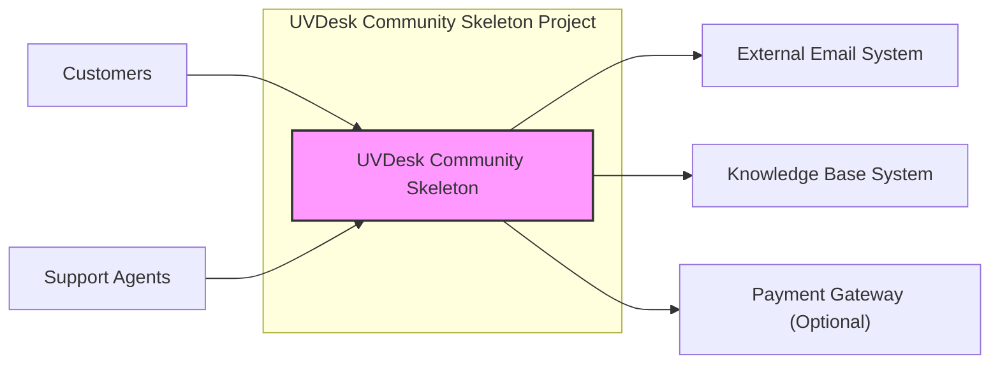
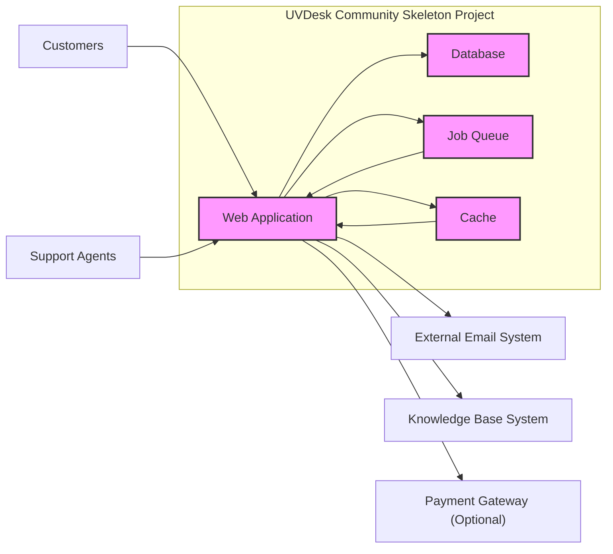
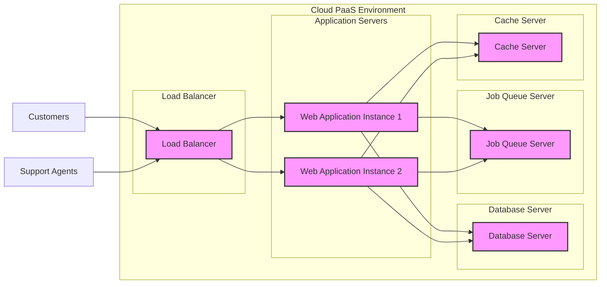

# BUSINESS POSTURE

This project, based on the uvdesk/community-skeleton repository, aims to provide a foundation for building a customer support help desk system.

- Business Priorities:
  - Provide a customizable and extensible platform for customer support.
  - Enable businesses to manage customer inquiries and support tickets efficiently.
  - Offer a community-driven open-source alternative to commercial help desk solutions.

- Business Goals:
  - Increase user adoption of the UVDesk platform.
  - Foster a community of developers and users around the platform.
  - Enable businesses to improve customer satisfaction through efficient support.

- Business Risks:
  - Data breaches exposing sensitive customer and business information.
  - System unavailability disrupting customer support operations.
  - Malicious attacks leading to data manipulation or system compromise.
  - Reputation damage due to security vulnerabilities or data leaks.
  - Compliance violations with data privacy regulations (e.g., GDPR, CCPA) if handling personal data.

# SECURITY POSTURE

- Existing Security Controls:
  - security control: Code hosted on GitHub, leveraging GitHub's security features for repository access control and vulnerability scanning. (Implemented: GitHub platform)
  - security control: Open-source nature allows for community security reviews and contributions. (Implemented: Open Source Community)
  - security control: Project likely follows general web application security best practices, although specific controls need to be verified within the codebase. (Description: Codebase - needs verification)

- Accepted Risks:
  - accepted risk: Reliance on community contributions for security vulnerability identification and patching might lead to delays in addressing critical issues.
  - accepted risk: Potential for vulnerabilities in third-party dependencies used by the project.
  - accepted risk: Security posture is dependent on the security practices of developers contributing to the open-source project.

- Recommended Security Controls:
  - security control: Implement automated Static Application Security Testing (SAST) in the CI/CD pipeline to identify potential vulnerabilities in the codebase.
  - security control: Implement automated Dependency Scanning to identify vulnerabilities in third-party libraries.
  - security control: Conduct regular manual security code reviews by security experts.
  - security control: Implement a vulnerability disclosure program to encourage responsible reporting of security issues by the community.
  - security control: Implement security awareness training for developers contributing to the project.
  - security control: Define and enforce secure coding guidelines for all contributors.

- Security Requirements:
  - Authentication:
    - Requirement: Secure user authentication mechanism to verify the identity of users (customers, agents, administrators).
    - Requirement: Support for strong password policies and multi-factor authentication (MFA) for enhanced security.
    - Requirement: Protection against common authentication attacks such as brute-force and credential stuffing.
  - Authorization:
    - Requirement: Role-based access control (RBAC) to manage user permissions and restrict access to sensitive features and data based on roles (e.g., administrator, agent, customer).
    - Requirement: Enforce least privilege principle, granting users only the necessary permissions to perform their tasks.
    - Requirement: Secure API authorization to protect backend services and data from unauthorized access.
  - Input Validation:
    - Requirement: Comprehensive input validation on all user-supplied data to prevent injection attacks (e.g., SQL injection, Cross-Site Scripting (XSS)).
    - Requirement: Input sanitization and encoding to neutralize potentially malicious input.
    - Requirement: Use of parameterized queries or ORM frameworks to mitigate SQL injection risks.
  - Cryptography:
    - Requirement: Use HTTPS for all communication to protect data in transit.
    - Requirement: Secure storage of sensitive data at rest, such as passwords and API keys, using strong encryption algorithms.
    - Requirement: Proper handling and management of cryptographic keys, including secure key generation, storage, and rotation.

# DESIGN

## C4 CONTEXT

- Context Diagram Elements:
  - - Name: UVDesk Community Skeleton
    - Type: Software System
    - Description: The core help desk system being designed and built. It provides functionalities for ticket management, customer communication, and support workflows.
    - Responsibilities:
      - Managing customer support tickets.
      - Facilitating communication between customers and support agents.
      - Providing a platform for knowledge base integration.
      - Optionally integrating with payment gateways for paid support services.
    - Security controls:
      - Authentication and authorization for users (customers, agents, administrators).
      - Input validation to protect against injection attacks.
      - Secure session management.
      - Data encryption at rest and in transit.

  - - Name: Customers
    - Type: Actor
    - Description: End-users who require support and interact with the help desk system to submit tickets and track their progress.
    - Responsibilities:
      - Submitting support requests.
      - Communicating with support agents.
      - Accessing knowledge base articles.
    - Security controls:
      - Authentication to access their tickets and information.
      - Limited authorization to only access their own data.

  - - Name: Support Agents
    - Type: Actor
    - Description: Users who are responsible for providing customer support, managing tickets, and resolving customer issues.
    - Responsibilities:
      - Responding to customer support requests.
      - Managing and resolving support tickets.
      - Updating knowledge base articles.
    - Security controls:
      - Strong authentication to access the system.
      - Role-based authorization to manage tickets and access customer data.
      - Audit logging of agent actions.

  - - Name: External Email System
    - Type: External System
    - Description: An external email service (e.g., SMTP server) used by the help desk system to send and receive emails for ticket notifications and communication.
    - Responsibilities:
      - Sending email notifications to customers and agents.
      - Receiving emails from customers to create support tickets.
    - Security controls:
      - Secure configuration of SMTP connection (TLS/SSL).
      - Authentication to the email server.
      - Email content filtering (anti-spam, anti-malware).

  - - Name: Knowledge Base System
    - Type: External System
    - Description: A separate system or module (potentially within UVDesk or external) that stores and manages knowledge base articles for self-service support.
    - Responsibilities:
      - Providing a repository of knowledge articles.
      - Allowing customers to search for solutions to common issues.
      - Enabling agents to create and manage knowledge articles.
    - Security controls:
      - Access control to knowledge base articles (public vs. agent-only).
      - Input validation for article creation and editing.

  - - Name: Payment Gateway (Optional)
    - Type: External System
    - Description: An optional external payment gateway (e.g., Stripe, PayPal) integrated with the help desk system to process payments for premium support services or features.
    - Responsibilities:
      - Processing payments for support services.
      - Managing subscriptions and billing.
    - Security controls:
      - Secure integration with the payment gateway API.
      - PCI DSS compliance if handling credit card information directly (though ideally, payment processing is offloaded to the gateway).

## C4 CONTAINER

- Container Diagram Elements:
  - - Name: Web Application
    - Type: Container
    - Description: The main web application component built using PHP (likely Laravel or Symfony framework based on typical open-source help desk systems). Handles user requests, business logic, and presentation.
    - Responsibilities:
      - Handling HTTP requests from customers and support agents.
      - Implementing application logic for ticket management, user management, etc.
      - Rendering user interfaces (HTML, CSS, JavaScript).
      - Interacting with the database, job queue, and cache.
      - Communicating with external systems (email, knowledge base, payment gateway).
    - Security controls:
      - Web Application Firewall (WAF) to protect against web attacks.
      - Input validation and output encoding.
      - Authentication and authorization mechanisms.
      - Secure session management.
      - Protection against common web vulnerabilities (OWASP Top 10).

  - - Name: Database
    - Type: Container
    - Description: Relational database (e.g., MySQL, PostgreSQL) to store application data, including user accounts, tickets, knowledge base articles, and configuration settings.
    - Responsibilities:
      - Persistent storage of application data.
      - Data retrieval and manipulation for the web application.
      - Data integrity and consistency.
    - Security controls:
      - Database access control (user permissions, network restrictions).
      - Data encryption at rest.
      - Regular database backups.
      - Database vulnerability scanning and patching.
      - Protection against SQL injection attacks (handled by Web Application through parameterized queries/ORM).

  - - Name: Job Queue
    - Type: Container
    - Description: Asynchronous job queue (e.g., Redis, RabbitMQ) to handle background tasks, such as sending email notifications, processing large data imports, and scheduled tasks.
    - Responsibilities:
      - Asynchronous processing of tasks.
      - Decoupling long-running operations from the web application's request-response cycle.
      - Improving application performance and responsiveness.
    - Security controls:
      - Access control to the job queue (authentication and authorization).
      - Secure communication between the web application and the job queue.
      - Monitoring and logging of job queue activity.

  - - Name: Cache
    - Type: Container
    - Description: In-memory cache (e.g., Redis, Memcached) to store frequently accessed data for faster retrieval and improved application performance.
    - Responsibilities:
      - Caching frequently accessed data (e.g., user sessions, configuration settings, query results).
      - Reducing database load and improving response times.
    - Security controls:
      - Access control to the cache (if applicable).
      - Secure configuration of the cache service.
      - Consideration of sensitive data caching and appropriate security measures.

## DEPLOYMENT

Deployment Solution: Cloud-based Deployment on a Platform as a Service (PaaS) like AWS Elastic Beanstalk, Google App Engine, or Heroku. This is a common and scalable approach for web applications.

- Deployment Diagram Elements:
  - - Name: Load Balancer
    - Type: Infrastructure
    - Description: Distributes incoming traffic across multiple Web Application Instances for high availability and scalability.
    - Responsibilities:
      - Traffic distribution.
      - Health checks of application instances.
      - SSL termination (HTTPS).
    - Security controls:
      - DDoS protection.
      - SSL/TLS configuration.
      - Access control lists (ACLs).

  - - Name: Web Application Instance 1 & 2
    - Type: Infrastructure (Compute Instance/Container)
    - Description: Instances of the Web Application container running on compute resources provided by the PaaS.
    - Responsibilities:
      - Running the Web Application code.
      - Handling user requests.
      - Processing application logic.
    - Security controls:
      - Operating system and runtime environment hardening.
      - Security patching and updates.
      - Instance-level firewalls.
      - Intrusion detection/prevention systems (IDS/IPS) at the PaaS level.

  - - Name: Database Server
    - Type: Infrastructure (Managed Database Service)
    - Description: Managed database service provided by the PaaS provider, offering scalability, reliability, and automated backups.
    - Responsibilities:
      - Hosting the application database.
      - Database management and maintenance.
      - Data backups and recovery.
    - Security controls:
      - Database access control and encryption.
      - Regular security patching by the PaaS provider.
      - Network isolation within the PaaS environment.
      - Data encryption at rest and in transit (within PaaS).

  - - Name: Job Queue Server
    - Type: Infrastructure (Managed Queue Service)
    - Description: Managed job queue service provided by the PaaS provider for asynchronous task processing.
    - Responsibilities:
      - Hosting the job queue.
      - Message queuing and delivery.
      - Scalability and reliability of the queue service.
    - Security controls:
      - Access control to the job queue service.
      - Secure communication within the PaaS environment.
      - Monitoring and logging.

  - - Name: Cache Server
    - Type: Infrastructure (Managed Cache Service)
    - Description: Managed cache service provided by the PaaS provider for in-memory data caching.
    - Responsibilities:
      - Hosting the cache.
      - Data caching and retrieval.
      - Scalability and performance of the cache service.
    - Security controls:
      - Access control to the cache service (if applicable).
      - Secure configuration within the PaaS environment.

## BUILD

```mermaid
flowchart LR
    Developer["Developer"] --> CodeRepository["Code Repository (GitHub)"]
    CodeRepository --> CI["CI/CD Pipeline (GitHub Actions)"]
    CI --> BuildArtifacts["Build Artifacts (Container Image, Packages)"]
    BuildArtifacts --> ContainerRegistry["Container Registry (e.g., Docker Hub, PaaS Registry)"]
    ContainerRegistry --> DeploymentEnvironment["Deployment Environment (PaaS)"]

    subgraph "CI/CD Pipeline (GitHub Actions)"
        SourceCodeCheckout["Source Code Checkout"]
        BuildStep["Build Application"]
        UnitTest["Unit Tests"]
        SAST["SAST Scanning"]
        DependencyCheck["Dependency Check"]
        Containerize["Containerize Application (if applicable)"]
        PushArtifacts["Push Artifacts"]
    end

    CI --> SourceCodeCheckout
    SourceCodeCheckout --> BuildStep
    BuildStep --> UnitTest
    UnitTest --> SAST
    SAST --> DependencyCheck
    DependencyCheck --> Containerize
    Containerize --> PushArtifacts
    PushArtifacts --> BuildArtifacts

    style Developer fill:#f9f,stroke:#333,stroke-width:2px
    style CodeRepository fill:#f9f,stroke:#333,stroke-width:2px
    style CI fill:#f9f,stroke:#333,stroke-width:2px
    style BuildArtifacts fill:#f9f,stroke:#333,stroke-width:2px
    style ContainerRegistry fill:#f9f,stroke:#333,stroke-width:2px
    style DeploymentEnvironment fill:#f9f,stroke:#333,stroke-width:2px
    style SourceCodeCheckout fill:#ccf,stroke:#333,stroke-width:1px
    style BuildStep fill:#ccf,stroke:#333,stroke-width:1px
    style UnitTest fill:#ccf,stroke:#333,stroke-width:1px
    style SAST fill:#ccf,stroke:#333,stroke-width:1px
    style DependencyCheck fill:#ccf,stroke:#333,stroke-width:1px
    style Containerize fill:#ccf,stroke:#333,stroke-width:1px
    style PushArtifacts fill:#ccf,stroke:#333,stroke-width:1px
```

- Build Process Description:
  - Developer commits code changes to the Code Repository (GitHub).
  - A CI/CD Pipeline (e.g., GitHub Actions) is triggered on code changes.
  - CI Pipeline Stages:
    - Source Code Checkout: Retrieves the latest code from the repository.
    - Build Application: Compiles the application code and builds necessary assets.
    - Unit Tests: Executes automated unit tests to ensure code quality and functionality.
    - SAST Scanning: Performs Static Application Security Testing to identify potential vulnerabilities in the source code.
    - Dependency Check: Scans project dependencies for known vulnerabilities.
    - Containerize Application (if applicable): Builds a container image of the application (e.g., Docker image).
    - Push Artifacts: Pushes build artifacts (container image, packages) to a Container Registry or artifact repository.
  - Build Artifacts are stored in a Container Registry (e.g., Docker Hub, PaaS Registry).
  - Deployment Environment (PaaS) pulls the Build Artifacts from the Container Registry for deployment.

- Build Process Security Controls:
  - security control: Code Repository Access Control: Restrict access to the code repository to authorized developers. (Implemented: GitHub Permissions)
  - security control: CI/CD Pipeline Security: Secure configuration of the CI/CD pipeline, including access control, secret management, and secure build environment. (Implemented: GitHub Actions Security Best Practices)
  - security control: Automated Security Scans (SAST, Dependency Check): Integrate security scanning tools into the CI/CD pipeline to automatically identify vulnerabilities. (Implemented: CI Pipeline - needs to be configured)
  - security control: Build Artifact Signing: Sign build artifacts to ensure integrity and authenticity. (Recommended)
  - security control: Vulnerability Scanning of Container Images: Scan container images for vulnerabilities before deployment. (Recommended)
  - security control: Infrastructure as Code (IaC) Security Scanning: If IaC is used for deployment, scan IaC configurations for security misconfigurations. (Recommended if IaC is used)
  - security control: Regular Security Audits of Build Process: Periodically review and audit the build process for security weaknesses. (Recommended)

# RISK ASSESSMENT

- Critical Business Processes:
  - Customer Support Ticket Management: The core function of the system. Disruption or compromise can directly impact customer satisfaction and business operations.
  - Customer Communication: Secure and reliable communication channels are essential for effective support.
  - User Authentication and Authorization: Secure access control is critical to protect sensitive data and prevent unauthorized actions.
  - Data Storage and Backup: Protecting customer and business data from loss or unauthorized access.

- Data Sensitivity:
  - Customer Personal Data: Names, email addresses, contact information, support history. Sensitivity: High (PII, subject to privacy regulations).
  - Support Ticket Content: Customer inquiries, potentially containing sensitive information. Sensitivity: Medium to High (depending on the nature of inquiries).
  - Agent Personal Data: Names, contact information, roles, permissions. Sensitivity: Medium (Employee data).
  - System Configuration Data: API keys, database credentials, application settings. Sensitivity: Critical (Secrets, compromise can lead to full system access).
  - Payment Information (if applicable): Credit card details, billing addresses. Sensitivity: Critical (PCI DSS scope if handled directly, ideally offloaded to payment gateway).

# QUESTIONS & ASSUMPTIONS

- Questions:
  - What is the intended deployment environment (cloud provider, on-premises)?
  - Are there any specific compliance requirements (e.g., GDPR, HIPAA, PCI DSS)?
  - What is the expected scale of users and support tickets?
  - Are there any existing security policies or guidelines that need to be followed?
  - Is there a dedicated security team or person responsible for security?
  - What is the process for vulnerability management and incident response?
  - Is there a budget allocated for security tools and resources?
  - What are the performance and availability requirements for the system?

- Assumptions:
  - BUSINESS POSTURE:
    - The primary business goal is to provide a functional and secure open-source help desk system.
    - Data privacy and security are important considerations for user trust and compliance.
    - The project aims for a balance between functionality, security, and ease of use.
  - SECURITY POSTURE:
    - Basic security controls are in place (GitHub security features, open-source community review).
    - There is a need to enhance security controls, especially in automated testing and secure development practices.
    - Security requirements include standard web application security principles (authentication, authorization, input validation, cryptography).
  - DESIGN:
    - The system will be deployed in a cloud environment using a PaaS.
    - The architecture will be based on a typical three-tier web application model (web application, database, background processing).
    - The build process will utilize CI/CD pipelines for automation and security checks.