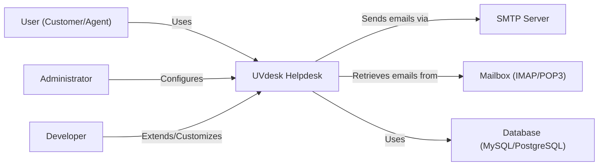
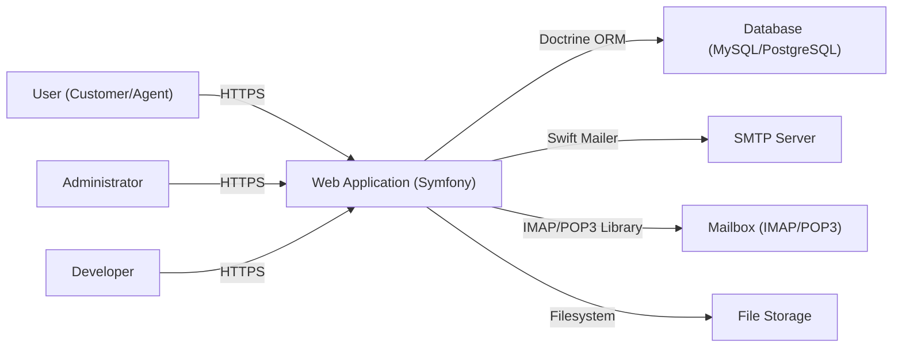
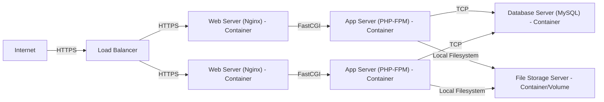
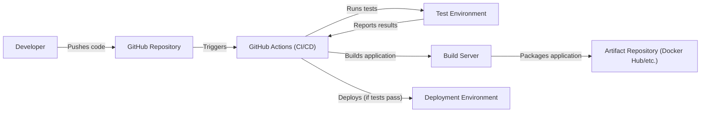

Okay, let's create a design document for the UVdesk Community Skeleton project.

# BUSINESS POSTURE

UVdesk is an open-source helpdesk system. The Community Skeleton likely represents the core, freely available version.  The primary business goals appear to be:

*   Provide a free, customizable helpdesk solution to attract users and build a community.
*   Offer a migration path to paid/hosted versions or additional features (upselling).
*   Maintain a positive reputation for quality and security to encourage adoption and contribution.
*   Reduce support costs for the commercial offerings by enabling self-service and community support.

Business priorities:

*   Ease of installation and use.
*   Extensibility and customizability.
*   Data integrity and availability (preventing data loss or corruption).
*   Basic security to protect user data and prevent abuse.

Most important business risks:

*   Reputational damage due to security vulnerabilities or data breaches.
*   High support costs if the open-source version is difficult to use or unstable.
*   Lack of adoption if the system is not perceived as valuable or reliable.
*   Legal risks associated with data privacy violations (GDPR, CCPA, etc.).
*   Compromise of the system leading to spam or phishing campaigns.

# SECURITY POSTURE

Based on the GitHub repository, the following security controls and accepted risks can be identified.  This is an initial assessment and would require deeper code review and configuration analysis to be fully comprehensive.

Existing security controls:

*   security control: Input validation: The project uses Symfony, which provides mechanisms for input validation and sanitization (forms, controllers). Where it's implemented: Throughout the application, particularly in controllers and form definitions.
*   security control: Authentication: The project uses Symfony's security component for user authentication. Where it's implemented: `config/packages/security.yaml` and related controllers/entities.
*   security control: Authorization: Access control is likely implemented using Symfony's security voters or similar mechanisms. Where it's implemented: `config/packages/security.yaml` and potentially within controllers and templates.
*   security control: Database security: The project uses an ORM (Doctrine), which helps prevent SQL injection vulnerabilities when used correctly. Where it's implemented: Database interactions are handled through Doctrine entities and repositories.
*   security control: Dependency management: Composer is used to manage dependencies, allowing for updates and security patches. Where it's implemented: `composer.json` and `composer.lock` files.
*   security control: Templating engine: Twig is used, which provides automatic output escaping to help prevent cross-site scripting (XSS) vulnerabilities. Where it's implemented: All views are rendered using Twig templates.
*   security control: Session management: Symfony's session management is used. Where it's implemented: `config/packages/framework.yaml` and related session handling logic.

Accepted risks:

*   accepted risk: The project is open-source, meaning the code is publicly available. This increases the risk of vulnerability discovery, but also allows for community auditing and contributions.
*   accepted risk: The project relies on third-party libraries and dependencies. Vulnerabilities in these dependencies could impact the security of the system.
*   accepted risk: The default configuration may not be fully secure. Users are responsible for configuring the system securely (e.g., setting strong passwords, configuring firewalls).
*   accepted risk: The project may not be fully compliant with all relevant data privacy regulations out of the box. Users are responsible for ensuring compliance.

Recommended security controls:

*   Implement a robust Content Security Policy (CSP) to mitigate XSS and data injection attacks.
*   Enable HTTP Strict Transport Security (HSTS) to enforce HTTPS connections.
*   Implement rate limiting to prevent brute-force attacks and denial-of-service.
*   Configure security headers (X-Frame-Options, X-XSS-Protection, X-Content-Type-Options) for enhanced browser security.
*   Implement regular security audits and penetration testing.
*   Establish a clear vulnerability disclosure process.
*   Implement logging and monitoring to detect and respond to security incidents.
*   Use a static application security testing (SAST) tool during development to identify potential vulnerabilities.
*   Use a software composition analysis (SCA) tool to identify vulnerabilities in third-party dependencies.

Security requirements:

*   Authentication:
    *   Support strong password policies (minimum length, complexity requirements).
    *   Implement secure password reset mechanisms.
    *   Consider multi-factor authentication (MFA) as an option.
    *   Protect against brute-force attacks (account lockout, rate limiting).
*   Authorization:
    *   Implement role-based access control (RBAC) to restrict access to sensitive data and functionality.
    *   Ensure that users can only access data and perform actions that are authorized for their role.
    *   Regularly review and update access control policies.
*   Input Validation:
    *   Validate all user input on the server-side, using a whitelist approach whenever possible.
    *   Sanitize input to prevent cross-site scripting (XSS) and other injection attacks.
    *   Validate file uploads to prevent malicious files from being uploaded.
*   Cryptography:
    *   Use strong, industry-standard cryptographic algorithms for storing passwords (e.g., bcrypt, Argon2).
    *   Use HTTPS for all communication between the client and the server.
    *   Protect sensitive data at rest using encryption.
    *   Securely manage cryptographic keys.

# DESIGN

## C4 CONTEXT

Element descriptions:

*   Element:
    *   Name: User (Customer/Agent)
    *   Type: Person
    *   Description: A person who interacts with the helpdesk system, either as a customer submitting a ticket or an agent responding to tickets.
    *   Responsibilities: Submitting tickets, viewing ticket status, responding to tickets, managing their profile.
    *   Security controls: Authentication, authorization, session management.

*   Element:
    *   Name: UVdesk Helpdesk
    *   Type: Software System
    *   Description: The core helpdesk application.
    *   Responsibilities: Managing tickets, users, workflows, knowledge base, and other helpdesk functions.
    *   Security controls: Input validation, output encoding, authentication, authorization, session management, database security, dependency management.

*   Element:
    *   Name: SMTP Server
    *   Type: Software System
    *   Description: An external system used to send emails (notifications, responses).
    *   Responsibilities: Sending emails on behalf of the UVdesk system.
    *   Security controls: Secure communication (TLS/SSL), authentication.

*   Element:
    *   Name: Mailbox (IMAP/POP3)
    *   Type: Software System
    *   Description: An external system used to retrieve emails (incoming tickets).
    *   Responsibilities: Receiving emails and making them available to the UVdesk system.
    *   Security controls: Secure communication (TLS/SSL), authentication.

*   Element:
    *   Name: Database (MySQL/PostgreSQL)
    *   Type: Software System
    *   Description: The database used to store helpdesk data (tickets, users, settings).
    *   Responsibilities: Storing and retrieving data.
    *   Security controls: Database security (access control, encryption), input validation (ORM).

*   Element:
    *   Name: Administrator
    *   Type: Person
    *   Description: A person who configures and manages the helpdesk system.
    *   Responsibilities: Configuring system settings, managing users and roles, monitoring system performance.
    *   Security controls: Authentication, authorization, strong password policies.

*   Element:
    *   Name: Developer
    *   Type: Person
    *   Description: A person who extends or customizes the helpdesk system.
    *   Responsibilities: Developing custom features, integrating with other systems, contributing to the codebase.
    *   Security controls: Secure coding practices, code reviews, vulnerability scanning.

## C4 CONTAINER

Element descriptions:

*   Element:
    *   Name: Web Application (Symfony)
    *   Type: Web Application
    *   Description: The main application, built using the Symfony framework.
    *   Responsibilities: Handling user requests, processing data, interacting with the database and other systems.
    *   Security controls: Input validation, output encoding, authentication, authorization, session management, CSRF protection.

*   Element:
    *   Name: Database (MySQL/PostgreSQL)
    *   Type: Database
    *   Description: The database used to store helpdesk data.
    *   Responsibilities: Storing and retrieving data.
    *   Security controls: Database security (access control, encryption), input validation (ORM).

*   Element:
    *   Name: SMTP Server
    *   Type: Software System
    *   Description: An external system used to send emails.
    *   Responsibilities: Sending emails on behalf of the UVdesk system.
    *   Security controls: Secure communication (TLS/SSL), authentication.

*   Element:
    *   Name: Mailbox (IMAP/POP3)
    *   Type: Software System
    *   Description: An external system used to retrieve emails.
    *   Responsibilities: Receiving emails and making them available to the UVdesk system.
    *   Security controls: Secure communication (TLS/SSL), authentication.

*   Element:
    *   Name: File Storage
    *   Type: File System
    *   Description: Storage for attachments and other files.
    *   Responsibilities: Storing and retrieving files.
    *   Security controls: Access control, file validation, potentially virus scanning.

*   Element:
    *   Name: User (Customer/Agent)
    *   Type: Person
    *   Description: A person who interacts with the helpdesk system.
    *   Responsibilities: Submitting tickets, viewing ticket status, responding to tickets, managing their profile.
    *   Security controls: Authentication, authorization, session management.

*   Element:
    *   Name: Administrator
    *   Type: Person
    *   Description: A person who configures and manages the helpdesk system.
    *   Responsibilities: Configuring system settings, managing users and roles, monitoring system performance.
    *   Security controls: Authentication, authorization, strong password policies.

*   Element:
    *   Name: Developer
    *   Type: Person
    *   Description: A person who extends or customizes the helpdesk system.
    *   Responsibilities: Developing custom features, integrating with other systems, contributing to the codebase.
    *   Security controls: Secure coding practices, code reviews, vulnerability scanning.

## DEPLOYMENT

Possible deployment solutions:

1.  Traditional LAMP/LEMP stack: Apache/Nginx, MySQL/PostgreSQL, PHP on a single server or multiple servers.
2.  Containerized deployment: Using Docker and Docker Compose to deploy the application and its dependencies.
3.  Cloud-based deployment: Using a cloud provider (AWS, Azure, GCP) to deploy the application using virtual machines, containers, or serverless functions.

Chosen solution (for detailed description): Containerized deployment using Docker and Docker Compose.

Element descriptions:

*   Element:
    *   Name: Internet
    *   Type: External
    *   Description: The public internet.
    *   Responsibilities: N/A
    *   Security controls: N/A

*   Element:
    *   Name: Load Balancer
    *   Type: Load Balancer
    *   Description: Distributes incoming traffic across multiple web servers.
    *   Responsibilities: Load balancing, SSL termination (potentially).
    *   Security controls: SSL/TLS configuration, DDoS protection (potentially).

*   Element:
    *   Name: Web Server (Nginx) - Container
    *   Type: Web Server
    *   Description: Serves static content and proxies requests to the application server.
    *   Responsibilities: Serving static content, proxying requests, SSL termination (potentially).
    *   Security controls: Web server security configuration (e.g., disabling unnecessary modules, configuring security headers).

*   Element:
    *   Name: App Server (PHP-FPM) - Container
    *   Type: Application Server
    *   Description: Executes the PHP code of the UVdesk application.
    *   Responsibilities: Running the application logic.
    *   Security controls: Application-level security controls (see previous sections).

*   Element:
    *   Name: Database Server (MySQL) - Container
    *   Type: Database Server
    *   Description: Stores the helpdesk data.
    *   Responsibilities: Storing and retrieving data.
    *   Security controls: Database security (access control, encryption), network security (limiting access to the database server).

*   Element:
    *   Name: File Storage Server - Container/Volume
    *   Type: File Storage
    *   Description: Stores attachments and other files.
    *   Responsibilities: Storing and retrieving files.
    *   Security controls: Access control, file validation, potentially virus scanning.

## BUILD

The UVdesk Community Skeleton project appears to use Composer for dependency management and likely relies on manual or basic scripting for building and packaging.  A more robust CI/CD pipeline is recommended.

Recommended Build Process (using GitHub Actions):

Steps and Security Controls:

1.  Developer pushes code to the GitHub repository.
2.  GitHub Actions workflow is triggered.
3.  security control: Linting: Run PHP_CodeSniffer or similar tools to enforce coding standards and identify potential security issues.
4.  security control: Static Analysis: Run a SAST tool (e.g., Psalm, Phan, PHPStan) to identify potential vulnerabilities in the code.
5.  security control: Dependency Scanning: Use Composer's built-in security checks or a dedicated SCA tool (e.g., Snyk, Dependabot) to identify vulnerabilities in third-party dependencies.
6.  Run unit and integration tests.
7.  Build the application (e.g., create a Docker image).
8.  security control: Image Scanning: Scan the Docker image for vulnerabilities using a tool like Trivy or Clair.
9.  security control: Tagging and Versioning: Tag the Docker image with a unique version number and commit hash.
10. Push the Docker image to a container registry (e.g., Docker Hub, AWS ECR).
11. Deploy the application to the target environment (e.g., using Docker Compose, Kubernetes).

# RISK ASSESSMENT

Critical business processes to protect:

*   Ticket management: Ensuring that tickets are created, assigned, tracked, and resolved efficiently and securely.
*   User management: Protecting user accounts and data from unauthorized access and modification.
*   Knowledge base management: Ensuring the integrity and availability of the knowledge base content.
*   Email communication: Protecting email communication from interception and tampering.
*   System configuration: Preventing unauthorized changes to system settings.

Data to protect and their sensitivity:

*   Customer data (names, email addresses, contact information): Personally Identifiable Information (PII) - High sensitivity.
*   Ticket data (descriptions, attachments): Potentially sensitive business information - Medium to High sensitivity.
*   User account data (passwords, roles): Highly sensitive - High sensitivity.
*   System configuration data: Sensitive - Medium sensitivity.
*   Knowledge base content: Potentially sensitive business information - Low to Medium sensitivity.

# QUESTIONS & ASSUMPTIONS

Questions:

*   What are the specific compliance requirements (e.g., GDPR, CCPA)?
*   What is the expected volume of tickets and users?
*   What are the specific performance requirements?
*   What are the existing infrastructure and deployment environments?
*   What is the budget for security tools and services?
*   Are there any specific integrations required with other systems?
*   What level of support and maintenance is expected?
*   Is there a defined incident response plan?

Assumptions:

*   BUSINESS POSTURE: The primary goal is to provide a functional and free helpdesk system, with security being a secondary but important consideration.
*   SECURITY POSTURE: The development team has basic security awareness, but may not have dedicated security expertise.
*   DESIGN: The system will be deployed using a containerized approach (Docker/Compose) on a Linux-based infrastructure. The initial deployment will be relatively simple, with the potential for scaling in the future.