# Project Design Document: phpdotenv

**Version:** 1.1
**Date:** October 26, 2023
**Author:** AI Software Architect

## 1. Introduction

This document provides an enhanced design overview of the phpdotenv library, a PHP library designed to load environment variables from a `.env` file into the `$_ENV`, `$_SERVER`, and `getenv()` superglobals. This detailed description aims to serve as a robust foundation for subsequent threat modeling activities, providing a clear understanding of the system's components, data flow, and potential security considerations.

## 2. Goals and Non-Goals

### 2.1. Goals

*   Clearly articulate the architectural components of the phpdotenv library and their individual responsibilities.
*   Precisely illustrate the flow of data within the library, from file input to environment variable setting.
*   Identify and describe the core functionalities offered by the library and their interactions.
*   Provide a level of detail sufficient for security engineers and architects to perform comprehensive threat modeling.
*   Highlight potential security-relevant aspects of the design for focused analysis.

### 2.2. Non-Goals

*   Serve as a comprehensive code-level documentation or API reference.
*   Document every possible configuration option or edge case of the library.
*   Include performance metrics, benchmarking data, or optimization strategies.
*   Provide a definitive security audit or penetration testing report (this document is a precursor to such activities).
*   Detail the internal implementation of the PHP language itself.

## 3. System Architecture

phpdotenv's architecture is centered around the process of reading, parsing, and applying environment variables from a configuration file to the PHP environment.

### 3.1. Components

*   **`.env` File:** A plain text configuration file, typically located in the application's root directory (though this is configurable). It stores environment variables as key-value pairs.
    *   Format Specifications:
        *   `KEY=VALUE` syntax for variable assignment.
        *   Support for comments indicated by lines starting with `#`.
        *   Mechanism for quoting values using single or double quotes to handle spaces or special characters.
        *   Capability for variable expansion, allowing references to other defined variables within the same `.env` file.
*   **`Dotenv` Class:** The central class orchestrating the environment variable loading process.
    *   **Loader Component:** Responsible for the initial step of reading the `.env` file from the filesystem. This involves:
        *   Locating the `.env` file based on configured paths.
        *   Handling file access operations and potential errors (e.g., file not found, permission issues).
        *   Reading the raw content of the file into memory.
    *   **Parser Component:**  Takes the raw file content and transforms it into a structured representation of key-value pairs. This includes:
        *   Splitting the content into individual lines.
        *   Identifying and ignoring comment lines.
        *   Parsing each line to extract the variable name and value, handling different syntax variations (with and without quotes, variable expansion).
        *   Performing variable expansion by substituting references with their corresponding values.
    *   **Repository Component:** Manages the interaction with PHP's environment variable storage. This component:
        *   Receives the parsed key-value pairs from the Parser.
        *   Sets the environment variables within PHP's superglobals: `$_ENV` and `$_SERVER`.
        *   Makes the variables accessible through the `getenv()` function.
        *   Implements the immutability option, preventing overwriting of already existing environment variables if configured.
    *   **Validator Component (Optional):** Provides a mechanism to define and enforce rules for the loaded environment variables. This component:
        *   Allows defining required variables.
        *   Enables specifying data types or formats for variables.
        *   Raises exceptions if validation rules are not met.
*   **PHP Environment:** The runtime environment in which the PHP application executes. This is the target of phpdotenv's actions.
    *   `$_ENV` Superglobal: An associative array containing environment variables.
    *   `$_SERVER` Superglobal: An associative array containing server and execution environment information, including environment variables.
    *   `getenv()` Function: A PHP function to retrieve the value of an environment variable.
*   **Application Code:** The PHP application that depends on and utilizes the environment variables loaded by phpdotenv.

### 3.2. Data Flow

```mermaid
graph LR
    A["Application Code"] --> B("Dotenv Class - Instantiation & Load Call");
    B --> C["Dotenv Class - Loader: Locate & Read '.env' File"];
    C --> D["Dotenv Class - Parser: Parse File Content"];
    D --> E["Dotenv Class - Repository: Set Environment Variables"];
    E --> F["PHP Environment: $_ENV, $_SERVER, getenv()"];
    F --> G["Application Code: Access Environment Variables"];
    style A fill:#ccf,stroke:#333,stroke-width:2px
    style G fill:#ccf,stroke:#333,stroke-width:2px
```

**Detailed Data Flow Description:**

1. The **Application Code** initiates the process by instantiating the `Dotenv` class and calling a method to load environment variables (e.g., `load()`, `safeLoad()`, `immutable()`).
2. The `Dotenv` class's **Loader** component is invoked. It attempts to locate the `.env` file based on configured paths. Upon successful location, it reads the raw content of the file. Error conditions, such as the file not being found or permission issues, are handled at this stage (potentially throwing exceptions or failing silently based on configuration).
3. The raw file content is then passed to the **Parser** component. The Parser processes the content line by line, identifying key-value pairs, handling comments, and processing quoted values. If variable expansion is present (e.g., `DB_USER=${DB_USERNAME}`), the Parser resolves these references.
4. The **Repository** component receives the parsed key-value pairs. It then proceeds to set these variables within the PHP environment by updating the `$_ENV` and `$_SERVER` superglobals and ensuring they are accessible via the `getenv()` function. If the immutable option is enabled, the Repository will skip setting variables that already exist in the environment.
5. The **PHP Environment** is updated with the loaded environment variables.
6. The **Application Code** can subsequently access these environment variables using standard PHP mechanisms like `$_ENV['KEY']`, `$_SERVER['KEY']`, or `getenv('KEY')`.

## 4. Key Functionalities

*   **Loading Environment Variables from `.env` File:** The fundamental functionality of reading and processing the `.env` file.
    *   Configuration options for specifying the file path and name.
    *   Handling scenarios where the `.env` file is missing (with options for throwing exceptions or failing silently).
*   **Parsing `.env` File Content:**  Interpreting the syntax and structure of the `.env` file.
    *   Identifying and extracting key-value pairs from each line.
    *   Ignoring comment lines (lines starting with `#`).
    *   Handling values enclosed in single or double quotes, allowing for spaces and special characters within values.
    *   Performing variable expansion:
        *   Identifying variable references within values (e.g., `${OTHER_VARIABLE}`).
        *   Resolving these references by substituting the values of other defined variables.
        *   Potential for recursive expansion.
*   **Setting Environment Variables in PHP:**  Modifying the PHP environment with the parsed variables.
    *   Setting variables in the `$_ENV` superglobal.
    *   Setting variables in the `$_SERVER` superglobal.
    *   Making variables accessible through the `getenv()` function.
    *   Immutability option:
        *   If enabled, prevents overwriting existing environment variables that were set before phpdotenv was executed.
        *   This can be crucial for preventing accidental modification of environment variables set by the server or other means.
*   **Optional Validation of Environment Variables:**  Providing a mechanism to ensure the loaded variables meet specific criteria.
    *   Defining required environment variables.
    *   Specifying data types or formats for variables (e.g., ensuring a variable is an integer or a valid URL).
    *   Throwing exceptions if validation rules are violated, allowing for early detection of configuration issues.

## 5. Security Considerations (For Threat Modeling)

This section outlines potential security considerations relevant for threat modeling, categorized for clarity.

*   **Sensitive Data Exposure:**
    *   The `.env` file often contains sensitive credentials (database passwords, API keys, etc.).
    *   **Threat:** Unauthorized access to the `.env` file could lead to the compromise of these credentials.
    *   **Threat:** Accidental inclusion of the `.env` file in version control or public deployments.
*   **File Access and Permissions:**
    *   The PHP process requires read access to the `.env` file.
    *   **Threat:** Incorrect file permissions could allow unauthorized users or processes to read or modify the `.env` file.
    *   **Threat:** Symbolic link vulnerabilities where the `.env` file points to a sensitive location.
*   **Variable Overwriting and Manipulation:**
    *   Depending on configuration, phpdotenv might overwrite existing environment variables.
    *   **Threat:** Maliciously crafted `.env` files could overwrite critical environment variables, leading to application malfunction or security vulnerabilities.
    *   **Threat:** If immutability is not enabled, a later loading of a `.env` file could unintentionally overwrite previously set secure variables.
*   **Variable Expansion Vulnerabilities:**
    *   The variable expansion feature, while convenient, introduces potential risks.
    *   **Threat:**  Recursive or circular variable expansion could lead to denial-of-service conditions.
    *   **Threat:**  If not properly sanitized, expanded variables could be used for injection attacks if they are later used in system commands or other sensitive contexts.
*   **Error Handling and Information Disclosure:**
    *   How phpdotenv handles errors can have security implications.
    *   **Threat:** Verbose error messages revealing file paths or internal application details could aid attackers.
    *   **Threat:**  Failure to properly handle file access errors could lead to unexpected behavior or security loopholes.
*   **Deployment Environment Security:**
    *   The security of the environment where the application is deployed is paramount.
    *   **Threat:**  Even with secure handling within phpdotenv, vulnerabilities in the deployment environment (e.g., exposed file system, compromised server) can negate these efforts.
    *   **Threat:**  Storing `.env` files in publicly accessible web directories.

## 6. Deployment Considerations

*   **Integration via Composer:** phpdotenv is typically added as a project dependency using Composer.
*   **`.env` File Location:** The `.env` file is conventionally placed in the root directory of the application, but the path can be configured.
*   **Exclusion from Version Control:** It is crucial to prevent the `.env` file containing sensitive information from being committed to version control systems in production environments. This is typically achieved using `.gitignore` or similar mechanisms.
*   **Production Environment Management:** In production, relying solely on a `.env` file is often discouraged for security and manageability reasons. Alternative methods for managing environment variables in production include:
    *   Server-level configuration (e.g., Apache or Nginx configuration).
    *   Operating system environment variables.
    *   Container orchestration tools (e.g., Kubernetes Secrets).
    *   Dedicated secret management systems (e.g., HashiCorp Vault).
*   **Usage in Different Environments:** phpdotenv is commonly used in development and staging environments for convenience, while production environments often employ more robust and secure methods for managing sensitive configuration.

## 7. Future Considerations

*   **Enhanced Validation Capabilities:**  Adding support for more complex validation rules and custom validation functions.
*   **Improved Error Reporting:** Providing more detailed and context-aware error messages to aid in debugging and security analysis.
*   **Integration with Secret Management Systems:**  Exploring tighter integration with external secret management solutions to fetch secrets dynamically instead of relying solely on local files.
*   **Support for Encrypted `.env` Files:**  Potentially adding functionality to decrypt encrypted `.env` files, enhancing the security of sensitive configuration data at rest.

This improved design document provides a more detailed and structured overview of the phpdotenv library, specifically tailored to facilitate effective threat modeling. The enhanced descriptions of components, data flow, and security considerations should enable a more thorough analysis of potential vulnerabilities and attack vectors.
