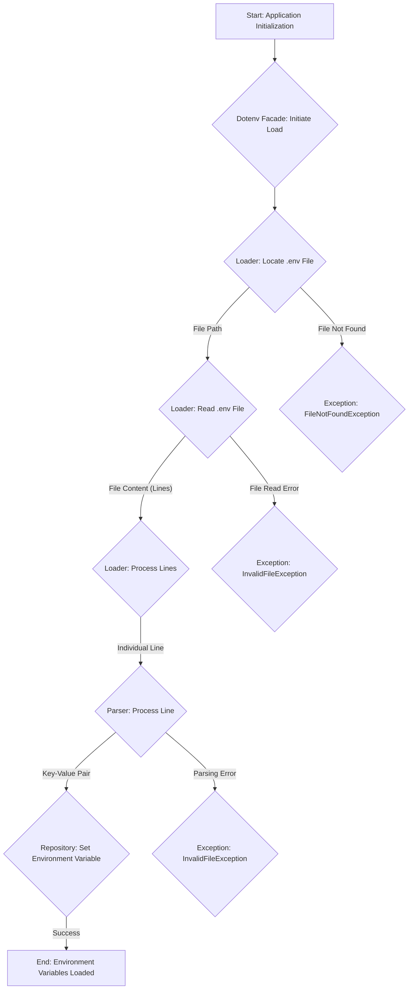

## Project Design Document: phpdotenv

**Project Name:** phpdotenv

**Project Repository:** https://github.com/vlucas/phpdotenv

**Document Version:** 1.1

**Date:** October 26, 2023

**Author:** AI Software Architect

### 1. Introduction

This document provides a detailed design overview of the `phpdotenv` library, intended to serve as a foundation for subsequent threat modeling activities. It outlines the library's purpose, architecture, data flow, and key components with a focus on security-relevant aspects.

### 2. Project Overview

`phpdotenv` is a PHP library that loads environment variables from a `.env` file into the `getenv()`, `$_ENV`, and `$_SERVER` superglobal arrays. This facilitates the separation of application configuration from the codebase, improving security by allowing sensitive information to be stored outside of version control and simplifying environment-specific configurations.

### 3. Goals and Objectives

*   To provide a straightforward and dependable mechanism for loading environment variables from a `.env` file.
*   To enhance application security and maintainability by decoupling configuration from code.
*   To adhere to standard `.env` file syntax and parsing conventions.
*   To offer seamless integration into existing PHP projects with minimal overhead.
*   To provide options for controlling environment variable overwriting.

### 4. Non-Goals

*   To offer built-in encryption or secure storage solutions for the `.env` file itself.
*   To function as a comprehensive environment variable management system beyond loading from a file.
*   To provide a graphical or command-line interface for managing environment variables.
*   To support complex, nested configuration structures beyond basic key-value pairs.
*   To automatically reload environment variables upon changes to the `.env` file during runtime.

### 5. Architecture and Components

The `phpdotenv` library operates through a series of interconnected components responsible for locating, reading, parsing, and applying environment variables.

*   **Dotenv Facade (Entry Point):** This serves as the primary interface for interacting with the library. It orchestrates the loading process.
    *   Accepts the path to the directory containing the `.env` file (optional).
    *   Instantiates the `Loader` and `Repository` components.
    *   Provides methods like `load()` to initiate the loading process.

*   **Loader Component:** Responsible for the core logic of finding and processing the `.env` file.
    *   **File Locator:** Determines the location of the `.env` file.
        *   Checks for a user-specified path.
        *   Defaults to searching in the current working directory and its parent directories.
    *   **File Reader:** Reads the content of the located `.env` file.
        *   Uses standard PHP file system functions.
        *   Handles potential file access errors.
    *   **Line Processor:** Iterates through each line of the file content and passes it to the `Parser`.

*   **Parser Component:** Interprets individual lines from the `.env` file.
    *   **Comment Stripper:** Identifies and removes comment lines (starting with `#`).
    *   **Whitespace Trimmer:** Removes leading and trailing whitespace from lines.
    *   **Key-Value Splitter:** Splits each line into a key and a value based on the first occurrence of the `=` delimiter.
    *   **Quote Handler:** Manages quoted values (single and double quotes).
        *   Removes surrounding quotes.
        *   Handles escaped characters within quotes (e.g., `\"`, `\'`).
    *   **Variable Expander (Optional):**  May support expanding existing environment variables within the `.env` file (e.g., `DB_HOST=${DATABASE_HOST}`).

*   **Repository Component:** Manages the setting of environment variables.
    *   **Variable Setter:** Sets the environment variables using PHP's `putenv()` function and by directly manipulating the `$_ENV` and `$_SERVER` superglobals.
    *   **Overwrite Policy Enforcer:**  Determines whether to overwrite existing environment variables based on configuration options.
    *   **Immutable Check (Optional):** May provide an option to make environment variables immutable after loading.

*   **Exception Handling:**  Provides mechanisms for handling errors during the loading process.
    *   `FileNotFoundException`: Thrown when the `.env` file cannot be found.
    *   `InvalidFileException`: Thrown for errors during file reading or parsing.

### 6. Data Flow

The process of loading environment variables involves a series of steps, with data flowing between the components.

Detailed steps in the data flow:

1. **Start: Application Initialization:** The PHP application begins execution.
2. **Dotenv Facade: Initiate Load:** The application calls the `load()` method of the `Dotenv` facade.
3. **Loader: Locate .env File:** The `File Locator` within the `Loader` component searches for the `.env` file based on configured paths or defaults.
4. **Loader: Read .env File:** The `File Reader` reads the content of the located `.env` file into a string.
5. **Loader: Process Lines:** The `Line Processor` iterates through each line of the file content.
6. **Parser: Process Line:** For each line, the `Parser` component performs the following:
    *   Removes comments using the `Comment Stripper`.
    *   Trims whitespace using the `Whitespace Trimmer`.
    *   Splits the line into a key and value using the `Key-Value Splitter`.
    *   Handles quoted values and escaped characters using the `Quote Handler`.
    *   Optionally expands existing environment variables using the `Variable Expander`.
7. **Repository: Set Environment Variable:** The `Variable Setter` in the `Repository` component sets the environment variable using `putenv()`, `$_ENV`, and `$_SERVER`. The `Overwrite Policy Enforcer` determines if an existing variable should be overwritten.
8. **End: Environment Variables Loaded:** The environment variables are now available to the application.
9. **Exception: FileNotFoundException:** If the `.env` file cannot be found, a `FileNotFoundException` is thrown.
10. **Exception: InvalidFileException:** If there's an error reading the file or during parsing, an `InvalidFileException` is thrown.

### 7. Dependencies

*   **PHP Core:** Relies on standard PHP functions for file system operations (e.g., `file_get_contents`), string manipulation (e.g., `trim`, `explode`), and environment variable manipulation (`getenv`, `putenv`).
*   **Composer (Development):** Used for managing development dependencies and autoloading the library.

### 8. Security Considerations

This section details potential security considerations relevant for threat modeling.

*   **Exposure of Sensitive Information in `.env` File:**
    *   **Threat:** The `.env` file contains sensitive configuration data (e.g., database credentials, API keys). If the file is inadvertently exposed (e.g., through misconfigured web servers, accidental inclusion in public repositories), this information can be compromised.
    *   **Mitigation:**  Ensure proper file permissions (read-only for the application user), exclude `.env` from version control, and configure web servers to prevent direct access to `.env` files.

*   **File Path Traversal Vulnerabilities:**
    *   **Threat:** If the path to the `.env` file is determined by external input or insufficiently validated data, an attacker might be able to manipulate the path to access other files on the system.
    *   **Mitigation:** Avoid dynamic path construction for the `.env` file. Use a fixed or well-defined configuration.

*   **Parsing Vulnerabilities:**
    *   **Threat:** Maliciously crafted `.env` files with unexpected characters, excessive whitespace, or unusual quoting could potentially lead to unexpected behavior or even code injection if the parsing logic is flawed.
    *   **Mitigation:** Implement robust input validation and sanitization within the `Parser` component. Thoroughly test the parsing logic with various edge cases.

*   **Environment Variable Overwriting:**
    *   **Threat:** If the application allows overwriting existing environment variables and an attacker can influence the contents of the `.env` file, they could potentially overwrite critical system or application environment variables, leading to unexpected behavior or security breaches.
    *   **Mitigation:** Carefully consider the configuration option for overwriting existing variables. In production environments, it's often safer to prevent overwriting.

*   **Information Disclosure through Error Messages:**
    *   **Threat:** Verbose error messages during the loading process (e.g., file not found with full path) could reveal sensitive information about the application's file structure.
    *   **Mitigation:** Implement proper error handling that logs detailed errors internally but provides generic error messages to end-users or external systems.

*   **Supply Chain Vulnerabilities:**
    *   **Threat:** If the `phpdotenv` library itself is compromised (e.g., through a malicious update), applications using it could be vulnerable.
    *   **Mitigation:** Use dependency management tools like Composer to manage and verify dependencies. Regularly update dependencies to patch known vulnerabilities.

*   **Variable Expansion Vulnerabilities:**
    *   **Threat:** If variable expansion is enabled, and an attacker can control parts of the `.env` file, they might be able to inject arbitrary values by referencing existing environment variables they control.
    *   **Mitigation:** If variable expansion is supported, carefully consider its security implications and potentially disable it if the risk is deemed too high.

### 9. Deployment Considerations

*   **Secure Storage of `.env` Files:** The `.env` file should be stored securely, outside the web server's document root, and with restricted file permissions.
*   **Environment-Specific Configurations:** Utilize environment-specific `.env` files (e.g., `.env.development`, `.env.staging`, `.env.production`) and load the appropriate file based on the deployment environment.
*   **Web Server Configuration:** Configure the web server (e.g., Apache, Nginx) to prevent direct access to `.env` files.
*   **Alternative Configuration Methods:** For highly sensitive production environments, consider alternative methods for managing secrets, such as using dedicated secret management services (e.g., HashiCorp Vault, AWS Secrets Manager).
*   **Process Isolation:** Ensure the application runs with the least necessary privileges to limit the impact of potential security breaches.

### 10. Future Considerations

*   Exploring more sophisticated parsing techniques to handle complex scenarios.
*   Adding support for different configuration file formats (e.g., `.ini`, `.yaml`).
*   Providing more granular control over which environment variables are loaded.
*   Improving documentation with more comprehensive security guidelines and best practices.

This improved design document provides a more detailed and security-focused overview of the `phpdotenv` library, enhancing its utility for threat modeling activities. The expanded descriptions of components, data flow, and security considerations offer a more comprehensive understanding of the library's inner workings and potential vulnerabilities.
