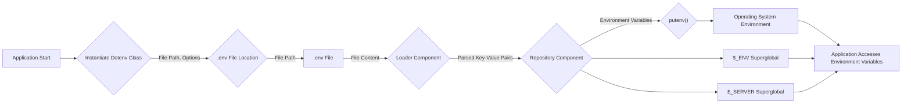

# Project Design Document: phpdotenv

**Version:** 1.1
**Date:** October 26, 2023
**Author:** AI Software Architect

## 1. Introduction

This document provides an enhanced design overview of the `phpdotenv` library. Its primary purpose is to serve as a detailed reference for threat modeling activities, outlining the library's functionality, architecture, and potential security considerations.

## 2. Project Overview

The `phpdotenv` library is a PHP package designed to load environment variables from a `.env` file into the PHP environment. This allows developers to manage configuration settings, especially sensitive information, separately from the application's code, promoting security and simplifying environment-specific deployments.

## 3. Goals

*   Provide a clear and comprehensive description of the `phpdotenv` library's functionalities and their execution flow.
*   Detail the internal components and their interactions within the library.
*   Visually represent the data flow within the library and its interaction with the environment.
*   Establish a solid foundation for identifying and analyzing potential security threats associated with the library's use.

## 4. Functional Description

The `phpdotenv` library operates through a series of steps to load environment variables:

*   **Initialization:**
    *   The `Dotenv` class is instantiated, typically providing the path to the directory containing the `.env` file.
    *   Configuration options, such as immutability or the ability to overwrite existing variables, are set during initialization.
*   **File Discovery and Loading:**
    *   The library attempts to locate the specified `.env` file.
    *   It can be configured to load from multiple files (e.g., `.env`, `.env.local`).
    *   Error handling is in place for scenarios where the file is not found (configurable to throw exceptions or not).
*   **Content Acquisition:**
    *   Once located, the library reads the content of the `.env` file.
    *   It handles different line endings and character encodings.
*   **Parsing and Processing:**
    *   The file content is processed line by line.
    *   **Comment Handling:** Lines starting with `#` are ignored.
    *   **Key-Value Extraction:**  Lines are split into key-value pairs based on the `=` delimiter. Leading and trailing whitespace around keys and unquoted values are typically trimmed.
    *   **Quoting:** Handles single and double quotes around values.
        *   Double quotes allow for variable interpolation and interpretation of escape sequences (e.g., `\n`, `\t`).
        *   Single quotes treat the enclosed value literally.
    *   **Empty Values:** Handles cases where a key has no assigned value (e.g., `KEY_NAME=`).
    *   **Multiline Values (Limited):** While not a primary feature, some implementations might handle basic multiline values.
*   **Variable Expansion:**
    *   Optionally, the library can expand variables within values using syntax like `${OTHER_VARIABLE}` or `$OTHER_VARIABLE`.
    *   This involves recursively looking up and substituting the values of other defined environment variables.
    *   Care must be taken to avoid infinite recursion.
*   **Environment Variable Setting:**
    *   For each parsed key-value pair, the library sets the corresponding environment variable.
    *   It typically uses the `putenv()` function.
    *   It updates the `$_ENV` and `$_SERVER` superglobals to reflect the loaded variables. The specific superglobals updated might be configurable.
*   **Immutability Enforcement:**
    *   If configured as immutable, the library will not overwrite environment variables that are already set in the environment.
    *   The order in which files are loaded can be significant in this mode.
*   **Error Handling:**
    *   The library includes error handling for scenarios like malformed lines in the `.env` file or issues during variable expansion.
    *   Error handling behavior (e.g., throwing exceptions, logging) can be configurable.

## 5. System Architecture

The `phpdotenv` library's architecture is centered around a few key classes:

*   **`Dotenv\Dotenv`:** This is the primary class developers interact with. It orchestrates the process of loading environment variables. Its responsibilities include:
    *   Accepting configuration options (file paths, immutability).
    *   Locating and loading the `.env` file(s).
    *   Delegating parsing and setting of variables to other components.
*   **`Dotenv\Loader\Loader`:**  This class (or a similar internal component) is responsible for the core logic of parsing the `.env` file content. Its responsibilities include:
    *   Reading the file content.
    *   Iterating through lines.
    *   Identifying comments.
    *   Extracting keys and values, handling quoting and escaping.
    *   Performing variable expansion if enabled.
*   **`Dotenv\Repository\RepositoryInterface` (and implementations):** This interface (and its implementations) abstract the mechanism for setting and retrieving environment variables. Implementations might interact directly with `putenv()`, `$_ENV`, and `$_SERVER`. This allows for flexibility in how environment variables are managed.
*   **Exception Classes (e.g., `Exception\InvalidFileException`, `Exception\InvalidPathException`):**  Define specific exception types for different error conditions encountered during the loading and parsing process.

## 6. Data Flow Diagram

## 7. Deployment Considerations

*   **Integration Method:** Typically integrated into PHP projects using Composer as a dependency.
*   **Configuration:** The path to the `.env` file and other options are usually configured within the application's bootstrap or initialization process.
*   **Runtime Environment:**  `phpdotenv` is designed to run in various PHP environments, including:
    *   **Web Servers (e.g., Apache, Nginx with PHP-FPM):**  Environment variables are loaded when the PHP process starts.
    *   **Command-Line Interface (CLI):** Useful for scripts and console applications.
    *   **Testing Environments:**  Allows for setting up specific configurations for testing.
*   **File System Permissions:** The PHP process requires read permissions on the `.env` file. Incorrect permissions can lead to application failures.
*   **Version Control:** The `.env` file should generally *not* be committed to version control in production environments. `.env.example` files are often used to provide a template.
*   **Containerization (e.g., Docker):**  `phpdotenv` is commonly used in containerized applications to load environment-specific configurations.
*   **Cloud Environments:**  Used in cloud deployments (e.g., AWS, Azure, Google Cloud) to manage environment variables specific to each environment.

## 8. Security Considerations

This section outlines potential security considerations relevant to `phpdotenv`:

*   **Sensitive Data Exposure in `.env` Files:**
    *   The primary risk is the exposure of sensitive information (API keys, database credentials, etc.) if the `.env` file is inadvertently exposed.
    *   **Threat:** Unauthorized access to the file system, accidental commit to version control, misconfigured deployments.
*   **File Path Vulnerabilities:**
    *   If the path to the `.env` file is derived from user input or external, untrusted sources, it could be susceptible to path traversal attacks.
    *   **Threat:** Attackers could potentially load arbitrary files as environment variable sources.
*   **Variable Expansion Exploits:**
    *   If variable expansion is enabled, malicious actors might be able to inject unintended values or trigger unexpected behavior by manipulating existing environment variables or crafting malicious `.env` content.
    *   **Threat:** Information disclosure, command injection (if expanded variables are used in system calls).
*   **Denial of Service (DoS):**
    *   Extremely large or deeply nested variable expansions in the `.env` file could potentially lead to excessive resource consumption and denial of service.
    *   **Threat:** Application becomes unresponsive or crashes.
*   **Information Disclosure through Errors:**
    *   Verbose error messages or logging related to `.env` file processing could inadvertently reveal sensitive information about the file's contents or structure.
    *   **Threat:** Attackers gain insights into the application's configuration.
*   **Overwriting Critical Environment Variables:**
    *   If immutability is not enforced or configured incorrectly, `phpdotenv` could potentially overwrite existing, critical system-level environment variables, leading to unexpected application behavior or security issues.
    *   **Threat:** Application malfunction, security bypasses.
*   **Insecure Defaults:**
    *   Default configuration settings (e.g., variable expansion enabled by default) could introduce security vulnerabilities if not carefully considered.
*   **Supply Chain Attacks:**
    *   Compromise of the `phpdotenv` package itself could lead to malicious code being injected into applications using it.
    *   **Mitigation:** Rely on trusted package repositories and use dependency scanning tools.

## 9. Data Elements

*   **.env File:** A plain text file containing environment variables.
    *   **Key:**  The name of the environment variable (string). Typically uppercase.
    *   **Value:** The value assigned to the environment variable (string). Can be quoted or unquoted.
*   **Environment Variables (in PHP):**
    *   **Name:** The identifier for the environment variable (string).
    *   **Value:** The string value associated with the environment variable.
*   **Configuration Options (passed to `Dotenv`):**
    *   File paths (string or array of strings).
    *   Immutability flag (boolean).
    *   Overload flag (boolean).
    *   Short circuit flag (boolean).
    *   Exception on not found flag (boolean).

## 10. Interactions with External Systems

*   **File System:** Reads the `.env` file from the file system.
*   **Operating System:** Uses the `putenv()` function to set environment variables in the operating system's environment for the current PHP process.
*   **PHP Superglobals (`$_ENV`, `$_SERVER`):** Updates these arrays to reflect the loaded environment variables.

## 11. Configuration Options

The `phpdotenv` library offers several configuration options to customize its behavior:

*   **`$path` (string or array):** Specifies the path(s) to the directory containing the `.env` file(s).
*   **`$immutable` (bool):** If `true`, existing environment variables will not be overwritten. Defaults to `false`.
*   **`$overload` (bool):** If `true`, allows overwriting existing environment variables. This is the opposite of `$immutable`.
*   **`$shortCircuit` (bool):** If `true`, stops processing the `.env` file after the first error is encountered.
*   **`$notfoundException` (bool):** If `true`, an exception is thrown if the `.env` file is not found.

## 12. Future Considerations (Out of Scope for Initial Threat Model)

*   Support for different environment variable file formats (e.g., `.ini`).
*   More sophisticated variable expansion capabilities and syntax.
*   Integration with secret management services for retrieving sensitive values.
*   Improved error reporting and debugging features.

This improved design document provides a more detailed and structured overview of the `phpdotenv` library, enhancing its utility for threat modeling and security analysis. The added details on functional aspects, architecture, and security considerations offer a more comprehensive understanding of the library's potential attack surface.