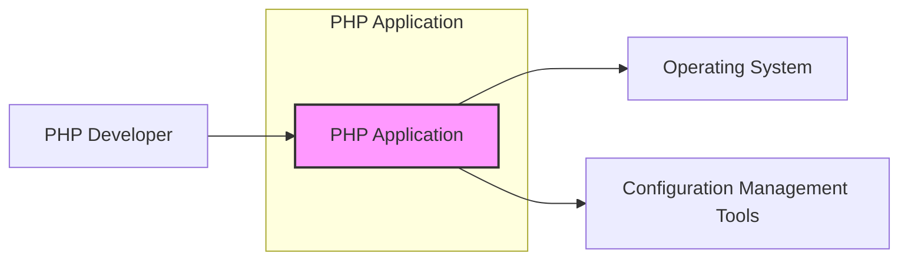
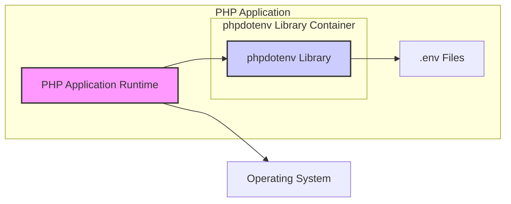
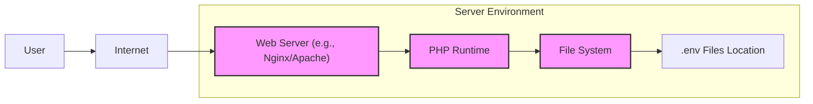

# BUSINESS POSTURE

- Business Priorities and Goals:
  - The phpdotenv project aims to simplify the management of environment variables for PHP applications.
  - It promotes the separation of configuration from code, making applications more portable and easier to deploy across different environments (development, staging, production).
  - The primary goal is to enhance developer experience and streamline configuration management in PHP projects.
- Business Risks:
  - Misconfiguration due to incorrect or missing environment variables can lead to application malfunctions or unexpected behavior.
  - Exposure of sensitive information if `.env` files are not properly secured or accidentally committed to version control.
  - Dependency on an external library introduces a potential supply chain risk, although phpdotenv is a widely used and mature library.
  - Incorrect handling of environment variables within the application code can lead to security vulnerabilities if not properly validated and sanitized.

# SECURITY POSTURE

- Existing Security Controls:
  - security control: Reliance on underlying operating system and server security for file system permissions to protect `.env` files. Implemented at the server level.
  - security control: Secure software development lifecycle practices for projects using phpdotenv, including code reviews and testing. Implemented by development teams using the library.
  - security control: Usage of HTTPS for web applications using phpdotenv to protect data in transit, including potentially environment variables used in the application logic. Implemented at the web server and application level.
- Accepted Risks:
  - accepted risk: Risk of accidental exposure of `.env` files if not properly managed in version control or backups. Mitigation relies on developer awareness and best practices.
  - accepted risk: Risk of misconfiguration if environment variables are not correctly set or interpreted. Mitigation relies on testing and validation within the application.
  - accepted risk: Dependency on the phpdotenv library itself. Mitigation relies on community trust and monitoring for known vulnerabilities in the library.
- Recommended Security Controls:
  - security control: Implement automated checks to prevent `.env` files from being committed to version control systems. Implemented in CI/CD pipelines and developer workflows.
  - security control: Regularly scan dependencies, including phpdotenv, for known vulnerabilities using tools like dependency-check or similar. Implemented in CI/CD pipelines.
  - security control: Implement input validation and sanitization for environment variables within the application code to prevent injection vulnerabilities. Implemented in application code.
  - security control: Consider encrypting sensitive data within `.env` files or using more secure configuration management solutions for highly sensitive environments. Implemented at the application and deployment level.
  - security control: Implement least privilege principles for access to `.env` files and environment variables within the application and deployment environment. Implemented at the operating system and application level.
- Security Requirements:
  - Authentication: Not directly applicable to phpdotenv library itself. Authentication is a responsibility of the applications using phpdotenv.
  - Authorization: Not directly applicable to phpdotenv library itself. Authorization is a responsibility of the applications using phpdotenv.
  - Input Validation: Applications using phpdotenv must validate and sanitize environment variables before using them to prevent injection vulnerabilities. This is a critical security requirement for applications using the library.
  - Cryptography: phpdotenv itself does not handle cryptography. If sensitive data is stored in environment variables, applications should consider encrypting this data at rest or in transit, but this is outside the scope of the phpdotenv library itself.

# DESIGN

## C4 CONTEXT

- Elements of Context Diagram:
  - - Name: PHP Application
    - Type: Software System
    - Description: The PHP application that utilizes the phpdotenv library to manage environment variables. This is the system being designed from a security perspective in relation to its configuration management.
    - Responsibilities:
      - Execute business logic.
      - Utilize environment variables for configuration.
      - Interact with the operating system and potentially other systems.
    - Security controls:
      - Input validation of environment variables.
      - Authorization checks within the application.
      - Secure coding practices.
  - - Name: PHP Developer
    - Type: Person
    - Description: Developers who use the phpdotenv library to configure their PHP applications. They are responsible for creating and managing `.env` files and integrating phpdotenv into their projects.
    - Responsibilities:
      - Develop and maintain PHP applications.
      - Configure applications using environment variables and phpdotenv.
      - Manage `.env` files and ensure they are properly secured.
    - Security controls:
      - Secure development practices.
      - Awareness of secure configuration management.
      - Access control to development environments and `.env` files.
  - - Name: Operating System
    - Type: Software System
    - Description: The operating system on which the PHP application is deployed. It provides the underlying environment for the application to run, including file system access and process management.
    - Responsibilities:
      - Provide runtime environment for PHP applications.
      - Manage file system and permissions.
      - Enforce security policies at the OS level.
    - Security controls:
      - File system permissions to protect `.env` files.
      - Operating system level security hardening.
      - Access control to the server and OS.
  - - Name: Configuration Management Tools
    - Type: Software System
    - Description: Tools like Ansible, Chef, Puppet, or Docker that might be used to deploy and configure the PHP application and its environment, including setting up environment variables.
    - Responsibilities:
      - Automate deployment and configuration of applications.
      - Manage environment variables in deployment environments.
      - Ensure consistent configurations across environments.
    - Security controls:
      - Secure configuration management practices.
      - Access control to configuration management tools.
      - Secure storage of configuration data.

## C4 CONTAINER

- Elements of Container Diagram:
  - - Name: PHP Application Runtime
    - Type: Container - Application Runtime
    - Description: The PHP runtime environment executing the application code. This container is responsible for running the application logic and interacting with the phpdotenv library.
    - Responsibilities:
      - Execute PHP application code.
      - Load and utilize environment variables via phpdotenv.
      - Interact with the operating system and other resources.
    - Security controls:
      - Input validation of environment variables received from phpdotenv.
      - Secure coding practices within the application.
      - Least privilege principles for application processes.
  - - Name: phpdotenv Library
    - Type: Container - Library
    - Description: The phpdotenv library itself, which is included as a dependency within the PHP application. It is responsible for reading and parsing `.env` files and making environment variables available to the application.
    - Responsibilities:
      - Read and parse `.env` files.
      - Make environment variables accessible to the PHP application.
      - Handle different `.env` file formats and parsing rules.
    - Security controls:
      - Secure parsing logic to prevent vulnerabilities during `.env` file processing.
      - No external network communication, minimizing attack surface.
      - Reliance on file system permissions for `.env` file access.
  - - Name: .env Files
    - Type: Data Store - Files
    - Description: Files that store environment variables in a key-value format. These files are read by the phpdotenv library to configure the application.
    - Responsibilities:
      - Persistently store environment variables.
      - Be accessible to the PHP application runtime.
    - Security controls:
      - File system permissions to restrict access to `.env` files.
      - Encryption at rest for sensitive `.env` files (if required).
      - Secure storage location, outside of public web directories.
  - - Name: Operating System
    - Type: Infrastructure - Operating System
    - Description: The underlying operating system providing the environment for the PHP application and phpdotenv library to run.
    - Responsibilities:
      - Provide file system access.
      - Manage process execution.
      - Enforce security policies.
    - Security controls:
      - File system access controls.
      - Operating system hardening.
      - Security monitoring and logging.

## DEPLOYMENT

- Deployment Architecture Options:
  - Option 1: Traditional Server Deployment: PHP application and `.env` files deployed directly on a web server (e.g., Apache, Nginx) running on a virtual machine or physical server.
  - Option 2: Containerized Deployment: PHP application and `.env` files containerized using Docker and deployed in a container orchestration platform like Kubernetes or Docker Swarm.
  - Option 3: Serverless Deployment: PHP application deployed as a serverless function (e.g., AWS Lambda, Google Cloud Functions) with environment variables configured through the serverless platform's configuration.

- Detailed Deployment Architecture (Option 1: Traditional Server Deployment):

- Elements of Deployment Diagram (Option 1: Traditional Server Deployment):
  - - Name: Web Server (e.g., Nginx/Apache)
    - Type: Software - Web Server
    - Description: The web server responsible for handling HTTP requests and serving the PHP application. It forwards requests to the PHP runtime.
    - Responsibilities:
      - Handle incoming HTTP requests.
      - Serve static content.
      - Forward PHP requests to the PHP runtime.
      - Enforce web server security configurations (e.g., HTTPS, firewalls).
    - Security controls:
      - HTTPS configuration for secure communication.
      - Web application firewall (WAF) if needed.
      - Regular security updates and patching.
      - Access control and hardening of web server configuration.
  - - Name: PHP Runtime
    - Type: Software - Runtime Environment
    - Description: The PHP interpreter that executes the application code and utilizes the phpdotenv library to load environment variables from `.env` files located in the file system.
    - Responsibilities:
      - Execute PHP application code.
      - Load environment variables using phpdotenv.
      - Interact with the file system and other server resources.
    - Security controls:
      - Secure PHP configuration.
      - Regular PHP updates and patching.
      - Least privilege principles for PHP processes.
  - - Name: File System
    - Type: Infrastructure - File System
    - Description: The server's file system where the PHP application code and `.env` files are stored.
    - Responsibilities:
      - Store application files and configuration files.
      - Provide file access to the web server and PHP runtime.
    - Security controls:
      - File system permissions to protect application files and `.env` files.
      - Regular backups of the file system.
      - Monitoring file system integrity.
  - - Name: .env Files Location
    - Type: Data - File Path
    - Description: Specific directory on the file system where `.env` files are stored. This location should be outside of the web server's document root to prevent direct access from the internet.
    - Responsibilities:
      - Securely store `.env` files.
      - Be accessible to the PHP runtime for reading.
    - Security controls:
      - File system permissions to restrict access to `.env` files (e.g., read-only for the PHP runtime, restricted access for other users).
      - Location outside of web server's public directory.

## BUILD

```mermaid
flowchart LR
    A["Developer"] --> B["Code Repository (e.g., GitHub)"];
    B --> C["CI/CD Pipeline (e.g., GitHub Actions)"];
    C --> D["Build Process (Composer Install, etc.)"];
    D --> E["Security Scanners (SAST, Dependency Check)"];
    E --> F["Build Artifacts (Application Code, Dependencies)"];
    F --> G["Artifact Repository"];
    style A fill:#ccf,stroke:#333,stroke-width:2px
    style B fill:#f9f,stroke:#333,stroke-width:2px
    style C fill:#f9f,stroke:#333,stroke-width:2px
    style D fill:#f9f,stroke:#333,stroke-width:2px
    style E fill:#f9f,stroke:#333,stroke-width:2px
    style F fill:#f9f,stroke:#333,stroke-width:2px
    style G fill:#f9f,stroke:#333,stroke-width:2px
```

- Build Process Description:
  - Developer commits code changes to a code repository (e.g., GitHub).
  - A CI/CD pipeline (e.g., GitHub Actions, Jenkins) is triggered upon code changes.
  - The build process starts, typically involving:
    - Checking out the code from the repository.
    - Installing dependencies using a dependency manager like Composer for PHP (`composer install`).
    - Running linters and static analysis security testing (SAST) tools to identify potential code quality and security issues.
    - Running dependency check tools to identify known vulnerabilities in project dependencies, including phpdotenv and other libraries.
    - Running unit tests and integration tests.
  - Security scanners analyze the code and dependencies for vulnerabilities.
  - Build artifacts are created, including the application code and installed dependencies.
  - Build artifacts are stored in an artifact repository (e.g., Docker Registry, package repository).
- Security Controls in Build Process:
  - security control: Automated build process using CI/CD pipelines to ensure consistency and repeatability. Implemented in CI/CD system.
  - security control: Static Application Security Testing (SAST) tools to scan code for potential vulnerabilities. Implemented in CI/CD pipeline.
  - security control: Dependency checking tools to identify known vulnerabilities in dependencies, including phpdotenv. Implemented in CI/CD pipeline.
  - security control: Code linters to enforce code quality and coding standards. Implemented in CI/CD pipeline.
  - security control: Automated unit and integration tests to ensure code functionality and prevent regressions. Implemented in CI/CD pipeline.
  - security control: Secure access control to the CI/CD pipeline and artifact repository. Implemented in CI/CD and artifact repository systems.
  - security control: Supply chain security practices by using trusted dependency repositories and verifying checksums of downloaded dependencies. Implemented in build process and dependency management.

# RISK ASSESSMENT

- Critical Business Processes:
  - The critical business processes are those supported by the PHP applications that utilize phpdotenv for configuration. The security of these applications and their configurations directly impacts the business processes they enable.
  - If the application is a customer-facing web application, the critical business process is serving customers and maintaining application availability and data integrity.
  - If the application is an internal tool, the critical business process is supporting internal operations and ensuring data confidentiality and integrity for internal users.
- Data Sensitivity:
  - The sensitivity of data protected by this design depends on the environment variables stored in `.env` files.
  - Environment variables can contain sensitive information such as:
    - Database credentials (usernames, passwords, connection strings).
    - API keys and secrets for external services.
    - Encryption keys or salts.
    - Application-specific sensitive configuration parameters.
  - The sensitivity level can range from moderate (if only non-critical configuration is stored) to high (if highly sensitive credentials or secrets are stored). It is crucial to treat `.env` files and environment variables as potentially containing highly sensitive data and apply appropriate security controls.

# QUESTIONS & ASSUMPTIONS

- Questions:
  - What type of applications will be using phpdotenv? (e.g., web applications, APIs, background workers, CLI tools). This will influence the deployment architecture and threat model.
  - What is the sensitivity of the data that will be stored in environment variables? This will determine the required level of security controls for `.env` files and environment variable handling.
  - What is the deployment environment for the applications using phpdotenv? (e.g., cloud, on-premise, hybrid). This will impact the deployment architecture and available security services.
  - Are there any specific compliance requirements (e.g., GDPR, PCI DSS, HIPAA) that the applications using phpdotenv must adhere to? This will dictate additional security controls and considerations.
  - What is the organization's risk appetite? A higher risk appetite might lead to accepting more risks related to configuration management, while a lower risk appetite will require stricter security measures.
- Assumptions:
  - It is assumed that phpdotenv is used in typical PHP application development scenarios for managing configuration across different environments.
  - It is assumed that environment variables may contain sensitive information, requiring appropriate security measures to protect `.env` files and handle environment variables securely.
  - It is assumed that applications using phpdotenv will be deployed in standard server environments, either traditional servers or containerized environments.
  - It is assumed that the organization values security and wants to implement reasonable security controls to protect their applications and data.
  - It is assumed that the development team follows secure software development lifecycle practices.