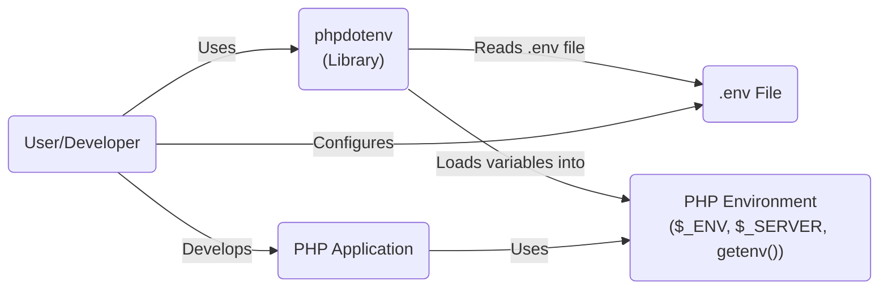
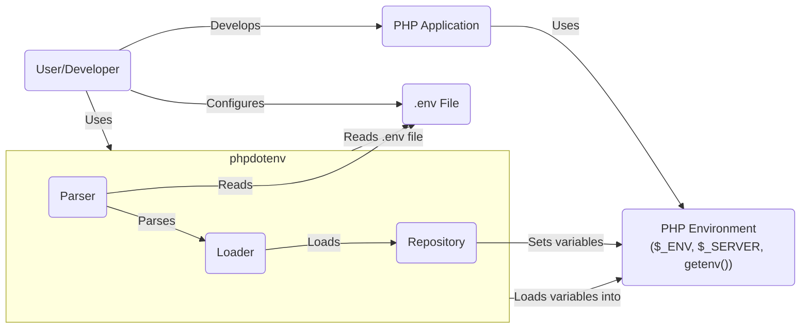
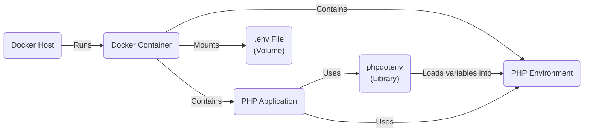
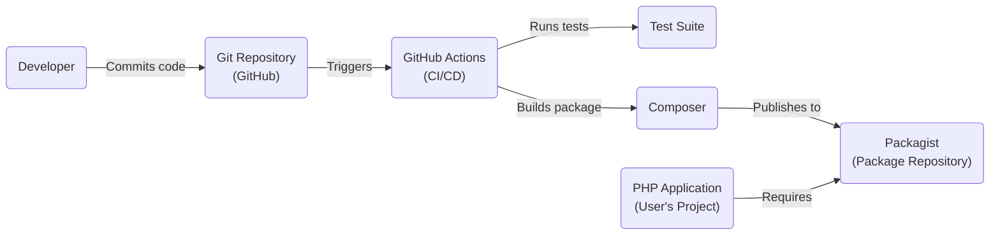

# BUSINESS POSTURE

Business Priorities and Goals:

The `phpdotenv` project aims to provide a simple and convenient way for PHP developers to manage environment variables in their applications. This aligns with the broader industry best practice of separating configuration from code, enhancing portability and security. The library's primary goal is to simplify the loading of environment variables from a `.env` file into the PHP environment (`$_ENV`, `$_SERVER`, and `getenv()`). This simplifies application configuration, especially across different environments (development, testing, production).

Business Risks:

-   Insecure handling of sensitive data: If the `.env` file, which often contains sensitive information like API keys, database credentials, and secret keys, is accidentally exposed (e.g., committed to a public repository, misconfigured web server), it could lead to significant security breaches.
-   Dependency vulnerabilities: As with any library, `phpdotenv` itself or its dependencies could have vulnerabilities that could be exploited.
-   Improper usage: Developers might misuse the library, leading to unexpected behavior or security issues. For example, not validating or sanitizing the loaded environment variables before using them could open up injection vulnerabilities.
-   Lack of maintenance: If the library is not actively maintained, it might become incompatible with newer PHP versions or fail to address emerging security threats.
-   Supply chain attacks: Compromise of the package repository or build process could lead to malicious code being injected into the library.

# SECURITY POSTURE

Existing Security Controls:

-   security control: The library itself promotes a security best practice by encouraging the use of environment variables, which helps keep sensitive information out of the codebase.
-   security control: The project's README provides guidance on securing the `.env` file, advising users to keep it outside the web root and restrict access to it.
-   security control: The library is relatively simple, reducing the attack surface compared to more complex configuration management solutions.
-   security control: The project uses GitHub Actions for continuous integration, which includes running tests. This helps ensure that new changes don't introduce regressions.
-   security control: The project is open-source, allowing for community review and contributions, which can help identify and fix security issues.
-   security control: The project uses Composer for dependency management, which allows for easier tracking and updating of dependencies.
-   security control: Implemented in PHP.

Accepted Risks:

-   accepted risk: The library relies on the user to properly secure the `.env` file. The library itself cannot enforce this.
-   accepted risk: The library does not perform any input validation or sanitization on the loaded environment variables. It's the responsibility of the user to ensure that the values are safe to use.
-   accepted risk: The library does not encrypt the contents of the `.env` file.

Recommended Security Controls:

-   security control: Integrate static analysis tools (e.g., PHPStan, Psalm) into the CI pipeline to identify potential code quality and security issues.
-   security control: Implement a security policy (e.g., a `SECURITY.md` file) that outlines how to report vulnerabilities and how they will be handled.
-   security control: Regularly audit dependencies for known vulnerabilities and update them promptly. Consider using tools like Dependabot.
-   security control: Provide more explicit guidance in the documentation on how to securely use the library in different environments (e.g., Docker, shared hosting).
-   security control: Consider adding features to help users validate or sanitize environment variables, although this should be done carefully to avoid breaking existing functionality.

Security Requirements:

-   Authentication: Not directly applicable to this library, as it doesn't handle authentication.
-   Authorization: Not directly applicable to this library.
-   Input Validation: The library should encourage (but not enforce) input validation of environment variables by the application using it. The documentation should clearly state the risks of using unvalidated input.
-   Cryptography: The library itself does not handle cryptography, but the documentation should advise users to store sensitive data securely (e.g., using strong encryption if storing secrets in a database). The `.env` file should never be committed to version control.

# DESIGN

## C4 CONTEXT

Element Descriptions:

-   1.  Name: User/Developer
    -   Type: Person
    -   Description: The developer using the phpdotenv library in their PHP application.
    -   Responsibilities: Configures the .env file, integrates phpdotenv into their application, and uses the loaded environment variables.
    -   Security controls: Follows secure coding practices, properly secures the .env file.

-   2.  Name: phpdotenv
    -   Type: Library
    -   Description: The phpdotenv library itself.
    -   Responsibilities: Reads the .env file, parses its contents, and loads the variables into the PHP environment.
    -   Security controls: Follows secure coding practices, relies on the user to secure the .env file.

-   3.  Name: .env File
    -   Type: File
    -   Description: A file containing environment variables in a key-value format.
    -   Responsibilities: Stores configuration settings, including sensitive data.
    -   Security controls: Kept outside the web root, restricted file permissions, not committed to version control.

-   4.  Name: PHP Environment
    -   Type: Runtime Environment
    -   Description: The PHP runtime environment, including global variables like `$_ENV`, `$_SERVER`, and the `getenv()` function.
    -   Responsibilities: Provides access to environment variables.
    -   Security controls: Standard PHP security configurations.

-   5.  Name: PHP Application
    -   Type: Software System
    -   Description: Application that is using phpdotenv library.
    -   Responsibilities: Uses environment variables loaded by phpdotenv.
    -   Security controls: Input validation, secure coding practices.

## C4 CONTAINER

Element Descriptions:

-   1.  Name: User/Developer
    -   Type: Person
    -   Description: The developer using the phpdotenv library in their PHP application.
    -   Responsibilities: Configures the .env file, integrates phpdotenv into their application, and uses the loaded environment variables.
    -   Security controls: Follows secure coding practices, properly secures the .env file.

-   2.  Name: phpdotenv
    -   Type: Library
    -   Description: The phpdotenv library itself.
    -   Responsibilities: Reads the .env file, parses its contents, and loads the variables into the PHP environment.
    -   Security controls: Follows secure coding practices, relies on the user to secure the .env file.

-   3.  Name: .env File
    -   Type: File
    -   Description: A file containing environment variables in a key-value format.
    -   Responsibilities: Stores configuration settings, including sensitive data.
    -   Security controls: Kept outside the web root, restricted file permissions, not committed to version control.

-   4.  Name: PHP Environment
    -   Type: Runtime Environment
    -   Description: The PHP runtime environment, including global variables like `$_ENV`, `$_SERVER`, and the `getenv()` function.
    -   Responsibilities: Provides access to environment variables.
    -   Security controls: Standard PHP security configurations.

-   5.  Name: PHP Application
    -   Type: Software System
    -   Description: Application that is using phpdotenv library.
    -   Responsibilities: Uses environment variables loaded by phpdotenv.
    -   Security controls: Input validation, secure coding practices.

-   6.  Name: Parser
    -   Type: Component
    -   Description: Responsible for reading and parsing the .env file content.
    -   Responsibilities: Reads the file line by line, handles comments, and extracts key-value pairs.
    -   Security controls: Handles different quoting and escaping mechanisms correctly.

-   7.  Name: Loader
    -   Type: Component
    -   Description: Takes the parsed key-value pairs and prepares them for loading into the environment.
    -   Responsibilities: Handles variable substitution and other transformations.
    -   Security controls: None specific, relies on the Parser for correct input.

-   8.  Name: Repository
    -   Type: Component
    -   Description: Responsible for setting the environment variables in the PHP environment.
    -   Responsibilities: Calls `putenv`, sets `$_ENV` and `$_SERVER` variables.
    -   Security controls: None specific.

## DEPLOYMENT

Possible Deployment Solutions:

-   Shared Hosting: The `.env` file should be placed outside the web root and the application code should be configured to load it from that location.
-   Dedicated Server/VPS: Similar to shared hosting, the `.env` file should be placed in a secure location, ideally outside the web root.
-   Containerized (Docker): The `.env` file can be mounted as a volume or the environment variables can be set directly in the Dockerfile or docker-compose file.
-   Cloud Platforms (AWS, Google Cloud, Azure): Environment variables can be managed using the platform's built-in configuration management services (e.g., AWS Secrets Manager, Google Cloud Secret Manager, Azure Key Vault).

Chosen Deployment Solution (Containerized - Docker):

Element Descriptions:

-   1.  Name: Docker Host
    -   Type: Infrastructure Node
    -   Description: The physical or virtual machine running the Docker engine.
    -   Responsibilities: Hosts and manages Docker containers.
    -   Security controls: OS hardening, firewall, regular security updates.

-   2.  Name: Docker Container
    -   Type: Container
    -   Description: The isolated environment running the PHP application and its dependencies.
    -   Responsibilities: Provides a consistent and reproducible environment for the application.
    -   Security controls: Minimal base image, non-root user, regular image updates.

-   3.  Name: PHP Application
    -   Type: Software System
    -   Description: The PHP application using phpdotenv.
    -   Responsibilities: Uses environment variables loaded by phpdotenv.
    -   Security controls: Input validation, secure coding practices.

-   4.  Name: PHP Environment
    -   Type: Runtime Environment
    -   Description: The PHP runtime environment within the Docker container.
    -   Responsibilities: Provides access to environment variables.
    -   Security controls: Standard PHP security configurations.

-   5.  Name: .env File (Volume)
    -   Type: File (Mounted Volume)
    -   Description: The .env file, mounted as a volume into the Docker container.
    -   Responsibilities: Stores configuration settings.
    -   Security controls: Kept outside the container image, restricted access.

-   6.  Name: phpdotenv
    -   Type: Library
    -   Description: The phpdotenv library itself.
    -   Responsibilities: Reads the .env file, parses its contents, and loads the variables into the PHP environment.
    -   Security controls: Follows secure coding practices, relies on the user to secure the .env file.

## BUILD

Build Process Description:

1.  Developer commits code changes to the GitHub repository.
2.  GitHub Actions is triggered by the commit.
3.  GitHub Actions runs the test suite to ensure code quality and prevent regressions.
4.  Composer is used to manage dependencies and build the package.
5.  The built package is published to Packagist, the main package repository for PHP.
6.  User's PHP application, which requires `phpdotenv`, can then install or update the library via Composer.

Security Controls:

-   security control: GitHub Actions provides a secure and automated build environment.
-   security control: Running tests as part of the CI pipeline helps catch bugs and vulnerabilities early.
-   security control: Composer helps manage dependencies and ensures that the correct versions are used.
-   security control: Packagist provides a central and trusted repository for PHP packages.
-   security control: Using signed commits can help verify the integrity of the code.
-   security control: Two-factor authentication (2FA) should be enabled for all accounts involved in the build and publishing process (GitHub, Packagist).

# RISK ASSESSMENT

Critical Business Processes:

-   Application configuration management: Ensuring that applications can be easily configured for different environments without modifying the code.
-   Secure handling of sensitive data: Protecting secrets like API keys and database credentials.

Data Sensitivity:

-   .env file contents: Highly sensitive, as it often contains secrets.
-   Application code: Potentially sensitive, depending on the application's functionality.
-   Environment variables: Can range from non-sensitive to highly sensitive, depending on the specific variable.

# QUESTIONS & ASSUMPTIONS

Questions:

-   Are there any specific compliance requirements (e.g., PCI DSS, GDPR) that need to be considered?
-   What is the expected frequency of updates and releases for this library?
-   What is the process for handling security vulnerabilities reported by external researchers?
-   Are there any plans to add new features to the library in the future?

Assumptions:

-   BUSINESS POSTURE: The primary goal is to provide a simple and convenient way to manage environment variables in PHP applications. Security is a high priority, but usability should not be significantly impacted.
-   SECURITY POSTURE: The library relies on the user to properly secure the .env file and validate the loaded environment variables. The library itself does not handle encryption or advanced security features.
-   DESIGN: The library is designed to be lightweight and have minimal dependencies. The deployment environment can vary, but the general principles of keeping the .env file secure remain the same.