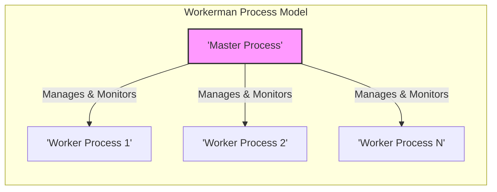
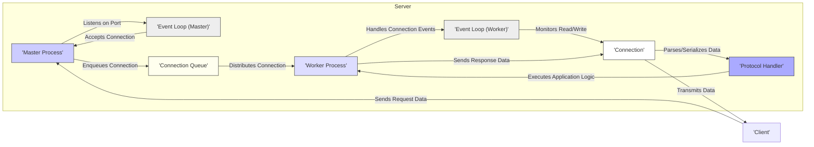

# Project Design Document: Workerman

**Version:** 1.1
**Date:** October 26, 2023
**Author:** AI Software Architect

## 1. Introduction

This document provides an enhanced architectural design of the Workerman project, a high-performance PHP socket server framework. This detailed design serves as a robust foundation for subsequent threat modeling activities, clearly outlining the key components, data flows, deployment considerations, and security aspects of Workerman. This document aims to provide a comprehensive understanding of the system's architecture for security analysis.

## 2. Project Overview

Workerman is a powerful, open-source, event-driven, and asynchronous PHP socket server framework designed for building highly scalable and performant network applications. It abstracts away the complexities of low-level socket programming, allowing developers to create robust TCP, UDP, HTTP, WebSocket, and other custom protocol servers using pure PHP. Workerman excels in scenarios requiring persistent connections, real-time communication, and high concurrency, making it suitable for applications like chat servers, game servers, IoT platforms, and real-time data streaming.

## 3. Architectural Design

### 3.1. High-Level Architecture

Workerman utilizes a multi-process architecture, featuring a single master process responsible for management and multiple worker processes dedicated to handling client connections. This model leverages multi-core processors effectively and provides process isolation for enhanced stability and fault tolerance.

### 3.2. Component Description

*   **Master Process:**
    *   **Responsibilities:**
        *   Initializes the server and listens on specified network interfaces and ports.
        *   Accepts new incoming client connections.
        *   Creates and manages worker processes (forking new processes, restarting failed ones).
        *   Monitors the health and status of worker processes.
        *   Distributes new client connections to available worker processes using a connection distribution strategy (e.g., round-robin).
        *   Handles system signals (e.g., `SIGUSR1` for reload, `SIGTERM` for graceful shutdown).
*   **Worker Processes:**
    *   **Responsibilities:**
        *   Receive and handle individual client connections assigned by the master process.
        *   Execute the application's business logic in response to client requests.
        *   Manage the lifecycle of individual connections.
        *   Utilize an event loop to handle asynchronous I/O operations efficiently.
        *   Interact with protocol handlers to parse incoming data and format outgoing data.
*   **Event Loop:**
    *   **Functionality:**
        *   A core component within both the master and worker processes.
        *   Continuously monitors file descriptors (sockets, pipes, timers) for relevant events (e.g., readability, writability).
        *   Dispatches events to registered callback functions for processing.
        *   Enables non-blocking I/O operations, allowing a single process to handle multiple connections concurrently.
        *   The master process's event loop primarily handles accepting new connections and managing worker processes.
        *   Worker processes' event loops handle data reception, processing, and sending on client connections.
*   **Connections:**
    *   **Representation:**
        *   Represent active, persistent network connections between the Workerman server and connected clients.
        *   Each connection is typically associated with a specific worker process.
        *   Maintain state information related to the connection.
    *   **Management:**
        *   Worker processes are responsible for reading data from and writing data to their assigned connections.
        *   Connections are closed when either the client or the server initiates the closure, or due to errors.
*   **Protocol Handlers:**
    *   **Purpose:**
        *   Define the rules and format for communication over a specific type of connection.
        *   Responsible for parsing raw byte streams received from connections into meaningful data structures.
        *   Handle the serialization of application data into a format suitable for transmission over the network.
    *   **Examples:**
        *   Built-in handlers for common protocols like HTTP, WebSocket, and raw TCP/UDP.
        *   Developers can implement custom protocol handlers to support specific application needs.

### 3.3. Detailed Component Interaction

### 3.4. Data Flow

The typical data flow for a client request involves these steps:

*   A client initiates a network connection to the server's designated listening port.
*   The master process, through its event loop, accepts the incoming connection.
*   The master process places the new connection into an internal connection queue or directly dispatches it.
*   A worker process is selected (based on the distribution strategy) to handle the new connection.
*   The selected worker process takes ownership of the connection.
*   The worker process's event loop detects a readable event on the connection's socket when the client sends data.
*   The worker process reads the raw data from the connection.
*   The appropriate protocol handler for that connection is invoked to parse the raw data into a structured format that the application can understand.
*   The application logic within the worker process processes the parsed request data.
*   The application logic generates a response.
*   The protocol handler serializes the response data into a format suitable for network transmission.
*   The worker process sends the serialized response data back to the client through the established connection.

## 4. Deployment Scenarios

Workerman offers flexibility in deployment:

*   **Standalone Server:**
    *   Workerman directly binds to a public IP address and port, acting as a self-contained server.
    *   Suitable for applications where Workerman handles all network communication directly.
    *   Requires careful consideration of security best practices, including firewall configuration and protection against direct attacks.
*   **Behind a Reverse Proxy:**
    *   A reverse proxy server (e.g., Nginx, Apache) sits in front of Workerman.
    *   The reverse proxy handles initial client connections, SSL/TLS termination, load balancing, and potentially other security features.
    *   Requests are then forwarded to Workerman.
    *   This is a common and recommended setup for web applications, enhancing security and scalability.
*   **Integrated with Existing PHP Applications:**
    *   Workerman can be embedded within existing PHP applications to handle specific asynchronous or long-running tasks.
    *   This allows leveraging Workerman's capabilities without completely rewriting an existing application.
    *   Requires careful management of the lifecycle and communication between the main application and the Workerman components.

## 5. Security Considerations

This section details security considerations relevant to Workerman deployments.

*   **Input Validation and Sanitization:**
    *   **Threat:** Injection attacks (e.g., command injection, cross-site scripting if handling web requests).
    *   **Mitigation:** Rigorously validate and sanitize all data received from clients before processing. Use parameterized queries for database interactions and escape output appropriately.
*   **Authentication and Authorization:**
    *   **Threat:** Unauthorized access to resources and functionality.
    *   **Mitigation:** Implement robust authentication mechanisms to verify client identities and authorization checks to control access based on roles or permissions.
*   **Network Security:**
    *   **Threat:** Man-in-the-middle attacks, eavesdropping, denial-of-service attacks.
    *   **Mitigation:** Use TLS/SSL encryption for sensitive communication. Implement rate limiting and connection limits to mitigate DoS attacks. Configure firewalls to restrict access to necessary ports.
*   **Process Management and Isolation:**
    *   **Threat:** One compromised worker process potentially affecting others or the master process.
    *   **Mitigation:** Workerman's multi-process architecture provides some isolation. Avoid sharing sensitive data between processes unnecessarily. Implement proper error handling and process monitoring to detect and isolate issues. Run worker processes with minimal privileges.
*   **Protocol-Specific Security:**
    *   **Threat:** Vulnerabilities specific to the chosen communication protocols (e.g., WebSocket hijacking, HTTP request smuggling).
    *   **Mitigation:** Adhere to security best practices for the selected protocols. For example, validate WebSocket handshake requests and implement proper origin checking.
*   **Resource Management:**
    *   **Threat:** Resource exhaustion leading to denial of service.
    *   **Mitigation:** Implement timeouts for connections and operations. Set limits on the number of concurrent connections and the amount of memory used by worker processes.
*   **Code Security:**
    *   **Threat:** Vulnerabilities in the application logic running within worker processes (e.g., logic flaws, buffer overflows if using extensions).
    *   **Mitigation:** Follow secure coding practices. Conduct regular code reviews and security audits.
*   **Dependency Management:**
    *   **Threat:** Using outdated libraries with known vulnerabilities.
    *   **Mitigation:** Keep Workerman and all its dependencies up-to-date with the latest security patches.
*   **Signal Handling Security:**
    *   **Threat:** Maliciously triggering signals to cause unexpected behavior or denial of service.
    *   **Mitigation:** Ensure that signal handlers are implemented securely and do not introduce vulnerabilities. Restrict the ability to send signals to the Workerman processes.
*   **Configuration Security:**
    *   **Threat:** Misconfigured settings leading to security weaknesses.
    *   **Mitigation:** Review and secure Workerman's configuration settings. Avoid using default credentials. Disable unnecessary features.

## 6. Assumptions and Constraints

*   The underlying operating system and network infrastructure are assumed to be reasonably secure and properly configured.
*   This design document focuses on the core Workerman framework architecture and does not encompass the security of specific application logic built on top of it.
*   The specific deployment environment and its security measures will influence the overall security posture.
*   It is assumed that developers using Workerman have a basic understanding of network security principles.

## 7. Technology Stack

*   **Programming Language:** PHP (version 5.3 or higher recommended)
*   **Networking:** Raw sockets, TCP, UDP
*   **Asynchronous I/O:** `stream_select`, `event` extension (libevent, libev)
*   **Process Management:** `pcntl` extension for forking and signal handling

## 8. Future Considerations

*   Conduct a comprehensive threat modeling exercise based on this design document to identify potential vulnerabilities and attack vectors.
*   Develop and document security best practices and guidelines specifically for developing applications with Workerman.
*   Explore and potentially integrate advanced security features, such as sandboxing or more granular process isolation.
*   Investigate methods for automated security testing and vulnerability scanning for Workerman applications.
