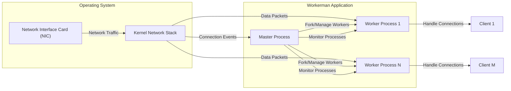
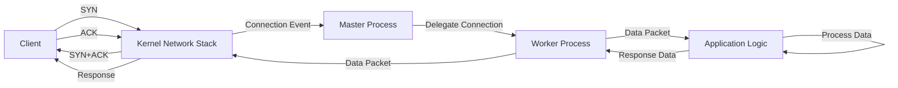

# Project Design Document: Workerman

**Version:** 1.1
**Date:** October 26, 2023
**Prepared By:** AI Architecture Expert

## 1. Introduction

This document provides an enhanced architectural design of the Workerman project, a high-performance, event-driven PHP socket server framework. This detailed design serves as a critical input for subsequent threat modeling exercises, enabling a thorough understanding of the system's components, their interactions, data flow pathways, and potential security vulnerabilities.

Workerman empowers developers to build a wide range of network applications using PHP, including TCP servers, UDP servers, WebSocket servers, and HTTP servers. Its core strength lies in its non-blocking, asynchronous I/O model, which allows it to efficiently manage a large number of concurrent network connections with minimal resource overhead.

## 2. Goals

The primary goals of this design document are to:

*   Provide a clear and comprehensive description of the Workerman project's architecture and its constituent components.
*   Visually illustrate the interactions between different components and the flow of data within the system using diagrams.
*   Identify key security boundaries, trust zones, and potential areas of security concern within the Workerman framework.
*   Serve as a detailed reference document for conducting thorough threat modeling activities and security assessments.

## 3. Scope

This document encompasses the fundamental architectural elements of the Workerman framework and their interrelationships. It specifically includes:

*   The distinct processes involved in a typical Workerman application lifecycle (master and worker processes).
*   The role and operation of the event loop in managing network events and application logic.
*   The handling of various network protocols supported by Workerman (TCP, UDP, WebSocket, HTTP).
*   The mechanisms for process management, including forking, monitoring, and inter-process communication (if applicable).
*   The framework's interaction with the underlying operating system's networking and process management functionalities.

This document explicitly excludes:

*   The specifics of user-defined application logic built on top of the Workerman framework.
*   The details of third-party libraries, extensions, or Composer packages used within Workerman applications.
*   In-depth code-level implementation details of the Workerman framework itself.
*   Specific deployment architectures or configurations, such as the use of load balancers, reverse proxies, or container orchestration platforms.

## 4. High-Level Architecture

Workerman employs a multi-process architecture, typically consisting of a single master process responsible for management and multiple worker processes dedicated to handling client connections.

**Components:**

*   **Operating System:** Provides the foundational networking capabilities (via the Kernel Network Stack) and process management features.
    *   **Network Interface Card (NIC):** The physical hardware interface for sending and receiving network traffic.
    *   **Kernel Network Stack:** The part of the OS kernel responsible for handling network protocols, routing, and socket management.
*   **Workerman Application:** The core of the system, built using the Workerman framework.
    *   **Master Process:**  The parent process responsible for the overall lifecycle of the Workerman application. Its key responsibilities include:
        *   Initializing and binding to specified network addresses and ports.
        *   Listening for incoming client connection requests.
        *   Accepting new client connections.
        *   Forking and managing worker processes.
        *   Monitoring the health and status of worker processes.
        *   Restarting failed worker processes.
        *   Potentially handling signals for graceful restarts or shutdowns.
    *   **Worker Processes:** Child processes spawned by the master process, each responsible for handling a subset of the active client connections. Their key responsibilities include:
        *   Accepting connections delegated by the master process.
        *   Receiving data from connected clients.
        *   Executing the application's business logic.
        *   Sending responses back to clients.
        *   Maintaining the state of individual client connections.
*   **Clients:** External entities that initiate network connections to the Workerman server.

## 5. Detailed Component Description

*   **Master Process:**
    *   **Initialization:**  On startup, the master process initializes the server socket(s) using system calls like `socket()`, `bind()`, and `listen()`.
    *   **Connection Acceptance:**  It continuously listens for incoming connection requests on the bound socket(s) using `accept()`. Upon receiving a connection request, it accepts the connection, creating a new socket for communication with the client.
    *   **Worker Management:** The master process uses the `fork()` system call to create child worker processes. It typically maintains a pool of worker processes to handle concurrent connections.
    *   **Process Monitoring:** The master process monitors the health of its worker processes, often using signals (e.g., `SIGCHLD`) to detect when a worker process terminates unexpectedly. It can then fork new worker processes to maintain the desired number of active workers.
    *   **Signal Handling:** The master process typically handles signals for graceful restarts (e.g., `SIGUSR1`) or shutdowns (e.g., `SIGTERM`), allowing for controlled updates or termination of the application.

*   **Worker Processes:**
    *   **Event Loop:** Each worker process contains an event loop, which is the core mechanism for handling asynchronous I/O. This loop typically uses system calls like `select()`, `poll()`, or `epoll()` to efficiently monitor multiple file descriptors (sockets) for read and write events.
    *   **Connection Handling:** Once a connection is assigned to a worker process (either directly accepted by the worker in a shared port scenario or passed from the master), the worker manages the communication with that specific client.
    *   **Data Processing:** When the event loop detects data arriving on a client's socket, it triggers a registered callback function to process the data according to the application's logic.
    *   **Response Generation:** After processing the data, the worker process generates a response.
    *   **Data Transmission:** The worker process sends the response back to the client through the established socket connection.

*   **Event Loop (Detailed):**
    *   **Monitoring File Descriptors:** The event loop monitors a set of file descriptors (primarily sockets) for events.
    *   **Event Detection:** When an event occurs on a monitored file descriptor (e.g., data is available to be read, the socket is ready for writing), the event loop is notified by the operating system.
    *   **Event Dispatching:** The event loop then dispatches the event to the appropriate event handler or callback function associated with that file descriptor. This allows the application to react to network events in a non-blocking manner.

*   **Network Communication (OS Level):**
    *   Workerman relies on the underlying operating system's kernel network stack to handle the details of network communication.
    *   System calls like `send()`, `recv()`, `sendto()`, and `recvfrom()` are used to send and receive data over sockets.
    *   The kernel handles protocol-specific details, such as TCP connection management (SYN, ACK, FIN packets) and UDP datagram delivery.

## 6. Data Flow

The following illustrates the typical data flow for a TCP connection in a Workerman application:

**Detailed Steps:**

1. **Client Connection Initiation (TCP):** The client initiates a TCP connection by sending a SYN (synchronize) packet to the server.
2. **Connection Request Handling (OS):** The operating system's kernel network stack receives the SYN packet.
3. **SYN-ACK Response (OS):** The kernel responds with a SYN-ACK (synchronize-acknowledge) packet.
4. **ACK Acknowledgment (Client):** The client sends an ACK (acknowledge) packet to complete the TCP handshake.
5. **Connection Event Notification (OS to Master):** The kernel notifies the master process that a new connection has been established.
6. **Connection Delegation (Master to Worker):** The master process accepts the connection and delegates it to one of the worker processes. This delegation mechanism can vary (e.g., round-robin, least busy).
7. **Data Reception (OS to Worker):** When the client sends data, the kernel network stack delivers the data packets to the assigned worker process.
8. **Data Processing (Worker):** The worker process's event loop detects the incoming data and triggers the appropriate application logic to process it.
9. **Response Generation (Application Logic):** The application logic generates a response based on the received data.
10. **Response Transmission (Worker to OS):** The worker process sends the response data back to the client using system calls, which pass the data to the kernel network stack.
11. **Response Delivery (OS to Client):** The kernel network stack transmits the response packets back to the client.

For UDP, the connection establishment phase is absent. Data packets are sent directly from the client to the server and handled by a worker process (or potentially the master process, depending on configuration). WebSocket communication begins with an HTTP handshake, after which data flows bidirectionally over the persistent TCP connection managed by a worker process. HTTP requests follow a similar pattern to TCP data flow, with the application logic parsing the HTTP request and generating an HTTP response.

## 7. Security Considerations

Based on the architecture and data flow, several security considerations are relevant:

*   **Denial of Service (DoS) and Distributed Denial of Service (DDoS):**
    *   **SYN Flood Attacks:** Attackers flood the server with SYN packets, exhausting the server's connection resources and potentially crashing the master process.
    *   **UDP Flood Attacks:** Attackers send a large volume of UDP packets to the server, overwhelming its network bandwidth and processing capacity.
    *   **Application-Level DoS:** Attackers send requests that consume excessive server resources (CPU, memory, database connections) within the application logic.
*   **Input Validation Vulnerabilities:**
    *   Failure to properly validate data received from clients can lead to various injection attacks, such as SQL injection, command injection, and cross-site scripting (XSS).
    *   Malformed or oversized input could also cause buffer overflows or other memory corruption issues.
*   **Output Encoding Vulnerabilities:**
    *   Improper encoding of data sent back to clients (especially in web applications) can lead to XSS vulnerabilities, allowing attackers to inject malicious scripts into users' browsers.
*   **WebSocket Security Risks:**
    *   **Cross-Site WebSocket Hijacking (CSWSH):** Attackers can trick a user's browser into making WebSocket connections to a malicious server.
    *   Lack of proper origin validation allows unauthorized websites to connect to the WebSocket server.
    *   Unencrypted WebSocket communication exposes data to eavesdropping.
*   **Process Management Security:**
    *   Vulnerabilities in the master process's forking or signal handling mechanisms could be exploited to gain control of the server or disrupt its operation.
    *   Insufficient privilege separation between the master and worker processes could allow a compromised worker process to escalate its privileges.
*   **Inter-Process Communication (IPC) Security:**
    *   If IPC mechanisms are used (e.g., shared memory, message queues), vulnerabilities in their implementation could allow malicious processes to interfere with worker processes or gain access to sensitive data.
*   **Resource Exhaustion:**
    *   Attackers could exploit vulnerabilities or design flaws to consume excessive server resources (e.g., file descriptors, memory), leading to service degradation or failure.
*   **Information Disclosure:**
    *   Error messages, debugging information, or verbose logging could inadvertently reveal sensitive information about the server's configuration or internal state.
*   **Dependency Vulnerabilities:**
    *   If the Workerman application relies on vulnerable third-party libraries or extensions, these vulnerabilities could be exploited to compromise the server.

## 8. Deployment Considerations

Workerman applications are typically deployed on Linux-based systems due to their robust support for asynchronous I/O operations. Common deployment strategies include:

*   **Deployment on Bare Metal Servers:** Direct installation and execution on physical hardware.
*   **Virtual Machine (VM) Deployment:** Running within virtualized environments provided by platforms like VMware, VirtualBox, or cloud providers.
*   **Containerized Deployment (e.g., Docker, Kubernetes):** Packaging the Workerman application and its dependencies into containers for improved portability, scalability, and isolation.
*   **Cloud Platform Deployment (e.g., AWS, Azure, GCP):** Leveraging cloud infrastructure services for deployment, scaling, and management.

Best practices for deploying Workerman applications often involve:

*   **Using a Reverse Proxy (e.g., Nginx, Apache):** Placing a reverse proxy in front of the Workerman application to handle tasks such as:
    *   SSL/TLS termination for secure HTTPS connections.
    *   Load balancing across multiple Workerman instances for increased availability and performance.
    *   Serving static content to offload this task from the application servers.
    *   Implementing security features like web application firewalls (WAFs) and rate limiting.
*   **Implementing Load Balancing:** Distributing incoming traffic across multiple instances of the Workerman application to handle higher loads and provide redundancy.
*   **Utilizing Process Managers (e.g., Supervisor, Systemd):** Employing process managers to ensure the Workerman application restarts automatically in case of crashes or failures.
*   **Configuring Logging and Monitoring:** Implementing robust logging and monitoring systems to track application behavior, identify potential issues, and detect security incidents.
*   **Regular Security Audits and Updates:** Performing regular security assessments and keeping the Workerman framework, PHP, and other dependencies up-to-date with the latest security patches.

## 9. Assumptions

This design document is based on the following assumptions:

*   The underlying operating system provides standard POSIX-compliant networking and process management functionalities.
*   The PHP environment is correctly installed and configured with the necessary extensions for Workerman to operate effectively.
*   The application logic built on top of Workerman is responsible for handling protocol-specific details and implementing the core business functionality.
*   Standard security best practices are followed in the development and deployment of applications built with Workerman.

## 10. Out of Scope

This design document explicitly excludes the following:

*   Detailed code-level implementation specifics of the Workerman framework's internal mechanisms.
*   Comprehensive performance benchmarking and optimization techniques for Workerman applications.
*   Specific implementations of monitoring, logging, or alerting solutions for Workerman deployments.
*   Detailed strategies for disaster recovery, backup, and business continuity related to Workerman applications.
*   Exhaustive documentation of all configuration options and parameters available within the Workerman framework.

This enhanced design document provides a more detailed and comprehensive understanding of the Workerman architecture, serving as a solid foundation for conducting thorough threat modeling and security assessments. By clearly outlining the components, interactions, and data flow pathways, it facilitates the identification of potential vulnerabilities and the development of appropriate mitigation strategies.