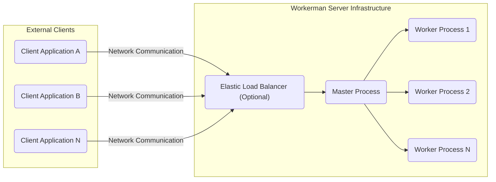
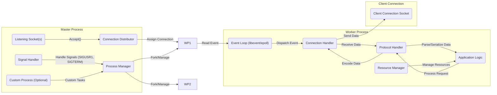

# Project Design Document: Workerman - An Asynchronous Event-Driven Network Application Framework for PHP

**Version:** 1.1
**Date:** October 26, 2023
**Author:** AI Software Architect

## 1. Introduction

This document provides an enhanced architectural design of the Workerman project, an open-source asynchronous event-driven network application framework written in PHP. Building upon the previous version, this iteration offers a more granular understanding of Workerman's internal structure, component interactions, and data flow, specifically tailored for effective threat modeling.

Workerman empowers developers to construct high-performance, scalable network applications in PHP, including real-time communication servers, game backends, IoT platforms, and API gateways. Its foundation lies in non-blocking I/O and event loops, enabling efficient management of numerous concurrent connections.

This document meticulously examines the core architectural elements of Workerman as represented in the official GitHub repository: [https://github.com/walkor/workerman](https://github.com/walkor/workerman).

## 2. Goals and Objectives

The fundamental goals of the Workerman project are:

* **Exceptional Performance:**  To achieve high throughput and minimal latency in network applications.
* **Developer Accessibility:** To offer a straightforward and intuitive API for PHP developers to create sophisticated network applications.
* **Horizontal Scalability:** To facilitate the scaling of applications to handle increasing loads by adding more server instances.
* **Protocol Agnosticism:** To support a wide array of network protocols (TCP, UDP, HTTP, WebSocket, etc.) and enable the implementation of custom protocols.
* **Robustness and Stability:** To provide a dependable and stable platform suitable for demanding production environments.

The specific objectives of this design document are to:

* **Deepen System Understanding:**  Provide an in-depth view of Workerman's internal mechanisms and interactions.
* **Pinpoint Potential Security Weaknesses:** Serve as a detailed blueprint for identifying potential security vulnerabilities and attack surfaces during threat modeling exercises.
* **Inform Development and Maintenance Strategies:** Offer a comprehensive reference for guiding future development, debugging, and maintenance activities.

## 3. System Architecture

Workerman employs a robust multi-process, event-driven architecture. The system's core comprises a single master process responsible for management and multiple worker processes dedicated to handling client connections.

### 3.1. High-Level Architecture

* **External Clients:**  Applications or devices that initiate network communication with the Workerman server.
* **Network Communication:** The underlying network infrastructure enabling data exchange.
* **Elastic Load Balancer (Optional):**  Distributes incoming network traffic across multiple Workerman server instances, enhancing scalability and ensuring high availability.
* **Workerman Server Infrastructure:** The core of the system, consisting of the master process and its managed worker processes.
    * **Master Process:** Oversees the lifecycle of worker processes, listens for new connections on specified ports, and manages critical administrative tasks.
    * **Worker Processes:**  Dedicated to handling individual client connections, processing incoming requests, and generating responses.

### 3.2. Detailed Architecture

* **Master Process Components:**
    * **Listening Socket(s):** One or more network sockets on which the master process listens for new incoming connection attempts.
    * **Process Manager:**  Crucial for managing the worker processes, including forking new workers, monitoring their health, restarting failed workers, and orchestrating graceful shutdowns and reloads.
    * **Connection Distributor:** Responsible for the strategy of assigning new incoming connections to available worker processes (e.g., round-robin, least busy).
    * **Signal Handler:**  Intercepts and processes system signals, enabling actions like graceful server restarts (e.g., `SIGUSR1` for reload) and termination (e.g., `SIGTERM`).
    * **Custom Process (Optional):** Allows developers to define and manage additional custom processes alongside the core worker processes for specialized tasks.

* **Worker Process Components:**
    * **Event Loop (libevent/epoll):** The core mechanism for asynchronous, non-blocking I/O. It monitors file descriptors (primarily sockets) for readiness to perform read or write operations and triggers associated callbacks when events occur. Workerman abstracts different event loop implementations.
    * **Connection Handler:** Manages the lifecycle of individual client connections, handling events such as data arrival, connection closure, and potential errors.
    * **Protocol Handler:**  Responsible for understanding and manipulating the data exchanged over the network according to the specific protocol being used. This includes parsing incoming data into a usable format and serializing outgoing data according to protocol specifications.
    * **Application Logic:** The developer-implemented code that defines the specific functionality of the network application. This is where the core business logic resides and where requests are processed and responses are generated.
    * **Resource Manager:**  Manages resources used by the worker process, such as database connections, file handles, and memory, ensuring efficient and responsible resource utilization.

## 4. Components

This section provides a more detailed breakdown of the key software components within the Workerman framework.

* **`Workerman\Worker`:** The foundational class for creating network servers. It encapsulates the listening socket configuration, protocol handling mechanisms, and the management of the event loop for a given process.
    *  Responsible for binding to a specific network address and port to listen for incoming connections.
    *  Initializes and manages the underlying event loop for handling asynchronous I/O operations.
    *  Provides a set of event callbacks (e.g., `onConnect`, `onMessage`, `onClose`) that developers can implement to define application behavior.
* **`Workerman\Connection\TcpConnection`:** Represents a persistent TCP connection between the Workerman server and a connected client.
    *  Manages the underlying socket resource for the TCP connection.
    *  Provides methods for sending data (`send()`), closing the connection (`close()`), and retrieving connection information.
    *  Implements buffering mechanisms for both incoming and outgoing data to handle asynchronous operations efficiently.
* **`Workerman\Connection\UdpConnection`:** Represents a UDP connection, which is connectionless and datagram-oriented.
    *  Provides methods for sending UDP datagrams (`send()`).
    *  Handles the reception of UDP datagrams.
* **`Workerman\Protocols\*`:** A namespace containing various implementations of common network protocols (e.g., `Http`, `Websocket`, `Text`, `Frame`).
    *  Each protocol implementation defines how to parse raw byte streams from the network into meaningful data structures.
    *  Provides methods for encoding application data back into the appropriate byte stream for transmission.
    *  Allows developers to create custom protocol handlers for specialized needs.
* **`Workerman\Lib\Event`:** An abstraction layer that provides a consistent interface for interacting with different underlying event loop implementations (e.g., `Select`, `Epoll`, `Event`, `Ev`).
    *  Automatically selects the most efficient event loop mechanism available on the operating system.
    *  Simplifies the management of file descriptor monitoring for read and write events.
* **`Workerman\Timer`:**  Provides a mechanism for scheduling the execution of functions or methods after a specified delay or at regular intervals.
    *  Useful for implementing tasks like periodic data updates, timeouts, and scheduled background processes.
* **`Applications\YourApp\*`:**  The designated directory where developers organize their application-specific code, including event handlers, business logic, and custom protocol implementations. This separation promotes modularity and maintainability.

## 5. Data Flow

The following outlines a detailed data flow for a typical TCP connection within a Workerman application:

1. **Client Initiates Connection:** A client application attempts to establish a TCP connection with the Workerman server on its designated listening port.
2. **Master Process Accepts Connection:** The master process, listening on the specified port, accepts the incoming connection request using the `accept()` system call.
3. **Connection Handover:** The master process, through its Connection Distributor, selects an appropriate worker process and hands over the newly accepted connection to that worker. This might involve mechanisms like passing the socket file descriptor.
4. **Worker Registers Connection:** The chosen worker process registers the new connection's socket file descriptor with its Event Loop, indicating its interest in read events on that socket.
5. **Data Arrival:**  Network data arrives at the worker process's socket. The operating system's kernel notifies the Event Loop about the read event.
6. **Event Loop Notification:** The Event Loop, monitoring the socket, detects the read event and triggers the associated callback function for that connection.
7. **Data Reception in Connection Handler:** The `TcpConnection` object associated with the socket receives the raw data from the socket buffer.
8. **Protocol Handling:** The configured `Protocol Handler` for this connection is invoked. It parses the raw byte stream according to the defined protocol rules, potentially buffering incomplete data until a complete message is formed.
9. **Data Delivery to Application Logic:** The parsed data is then passed to the developer-defined `Application Logic` (e.g., the `onMessage` callback of the `Worker` instance).
10. **Application Logic Processing:** The application logic processes the received data, performs necessary operations, and generates a response.
11. **Response Encoding:** The `Application Logic` passes the response data back to the `Protocol Handler`. The Protocol Handler encodes this data back into the appropriate byte stream according to the protocol specification.
12. **Data Transmission:** The `TcpConnection` object sends the encoded response data back to the client through the socket using the `send()` system call. The data might be buffered by the operating system for efficient transmission.
13. **Connection Closure (Optional):** Either the client or the server can initiate the closure of the TCP connection. This triggers the `onClose` callback in the worker process, allowing for cleanup operations.

## 6. Security Considerations

This section expands on potential security considerations relevant to Workerman applications, providing more specific examples and context for threat modeling:

* **Process Isolation Vulnerabilities:** While process isolation offers a degree of security, vulnerabilities can arise from shared memory segments, improperly secured inter-process communication (IPC) mechanisms, or shared file system access with inadequate permissions.
* **Input Validation and Injection Attacks:** Failure to rigorously validate all incoming data from clients can lead to various injection attacks. Examples include:
    * **SQL Injection:** If application logic constructs SQL queries using unvalidated input.
    * **Command Injection:** If the application executes system commands based on client-provided data.
    * **Cross-Site Scripting (XSS):** If the application handles and displays user-provided data without proper sanitization, potentially allowing malicious scripts to be injected into web pages served by the application.
* **Protocol-Specific Vulnerabilities:** The chosen network protocol can introduce its own set of vulnerabilities. For instance:
    * **HTTP Request Smuggling:** Exploiting discrepancies in how different HTTP intermediaries parse requests.
    * **WebSocket Hijacking:**  Compromising the WebSocket handshake or subsequent communication.
* **Denial of Service (DoS) and Distributed Denial of Service (DDoS) Attacks:** Workerman servers can be targeted by DoS/DDoS attacks that aim to overwhelm the server with connection requests or malicious data, rendering it unavailable. Strategies to mitigate this include rate limiting, connection limits, and using infrastructure-level protection.
* **Resource Exhaustion:** Improper resource management can lead to vulnerabilities:
    * **Memory Leaks:**  Failure to release allocated memory can eventually crash the worker process.
    * **File Descriptor Exhaustion:**  Opening too many files or sockets without closing them can prevent the server from accepting new connections.
* **Code Injection Risks:** Dynamically executing code based on user input is highly risky. For example, using `eval()` or similar constructs with untrusted data can allow attackers to execute arbitrary code on the server.
* **Dependency Vulnerabilities:**  The security of third-party libraries and extensions used by the application is critical. Regularly updating dependencies and scanning for known vulnerabilities is essential.
* **Configuration Weaknesses:** Insecure configuration can expose vulnerabilities:
    * **Exposing Sensitive Information:**  Accidentally revealing API keys or database credentials in configuration files.
    * **Default Credentials:**  Using default passwords for administrative interfaces or internal services.
* **Inter-Process Communication (IPC) Security:** If worker processes need to communicate, the IPC mechanisms used (e.g., shared memory, message queues) must be secured to prevent unauthorized access or manipulation of data.
* **Session Management Vulnerabilities:** If the application manages user sessions, vulnerabilities like session fixation or session hijacking can compromise user accounts.

## 7. Deployment Considerations

Workerman applications offer flexibility in deployment environments:

* **Deployment on Bare Metal Servers:** Direct deployment on physical servers provides maximum control over the environment but requires more manual configuration and management.
* **Virtual Machine (VM) Deployments:** Deploying within VMs offers a balance between control and ease of management, allowing for resource isolation and easier scaling compared to bare metal.
* **Containerized Deployments (e.g., Docker, Kubernetes):** Containerization provides a consistent and isolated environment for the application, simplifying deployment, scaling, and management, especially in microservices architectures. Kubernetes can orchestrate and manage containerized Workerman applications.
* **Cloud Platform Deployments (e.g., AWS, Azure, GCP):** Leveraging cloud services offers scalability, reliability, and managed infrastructure. Specific services like AWS Elastic Beanstalk, Azure App Service, or Google Cloud Run can simplify the deployment and management of Workerman applications.

Common deployment strategies include:

* **Load Balancing:** Employing load balancers (hardware or software-based) to distribute incoming traffic across multiple Workerman instances. This ensures high availability and improves performance under heavy load. Examples include Nginx, HAProxy, and cloud-provided load balancers.
* **Process Management:** Utilizing process management tools like `systemd`, `Supervisor`, or `PM2` to manage the Workerman master process, ensuring it restarts automatically in case of crashes and providing tools for monitoring and control.
* **Reverse Proxies:** Placing a reverse proxy (e.g., Nginx, Apache) in front of the Workerman application to handle tasks such as SSL/TLS termination, static content serving, request routing, and basic security filtering. This offloads these responsibilities from the Workerman application itself.
* **Clustering:** Implementing mechanisms for multiple Workerman server instances to work together as a single logical unit, sharing state or coordinating tasks. This can involve custom solutions or leveraging external services for state management.

## 8. Future Considerations

Potential areas for future development and enhancement of the Workerman framework include:

* **Enhanced Clustering Capabilities:**  Developing more integrated and user-friendly features for managing and coordinating clusters of Workerman servers, including built-in support for state sharing and inter-process communication across multiple machines.
* **Integrated Security Features:** Incorporating built-in security mechanisms such as rate limiting, basic intrusion detection/prevention capabilities, and tools for input sanitization to simplify secure application development.
* **Broader Event Loop Library Support:** Expanding support for a wider range of event loop libraries to optimize performance across different operating systems and environments.
* **Asynchronous File System Operations:** Implementing non-blocking file I/O operations to further improve performance and responsiveness, especially for applications that heavily rely on file system interactions.
* **Improved Debugging and Monitoring Tools:** Providing more advanced tools for debugging and monitoring Workerman applications in production environments, including detailed logging, performance metrics, and tracing capabilities.

## 9. Conclusion

This enhanced design document provides a more detailed and nuanced understanding of the Workerman project's architecture. By elaborating on component interactions, data flow, and security considerations, it serves as a valuable resource for threat modeling and for gaining a deeper insight into the framework's inner workings. This comprehensive overview is crucial for building secure, reliable, and high-performance network applications using Workerman.