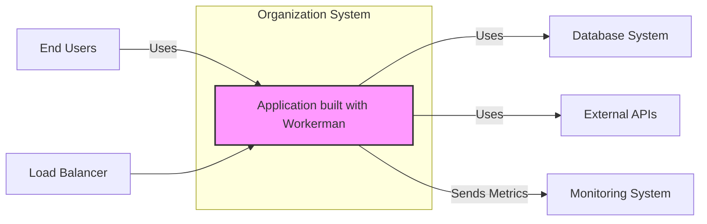
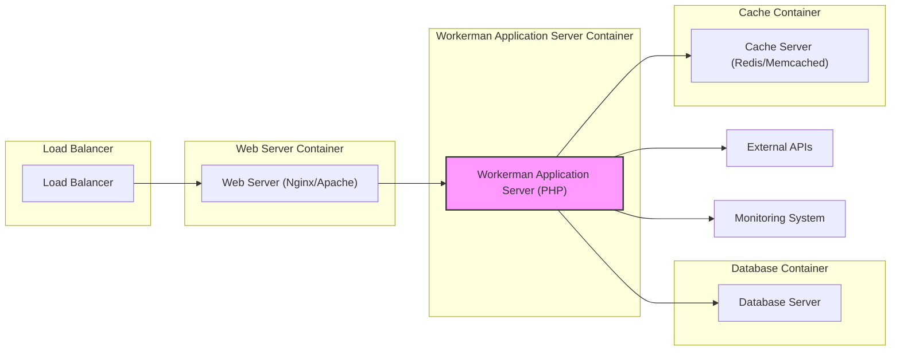
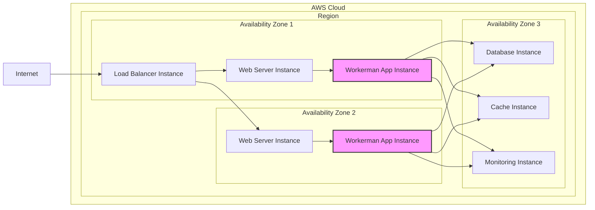
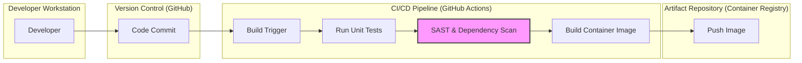

# BUSINESS POSTURE

This project aims to utilize the Workerman framework to build high-performance, real-time applications. The primary business priorities are achieving low latency, high concurrency, and efficient resource utilization for network-based services. The goal is to create applications that can handle a large number of concurrent connections and provide instant data delivery, potentially for use cases like real-time chat, game servers, or push notification systems.

The most important business risks associated with this project are:
- Security vulnerabilities in the Workerman framework or in the application code built upon it, which could lead to data breaches or service disruption.
- Performance bottlenecks or instability under high load, which could negatively impact user experience and service availability.
- Operational complexity in managing and maintaining a real-time application infrastructure, potentially leading to increased costs and downtime.

# SECURITY POSTURE

Existing security controls:
- security control: Code reviews are likely performed as part of the software development lifecycle, although the extent and rigor are unknown. (Location: Development process)
- security control: Version control system (Git/GitHub) is used for code management and history tracking. (Location: GitHub Repository)
- accepted risk: Usage of open-source framework Workerman introduces potential vulnerabilities inherent in third-party software.
- accepted risk: PHP runtime environment may have known vulnerabilities if not properly patched and configured.

Recommended security controls:
- security control: Implement automated Static Application Security Testing (SAST) tools in the CI/CD pipeline to identify potential vulnerabilities in the application code.
- security control: Implement automated Dependency Scanning to identify vulnerabilities in third-party libraries and dependencies used by the application.
- security control: Conduct regular security audits and penetration testing to proactively identify and address security weaknesses in the application and infrastructure.
- security control: Implement Runtime Application Self-Protection (RASP) or Web Application Firewall (WAF) to protect against runtime attacks.
- security control: Implement robust security logging and monitoring to detect and respond to security incidents.

Security requirements:
- Authentication: Securely authenticate users or systems interacting with the application. Consider appropriate authentication mechanisms based on the application's use case (e.g., API keys, OAuth 2.0, session-based authentication).
- Authorization: Implement fine-grained authorization controls to ensure that users or systems only have access to the resources and actions they are permitted to access. Follow the principle of least privilege.
- Input Validation: Thoroughly validate all input data received by the application to prevent injection attacks (e.g., SQL injection, command injection, cross-site scripting). Implement input sanitization and encoding as needed.
- Cryptography: Use strong cryptography to protect sensitive data in transit and at rest. Implement encryption for communication channels (TLS/SSL) and consider encryption for sensitive data stored in databases or caches.

# DESIGN

## C4 CONTEXT

Context Diagram Elements:

- Name: Application built with Workerman
  - Type: Software System
  - Description: The real-time application being developed using the Workerman framework. It provides core business functionalities and interacts with users and other systems.
  - Responsibilities:
    - Handle user requests and interactions.
    - Process real-time data.
    - Interact with databases for data persistence.
    - Integrate with external APIs for additional functionalities.
    - Provide metrics for monitoring.
  - Security controls:
    - Input validation and sanitization.
    - Authorization checks for all requests.
    - Secure session management.
    - Security logging and monitoring.

- Name: End Users
  - Type: Person
  - Description: Users who interact with the application to consume its functionalities. They can be accessing the application through web browsers, mobile apps, or other clients.
  - Responsibilities:
    - Initiate requests to the application.
    - Consume data provided by the application.
  - Security controls:
    - User authentication (handled by the Application).
    - Secure communication channels (HTTPS).

- Name: External APIs
  - Type: Software System
  - Description: Third-party APIs that the application integrates with to extend its functionality or access external data.
  - Responsibilities:
    - Provide external data or services to the application.
  - Security controls:
    - API key authentication.
    - Rate limiting.
    - Input validation on data received from APIs.

- Name: Database System
  - Type: Software System
  - Description: Persistent storage for application data. Could be a relational database (e.g., MySQL, PostgreSQL) or a NoSQL database depending on application requirements.
  - Responsibilities:
    - Store and retrieve application data.
    - Ensure data integrity and availability.
  - Security controls:
    - Database access control (authentication and authorization).
    - Data encryption at rest.
    - Regular backups.

- Name: Monitoring System
  - Type: Software System
  - Description: System used to monitor the application's performance, health, and security. Examples include Prometheus, Grafana, ELK stack.
  - Responsibilities:
    - Collect and analyze application logs and metrics.
    - Provide alerts for anomalies and security events.
  - Security controls:
    - Access control to monitoring data.
    - Secure storage of logs and metrics.

- Name: Load Balancer
  - Type: Software System
  - Description: Distributes incoming traffic across multiple instances of the application to ensure high availability and scalability.
  - Responsibilities:
    - Distribute traffic evenly.
    - Perform health checks on application instances.
    - Terminate SSL/TLS connections.
  - Security controls:
    - DDoS protection.
    - SSL/TLS termination.

## C4 CONTAINER

Container Diagram Elements:

- Name: Load Balancer
  - Type: Infrastructure Container
  - Description: Hardware or software load balancer that distributes incoming HTTP/WebSocket traffic to the Web Server containers.
  - Responsibilities:
    - Traffic distribution.
    - Health checks.
    - SSL/TLS termination.
  - Security controls:
    - DDoS protection.
    - SSL/TLS configuration.
    - Access control lists.

- Name: Web Server (Nginx/Apache)
  - Type: Web Server Container
  - Description: Web server acting as a reverse proxy, handling static content and forwarding dynamic requests to the Workerman Application Server.
  - Responsibilities:
    - Serve static content.
    - Reverse proxy to Workerman Application Server.
    - Handle SSL/TLS termination (optional, can be done at Load Balancer).
  - Security controls:
    - Web server hardening (disable unnecessary modules, configure security headers).
    - Rate limiting.
    - Input validation (for static content requests).

- Name: Workerman Application Server (PHP)
  - Type: Application Server Container
  - Description: PHP application server running the Workerman framework and the application code. Handles real-time logic, business logic, and interacts with other containers.
  - Responsibilities:
    - Handle application logic.
    - Manage WebSocket connections.
    - Process real-time events.
    - Interact with Database and Cache servers.
    - Integrate with External APIs.
    - Send metrics to Monitoring System.
  - Security controls:
    - Input validation and sanitization.
    - Authorization checks.
    - Secure coding practices.
    - Security logging.
    - Dependency management.

- Name: Database Server
  - Type: Database Container
  - Description: Database server (e.g., MySQL, PostgreSQL) used for persistent data storage.
  - Responsibilities:
    - Data persistence.
    - Data retrieval.
  - Security controls:
    - Database access control.
    - Data encryption at rest.
    - Regular backups.
    - Database hardening.

- Name: Cache Server (Redis/Memcached)
  - Type: Cache Container
  - Description: In-memory cache server (e.g., Redis, Memcached) used to improve application performance by caching frequently accessed data.
  - Responsibilities:
    - Caching frequently accessed data.
    - Reducing database load.
  - Security controls:
    - Cache access control.
    - Secure configuration.

- Name: External APIs
  - Type: External System
  - Description: Third-party APIs consumed by the Workerman Application Server.
  - Responsibilities:
    - Provide external services and data.
  - Security controls:
    - API key management.
    - Secure communication (HTTPS).

- Name: Monitoring System
  - Type: External System
  - Description: Monitoring system that collects and analyzes logs and metrics from the Workerman Application Server and other containers.
  - Responsibilities:
    - Application monitoring.
    - Security event detection.
  - Security controls:
    - Secure API for metrics and logs.
    - Access control to monitoring data.

## DEPLOYMENT

Deployment Solution: Cloud-based deployment using container orchestration (e.g., Kubernetes) on AWS (Amazon Web Services).

Deployment Diagram Elements:

- Name: Load Balancer Instance
  - Type: Infrastructure Component (AWS ELB/ALB)
  - Description: AWS Elastic Load Balancer distributing traffic across Web Server instances in multiple Availability Zones.
  - Responsibilities:
    - Traffic distribution.
    - Health checks.
    - SSL/TLS termination.
  - Security controls:
    - AWS WAF integration.
    - DDoS protection (AWS Shield).
    - Security groups.

- Name: Web Server Instance
  - Type: Compute Instance (AWS EC2)
  - Description: EC2 instances running Web Server containers (Nginx/Apache) in multiple Availability Zones for high availability.
  - Responsibilities:
    - Serve static content.
    - Reverse proxy to Workerman App Instances.
  - Security controls:
    - Security groups.
    - Instance hardening.
    - Regular patching.

- Name: Workerman App Instance
  - Type: Compute Instance (AWS EC2)
  - Description: EC2 instances running Workerman Application Server containers in multiple Availability Zones for high availability and scalability.
  - Responsibilities:
    - Run Workerman application.
    - Handle business logic and real-time processing.
  - Security controls:
    - Security groups.
    - Instance hardening.
    - Regular patching.
    - Container security scanning.

- Name: Database Instance
  - Type: Managed Database Service (AWS RDS)
  - Description: AWS RDS instance for persistent data storage, deployed in a separate Availability Zone for fault tolerance.
  - Responsibilities:
    - Data persistence.
    - Data management.
  - Security controls:
    - AWS RDS security features (encryption, backups, access control).
    - Security groups.

- Name: Cache Instance
  - Type: Managed Cache Service (AWS ElastiCache)
  - Description: AWS ElastiCache instance (Redis/Memcached) for caching, deployed in a separate Availability Zone.
  - Responsibilities:
    - Caching data.
    - Improving performance.
  - Security controls:
    - AWS ElastiCache security features (encryption, access control).
    - Security groups.

- Name: Monitoring Instance
  - Type: Managed Monitoring Service (AWS CloudWatch, Prometheus on EC2)
  - Description: AWS CloudWatch or a self-hosted Prometheus instance for monitoring application and infrastructure metrics and logs.
  - Responsibilities:
    - Monitoring application health and performance.
    - Security monitoring and alerting.
  - Security controls:
    - AWS CloudWatch security features (access control).
    - Prometheus security configuration (authentication, authorization).
    - Security groups.

## BUILD

Build Process Description:

1. Developer commits code changes to the Git Repository (GitHub).
2. A CI/CD pipeline (GitHub Actions) is triggered by the code commit.
3. Build Stage: Dependencies are installed, and the application is built.
4. Test Stage: Unit tests and integration tests are executed to ensure code quality.
5. Security Scan Stage: Static Application Security Testing (SAST) and Dependency Scanning are performed to identify potential vulnerabilities in the code and dependencies.
6. Publish Stage: If tests and security scans pass, a container image of the application is built.
7. Artifact Repository: The container image is pushed to a Container Registry (e.g., Docker Hub, AWS ECR).

Build Security Controls:

- security control: Automated CI/CD pipeline ensures consistent and repeatable builds. (Location: GitHub Actions)
- security control: Static Application Security Testing (SAST) is integrated into the pipeline to detect code-level vulnerabilities. (Location: Security Scan Stage)
- security control: Dependency scanning is integrated to identify vulnerabilities in third-party libraries. (Location: Security Scan Stage)
- security control: Container image scanning is performed to identify vulnerabilities in the base image and application dependencies within the container. (Location: Security Scan Stage - can be added)
- security control: Secure storage of build artifacts in a private Container Registry with access control. (Location: Artifact Repository)
- security control: Code signing or image signing can be implemented to ensure the integrity and authenticity of build artifacts. (Location: Publish Stage - can be added)

# RISK ASSESSMENT

Critical business processes we are trying to protect:
- Real-time communication and data delivery to end-users.
- Availability and performance of the application under high load.
- Integrity and confidentiality of application data.

Data we are trying to protect and their sensitivity:
- User data (potentially PII depending on the application, e.g., usernames, chat messages, profile information) - Medium to High sensitivity.
- Application data (business-specific data processed by the application) - Sensitivity depends on the application.
- System logs and metrics (potentially containing sensitive information) - Low to Medium sensitivity.

# QUESTIONS & ASSUMPTIONS

Questions:
- What specific type of application is being built using Workerman? (e.g., chat application, game server, API gateway).
- What are the specific data sensitivity requirements for the application?
- What is the expected scale and performance requirements for the application?
- What are the compliance requirements (e.g., GDPR, HIPAA, PCI DSS) if any?
- What is the organization's risk appetite and security maturity level?

Assumptions:
- The application being built is a generic real-time web application.
- Data sensitivity is medium, including user PII.
- The application is expected to handle a moderate to high load.
- Deployment environment is cloud-based (AWS).
- Standard security best practices are desired.
- The organization has a moderate risk appetite and is willing to invest in security controls.