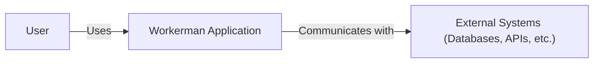
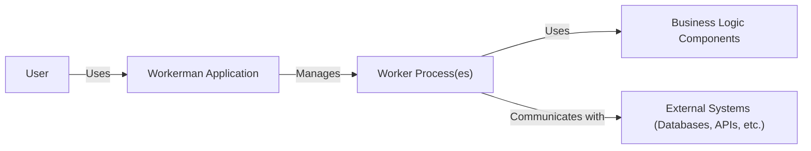
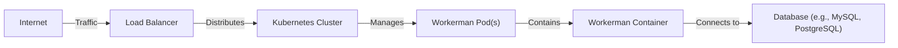
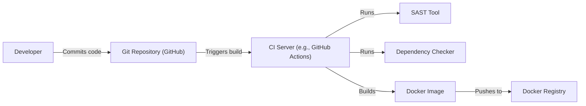

Okay, let's create a design document for the Workerman project.

# BUSINESS POSTURE

Workerman is an open-source, high-performance PHP socket framework.  It appears to be targeted at developers building real-time applications, network services, and other applications requiring persistent connections.  The business priorities likely revolve around:

*   Performance:  Enabling high throughput and low latency for applications.
*   Reliability:  Providing a stable and robust foundation for network services.
*   Ease of Use:  Offering a developer-friendly API for building socket-based applications.
*   Community Support:  Maintaining an active and engaged community for support and contributions.
*   Open Source: Free to use and modify.

Business risks that need to be addressed, based on these priorities:

*   Security Vulnerabilities:  Vulnerabilities in the framework could lead to compromised applications and data breaches.  This is the most critical risk.
*   Performance Bottlenecks:  Issues that limit performance could render the framework unsuitable for its intended use cases.
*   Lack of Adoption:  If developers don't find the framework useful or easy to use, it won't gain traction.
*   Maintainability:  If the codebase becomes difficult to maintain, it will be harder to fix bugs and add new features.
*   Stability Issues:  Crashes or unexpected behavior could disrupt applications built on the framework.

# SECURITY POSTURE

Based on the provided GitHub repository, here's an assessment of the security posture:

*   security control: The project is written in PHP. PHP itself has a history of security vulnerabilities, so staying up-to-date with the latest PHP versions is crucial.
*   security control: The project uses sockets. Secure usage of sockets is important.
*   accepted risk: The project is open-source, meaning the code is publicly available for scrutiny. This can be a double-edged sword: vulnerabilities can be found and fixed more easily, but they can also be exploited more easily.
*   accepted risk: The framework itself doesn't seem to implement any specific security features like authentication or encryption. It's a low-level framework, and these responsibilities are likely delegated to the applications built on top of it. This places a significant burden on the developers using Workerman to implement security correctly.
*   accepted risk: Limited information is available about the secure development lifecycle practiced by the Workerman maintainers.

Recommended Security Controls (High Priority):

*   security control: Implement or recommend specific libraries for handling secure connections (TLS/SSL). Provide clear documentation and examples.
*   security control: Provide guidance and examples for implementing authentication and authorization mechanisms within applications built with Workerman.
*   security control: Conduct regular security audits and penetration testing of the framework.
*   security control: Establish a clear vulnerability disclosure and patching process.
*   security control: Integrate static analysis security testing (SAST) tools into the development workflow.
*   security control: Integrate dependency checking to identify and mitigate known vulnerabilities in third-party libraries.

Security Requirements:

*   Authentication: The framework itself doesn't need to handle authentication, but documentation should clearly guide developers on how to implement secure authentication mechanisms in their applications (e.g., using secure password storage, session management, etc.).
*   Authorization: Similar to authentication, the framework should provide guidance on implementing proper authorization checks within applications (e.g., role-based access control).
*   Input Validation: The framework should emphasize the importance of validating all input received from clients to prevent common vulnerabilities like injection attacks. Documentation should include examples of proper input validation techniques.
*   Cryptography: The framework should recommend the use of strong cryptographic libraries and algorithms for securing data in transit (TLS/SSL) and at rest (if applicable).  It should explicitly discourage the use of weak or outdated cryptographic methods.

# DESIGN

## C4 CONTEXT

C4 CONTEXT Element Descriptions:

*   Element:
    *   Name: User
    *   Type: Person
    *   Description: Represents a user interacting with an application built using Workerman.
    *   Responsibilities: Initiates connections, sends requests, and receives responses.
    *   Security controls: Authentication and authorization should be implemented within the Workerman application to verify the user's identity and permissions.

*   Element:
    *   Name: Workerman Application
    *   Type: Software System
    *   Description: An application built using the Workerman framework.
    *   Responsibilities: Handles network connections, processes requests, and interacts with external systems.
    *   Security controls: Input validation, output encoding, secure communication (TLS/SSL), and protection against common web vulnerabilities.

*   Element:
    *   Name: External Systems
    *   Type: Software System
    *   Description: Represents any external systems that the Workerman application interacts with, such as databases, APIs, or other services.
    *   Responsibilities: Varies depending on the specific system.
    *   Security controls: Secure communication protocols, authentication, and authorization mechanisms as required by the external system.

## C4 CONTAINER

C4 CONTAINER Element Descriptions:

*   Element:
    *   Name: User
    *   Type: Person
    *   Description: Represents a user interacting with the application.
    *   Responsibilities: Initiates connections, sends requests, and receives responses.
    *   Security controls: Authentication and authorization should be implemented within the Workerman application.

*   Element:
    *   Name: Workerman Application
    *   Type: Software System
    *   Description: The top-level application built using Workerman.
    *   Responsibilities: Initializes and manages worker processes.
    *   Security controls: Configuration of security parameters, overall application security settings.

*   Element:
    *   Name: Worker Process(es)
    *   Type: Container (Process)
    *   Description: One or more worker processes spawned by Workerman to handle concurrent connections.
    *   Responsibilities: Handles individual client connections, processes requests, and interacts with business logic components.
    *   Security controls: Input validation, output encoding, secure session management, and adherence to the principle of least privilege.

*   Element:
    *   Name: Business Logic Components
    *   Type: Container (Code Modules)
    *   Description: The application-specific code that implements the business logic.
    *   Responsibilities: Processes data, interacts with external systems, and generates responses.
    *   Security controls: Secure coding practices, data validation, and protection against business logic flaws.

*   Element:
    *   Name: External Systems
    *   Type: Software System
    *   Description: Represents external systems that the application interacts with.
    *   Responsibilities: Varies depending on the specific system.
    *   Security controls: Secure communication protocols, authentication, and authorization mechanisms as required by the external system.

## DEPLOYMENT

Possible deployment solutions:

1.  Traditional Server: Deploying the Workerman application on a traditional server (physical or virtual) running a supported operating system (Linux, etc.).
2.  Containerized Deployment: Packaging the Workerman application and its dependencies into a container (e.g., Docker) and deploying it on a container orchestration platform (e.g., Kubernetes, Docker Swarm).
3.  Serverless Deployment: While Workerman is designed for persistent connections, it might be possible to adapt parts of it for serverless functions, though this is not its primary use case.

Chosen Solution: Containerized Deployment (using Docker and Kubernetes)

DEPLOYMENT Element Descriptions:

*   Element:
    *   Name: Internet
    *   Type: Network
    *   Description: The public internet.
    *   Responsibilities: Routes traffic to the load balancer.
    *   Security controls: Firewall rules, DDoS protection.

*   Element:
    *   Name: Load Balancer
    *   Type: Infrastructure
    *   Description: Distributes incoming traffic across multiple instances of the Workerman application.
    *   Responsibilities: Health checks, traffic routing.
    *   Security controls: TLS termination, Web Application Firewall (WAF).

*   Element:
    *   Name: Kubernetes Cluster
    *   Type: Infrastructure
    *   Description: A container orchestration platform that manages the deployment and scaling of the Workerman application.
    *   Responsibilities: Resource management, scheduling, self-healing.
    *   Security controls: Network policies, role-based access control (RBAC), pod security policies.

*   Element:
    *   Name: Workerman Pod(s)
    *   Type: Infrastructure
    *   Description: One or more pods running instances of the Workerman container.
    *   Responsibilities: Running the Workerman application.
    *   Security controls: Resource limits, security context.

*   Element:
    *   Name: Workerman Container
    *   Type: Container
    *   Description: A Docker container containing the Workerman application and its dependencies.
    *   Responsibilities: Running the Workerman application code.
    *   Security controls: Minimal base image, regular image scanning for vulnerabilities.

*   Element:
    *   Name: Database
    *   Type: Infrastructure
    *   Description: The database used by the Workerman application.
    *   Responsibilities: Storing and retrieving data.
    *   Security controls: Authentication, authorization, encryption at rest and in transit, regular backups.

## BUILD

BUILD Process Description:

1.  Developer commits code to the Git repository (GitHub).
2.  The commit triggers a build on the CI server (e.g., GitHub Actions).
3.  The CI server runs a series of steps:
    *   Runs a SAST tool (e.g., PHPStan, Psalm) to analyze the code for potential security vulnerabilities.
    *   Runs a dependency checker (e.g., Composer audit) to identify known vulnerabilities in third-party libraries.
    *   Builds the Workerman application and packages it into a Docker image.
    *   Pushes the Docker image to a Docker registry.

Security Controls in Build Process:

*   security control: SAST: Static analysis security testing to identify vulnerabilities in the code.
*   security control: Dependency Checking: Identifying and mitigating known vulnerabilities in third-party libraries.
*   security control: Build Automation: Ensuring a consistent and repeatable build process.
*   security control: Image Scanning: Scanning the Docker image for vulnerabilities before deployment.

# RISK ASSESSMENT

*   Critical Business Processes:
    *   Real-time communication: Ensuring low-latency and reliable communication between clients and the server.
    *   Data processing: Handling and processing data received from clients.
    *   Service availability: Maintaining the availability of the application.

*   Data Sensitivity:
    *   The sensitivity of the data handled by Workerman applications depends entirely on the specific application. Workerman itself doesn't handle data persistence.
    *   Examples:
        *   Low Sensitivity: Publicly available data, non-sensitive logs.
        *   Medium Sensitivity: Usernames, email addresses, usage statistics.
        *   High Sensitivity: Passwords, financial data, personal health information.
    *   The application developer is responsible for determining the sensitivity of the data and implementing appropriate security measures.

# QUESTIONS & ASSUMPTIONS

*   Questions:
    *   What are the specific security practices followed by the Workerman maintainers?
    *   Are there any plans to add built-in security features to the framework?
    *   What are the most common use cases for Workerman, and what are the associated security concerns?
    *   What is the process for reporting and addressing security vulnerabilities?

*   Assumptions:
    *   Business Posture: The primary goal is to provide a high-performance, reliable, and easy-to-use socket framework. Security is a critical concern, but it's largely the responsibility of the application developer.
    *   Security Posture: The framework itself has a minimal security footprint. It relies heavily on the underlying operating system and the application developer to implement security controls.
    *   Design: The design is based on a multi-process model, where worker processes handle individual connections. The framework is highly configurable, and the specific deployment architecture can vary.
    *   The project is actively maintained and updated.
    *   Developers using Workerman have a basic understanding of network security principles.
    *   External systems (databases, APIs) have their own security measures in place.