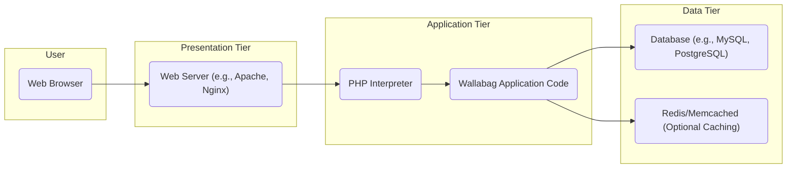
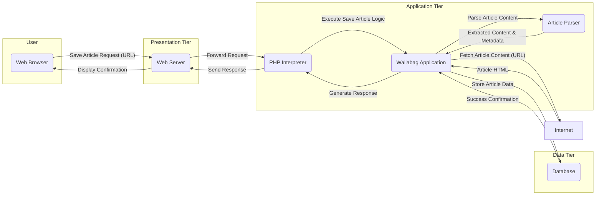

# Project Design Document: Wallabag

**Version:** 1.1
**Date:** October 26, 2023
**Author:** AI Software Architect

## 1. Introduction

This document provides a detailed architectural design of the Wallabag project, a self-hosted read-it-later application. This document aims to provide a comprehensive understanding of the system's components, interactions, and data flow, which will serve as the foundation for subsequent threat modeling activities. The design is based on the publicly available source code and documentation of the Wallabag project found at [https://github.com/wallabag/wallabag](https://github.com/wallabag/wallabag). This revision includes more detailed descriptions and expands on security considerations.

## 2. Goals and Objectives

The primary goals of this design document are:

*   Clearly outline the architecture of the Wallabag application.
*   Identify the key components and their specific responsibilities.
*   Describe the data flow within the system for critical operations.
*   Provide a robust basis for identifying potential security vulnerabilities during threat modeling.
*   Serve as a detailed reference for developers, security analysts, and operations teams.

## 3. High-Level Architecture

Wallabag follows a traditional three-tier web application architecture, separating concerns for better maintainability and scalability.

*   **Presentation Tier:**  Responsible for user interaction and display.
*   **Application Tier:** Contains the core business logic and processing.
*   **Data Tier:** Manages persistent data storage and retrieval.



## 4. Detailed Component Description

This section provides a detailed breakdown of the key components within the Wallabag system and their specific functionalities.

*   **Web Browser:** The user's interface to Wallabag, responsible for:
    *   Rendering the user interface (HTML, CSS, JavaScript).
    *   Sending HTTP requests to the web server.
    *   Displaying responses from the server.
*   **Web Server (e.g., Apache, Nginx):** The entry point for all user requests, responsible for:
    *   Receiving and routing HTTP/HTTPS requests.
    *   Serving static content (images, CSS, JavaScript).
    *   Forwarding dynamic requests to the PHP interpreter.
    *   Handling SSL/TLS termination for secure communication.
    *   Implementing security headers (e.g., HSTS, X-Frame-Options).
*   **PHP Interpreter:** Executes the Wallabag application code, responsible for:
    *   Processing dynamic web requests.
    *   Executing the Wallabag application logic.
    *   Interacting with the database and other services.
    *   Generating HTTP responses.
*   **Wallabag Application Code:** The core of the application, encompassing various modules and functionalities:
    *   **Authentication Module:** Handles user login, logout, and session management.
    *   **Authorization Module:** Controls access to resources based on user roles and permissions.
    *   **Article Management Module:**  Handles saving, retrieving, updating, and deleting articles.
    *   **Article Parsing Module:** Extracts relevant content from web pages.
    *   **Tagging Module:** Allows users to categorize and organize articles with tags.
    *   **Search Module:** Enables users to search for articles based on keywords and criteria.
    *   **API Module:** Provides endpoints for external integrations and mobile applications.
    *   **User Settings Module:** Manages user preferences and configurations.
    *   **Import/Export Module:** Facilitates importing and exporting articles in various formats.
*   **Database (e.g., MySQL, PostgreSQL):**  The persistent storage for all application data, including:
    *   User credentials (usernames, hashed passwords, email addresses).
    *   Article content (URLs, extracted text, metadata, publication dates).
    *   Tags and their relationships with articles.
    *   User preferences and application settings.
    *   Session data (if not using Redis/Memcached for sessions).
*   **Redis/Memcached (Optional Caching):** An in-memory data store used for performance optimization, responsible for:
    *   Caching frequently accessed data (e.g., parsed article content).
    *   Storing session data for faster retrieval.
    *   Potentially used as a message broker for background tasks.
*   **Message Queue (Optional, e.g., RabbitMQ, Redis):** Facilitates asynchronous task processing, such as:
    *   Background fetching of article content.
    *   Processing large import/export operations.
    *   Sending notifications.

## 5. Data Flow

This section details the typical data flow for two key operations within Wallabag, illustrating how different components interact.

### 5.1. Saving an Article



*   The user initiates the save article process by submitting a URL through the web browser.
*   The web browser sends an HTTP POST request containing the URL to the web server.
*   The web server receives the request and forwards it to the PHP interpreter.
*   The PHP interpreter executes the Wallabag application code, specifically the save article logic.
*   The Wallabag application code fetches the content of the provided URL from the internet.
*   The article parser component extracts the relevant content and metadata from the fetched HTML.
*   The extracted content and metadata are passed back to the main application logic.
*   The application logic stores the article data, including the URL, content, and metadata, in the database.
*   The database confirms the successful storage of the data.
*   The application generates an HTTP response indicating the success or failure of the operation.
*   The PHP interpreter sends the response back to the web server.
*   The web server forwards the response to the user's web browser.
*   The web browser displays a confirmation message to the user.

### 5.2. Viewing an Article

```mermaid
graph LR
    subgraph "User"
        A("Web Browser")
    end
    subgraph "Presentation Tier"
        B("Web Server")
    end
    subgraph "Application Tier"
        C("PHP Interpreter")
        D("Wallabag Application")
    end
    subgraph "Data Tier"
        E("Database")
        F("Redis/Memcached (Optional)")
    end

    A -- "View Article Request (Article ID)" --> B
    B -- "Forward Request" --> C
    C -- "Execute View Article Logic" --> D
    D -- "Check Cache (Article ID)" --> F
    alt Cache Hit
        F -- "Retrieve Article Data" --> D
    else Cache Miss
        D -- "Retrieve Article Data (Article ID)" --> E
        E -- "Article Data" --> D
        D -- "Store in Cache (Article ID)" --> F
    end
    D -- "Generate HTML Response" --> C
    C -- "Send Response" --> B
    B -- "Display Article" --> A
```

*   The user requests to view a specific article by clicking a link or navigating to a specific URL in the web browser.
*   The web browser sends an HTTP GET request containing the article ID to the web server.
*   The web server receives the request and forwards it to the PHP interpreter.
*   The PHP interpreter executes the Wallabag application code, specifically the view article logic.
*   The application first checks if the article data is available in the cache (Redis/Memcached) using the article ID as the key.
*   If the data is found in the cache (cache hit), it is retrieved directly from the cache.
*   If the data is not found in the cache (cache miss), the application retrieves the article data from the database using the article ID.
*   The retrieved data from the database is then optionally stored in the cache for subsequent requests.
*   The application generates an HTML response containing the article content, formatted for display.
*   The PHP interpreter sends the generated HTML response back to the web server.
*   The web server forwards the response to the user's web browser.
*   The web browser renders and displays the article content to the user.

## 6. Security Considerations

This section outlines key security considerations for the Wallabag application, categorized by component and data flow.

*   **Web Browser:**
    *   Enforce HTTPS usage to protect data in transit.
    *   Implement Content Security Policy (CSP) to mitigate XSS attacks.
    *   Utilize Subresource Integrity (SRI) for included scripts and stylesheets.
*   **Web Server:**
    *   Configure strong TLS settings and disable insecure protocols.
    *   Implement security headers (HSTS, X-Frame-Options, X-Content-Type-Options, Referrer-Policy).
    *   Restrict access to sensitive files and directories.
    *   Regularly update the web server software to patch vulnerabilities.
    *   Implement request rate limiting to prevent brute-force attacks.
*   **PHP Interpreter:**
    *   Keep PHP up-to-date with the latest security patches.
    *   Disable unnecessary PHP extensions.
    *   Configure `php.ini` with security best practices (e.g., `expose_php = Off`).
    *   Sanitize user inputs to prevent injection vulnerabilities.
*   **Wallabag Application Code:**
    *   Implement robust authentication and authorization mechanisms.
    *   Validate all user inputs to prevent XSS, SQL injection, and other injection attacks.
    *   Protect against Cross-Site Request Forgery (CSRF) attacks using tokens.
    *   Securely handle file uploads and downloads.
    *   Implement proper error handling and logging without exposing sensitive information.
    *   Regularly audit the code for security vulnerabilities.
    *   Use parameterized queries or prepared statements to prevent SQL injection.
    *   Sanitize output data before rendering it in the browser to prevent XSS.
    *   Implement strong password hashing algorithms.
    *   Securely manage session data (consider using HTTP-only and secure flags for cookies).
*   **Database:**
    *   Use strong and unique passwords for database users.
    *   Restrict database access to only necessary users and hosts.
    *   Encrypt sensitive data at rest (e.g., using database encryption features).
    *   Regularly back up the database.
    *   Keep the database software up-to-date with security patches.
    *   Disable remote access to the database if not required.
*   **Redis/Memcached:**
    *   Restrict network access to the caching server.
    *   If used for session storage, ensure secure configuration.
    *   Consider using authentication if the caching server is exposed.
*   **Message Queue:**
    *   Secure the message queue with authentication and authorization.
    *   Ensure messages are not exposing sensitive information.

## 7. Deployment Considerations

Wallabag is typically deployed in self-hosted environments, requiring careful consideration of security and infrastructure.

*   **Deployment Environments:**
    *   Virtual Private Servers (VPS)
    *   Dedicated Servers
    *   Containerized Environments (Docker, Kubernetes)
    *   Platform as a Service (PaaS) offerings
*   **Deployment Processes:**
    *   Automated deployment using tools like Ansible, Chef, or Puppet.
    *   Container orchestration with Docker Compose or Kubernetes.
    *   Continuous Integration/Continuous Deployment (CI/CD) pipelines for automated builds and deployments.
*   **Security Best Practices:**
    *   Regularly update all system software and dependencies.
    *   Implement firewalls to restrict network access.
    *   Use intrusion detection and prevention systems (IDS/IPS).
    *   Monitor system logs for suspicious activity.
    *   Perform regular security audits and penetration testing.

## 8. Technologies Used

*   **Programming Language:** PHP
*   **Web Server:** Apache or Nginx
*   **Database:** MySQL or PostgreSQL
*   **Caching (Optional):** Redis or Memcached
*   **Message Queue (Optional):** RabbitMQ or Redis
*   **Frontend Technologies:** HTML, CSS, JavaScript, potentially using frameworks like Symfony's Twig.

## 9. Diagrams

The diagrams included in this document provide a visual representation of the system architecture and data flow, aiding in understanding the relationships between components.

## 10. Conclusion

This revised design document provides a more detailed and comprehensive overview of the Wallabag application's architecture. By elaborating on the responsibilities of each component and expanding on the security considerations, this document serves as a stronger foundation for threat modeling and security analysis. This information is crucial for ensuring the security, stability, and maintainability of the Wallabag project.