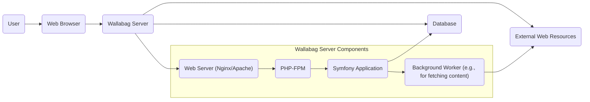

# Project Design Document: Wallabag

**Version:** 1.1
**Date:** October 26, 2023
**Author:** Gemini (AI Expert)

## 1. Introduction

This document outlines the design of Wallabag, a self-hosted read-it-later application for saving web articles. This document aims to provide a comprehensive and detailed overview of the system's architecture, components, data flow, and infrastructure considerations. It will serve as the foundation for subsequent threat modeling activities, providing the necessary context and understanding of the system's inner workings.

## 2. Goals and Objectives

*   Provide users with a personal, self-hosted platform to save and manage web articles, ensuring data ownership and privacy.
*   Enable users to access saved articles offline, offering a convenient reading experience.
*   Offer robust features for organizing and tagging articles, facilitating efficient content management.
*   Support various methods for saving articles, including browser extensions, bookmarklets, and a comprehensive API, catering to diverse user workflows.
*   Maintain user privacy and data ownership as core principles, minimizing reliance on external services and maximizing control over personal data.

## 3. System Architecture

### 3.1. High-Level Architecture



**Description:**

*   **User:** Interacts with Wallabag through a web browser or dedicated applications, initiating actions like saving or viewing articles.
*   **Web Browser:** The primary interface for users to access the Wallabag web application.
*   **Wallabag Server:** The central component hosting the application logic, handling requests, processing data, and managing interactions with other components.
*   **Database:** Stores persistent data, including user accounts, saved articles, tags, and application settings.
*   **External Web Resources:** The origin of the articles being saved and processed by Wallabag.

### 3.2. Component Architecture

```mermaid
graph LR
    subgraph "Wallabag Server"
    A("Web Server (Nginx/Apache)")
    B("PHP-FPM")
    C("Symfony Application")
    D("Routing Component")
    E("Security Component")
    F("Controller Layer")
    G("Service Layer")
    H("Domain Model")
    I("Data Access Layer (Doctrine ORM)")
    J("Templating Engine (Twig)")
    K("Event Dispatcher")
    L("Background Worker (e.g., Symfony Messenger)")
    M("Article Fetcher")
    N("Content Extractor")
    O("Image Proxy (Optional)")
    end
    P("Database (MySQL/PostgreSQL)")
    Q("Message Queue (Optional, e.g., Redis, RabbitMQ)")

    A --> B;
    B --> C;
    C --> D;
    D --> F;
    C --> E;
    F --> G;
    G --> H;
    G --> I;
    I --> P;
    F --> J;
    C --> K;
    K --> L;
    L --> M;
    M --> N;
    L --> O;
    ```

**Description:**

*   **Web Server (Nginx/Apache):**  Accepts incoming HTTP/HTTPS requests, serves static assets, and acts as a reverse proxy, forwarding dynamic requests to PHP-FPM.
*   **PHP-FPM:** A FastCGI Process Manager responsible for executing PHP code within the Symfony application.
*   **Symfony Application:** The core application built using the Symfony framework, providing structure, reusable components, and a robust development environment.
    *   **Routing Component:**  Maps incoming HTTP requests to specific controller actions based on defined routes.
    *   **Security Component:** Handles authentication, authorization, and security-related features like CSRF protection.
    *   **Controller Layer:**  Manages user interactions, receives requests from the Router, orchestrates business logic through the Service Layer, and returns HTTP responses.
    *   **Service Layer:** Contains the core business logic of the application, encapsulating specific functionalities like saving articles, managing tags, and user administration.
    *   **Domain Model:** Represents the core entities and their relationships within the application (e.g., Article, User, Tag, Entry).
    *   **Data Access Layer (Doctrine ORM):** Provides an abstraction layer for interacting with the database, simplifying data persistence and retrieval.
    *   **Templating Engine (Twig):**  Used to render dynamic HTML content for the user interface.
    *   **Event Dispatcher:**  Allows different parts of the application to communicate and react to events, facilitating decoupled functionality (e.g., triggering background tasks after an article is saved).
*   **Background Worker (e.g., Symfony Messenger):**  Manages asynchronous tasks that do not need immediate processing, such as fetching article content or processing bulk operations.
    *   **Article Fetcher:**  Responsible for retrieving the raw HTML content of a web page from a given URL.
    *   **Content Extractor:** Parses the fetched HTML content to identify and extract the main article text, title, publication date, and other relevant metadata.
    *   **Image Proxy (Optional):**  A component that can be used to download and serve images from external sources, potentially for privacy or caching purposes.
*   **Database (MySQL/PostgreSQL):** The persistent storage for all application data.
*   **Message Queue (Optional, e.g., Redis, RabbitMQ):**  Provides a mechanism for queuing and processing background tasks, improving application responsiveness and scalability.

## 4. Data Flow

### 4.1. Saving an Article

1. **User Initiates Save:** The user triggers the saving process via a browser extension, bookmarklet, the web interface, or the API, providing the URL of the article.
2. **HTTP Request:** The browser or application sends an HTTP POST request to the Wallabag server, containing the article URL and potentially other metadata.
3. **Routing and Security:** The Web Server forwards the request to PHP-FPM. The Symfony application's Routing component maps the request to the appropriate controller action. The Security component handles authentication and authorization to ensure the user is permitted to save articles.
4. **Controller Action:** The designated controller receives the request, validates the input (e.g., ensuring the URL is valid), and calls the appropriate method in the Service Layer.
5. **Service Layer Processing:** The Service Layer creates a new Article entity in the Domain Model, initially containing the provided URL and user information.
6. **Event Dispatching:** An event (e.g., `ArticleCreatedEvent`) might be dispatched, allowing other parts of the application to react.
7. **Database Persistence (Initial):** The Data Access Layer (Doctrine ORM) persists the initial Article entity to the database.
8. **Background Task Enqueue:** The Service Layer enqueues a background task using the Background Worker (e.g., via Symfony Messenger) to fetch and extract the article content. The message queue (if configured) might be involved here.
9. **Background Worker Processing:** The Background Worker picks up the queued task.
10. **Content Fetching:** The Article Fetcher retrieves the HTML content from the provided URL. This might involve handling redirects and respecting robots.txt.
11. **Content Extraction:** The Content Extractor parses the downloaded HTML, using techniques like HTML parsing libraries and heuristics, to extract the main article content, title, author, publication date, and potentially featured images.
12. **Image Handling (Optional):** If an Image Proxy is configured, images might be downloaded and served through the proxy.
13. **Article Update:** The extracted content is used to update the corresponding Article entity in the Domain Model.
14. **Database Persistence (Update):** The Data Access Layer updates the Article entity in the database with the fetched and extracted content.
15. **Response to User:** The controller sends an HTTP response back to the user, typically confirming that the article has been saved. This response might be sent before the background fetching is fully complete.

### 4.2. Viewing an Article

1. **User Request:** The user navigates to the Wallabag web interface or uses the API to request a specific article.
2. **HTTP Request:** The browser or application sends an HTTP GET request to the Wallabag server, including the unique identifier (ID) of the article.
3. **Routing and Security:** The Web Server forwards the request to PHP-FPM. The Symfony application's Routing component maps the request to the appropriate controller action. The Security component verifies the user's authorization to view the requested article.
4. **Controller Action:** The designated controller receives the request and retrieves the article ID. It calls the appropriate method in the Service Layer to retrieve the article.
5. **Service Layer Retrieval:** The Service Layer uses the Data Access Layer (Doctrine ORM) to query the database and fetch the Article entity based on the provided ID.
6. **Templating and Rendering:** The controller passes the retrieved Article data to the Templating Engine (Twig). Twig renders the HTML representation of the article, incorporating the content, title, and other metadata.
7. **HTTP Response:** The server sends the generated HTML response back to the user's browser.
8. **Browser Rendering:** The user's browser renders the HTML, displaying the article content.

## 5. Infrastructure

### 5.1. Typical Deployment Environments

*   **Self-Hosted (Bare Metal/VPS):** Users install and manage Wallabag directly on their own physical servers or virtual private servers, providing maximum control but requiring technical expertise.
*   **Containerized Deployment (Docker):**  Wallabag can be deployed using Docker containers, simplifying setup and management across different environments. Orchestration tools like Docker Compose or Kubernetes can be used for more complex deployments.
*   **Cloud Platforms (IaaS):** Deployment on cloud infrastructure services like AWS EC2, Google Compute Engine, or Azure Virtual Machines, offering scalability and flexibility.
*   **Platform as a Service (PaaS):**  Deployment on platforms like Heroku, Platform.sh, or cloud providers' managed Kubernetes services, abstracting away infrastructure management.

### 5.2. Key Infrastructure Components

*   **Operating System:** Linux distributions (e.g., Ubuntu, Debian) are common choices for their stability and open-source nature.
*   **Web Server:** Nginx or Apache are the primary web servers used to handle incoming requests. Nginx is often preferred for its performance and efficiency.
*   **PHP:**  The programming language in which Wallabag is primarily written. Specific PHP extensions are required for the Symfony framework and its dependencies.
*   **PHP-FPM:**  A process manager for PHP, improving performance and security compared to traditional CGI.
*   **Database Server:** MySQL or PostgreSQL are the supported relational database management systems for storing persistent data.
*   **Message Queue (Optional):**  Redis or RabbitMQ can be used for managing background tasks, providing more robust queuing and processing capabilities than Symfony Messenger's default implementation.
*   **Caching Layer (Optional):** Redis or Memcached can be used to cache frequently accessed data, such as rendered templates or database query results, improving application performance.
*   **Storage:**  Disk space is required for storing the database, application code, uploaded files (if any), and potentially cached content.
*   **DNS:**  A Domain Name System is necessary to resolve the domain name used to access Wallabag to the server's IP address.
*   **TLS/SSL Certificates:**  Essential for enabling HTTPS and securing communication between the user's browser and the server, protecting sensitive data in transit. Let's Encrypt is a popular option for free certificates.
*   **Firewall:** A firewall (e.g., `iptables`, `ufw`) is crucial for controlling network traffic and protecting the server from unauthorized access.
*   **Load Balancer (Optional):** For high-availability deployments, a load balancer can distribute traffic across multiple Wallabag server instances.

## 6. Security Considerations

This section details key security considerations for Wallabag, crucial for identifying potential threats and vulnerabilities during threat modeling.

*   **Authentication:** Securely verifying user identities is paramount.
    *   **Local Authentication:** Wallabag uses a username and password system. Strong password policies and secure password hashing algorithms (e.g., Argon2i) are essential. Consider implementing features like password reset and account lockout after failed login attempts.
    *   **Two-Factor Authentication (2FA):** Implementing 2FA (e.g., using TOTP) significantly enhances account security by requiring a second verification factor.
    *   **OAuth2/OpenID Connect:** Supporting integration with established identity providers via OAuth2 or OpenID Connect can provide a more secure and user-friendly authentication experience.
*   **Authorization:** Controlling access to resources and functionalities based on user roles and permissions is vital.
    *   **Role-Based Access Control (RBAC):**  Wallabag should implement RBAC to define different roles (e.g., administrator, regular user) with varying levels of access.
    *   **Granular Permissions:**  Consider more granular permissions for specific actions, such as editing or deleting articles.
*   **Input Validation:**  Thoroughly validating all user-supplied input is crucial to prevent injection attacks.
    *   **Sanitization and Escaping:** Sanitize and escape user input before using it in database queries (to prevent SQL injection), rendering in templates (to prevent XSS), or executing shell commands (to prevent command injection).
    *   **Whitelisting:**  Prefer whitelisting valid input patterns over blacklisting potentially malicious ones.
    *   **Regular Expression Validation:** Use regular expressions to enforce specific input formats (e.g., for URLs).
*   **Output Encoding:** Properly encoding output data prevents Cross-Site Scripting (XSS) vulnerabilities.
    *   **Context-Aware Encoding:** Encode output based on the context in which it's being used (e.g., HTML escaping, JavaScript escaping, URL encoding).
    *   **Templating Engine Features:** Leverage the auto-escaping features provided by the Twig templating engine.
*   **Data Protection at Rest:** Securely storing sensitive data is essential.
    *   **Database Encryption:** Consider encrypting sensitive data within the database.
    *   **Configuration Management:** Securely store configuration files containing database credentials and API keys, avoiding hardcoding them in the application.
*   **Data Protection in Transit:**  Protecting data during transmission is critical.
    *   **HTTPS Enforcement:** Enforce the use of HTTPS for all communication by redirecting HTTP requests to HTTPS.
    *   **HSTS (HTTP Strict Transport Security):** Implement HSTS to instruct browsers to always use HTTPS when accessing the Wallabag domain.
*   **Session Management:**  Securely managing user sessions prevents session hijacking.
    *   **Secure Session Cookies:** Use secure, HTTP-only session cookies with appropriate expiration times.
    *   **Session Regeneration:** Regenerate session IDs upon successful login to prevent session fixation attacks.
*   **Cross-Site Request Forgery (CSRF) Protection:**  Preventing unauthorized actions on behalf of authenticated users.
    *   **CSRF Tokens:** Utilize Symfony's built-in CSRF protection mechanisms by including CSRF tokens in forms.
*   **Rate Limiting:**  Protecting against brute-force attacks and denial-of-service attempts.
    *   **Login Attempt Limiting:** Limit the number of failed login attempts from a specific IP address.
    *   **API Rate Limiting:** Implement rate limits for API endpoints to prevent abuse.
*   **Dependency Management:**  Keeping third-party libraries and dependencies up-to-date is crucial for patching known vulnerabilities.
    *   **Regular Updates:** Regularly update dependencies using a dependency management tool like Composer.
    *   **Vulnerability Scanning:**  Use tools to scan dependencies for known security vulnerabilities.
*   **Logging and Monitoring:**  Implementing robust logging and monitoring is essential for detecting and responding to security incidents.
    *   **Security Auditing:** Log security-related events, such as login attempts, failed authorization attempts, and changes to user permissions.
    *   **Application Logging:** Log application errors and important events for debugging and analysis.
    *   **Intrusion Detection/Prevention Systems (IDS/IPS):** Consider using IDS/IPS to detect and prevent malicious activity.
*   **Content Security Policy (CSP):**  Using CSP helps mitigate XSS attacks by controlling the resources the browser is allowed to load for a given page.
*   **Regular Security Audits and Penetration Testing:**  Proactively identifying and addressing security vulnerabilities through regular security assessments.

## 7. Assumptions and Constraints

*   The application is primarily designed for single-user or small team self-hosting, although larger deployments are possible with appropriate infrastructure.
*   The primary data store is a relational database (MySQL or PostgreSQL), influencing data modeling and querying approaches.
*   The application relies on standard web technologies (HTTP, HTML, CSS, JavaScript) and the PHP ecosystem.
*   Background task processing is a core requirement for efficient fetching and processing of article content.
*   User data privacy and control are key design considerations.

## 8. Future Considerations

*   **Mobile Applications:** Developing dedicated mobile applications for iOS and Android to provide a more integrated user experience.
*   **Improved Content Extraction:** Continuously enhancing the content extraction capabilities to handle a wider range of website structures and paywalls.
*   **Full-Text Search:** Implementing a robust full-text search functionality to allow users to easily find specific articles based on their content.
*   **Integration with Third-Party Services:**  Expanding integrations with services like Instapaper, Pocket, or RSS readers to facilitate data import and export.
*   **Collaboration Features:**  Exploring options for users to share articles or create collaborative reading lists, while carefully considering privacy implications.
*   **Plugin System:**  Developing a plugin system to allow users and developers to extend Wallabag's functionality.
*   **Webhooks:** Implementing webhooks to allow Wallabag to notify external services about events, such as new articles being saved.
