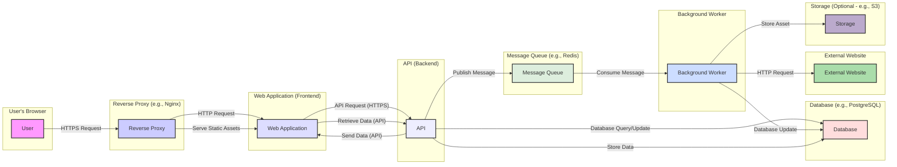

## Project Design Document: Wallabag (Improved)

**1. Introduction**

This document provides an enhanced architectural design of the Wallabag project, an open-source read-it-later application. This detailed design serves as a crucial foundation for subsequent threat modeling activities, offering a comprehensive understanding of the system's components, their interactions, and the flow of data. The intended audience includes security engineers, developers, operations teams, and anyone involved in the security assessment and maintenance of Wallabag.

**2. Project Overview**

Wallabag is a self-hosted application designed to allow users to save web articles and other online content for convenient later reading. It prioritizes a clean, distraction-free reading experience and offers features such as tagging, full-text search, content highlighting, and exporting capabilities. The core functionality involves fetching content from provided URLs, processing and storing this content, and presenting it to the user through a web interface or a programmatic API.

**3. System Architecture**

The Wallabag architecture comprises several interconnected components, each with specific responsibilities:

* **Web Application (Frontend):**
    * Presents the user interface for interacting with Wallabag.
    * Handles user input, displays saved articles, and manages user settings.
    * Primarily built using PHP (Symfony framework) leveraging the Twig templating engine for rendering dynamic content.
    * Communicates with the backend API using standard web protocols (primarily HTTPS).
    * Serves static assets, including CSS stylesheets, JavaScript files, images, and other media.

* **API (Backend):**
    * Provides a RESTful API endpoint for communication between the frontend, mobile applications (if any), and other potential integrations.
    * Enforces authentication and authorization policies to secure access to resources.
    * Implements the core business logic for managing articles (saving, retrieving, updating, deleting), user accounts, tagging, and application settings.
    * Built using PHP (Symfony framework), utilizing its routing, controller, and service components.

* **Database:**
    * Provides persistent storage for all application data.
    * Stores user credentials (hashed and salted), saved articles (content, metadata), tags, user preferences, and application configuration.
    * Supports various relational database management systems, including MySQL, PostgreSQL, and SQLite, offering flexibility in deployment environments.

* **Message Queue (Optional, but Recommended):**
    * Facilitates asynchronous task processing, particularly for fetching and processing article content.
    * Decouples the web request handling from potentially time-consuming operations, improving application responsiveness.
    * Common implementations include RabbitMQ or Redis.

* **Background Workers (Consumers):**
    * Processes tasks enqueued in the message queue.
    * Primarily responsible for fetching content from external URLs, extracting relevant information (title, author, publication date, content), cleaning the content, and downloading associated assets (images).
    * Operates independently of the main web application processes.

* **Storage (Optional):**
    * Provides a dedicated location for storing assets associated with saved articles, such as downloaded images.
    * Can be the local filesystem of the server or a cloud-based object storage service like AWS S3 or similar.
    * Improves performance by serving static assets directly, potentially through a CDN.

* **Reverse Proxy (Deployment Layer):**
    * Acts as an intermediary between clients and the Wallabag application.
    * Handles incoming requests, performs SSL/TLS termination, and can provide load balancing, caching, and other security features.
    * Common choices include Nginx or Apache HTTP Server.

**4. Data Flow (Detailed)**

The following details the key data flows within the Wallabag system:

* **Saving an Article (Web Interface):**
    * User enters or pastes a URL into the designated field in the web interface.
    * The frontend sends an asynchronous HTTPS request to the backend API's `/api/entries` endpoint, including the URL.
    * The API authenticates the user and validates the provided URL format.
    * The API creates a new "pending" article record in the database, storing the URL and user association.
    * If a message queue is configured, the API publishes a message to the queue containing the article ID and URL to be fetched.
    * A background worker consumes the message from the queue.
    * The background worker makes an HTTP request to the external website specified by the URL.
    * The background worker parses the HTML content of the response, extracts relevant information (using libraries like Readability), and downloads associated images.
    * The background worker updates the corresponding article record in the database with the fetched content, title, author, publication date, and status (e.g., "read").
    * If storage is configured, downloaded images are saved to the designated storage location, and the database record is updated with the asset paths.
    * The frontend can then retrieve the updated article details via an API request and display the saved content to the user.

* **Saving an Article (API):**
    * An external application or browser extension sends an HTTPS POST request to the backend API's `/api/entries` endpoint, including the URL and authentication credentials.
    * The API authenticates the request and follows the same steps as saving via the web interface from the API validation onwards.

* **Accessing an Article:**
    * User navigates to or requests a specific article through the web interface.
    * The frontend sends an HTTPS GET request to the backend API's `/api/entries/{id}` endpoint.
    * The API authenticates and authorizes the user to access the requested article.
    * The API retrieves the article data (content, metadata, associated assets paths) from the database.
    * The API sends the article data back to the frontend in JSON format.
    * The frontend renders the article content, fetching associated assets from the storage location (if configured) or directly if stored within the web application's static files.

* **User Authentication (Login):**
    * User submits login credentials (username/email and password) through the login form on the web interface.
    * The frontend sends an HTTPS POST request to the backend API's authentication endpoint (e.g., `/api/login`).
    * The API retrieves the user's stored credentials from the database.
    * The API securely verifies the provided password against the stored hashed and salted password.
    * Upon successful authentication, the API generates a session identifier and potentially a session cookie.
    * The session identifier is stored server-side (e.g., in the database or a dedicated session store).
    * The session cookie is sent back to the user's browser. Subsequent requests from the user's browser include this cookie for authentication and authorization.

**5. Security Considerations (Detailed)**

This section expands on potential security considerations, providing more specific examples of threats and vulnerabilities:

* **Authentication and Authorization:**
    * **Threat:** Brute-force attacks on login forms to guess user credentials.
        * **Mitigation:** Implement rate limiting on login attempts, account lockout mechanisms, and potentially multi-factor authentication.
    * **Threat:** Session hijacking or fixation, allowing attackers to impersonate legitimate users.
        * **Mitigation:** Use secure session management practices, including HTTPOnly and Secure flags on cookies, regular session regeneration, and proper session invalidation on logout.
    * **Threat:** Insufficient authorization checks, allowing users to access or modify data they are not permitted to.
        * **Mitigation:** Implement granular role-based access control (RBAC) and enforce authorization checks at the API level for all sensitive operations.
    * **Threat:** Weak password policies leading to easily guessable passwords.
        * **Mitigation:** Enforce strong password complexity requirements and encourage the use of password managers.

* **Input Validation and Output Encoding:**
    * **Threat:** Cross-Site Scripting (XSS) attacks, where malicious scripts are injected into web pages viewed by other users.
        * **Mitigation:** Implement robust input validation on all user-provided data and use context-aware output encoding to sanitize data before rendering it in HTML.
    * **Threat:** SQL Injection attacks, where malicious SQL queries are injected through input fields, potentially allowing attackers to access or modify database data.
        * **Mitigation:** Use parameterized queries or prepared statements for all database interactions to prevent SQL injection.
    * **Threat:** Command Injection attacks, where attackers can execute arbitrary commands on the server.
        * **Mitigation:** Avoid executing system commands based on user input. If necessary, sanitize input thoroughly and use safe API alternatives.

* **Data Protection:**
    * **Threat:** Exposure of sensitive data at rest if the database is compromised.
        * **Mitigation:** Encrypt sensitive data at rest using database encryption features or application-level encryption.
    * **Threat:** Interception of sensitive data in transit.
        * **Mitigation:** Enforce HTTPS for all communication between the client and the server. Ensure proper TLS configuration to prevent downgrade attacks.
    * **Threat:** Accidental exposure of sensitive information through logging or error messages.
        * **Mitigation:** Implement secure logging practices, avoid logging sensitive data, and ensure error messages do not reveal sensitive information to end-users.

* **Dependency Management:**
    * **Threat:** Exploitation of known vulnerabilities in third-party libraries and components.
        * **Mitigation:** Regularly update dependencies to the latest stable versions and monitor security advisories for known vulnerabilities. Use dependency scanning tools to identify potential risks.

* **Content Fetching Security:**
    * **Threat:** Server-Side Request Forgery (SSRF) attacks, where an attacker can induce the server to make requests to unintended internal or external resources.
        * **Mitigation:** Implement strict URL validation and sanitization for content fetching. Use a whitelist approach for allowed domains or protocols. Consider using a dedicated service for content fetching with restricted network access.
    * **Threat:** Exposure to malicious content from external websites, such as malware or phishing attempts.
        * **Mitigation:** Implement content security policies (CSP) to restrict the sources from which the application can load resources. Sanitize fetched content to remove potentially harmful elements.
    * **Threat:** Denial-of-service (DoS) attacks by overwhelming the content fetching mechanism.
        * **Mitigation:** Implement rate limiting and request throttling for content fetching operations.

* **Storage Security:**
    * **Threat:** Unauthorized access to stored assets.
        * **Mitigation:** Implement appropriate access controls and permissions for the storage location. For cloud storage, utilize IAM roles and policies.
    * **Threat:** Data breaches due to misconfigured storage buckets or permissions.
        * **Mitigation:** Regularly review and audit storage configurations to ensure they are secure.

* **Deployment Security:**
    * **Threat:** Vulnerabilities in the reverse proxy or web server configuration.
        * **Mitigation:** Follow security best practices for configuring the reverse proxy and web server, including disabling unnecessary features and applying security patches.
    * **Threat:** Lack of proper firewall rules allowing unauthorized access to the application or its components.
        * **Mitigation:** Implement a firewall to restrict network access to only necessary ports and services.

**6. Technologies Used (Specific)**

* **Programming Language (Backend):** PHP (Specific version should be documented)
* **Framework:** Symfony (Specific version should be documented)
* **Templating Engine:** Twig (Specific version should be documented)
* **Database:** MySQL (e.g., MySQL 8.x), PostgreSQL (e.g., PostgreSQL 14.x), SQLite (Specific version should be documented if applicable)
* **Message Queue (Optional):** RabbitMQ (Specific version should be documented), Redis (Specific version should be documented)
* **Web Server/Reverse Proxy:** Nginx (Specific version should be documented), Apache HTTP Server (Specific version should be documented)
* **Frontend Technologies:** HTML5, CSS3, JavaScript (potentially with specific libraries/frameworks like jQuery)

**7. Deployment Considerations (Expanded)**

Wallabag's deployment can vary significantly, impacting its security profile:

* **Single Server Deployment:** While simple, this concentrates all potential attack vectors on a single machine. Proper hardening of the server is crucial.
* **Containerized Deployment (Docker/Kubernetes):** Offers better isolation and scalability but requires secure configuration of container images and orchestration platforms. Security scanning of container images is recommended.
* **Cloud Deployment (IaaS/PaaS):** Leveraging cloud provider security features is essential. This includes secure configuration of cloud resources, network security groups, and identity and access management (IAM).
* **Deployment with a CDN:** Using a Content Delivery Network (CDN) can improve performance and provide some protection against DDoS attacks, but the CDN configuration itself needs to be secure.

**8. Future Considerations (Security Implications)**

Future developments should consider potential security implications:

* **Mobile Applications:** Introduce new attack surfaces and require secure API authentication and authorization mechanisms. Data storage on mobile devices needs careful consideration.
* **Browser Extensions:** Can introduce vulnerabilities if not developed securely, potentially allowing access to user data or actions on other websites.
* **Integration with other services:** Requires secure authentication and authorization protocols between Wallabag and external services. Data exchanged with external services needs to be protected.
* **Enhanced Search Capabilities:** Implementing advanced search features might introduce new injection vulnerabilities if not handled carefully.

This improved design document provides a more detailed and nuanced understanding of the Wallabag project's architecture, crucial for effective threat modeling and security assessments. The expanded security considerations offer a starting point for identifying potential vulnerabilities and developing appropriate mitigation strategies.