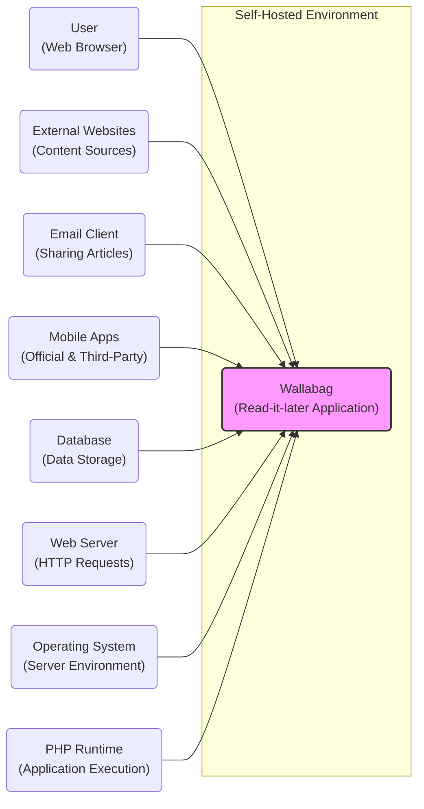
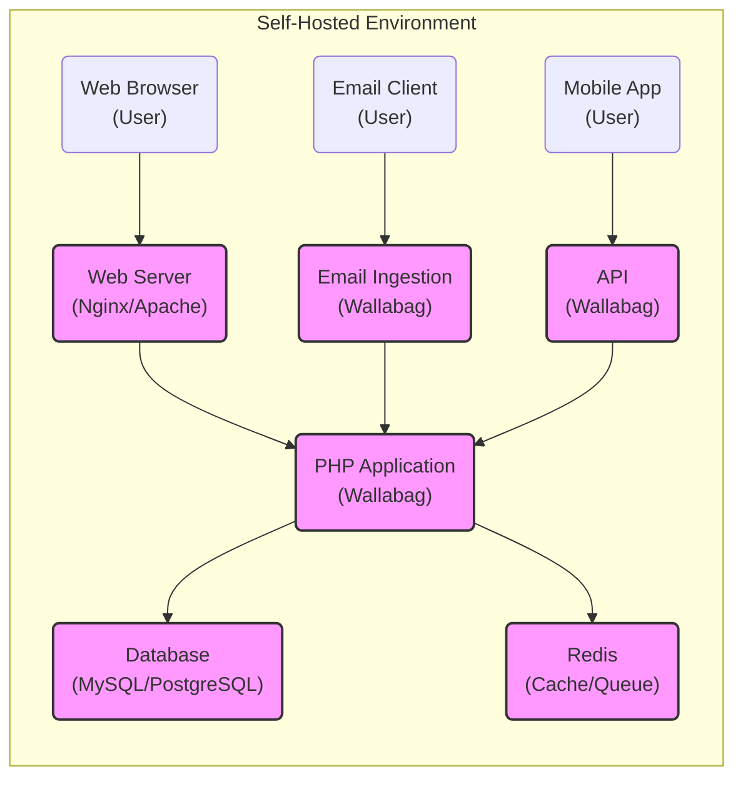
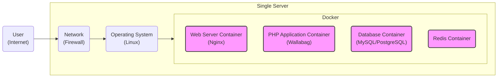
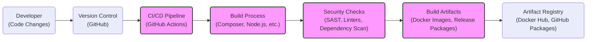

# BUSINESS POSTURE

Wallabag is an open-source, self-hosted read-it-later application. The primary business priority is to provide users with a reliable, feature-rich, and privacy-respecting platform to save and manage web content for later consumption. The goal is to empower users to control their reading list and avoid being tracked by commercial read-it-later services.

Most important business risks that need to be addressed:
- Data loss: Users rely on Wallabag to store important information. Data loss due to system failures, bugs, or security breaches would severely impact user trust and adoption.
- Privacy violations: As a privacy-focused application, any privacy breach or data leak would undermine the core value proposition and damage the project's reputation.
- Availability and Performance: Users expect the application to be available and performant when they need to save or access articles. Downtime or slow performance can lead to user frustration and abandonment.
- Security vulnerabilities: Security vulnerabilities can lead to data breaches, unauthorized access, and system compromise, impacting both data loss and privacy.

# SECURITY POSTURE

Existing security controls:
- security control: HTTPS encryption for communication between client and server. (Implemented in web server configuration)
- security control: Regular software updates to address known vulnerabilities in dependencies and core application. (Described in documentation and release notes)
- security control: User authentication to control access to personal reading lists. (Implemented in application code)
- security control: Input sanitization to prevent common web vulnerabilities like XSS and SQL injection. (Implemented in application code)

Accepted risks:
- accepted risk: Self-hosting implies users are responsible for the security of their own infrastructure, including server hardening, network security, and physical security.
- accepted risk: Reliance on community contributions for security audits and vulnerability discovery.

Recommended security controls:
- security control: Implement Content Security Policy (CSP) to mitigate XSS attacks.
- security control: Regularly perform static and dynamic application security testing (SAST/DAST) during development.
- security control: Implement rate limiting to prevent brute-force attacks on authentication endpoints.
- security control: Securely store user credentials using strong hashing algorithms.
- security control: Implement database backups and disaster recovery procedures.
- security control: Provide clear security guidelines for self-hosting users, including recommendations for server hardening and network security.

Security requirements:
- Authentication:
  - requirement: Secure user authentication mechanism to verify user identity.
  - requirement: Support strong password policies and encourage users to use strong passwords.
  - requirement: Consider implementing multi-factor authentication (MFA) for enhanced security.
- Authorization:
  - requirement: Role-based access control to manage user permissions and access to features.
  - requirement: Ensure proper authorization checks are in place to prevent unauthorized access to data and functionalities.
- Input validation:
  - requirement: Comprehensive input validation on all user-provided data to prevent injection attacks (SQL injection, XSS, etc.).
  - requirement: Sanitize and encode user inputs before displaying them in the application.
- Cryptography:
  - requirement: Use strong encryption algorithms for sensitive data at rest and in transit.
  - requirement: Securely manage cryptographic keys and secrets.
  - requirement: Utilize HTTPS for all communication to protect data in transit.

# DESIGN

## C4 CONTEXT

Context Diagram Elements:

- Element:
  - Name: Wallabag
  - Type: Software System
  - Description: The Wallabag read-it-later application itself, responsible for saving, storing, and managing web articles.
  - Responsibilities:
    - Accepting article URLs from users and external sources.
    - Fetching and parsing web content.
    - Storing articles in a structured format.
    - Providing a user interface for reading and managing articles.
    - Authenticating users and managing user accounts.
    - Providing API for integrations.
  - Security controls:
    - security control: Input validation and sanitization.
    - security control: Authentication and authorization mechanisms.
    - security control: Data encryption at rest (depending on database configuration).
    - security control: Secure session management.

- Element:
  - Name: User
  - Type: Person
  - Description: End-users who use Wallabag to save and read articles through a web browser or mobile applications.
  - Responsibilities:
    - Accessing Wallabag through a web browser or mobile app.
    - Saving articles to Wallabag.
    - Reading and managing saved articles.
    - Managing user account and settings.
  - Security controls:
    - security control: Using strong passwords.
    - security control: Keeping their devices and browsers secure.

- Element:
  - Name: External Websites
  - Type: External System
  - Description: Websites from which users save articles to Wallabag.
  - Responsibilities:
    - Providing web content that Wallabag fetches and parses.
    - Serving content over HTTPS.
  - Security controls:
    - security control: HTTPS encryption.
    - security control: Website security measures to protect their own content and users.

- Element:
  - Name: Email Client
  - Type: External System
  - Description: Email clients used to share articles with Wallabag via email integration.
  - Responsibilities:
    - Sending emails containing article URLs to Wallabag's email ingestion endpoint.
    - Authenticating with email servers.
  - Security controls:
    - security control: Email client security features (encryption, authentication).
    - security control: Email server security measures.

- Element:
  - Name: Mobile Apps
  - Type: External System
  - Description: Official and third-party mobile applications that interact with Wallabag API to provide mobile access.
  - Responsibilities:
    - Interacting with Wallabag API for saving and retrieving articles.
    - Providing a mobile user interface for Wallabag.
    - Securely storing user credentials for API access.
  - Security controls:
    - security control: Secure API communication (HTTPS).
    - security control: Mobile app security best practices (secure storage, input validation).

- Element:
  - Name: Database
  - Type: Container
  - Description: Database system used by Wallabag to store articles, user data, and application settings.
  - Responsibilities:
    - Persistently storing application data.
    - Providing data access to the Wallabag application.
    - Ensuring data integrity and availability.
  - Security controls:
    - security control: Database access controls and authentication.
    - security control: Data encryption at rest (depending on database configuration).
    - security control: Regular backups.

- Element:
  - Name: Web Server
  - Type: Container
  - Description: Web server (e.g., Apache, Nginx) that handles HTTP requests and serves the Wallabag application.
  - Responsibilities:
    - Receiving and routing HTTP requests.
    - Serving static files and proxying requests to the PHP runtime.
    - Handling HTTPS encryption.
  - Security controls:
    - security control: HTTPS configuration.
    - security control: Web server security hardening.
    - security control: Access controls and firewall rules.

- Element:
  - Name: Operating System
  - Type: Infrastructure
  - Description: The operating system on which Wallabag server is running (e.g., Linux).
  - Responsibilities:
    - Providing the underlying platform for the web server, PHP runtime, and database.
    - Managing system resources and security.
  - Security controls:
    - security control: Operating system security hardening.
    - security control: Regular security updates and patching.
    - security control: Access controls and user management.

- Element:
  - Name: PHP Runtime
  - Type: Container
  - Description: PHP runtime environment that executes the Wallabag application code.
  - Responsibilities:
    - Executing PHP code.
    - Interacting with the database and web server.
    - Handling application logic and processing user requests.
  - Security controls:
    - security control: PHP runtime security configuration.
    - security control: Keeping PHP runtime updated with security patches.
    - security control: Application-level security controls implemented in PHP code.

## C4 CONTAINER

Container Diagram Elements:

- Element:
  - Name: Web Server
  - Type: Container
  - Description: Web server (Nginx or Apache) responsible for handling HTTP requests, serving static content, and proxying requests to the PHP application.
  - Responsibilities:
    - Handling incoming HTTP/HTTPS requests from web browsers and mobile apps.
    - Serving static files (HTML, CSS, JavaScript, images).
    - Reverse proxy to the PHP Application container.
    - TLS/SSL termination for HTTPS.
  - Security controls:
    - security control: HTTPS configuration and certificate management.
    - security control: Web server hardening (e.g., disabling unnecessary modules, setting appropriate permissions).
    - security control: Rate limiting and request filtering.

- Element:
  - Name: PHP Application
  - Type: Container
  - Description: The core Wallabag application written in PHP, handling business logic, user authentication, data processing, and API endpoints.
  - Responsibilities:
    - Implementing Wallabag application logic.
    - Handling user authentication and authorization.
    - Processing article saving, parsing, and management.
    - Providing API endpoints for mobile apps and integrations.
    - Interacting with the Database and Redis containers.
  - Security controls:
    - security control: Input validation and sanitization.
    - security control: Secure coding practices to prevent vulnerabilities (XSS, SQL injection, etc.).
    - security control: Authentication and authorization mechanisms.
    - security control: Secure session management.
    - security control: Rate limiting for API endpoints.

- Element:
  - Name: Database
  - Type: Container
  - Description: Relational database (MySQL or PostgreSQL) used for persistent storage of application data, including user accounts, articles, and settings.
  - Responsibilities:
    - Storing and retrieving application data.
    - Ensuring data integrity and consistency.
    - Providing data persistence.
  - Security controls:
    - security control: Database access controls and authentication.
    - security control: Data encryption at rest (depending on database configuration).
    - security control: Regular database backups.
    - security control: Database server hardening.

- Element:
  - Name: Redis
  - Type: Container
  - Description: In-memory data store used for caching and potentially for message queuing for background tasks.
  - Responsibilities:
    - Caching frequently accessed data to improve performance.
    - Handling background tasks (e.g., article fetching, parsing) via message queues.
  - Security controls:
    - security control: Redis access controls and authentication.
    - security control: Network segmentation and access restrictions.

- Element:
  - Name: Email Ingestion
  - Type: Container (Logical)
  - Description: Logical component within the PHP Application responsible for handling article submissions via email.
  - Responsibilities:
    - Receiving emails sent to Wallabag's email address.
    - Authenticating email senders (if applicable).
    - Extracting article URLs from emails.
    - Passing article URLs to the core application for processing.
  - Security controls:
    - security control: Email authentication mechanisms (e.g., SPF, DKIM, DMARC) to prevent spoofing.
    - security control: Input validation and sanitization of email content.
    - security control: Rate limiting for email ingestion to prevent abuse.

- Element:
  - Name: API
  - Type: Container (Logical)
  - Description: Logical component within the PHP Application providing API endpoints for mobile apps and other integrations.
  - Responsibilities:
    - Exposing API endpoints for article management, user authentication, and other functionalities.
    - Handling API requests from mobile apps and external clients.
    - Enforcing API authentication and authorization.
  - Security controls:
    - security control: API authentication (e.g., API keys, OAuth 2.0).
    - security control: API authorization to control access to specific API endpoints and data.
    - security control: Input validation and sanitization for API requests.
    - security control: Rate limiting to prevent API abuse.
    - security control: API documentation and security guidelines for developers.

## DEPLOYMENT

Deployment Solution: Docker Compose on a single server

Deployment Diagram Elements:

- Element:
  - Name: Single Server
  - Type: Infrastructure Node
  - Description: A single physical or virtual server hosting all Wallabag components.
  - Responsibilities:
    - Providing the hardware and operating system for running Wallabag.
    - Managing system resources and security.
    - Hosting the Docker environment.
  - Security controls:
    - security control: Server hardening and security configuration.
    - security control: Operating system security updates and patching.
    - security control: Physical security of the server (if applicable).
    - security control: Access controls and user management.

- Element:
  - Name: Docker
  - Type: Container Platform
  - Description: Docker runtime environment used to containerize and manage Wallabag components.
  - Responsibilities:
    - Running and managing Docker containers.
    - Providing container isolation and resource management.
    - Simplifying deployment and management of Wallabag components.
  - Security controls:
    - security control: Docker security best practices (container image security, resource limits, security scanning).
    - security control: Docker host security hardening.

- Element:
  - Name: Web Server Container
  - Type: Container Instance
  - Description: Docker container instance running the Nginx web server.
  - Responsibilities:
    - Serving as the entry point for web traffic.
    - Reverse proxying to the PHP Application container.
    - Handling HTTPS.
  - Security controls:
    - security control: Container image security scanning.
    - security control: Minimal container image with only necessary components.
    - security control: Web server security configuration within the container.

- Element:
  - Name: PHP Application Container
  - Type: Container Instance
  - Description: Docker container instance running the Wallabag PHP application.
  - Responsibilities:
    - Executing the Wallabag application code.
    - Handling application logic and API requests.
    - Interacting with the Database and Redis containers.
  - Security controls:
    - security control: Container image security scanning.
    - security control: Minimal container image with only necessary components.
    - security control: Application-level security controls within the container.

- Element:
  - Name: Database Container
  - Type: Container Instance
  - Description: Docker container instance running the MySQL or PostgreSQL database.
  - Responsibilities:
    - Providing persistent data storage for Wallabag.
  - Security controls:
    - security control: Container image security scanning.
    - security control: Database access controls and authentication within the container.
    - security control: Data volume security and backups.

- Element:
  - Name: Redis Container
  - Type: Container Instance
  - Description: Docker container instance running the Redis in-memory data store.
  - Responsibilities:
    - Providing caching and message queuing.
  - Security controls:
    - security control: Container image security scanning.
    - security control: Redis access controls and authentication within the container.

- Element:
  - Name: Operating System
  - Type: Software
  - Description: Linux operating system running on the server.
  - Responsibilities:
    - Providing the base environment for Docker.
  - Security controls:
    - security control: Operating system security hardening.
    - security control: Regular security updates and patching.

- Element:
  - Name: Network
  - Type: Infrastructure
  - Description: Network infrastructure including firewall protecting the server.
  - Responsibilities:
    - Providing network connectivity.
    - Filtering network traffic and protecting the server from external threats.
  - Security controls:
    - security control: Firewall rules to restrict access to necessary ports only.
    - security control: Network segmentation (if applicable).
    - security control: Intrusion detection/prevention systems (if applicable).

- Element:
  - Name: User
  - Type: Person
  - Description: Users accessing Wallabag from the internet.
  - Responsibilities:
    - Accessing Wallabag through the internet.
  - Security controls:
    - security control: User-side security measures (secure devices, networks).

## BUILD

Build Process Description:

1. Developer makes code changes and commits them to the Version Control system (GitHub).
2. Changes to the main branch trigger the CI/CD Pipeline (e.g., GitHub Actions).
3. The Build Process is initiated, which includes:
    - Dependency management using Composer for PHP and Node.js/npm/yarn for frontend assets.
    - Compilation of assets (if needed).
    - Building Docker images.
    - Creating release packages (e.g., zip files, tarballs).
4. Security Checks are performed during the build process:
    - Static Application Security Testing (SAST) to identify potential code vulnerabilities.
    - Code linters to enforce code quality and style guidelines.
    - Dependency scanning to identify known vulnerabilities in project dependencies.
5. Build Artifacts are generated, including:
    - Docker images for different components (web server, application, database, redis).
    - Release packages containing application code and assets.
6. Build Artifacts are published to an Artifact Registry (e.g., Docker Hub, GitHub Packages) for distribution and deployment.

Build Process Security Controls:

- security control: Automated build process using CI/CD pipeline to ensure consistency and repeatability.
- security control: Version control system (GitHub) to track code changes and manage codebase integrity.
- security control: Static Application Security Testing (SAST) integrated into the build pipeline to detect code vulnerabilities early.
- security control: Dependency scanning to identify and manage vulnerable dependencies.
- security control: Code linters to enforce code quality and security best practices.
- security control: Secure build environment to prevent tampering with the build process.
- security control: Artifact signing and verification to ensure integrity of build artifacts.
- security control: Access control to the CI/CD pipeline and artifact registry to prevent unauthorized modifications.

# RISK ASSESSMENT

Critical business process we are trying to protect:
- User data confidentiality and integrity: Protecting user's saved articles and personal information from unauthorized access, modification, or deletion.
- Application availability: Ensuring the application is accessible to users when they need it to save or read articles.
- Application functionality: Maintaining the core functionalities of saving, reading, and managing articles without disruptions.

Data we are trying to protect and their sensitivity:
- User credentials (passwords): Highly sensitive. If compromised, attackers can gain full access to user accounts and data.
- Saved articles content: Sensitive. May contain personal or confidential information depending on what users save.
- User personal information (email, username, settings): Sensitive. Used for account management and personalization.
- Application settings and configuration: Less sensitive, but important for application functionality and security.
- Database backups: Sensitive. Contain all application data and need to be protected.

# QUESTIONS & ASSUMPTIONS

Questions:
- What is the expected user base size and growth rate? (Assumption: Small to medium-sized user base, primarily individuals and small groups self-hosting)
- What are the specific compliance requirements (if any)? (Assumption: No specific compliance requirements beyond general data privacy expectations for self-hosted software)
- What is the tolerance for downtime and data loss? (Assumption: Moderate tolerance for downtime in a self-hosted context, but low tolerance for data loss)
- Are there any specific integrations with other systems planned beyond email and mobile apps? (Assumption: Focus is primarily on web browser and mobile app access, with email as a secondary input method)
- What is the budget and resources available for security implementation and maintenance? (Assumption: Limited budget, relying on open-source tools and community best practices for security)

Assumptions:
- BUSINESS POSTURE: The primary business goal is to provide a privacy-focused, reliable read-it-later application for self-hosting users.
- SECURITY POSTURE: Security is important, but the primary responsibility for infrastructure security lies with the self-hosting users. The application should provide reasonable security controls to protect user data and prevent common web vulnerabilities.
- DESIGN: The application is designed for self-hosting, likely using common web technologies (PHP, MySQL/PostgreSQL, Nginx/Apache, Redis). Deployment is assumed to be primarily on single servers or small-scale infrastructure using Docker or similar containerization technologies.