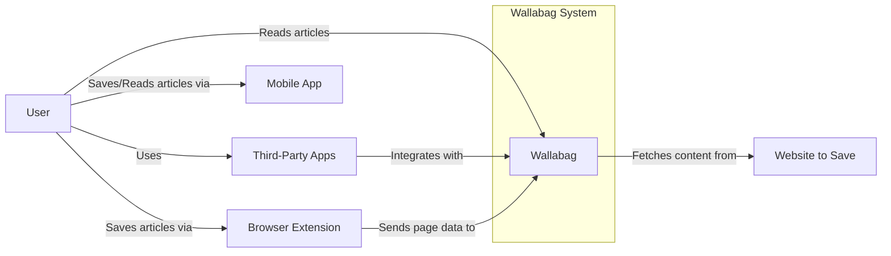
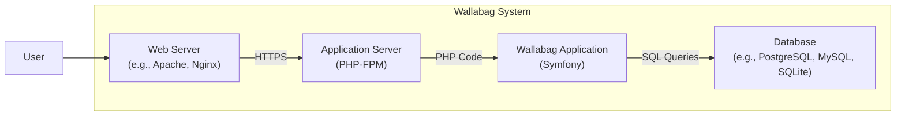
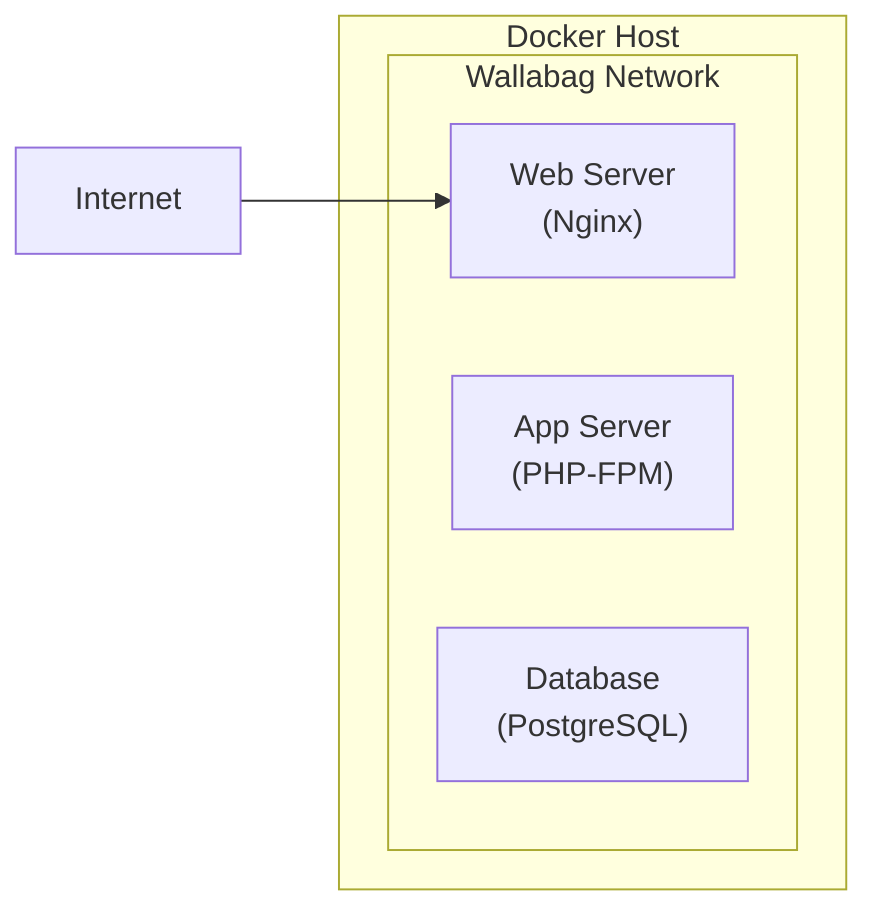
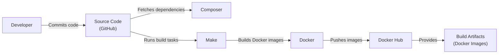

Okay, let's create a design document for Wallabag, based on the provided GitHub repository.

# BUSINESS POSTURE

Wallabag is a self-hostable read-it-later application. It allows users to save web pages for later reading, similar to services like Pocket or Instapaper. The core business priorities appear to be:

*   Data Privacy: Providing users with full control over their data by allowing self-hosting. This contrasts with centralized services where user data is stored on third-party servers.
*   Open Source and Community Driven: The project is open source, fostering transparency and community contributions.
*   Accessibility and Usability: Offering a clean and user-friendly interface for saving and reading articles.
*   Extensibility: Supporting various integrations and import/export options.
*   Cost-Effectiveness: Offering a free alternative to paid read-it-later services.

Business Goals:

*   Provide a stable and reliable self-hosted application.
*   Maintain user data privacy and security.
*   Grow the user base and community.
*   Ensure long-term project sustainability.

Most Important Business Risks:

*   Data breaches or loss due to vulnerabilities in the application or misconfiguration by users.
*   Reputational damage due to security incidents.
*   Lack of user adoption due to complexity or poor user experience.
*   Project abandonment due to lack of maintainer resources.
*   Legal issues related to copyright or data privacy regulations.

# SECURITY POSTURE

Existing Security Controls:

*   security control: Authentication: Wallabag implements user authentication to protect user accounts and data. (Implemented in the application code, likely using Symfony's security component).
*   security control: Authorization: Access control mechanisms restrict users to their own data. (Implemented in the application code, likely using Symfony's security component).
*   security control: Input Validation: The application likely performs input validation to prevent common web vulnerabilities like XSS and SQL injection. (Implemented in the application code, using Symfony's form validation and potentially other libraries).
*   security control: CSRF Protection: Symfony's built-in CSRF protection is likely used to prevent Cross-Site Request Forgery attacks. (Enabled by default in Symfony).
*   security control: HTTPS Support: Wallabag can be configured to use HTTPS, encrypting communication between the user and the server. (Configuration-dependent, relies on the user setting up a reverse proxy with SSL/TLS termination).
*   security control: Regular Updates: The project receives regular updates, including security patches. (Visible in the GitHub repository).
*   security control: Dependency Management: Composer is used to manage dependencies, allowing for updates to address vulnerabilities in third-party libraries. (Visible in the `composer.json` file).
*   security control: Content Security Policy (CSP): Wallabag can be configured with a CSP to mitigate XSS attacks. (Mentioned in documentation, implementation details vary).

Accepted Risks:

*   accepted risk: Self-Hosting Responsibility: Users are responsible for securing their own server infrastructure, including operating system updates, firewall configuration, and database security.
*   accepted risk: Limited Security Audits: While the code is open source, there may not have been extensive formal security audits.
*   accepted risk: Third-Party Library Vulnerabilities: Despite dependency management, there's always a risk of vulnerabilities in third-party libraries.

Recommended Security Controls:

*   security control: Two-Factor Authentication (2FA): Implement 2FA to enhance account security.
*   security control: Rate Limiting: Implement rate limiting to mitigate brute-force attacks and denial-of-service attacks.
*   security control: Security Headers: Enforce security headers like HSTS, X-Frame-Options, and X-Content-Type-Options.
*   security control: Regular Security Audits: Conduct regular penetration testing and code reviews.
*   security control: Database Encryption: Offer an option to encrypt the database at rest.

Security Requirements:

*   Authentication:
    *   Strong password policies.
    *   Protection against brute-force attacks.
    *   Secure password reset mechanisms.
    *   Optional 2FA.
*   Authorization:
    *   Role-based access control (if applicable).
    *   Strict separation of user data.
*   Input Validation:
    *   Whitelist-based validation where possible.
    *   Sanitization of all user inputs.
    *   Protection against XSS, SQL injection, and other common web vulnerabilities.
*   Cryptography:
    *   Use of strong, industry-standard cryptographic algorithms.
    *   Secure storage of sensitive data (e.g., API keys, passwords).
    *   HTTPS enforcement.

# DESIGN

## C4 CONTEXT

Element Descriptions:

*   Element:
    *   Name: User
    *   Type: Person
    *   Description: A person who wants to save and read web articles later.
    *   Responsibilities: Saves articles, reads articles, manages their Wallabag account.
    *   Security controls: Strong passwords, potentially 2FA.

*   Element:
    *   Name: Wallabag
    *   Type: Software System
    *   Description: The core Wallabag application.
    *   Responsibilities: Stores articles, provides a web interface, handles user authentication, manages API access.
    *   Security controls: Authentication, authorization, input validation, CSRF protection, HTTPS support, regular updates.

*   Element:
    *   Name: Browser Extension
    *   Type: Software System
    *   Description: A browser extension that allows users to easily save articles to Wallabag.
    *   Responsibilities: Sends page data to the Wallabag instance.
    *   Security controls: Secure communication with the Wallabag API (HTTPS).

*   Element:
    *   Name: Mobile App
    *   Type: Software System
    *   Description: A mobile application (iOS, Android) for saving and reading articles.
    *   Responsibilities: Saves articles, reads articles, synchronizes with the Wallabag instance.
    *   Security controls: Secure communication with the Wallabag API (HTTPS), secure storage of API keys.

*   Element:
    *   Name: Third-Party Apps
    *   Type: Software System
    *   Description: Applications that integrate with Wallabag via its API.
    *   Responsibilities: Varies depending on the application.
    *   Security controls: Secure communication with the Wallabag API (HTTPS), secure storage of API keys.

*   Element:
    *   Name: Website to Save
    *   Type: Software System
    *   Description: Any website from which a user wants to save an article.
    *   Responsibilities: Provides content to be saved.
    *   Security controls: N/A (Wallabag's responsibility is to handle content from potentially untrusted sources safely).

## C4 CONTAINER

Element Descriptions:

*   Element:
    *   Name: Web Server
    *   Type: Web Server
    *   Description: Handles incoming HTTP requests and serves static assets.
    *   Responsibilities: Receives requests from users, forwards requests to the application server, serves static files (CSS, JavaScript, images).
    *   Security controls: HTTPS configuration, security headers, potentially a web application firewall (WAF).

*   Element:
    *   Name: Application Server
    *   Type: Application Server
    *   Description: Executes the Wallabag application code.
    *   Responsibilities: Processes requests from the web server, interacts with the database, generates responses.
    *   Security controls: Secure configuration, limited file system access.

*   Element:
    *   Name: Database
    *   Type: Database
    *   Description: Stores Wallabag's data (users, articles, tags, etc.).
    *   Responsibilities: Stores and retrieves data.
    *   Security controls: Access control, encryption at rest (recommended), regular backups.

*   Element:
    *   Name: Wallabag Application
    *   Type: Web Application
    *   Description: The core Wallabag application logic, built with Symfony.
    *   Responsibilities: Handles user authentication, manages articles, provides API endpoints.
    *   Security controls: Authentication, authorization, input validation, CSRF protection, output encoding.

## DEPLOYMENT

Possible Deployment Solutions:

1.  Traditional LAMP/LEMP stack on a VPS or dedicated server.
2.  Docker-based deployment using Docker Compose.
3.  Cloud-based deployment using services like AWS, Google Cloud, or Azure.
4.  Platform-as-a-Service (PaaS) deployment using services like Heroku or DigitalOcean App Platform.

Chosen Solution (for detailed description): Docker-based deployment using Docker Compose. This is a popular and well-supported option for Wallabag.

Element Descriptions:

*   Element:
    *   Name: Docker Host
    *   Type: Server
    *   Description: The physical or virtual machine that runs the Docker engine.
    *   Responsibilities: Hosts the Docker containers.
    *   Security controls: Operating system hardening, firewall configuration, regular security updates.

*   Element:
    *   Name: Wallabag Network
    *   Type: Network
    *   Description: A private Docker network that isolates the Wallabag containers.
    *   Responsibilities: Facilitates communication between the containers.
    *   Security controls: Network isolation.

*   Element:
    *   Name: Web Server (Nginx)
    *   Type: Docker Container
    *   Description: An Nginx container that acts as a reverse proxy and serves static assets.
    *   Responsibilities: Receives requests from the internet, forwards requests to the application server, serves static files.
    *   Security controls: HTTPS configuration, security headers, limited file system access.

*   Element:
    *   Name: App Server (PHP-FPM)
    *   Type: Docker Container
    *   Description: A PHP-FPM container that executes the Wallabag application code.
    *   Responsibilities: Processes requests from the web server, interacts with the database.
    *   Security controls: Secure configuration, limited file system access.

*   Element:
    *   Name: Database (PostgreSQL)
    *   Type: Docker Container
    *   Description: A PostgreSQL container that stores Wallabag's data.
    *   Responsibilities: Stores and retrieves data.
    *   Security controls: Access control, strong passwords, data volume mounted for persistence, regular backups.

*  Element:
    *   Name: Internet
    *   Type: Network
    *   Description: External network.
    *   Responsibilities: Provides access to application.
    *   Security controls: N/A.

## BUILD

Wallabag uses a combination of tools for building and packaging the application:

1.  Composer: For managing PHP dependencies.
2.  Make: For automating build tasks.
3.  Docker: For creating containerized releases.

Build Process:

Security Controls in Build Process:

*   security control: Dependency Management: Composer ensures that dependencies are tracked and can be updated to address vulnerabilities.
*   security control: Build Automation: Make automates the build process, reducing the risk of manual errors.
*   security control: Containerization: Docker provides a consistent and isolated environment for the application, reducing the risk of environment-specific issues.
*   security control: (Recommended) SAST: Integrate a Static Application Security Testing (SAST) tool into the build process to scan for vulnerabilities in the code.
*   security control: (Recommended) SCA: Integrate a Software Composition Analysis (SCA) tool to identify vulnerabilities in third-party libraries.
*   security control: (Recommended) Image Signing: Sign Docker images to ensure their integrity.

# RISK ASSESSMENT

Critical Business Processes:

*   Saving web pages: Users must be able to reliably save articles to Wallabag.
*   Reading web pages: Users must be able to access and read their saved articles.
*   Data synchronization: Data must be synchronized correctly between different devices and clients.
*   User account management: Users must be able to manage their accounts securely.

Data to Protect:

*   Saved articles (content and metadata): Sensitivity varies depending on the content saved by the user. Could range from public information to highly sensitive personal data.
*   User account information (username, password hash, email address): Sensitive personal data.
*   API keys (if used): Highly sensitive, as they grant access to the user's data.
*   Configuration files: May contain sensitive information like database credentials.

# QUESTIONS & ASSUMPTIONS

Questions:

*   Are there any specific compliance requirements (e.g., GDPR, CCPA) that need to be considered?
*   What is the expected user base size and growth rate? This can impact scalability requirements.
*   What is the tolerance for downtime? This will influence the deployment architecture and redundancy requirements.
*   Are there any plans for features that might introduce new security risks (e.g., user collaboration, public sharing of articles)?
*   What level of support is provided to users for security-related issues?

Assumptions:

*   BUSINESS POSTURE: The primary goal is to provide a secure and private self-hosted read-it-later solution.
*   SECURITY POSTURE: Users are responsible for securing their own server infrastructure. The project aims to provide secure application code, but cannot guarantee the security of the user's environment.
*   DESIGN: The Docker-based deployment model is a suitable and common choice for Wallabag. The application architecture follows standard web application patterns.