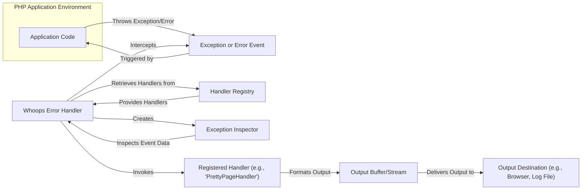

# Project Design Document: Whoops - PHP Error Handler

**Version:** 1.1
**Date:** October 26, 2023
**Author:** AI Software Architect

## 1. Introduction

This document provides an enhanced and detailed design overview of the Whoops PHP error handler library (https://github.com/filp/whoops). This document aims to clearly articulate the system's architecture, components, and data flow, serving as a robust foundation for subsequent threat modeling activities.

Whoops is a standalone PHP library designed to replace PHP's default error reporting with a more user-friendly and informative experience. Primarily intended for development environments, it significantly aids in debugging and understanding errors by providing rich diagnostic information.

## 2. Goals and Objectives

The primary goals and objectives of Whoops are:

*   To present error and exception information in a visually appealing and easily understandable format.
*   To provide comprehensive diagnostic details, including:
    *   Full stack traces with clickable file paths.
    *   Arguments passed to each function in the call stack.
    *   The state of local variables at each frame in the stack.
    *   Relevant environment information (e.g., request headers, GET/POST parameters, cookies).
*   To offer a flexible architecture through the use of handlers, allowing customization of how errors are processed and displayed.
*   To support various output formats, catering to different needs (e.g., HTML for browser display, JSON for API responses, plain text for logging).
*   To ensure seamless integration into existing PHP projects with minimal configuration.

## 3. System Architecture

Whoops functions as an interceptor and processor for errors and exceptions within a PHP application. Upon the occurrence of an uncaught exception or a triggered error, Whoops takes control, analyzes the event, and utilizes registered handlers to generate informative output.

**Key Architectural Components:**

*   **Application Code:** The PHP codebase being executed, which may generate errors or exceptions during its operation.
*   **Exception or Error Event:** The actual occurrence of an uncaught exception or a triggered error within the application's execution flow.
*   **Whoops Error Handler:** The central component of the library. It registers itself with PHP to intercept exceptions and errors.
*   **Handler Registry:**  Manages a collection of registered `Handler` instances. This allows for a modular approach to error processing and output generation.
*   **Exception Inspector:** A dedicated component responsible for examining the details of the caught exception or error. It extracts crucial information for subsequent processing.
*   **Registered Handler (e.g., 'PrettyPageHandler'):** Specific classes that implement the logic for processing the error information and generating output in a particular format. Multiple handlers can be registered to handle errors in different ways.
*   **Output Buffer/Stream:** A temporary storage or stream where the formatted output from the handlers is collected before being sent to the final destination.
*   **Output Destination (e.g., Browser, Log File):** The final location where the error information is displayed or stored. This depends on the active handler(s).

## 4. Component Design Details

### 4.1. Whoops Core (`Run` class)

*   **Responsibilities:**
    *   Registers itself as the primary exception handler using `set_exception_handler()`.
    *   Registers itself as the primary error handler using `set_error_handler()`, converting PHP errors into exceptions for consistent handling.
    *   Receives triggered exception and error events from the PHP engine.
    *   Instantiates an `Exception Inspector` to analyze the caught event.
    *   Maintains and manages the `Handler Registry`.
    *   Iterates through the registered handlers in the order they were added.
    *   Invokes each handler, passing the `Exception Inspector` instance.
    *   Provides methods for adding, registering, and managing handlers within the `Handler Registry`.
    *   Offers configuration options, such as enabling/disabling Whoops and controlling error reporting levels.
    *   Handles the final output, potentially sending headers and the formatted error information to the output buffer.

### 4.2. Exception Inspector (`Inspector` class)

*   **Responsibilities:**
    *   Receives the exception or error object as input.
    *   Extracts comprehensive diagnostic information:
        *   The error or exception message.
        *   The error or exception code (if applicable).
        *   The filename where the error originated.
        *   The line number where the error occurred.
        *   A detailed stack trace, including function/method names, file paths, and line numbers for each call in the stack.
        *   Arguments passed to each function in the stack trace.
        *   The context of the error, including local variables present in each stack frame.
        *   Potentially, relevant environment information like request parameters, headers, and server variables.
    *   Provides methods to access and retrieve this extracted information in a structured manner.

### 4.3. Handler Interface and Implementations

*   **Responsibilities (Interface):**
    *   Defines a standard interface (`HandlerInterface`) that all handlers must implement. This ensures a consistent way for Whoops to interact with different handlers.
    *   Typically includes a `handle(Inspector $inspector)` method, which is the entry point for processing error information.
*   **Responsibilities (Implementations - Examples):**
    *   **`PrettyPageHandler`:**
        *   Generates an interactive HTML page displaying the error details, stack trace, code snippets, and other diagnostic information in a user-friendly format.
        *   Often includes features like syntax highlighting for code snippets and the ability to open files in an editor.
    *   **`JsonResponseHandler`:**
        *   Formats the error information as a JSON object. This is useful for API endpoints where a structured error response is required.
        *   Allows customization of the JSON structure.
    *   **`PlainTextHandler`:**
        *   Outputs the error information as plain text. Suitable for logging errors to a file or displaying them in a simple text-based interface.
    *   **`CallbackHandler`:**
        *   Allows developers to define a custom PHP callable (function or method) to handle the error. This provides maximum flexibility for custom error processing.
    *   **`SystemFacadeHandler`:**
        *   A utility handler that provides access to system-level information and functionalities within the handler context.

### 4.4. Handler Registry

*   **Responsibilities:**
    *   Stores a collection of registered `Handler` instances.
    *   Maintains the order in which handlers were registered, as this order determines the sequence of execution.
    *   Provides methods for adding new handlers to the registry.
    *   Allows for clearing or resetting the handler collection.

## 5. Data Flow in Detail

The sequence of events and data flow when an error or exception occurs and is handled by Whoops is as follows:

1. **Error or Exception is Thrown/Triggered:** The PHP application encounters an error condition or explicitly throws an exception.
2. **Whoops Intercepts the Event:** Because Whoops has registered itself as the error and exception handler, it intercepts the event before PHP's default handling takes place.
3. **Exception Inspector is Created:** The `Whoops Core` creates an instance of the `Exception Inspector`, passing the caught exception or error object to it.
4. **Diagnostic Information is Extracted:** The `Exception Inspector` meticulously extracts detailed information about the error, including the message, file, line number, a comprehensive stack trace with arguments and context, and potentially environment details.
5. **Handlers are Retrieved:** The `Whoops Core` retrieves the registered handlers from the `Handler Registry` in the order they were added.
6. **Handlers are Invoked Sequentially:** The `Whoops Core` iterates through the retrieved handlers and invokes the `handle()` method of each handler, passing the `Exception Inspector` instance as an argument.
7. **Handlers Process and Format Output:** Each handler receives the `Inspector` instance and processes the error information according to its specific logic. For example:
    *   `PrettyPageHandler` formats the information into an interactive HTML page.
    *   `JsonResponseHandler` serializes the information into a JSON structure.
    *   `PlainTextHandler` formats the information as plain text.
8. **Output is Buffered or Streamed:** The output generated by the handlers is typically buffered or streamed.
9. **Output is Delivered:** The `Whoops Core` (or a specific handler) sends the generated output to the designated destination. For `PrettyPageHandler`, this is usually the web browser. For other handlers, it might be a log file or an API response.
10. **Handler Stopping (Optional):** Some handlers might implement logic to stop the propagation of error handling, preventing subsequent handlers from being invoked. This can be useful for scenarios where a specific handler has completely addressed the error.

## 6. Security Considerations (Expanded)

While Whoops is primarily a development-time tool, understanding its potential security implications is crucial, even if it's not intended for production use.

*   **Excessive Information Disclosure in Development/Staging:** Even in non-production environments, exposing highly detailed error information (including environment variables, full file paths, and potentially sensitive data in local variables) could be leveraged by attackers who gain unauthorized access to these environments.
    *   **Mitigation:** Restrict access to development and staging environments. Consider configuring Whoops to redact or mask sensitive data even in these environments.
*   **Cross-Site Scripting (XSS) Vulnerabilities:** If error messages or data within the stack trace contain user-supplied input that is not properly sanitized before being displayed by a handler like `PrettyPageHandler`, it can lead to XSS attacks.
    *   **Mitigation:** Ensure that any user-provided data that might end up in error messages is properly sanitized or escaped before being displayed. While Whoops itself might not directly sanitize, the application logic should handle this. Be cautious with custom handlers that directly output data.
*   **Path Disclosure:** The display of full file paths in stack traces can reveal the server's internal directory structure to potential attackers, aiding in reconnaissance.
    *   **Mitigation:** While Whoops is designed to show this information for debugging, be aware of this risk. Consider if there are scenarios where this information could be unintentionally exposed.
*   **Denial of Service (DoS) Potential:** While less likely to be a direct vulnerability in Whoops itself, if an attacker can trigger numerous errors that result in resource-intensive processing by Whoops' handlers (e.g., generating very large HTML error pages), it could contribute to a DoS attack.
    *   **Mitigation:** Implement proper input validation and error handling in the application to prevent easily triggerable error conditions.
*   **Risks in Custom Handlers:**  Custom handlers have the potential to introduce security vulnerabilities if not implemented carefully. For example, a poorly written custom handler could be susceptible to code injection or other attacks if it processes untrusted input.
    *   **Mitigation:** Thoroughly review and test any custom handlers for potential security flaws. Follow secure coding practices when developing custom handlers.
*   **Accidental Exposure in Production:** The most significant risk is accidentally enabling Whoops in a production environment. This would expose detailed error information to end-users and potential attackers.
    *   **Mitigation:** Implement robust environment-based configuration management to ensure Whoops is strictly disabled in production. Use environment variables or configuration files that are specific to each environment.

## 7. Deployment Considerations

*   **Installation:** Typically installed as a dependency using Composer: `composer require filp/whoops`.
*   **Basic Integration:** Requires instantiating the `Run` class and registering it as the exception and error handler in the application's bootstrap or entry point.
*   **Handler Registration:**  Handlers are added to the `Run` instance using methods like `pushHandler()`. The order of registration matters.
*   **Configuration:** Configuration options include:
    *   Adding and registering different handlers based on the environment.
    *   Setting the output format (implicitly determined by the active handlers).
    *   Enabling or disabling Whoops based on the environment (crucial for production).
    *   Customizing the behavior of individual handlers.
*   **Environment-Specific Setup:** It is essential to have distinct configurations for development, staging, and production environments. Whoops should be enabled with `PrettyPageHandler` (or similar) in development and strictly disabled in production. Logging errors to a file using a handler like `PlainTextHandler` might be appropriate for production.

## 8. Future Considerations

*   **Enhanced Security Features:** Exploring built-in mechanisms for automatic sanitization of output within core handlers to mitigate XSS risks.
*   **More Granular Control over Information Display:** Providing finer-grained options to selectively hide or redact specific parts of the error information (e.g., environment variables) based on configuration.
*   **Improved Integration with Logging Frameworks:** Offering more seamless integration with popular PHP logging libraries (e.g., Monolog) for production error handling.
*   **Advanced Customization Options for Error Pages:** Providing more theming and customization options for the `PrettyPageHandler`.
*   **Standardized Error Reporting Formats:**  Potentially supporting standardized error reporting formats for easier integration with error tracking and monitoring tools.

This improved document provides a more detailed and comprehensive design overview of the Whoops PHP error handler. This enhanced information will be invaluable for conducting a thorough and effective threat model to identify and mitigate potential security risks associated with its use, particularly emphasizing the critical importance of disabling it in production environments.
