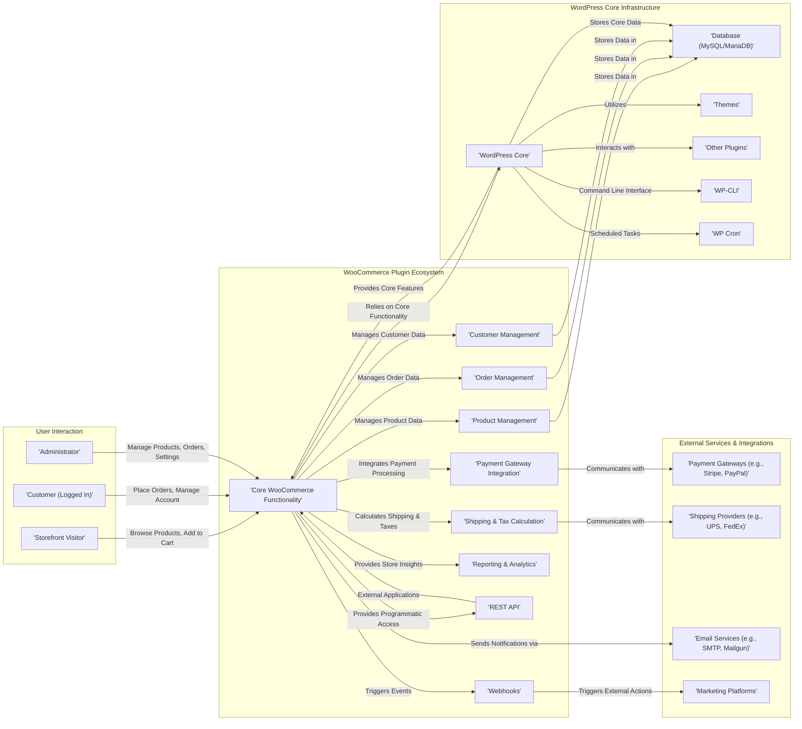
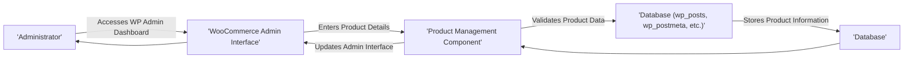
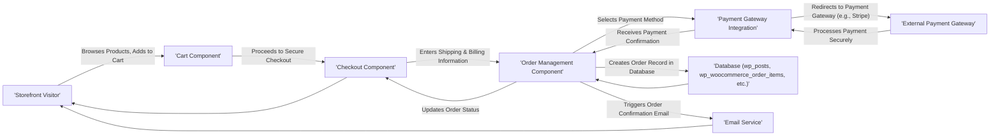
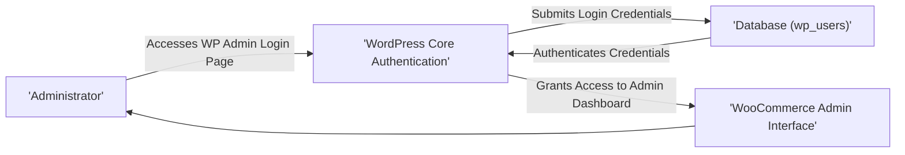

# Project Design Document: WooCommerce

**Version:** 1.1
**Date:** October 26, 2023
**Author:** AI Software Architect

## 1. Introduction

This document provides a refined architectural overview of the WooCommerce project, an open-source e-commerce platform built as a plugin for WordPress. It is designed to be a foundational resource for subsequent threat modeling activities, clearly outlining key components, data flows, and interactions within the WooCommerce ecosystem. This revision aims for enhanced clarity and detail to facilitate a more effective threat analysis.

## 2. Goals and Objectives

The core goal of WooCommerce is to empower users to build and manage online stores with flexibility and extensibility. Key objectives include:

*   **Product Catalog Management:**  Allowing users to create, categorize, and manage product listings with variations and attributes.
*   **Order and Payment Processing:**  Facilitating the complete order lifecycle, including secure payment processing through various gateways.
*   **Customer Relationship Management:**  Managing customer accounts, order history, and interactions.
*   **Shipping and Tax Handling:** Providing tools for configuring shipping methods, zones, rates, and automated tax calculations.
*   **Reporting and Analytics:** Offering insights into sales performance, customer behavior, and key business metrics.
*   **Extensibility:** Enabling customization and feature expansion through themes, plugins, and APIs.

## 3. High-Level Architecture

WooCommerce functions as a tightly integrated plugin within the WordPress environment, leveraging WordPress's core functionalities for user management, content management, and the plugin/theme ecosystem.

## 4. Detailed Component Description

This section provides a more granular description of the key components within the WooCommerce ecosystem:

*   **'Core WooCommerce Functionality':**  The central component encompassing the fundamental logic, classes, functions, and hooks that power the platform. This includes core data models, business logic, and the overall framework.
*   **'Product Management':**  Handles the creation, modification, categorization, and management of product listings. This includes handling product types (simple, variable, grouped, external/affiliate), attributes, variations, inventory levels, and product images.
*   **'Order Management':**  Manages the complete lifecycle of orders, from initial placement to fulfillment and archiving. This includes order status tracking, payment processing integration, refund management, and order notes.
*   **'Customer Management':**  Deals with customer accounts, profiles, addresses, order history, and user roles specific to the store (e.g., customer, guest).
*   **'Payment Gateway Integration':**  Provides an abstraction layer and interfaces for integrating with various third-party payment processors to securely handle online transactions. This includes handling payment requests, responses, and webhooks.
*   **'Shipping & Tax Calculation':**  Manages the configuration of shipping methods, shipping zones, and associated rates. It also handles automated tax calculations based on customer location, product type, and configured tax rules.
*   **'Reporting & Analytics':**  Offers tools and dashboards to visualize and analyze store performance, sales trends, customer behavior, and inventory levels.
*   **'REST API':**  Provides a programmatic interface (using REST principles) for external applications and services to interact with WooCommerce data and functionality. This enables headless commerce and other integrations.
*   **'Webhooks':**  Allows WooCommerce to send real-time notifications to external applications when specific events occur within the system (e.g., new order, order status change).
*   **'WordPress Core':** The underlying content management system providing essential functionalities like user management, content storage, plugin and theme management, and the overall framework for WooCommerce.
*   **'Database (MySQL/MariaDB)':**  The persistent storage layer for all WooCommerce and WordPress data, including product information, order details, customer data, and settings. Key tables include `wp_posts`, `wp_postmeta`, `wp_users`, `wp_woocommerce_orders`, `wp_woocommerce_order_items`, etc.
*   **'Themes':** Control the visual presentation and user interface of the storefront. WooCommerce-specific themes often provide enhanced e-commerce features and integrations.
*   **'Other Plugins':**  Extend WooCommerce functionality with a wide range of additional features, integrations, and customizations, such as marketing tools, shipping integrations, and advanced product options.
*   **'WP-CLI':**  A command-line interface for managing WordPress and WooCommerce installations, enabling tasks like plugin updates, data imports, and database management.
*   **'WP Cron':**  The WordPress built-in system for scheduling tasks, which WooCommerce uses for various background processes like sending emails and updating order statuses.
*   **'Payment Gateways (e.g., Stripe, PayPal)':** External services responsible for securely processing online payments.
*   **'Shipping Providers (e.g., UPS, FedEx)':** External services that provide real-time shipping rate calculations and label generation.
*   **'Email Services (e.g., SMTP, Mailgun)':** Services used for sending transactional emails, such as order confirmations, shipping updates, and password resets.
*   **'Marketing Platforms':** External services integrated with WooCommerce for marketing automation, email campaigns, and customer segmentation.

## 5. Data Flow Diagrams

This section illustrates the flow of data for critical operations within WooCommerce, providing a clearer understanding for threat analysis.

### 5.1. Product Creation Workflow

### 5.2. Customer Order Placement Workflow

### 5.3. Administrator Login Process

## 6. Security Considerations

This section details crucial security considerations relevant to the WooCommerce platform, essential for identifying potential threats.

*   **Authentication and Authorization Mechanisms:**
    *   Secure storage and handling of administrator and customer passwords (using hashing and salting).
    *   Robust role-based access control to restrict access to sensitive administrative functions.
    *   Implementation of measures to prevent brute-force attacks on login forms (e.g., rate limiting, CAPTCHA).
*   **Input Validation and Data Sanitization:**
    *   Thorough validation of all user inputs on both the storefront and the administrative interface to prevent injection vulnerabilities (e.g., SQL injection, cross-site scripting - XSS).
    *   Proper sanitization of user-provided data before storing it in the database to mitigate XSS risks.
*   **Data Protection Measures:**
    *   Secure storage of sensitive customer data, including addresses and potentially payment information (though often handled by payment gateways).
    *   Mandatory use of HTTPS to encrypt data in transit, protecting against eavesdropping.
    *   Compliance with relevant data privacy regulations (e.g., GDPR, CCPA) regarding data storage and handling.
*   **Payment Processing Security:**
    *   Strict adherence to PCI DSS standards when handling credit card information (often delegated to PCI-compliant payment gateways).
    *   Secure integration practices with payment gateways to prevent man-in-the-middle attacks and data breaches.
    *   Implementation of fraud prevention measures to detect and mitigate fraudulent transactions.
*   **Third-Party Extension Security:**
    *   Potential security risks associated with using themes and plugins developed by third parties.
    *   Importance of regular vulnerability scanning and management for installed extensions.
    *   Need for secure communication protocols when interacting with external services and APIs.
*   **Vulnerability Management Practices:**
    *   Regular security audits and penetration testing to identify potential weaknesses.
    *   Prompt patching of identified vulnerabilities in WooCommerce core, WordPress core, and all installed extensions.
    *   Staying informed about the latest security best practices and threats.
*   **Session Management Security:**
    *   Secure handling of user sessions to prevent session hijacking and fixation attacks.
    *   Implementation of appropriate session timeouts to limit the window of opportunity for attackers.
*   **Error Handling and Logging Practices:**
    *   Secure error handling to avoid revealing sensitive information in error messages.
    *   Comprehensive logging of security-related events for auditing and incident response purposes.
*   **Cross-Site Request Forgery (CSRF) Protection:**
    *   Implementation of CSRF tokens to prevent unauthorized actions performed on behalf of authenticated users.
*   **Security Headers:**
    *   Proper configuration of security headers (e.g., Content Security Policy, HTTP Strict Transport Security) to enhance security.

## 7. Deployment Considerations

WooCommerce is typically deployed on web servers running PHP and a MySQL/MariaDB database. Common deployment environments include:

*   **Shared Hosting Environments:** A cost-effective option where multiple websites share server resources. Security in this environment heavily relies on the hosting provider.
*   **Virtual Private Servers (VPS):** Offers more control and dedicated resources compared to shared hosting, allowing for more granular security configurations.
*   **Cloud Hosting Platforms (e.g., AWS, Google Cloud, Azure):** Provides scalability, flexibility, and a wide range of security services.
*   **Managed WordPress Hosting Solutions:** Hosting providers specifically optimized for WordPress and WooCommerce, often including built-in security features and optimizations.

Key security considerations during deployment include:

*   Secure server hardening and configuration.
*   Regular security updates for the operating system, web server software (e.g., Apache, Nginx), and PHP.
*   Proper firewall configuration to restrict unauthorized access.
*   Database security measures, including strong passwords and restricted access.
*   Secure file permissions to prevent unauthorized modification of files.

## 8. Future Considerations

Potential future developments and considerations for WooCommerce include:

*   Further enhancements to the REST API for more complex integrations.
*   Improvements in scalability and performance to handle larger product catalogs and higher traffic volumes.
*   Integration of more advanced security features and proactive threat detection mechanisms.
*   Deeper integration with emerging technologies like GraphQL and serverless architectures.

This revised document provides a more detailed and refined architectural overview of the WooCommerce platform, specifically tailored for effective threat modeling. The enhanced descriptions of components, data flows, and security considerations aim to facilitate a more thorough and accurate identification of potential vulnerabilities and the development of appropriate mitigation strategies.
