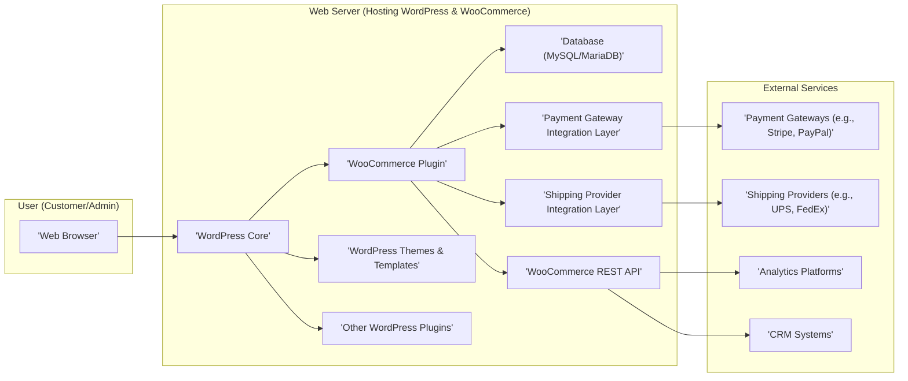
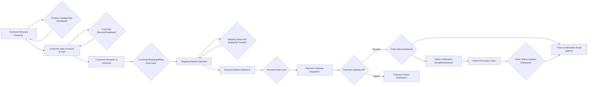

# Project Design Document: WooCommerce

**Version:** 1.1
**Date:** October 26, 2023
**Prepared By:** AI Software Architect

## 1. Introduction

This document outlines the detailed design of WooCommerce, an open-source e-commerce platform implemented as a plugin for WordPress. This document provides a comprehensive understanding of the system's architecture, component functionalities, data flow, and key interactions. It serves as the foundational document for subsequent threat modeling and security analysis.

## 2. Goals and Objectives

The primary goal of WooCommerce is to empower users to create and manage robust online stores within the WordPress environment. Key objectives include:

*   Facilitating the sale of various product types, including physical goods, digital downloads, and subscriptions.
*   Providing comprehensive tools for managing product catalogs, inventory levels, and product variations.
*   Enabling seamless order processing, from cart management to fulfillment.
*   Integrating with a wide array of payment gateways for secure transaction processing.
*   Supporting diverse shipping options and integrations with shipping providers.
*   Offering a highly customizable storefront experience through the use of WordPress themes and templates.
*   Providing an extensible architecture through WordPress's plugin system and dedicated WooCommerce APIs.

## 3. High-Level Architecture

WooCommerce functions as a plugin deeply integrated within the WordPress ecosystem. It leverages core WordPress functionalities for user management, content management, and database operations. The following diagram illustrates the high-level architecture and key interactions:

**Components:**

*   **Web Browser:** The user interface employed by customers to browse the storefront and by administrators to manage the store backend.
*   **Web Server (Hosting WordPress & WooCommerce):** The server environment responsible for executing WordPress and the WooCommerce plugin. This encompasses:
    *   **WordPress Core:** The foundational content management system providing core functionalities.
    *   **WooCommerce Plugin:** The core e-commerce logic, data models, and business rules.
    *   **Database (MySQL/MariaDB):** The persistent storage for all WordPress and WooCommerce data, including products, orders, customers, and configurations.
    *   **Payment Gateway Integration Layer:** An abstraction layer facilitating communication with various payment processors.
    *   **Shipping Provider Integration Layer:** An abstraction layer enabling integration with different shipping carriers for rate calculations and label generation.
    *   **WooCommerce REST API:** A programmatic interface for external applications to interact with WooCommerce data and functionalities.
    *   **WordPress Themes & Templates:** Controls the visual presentation and layout of the storefront.
    *   **Other WordPress Plugins:** Extensions that can augment or interact with WooCommerce's functionality.
*   **External Services:** Third-party services integrated with WooCommerce:
    *   **Payment Gateways (e.g., Stripe, PayPal):** Services that process online payments securely.
    *   **Shipping Providers (e.g., UPS, FedEx):** Services that handle the logistics of shipping orders.
    *   **Analytics Platforms:** Services used to track website traffic and user behavior.
    *   **CRM Systems:** Customer Relationship Management systems that can be integrated for customer data management.

## 4. Component Breakdown

This section provides a more detailed breakdown of the key components within the WooCommerce plugin:

*   **Product Management Module:**
    *   Functionality for creating, reading, updating, and deleting product listings.
    *   Support for diverse product types (simple, variable, grouped, external/affiliate, downloadable, virtual).
    *   Management of product attributes (e.g., color, size), categories, and tags for organization and filtering.
    *   Handling of product images, galleries, and featured images.
    *   Inventory management features, including stock quantity tracking and low-stock notifications.
    *   Management of product variations and associated pricing, stock, and images.
*   **Cart and Checkout Module:**
    *   Functionality for customers to add products to a shopping cart and manage its contents.
    *   A multi-step checkout process encompassing shipping address, billing address, shipping method selection, and payment method selection.
    *   Integration with the Payment Gateway Integration Layer for secure payment processing.
    *   Calculation of taxes based on configured tax rates and customer location.
    *   Integration with the Shipping Provider Integration Layer for real-time shipping cost calculations.
    *   Implementation of coupon code functionality for discounts and promotions.
    *   Guest checkout options and account creation during checkout.
*   **Order Management Module:**
    *   A dashboard for administrators to view, filter, and manage orders.
    *   Functionality for updating order statuses (e.g., pending payment, processing, completed, cancelled).
    *   Tools for generating invoices, packing slips, and shipping labels.
    *   Handling of order refunds and cancellations.
    *   Storage of detailed order history, including customer information, ordered items, and payment details.
    *   Communication tools for interacting with customers regarding their orders.
*   **Payment Gateway Integration Module:**
    *   Provides an abstract interface for integrating with various payment processors.
    *   Handles the secure redirection of customers to payment gateways for transaction processing.
    *   Manages the communication of transaction status back to WooCommerce.
    *   Supports various payment methods depending on the integrated gateways.
    *   May include features for saving payment methods for future use (subject to PCI compliance).
*   **Shipping Management Module:**
    *   Allows administrators to define shipping zones and associated shipping methods.
    *   Integration with shipping carriers' APIs for real-time rate calculations.
    *   Options for flat rate shipping, free shipping, and local pickup.
    *   Functionality for printing shipping labels through integrated services.
    *   Tracking information updates for orders.
*   **Customer Management Module:**
    *   Storage of customer profiles, including billing and shipping addresses, order history, and contact information.
    *   Functionality for customers to create and manage their accounts.
    *   Role-based access control for customer accounts.
    *   Tools for administrators to view and manage customer data.
*   **Reporting and Analytics Module:**
    *   Provides dashboards and reports on key store metrics, such as sales, orders, and customer behavior.
    *   Generates reports on product performance, stock levels, and tax calculations.
    *   Integration with analytics platforms for more in-depth data analysis.
*   **REST API Module:**
    *   Provides a programmatic interface for interacting with WooCommerce data (products, orders, customers, etc.).
    *   Supports standard RESTful operations (GET, POST, PUT, DELETE).
    *   Authentication and authorization mechanisms to control access to the API.
    *   Enables the development of custom integrations and mobile applications.
*   **Admin Interface Module:**
    *   Provides a user interface within the WordPress admin dashboard for managing all aspects of the WooCommerce store.
    *   Organized into logical sections for products, orders, customers, settings, and reports.
    *   Role-based access control to different administrative functionalities.
*   **Template System (within Themes):**
    *   Utilizes WordPress's template hierarchy for rendering the storefront.
    *   WooCommerce provides default templates that can be overridden by themes.
    *   Allows for extensive customization of the visual presentation and user experience.
    *   Template files handle the display of product listings, product details, cart, checkout, and account pages.
*   **Extensions (Plugin) Integration:**
    *   Leverages WordPress's plugin architecture for extending core WooCommerce functionality.
    *   Provides action hooks and filters that allow other plugins to interact with WooCommerce at various points in its execution.

## 5. Data Flow

The following outlines a more detailed data flow for a customer placing an order, highlighting key data interactions:

**Key Data Entities:**

*   **Products:** Detailed information about items for sale, including descriptions, pricing, images, and inventory levels.
*   **Customers:** Records of registered users, including personal details, contact information, and order history.
*   **Orders:** Comprehensive records of customer purchases, encompassing ordered items, shipping details, billing information, payment details, and order status.
*   **Cart:** Temporary storage of items a customer intends to purchase, often stored in session data or a temporary database table.
*   **Payment Information:** Sensitive data related to payment processing, ideally handled directly by payment gateways and not stored directly within WooCommerce.
*   **Shipping Information:** Customer-provided addresses and selected shipping methods for order delivery.
*   **Settings:** Configuration parameters for the WooCommerce store, including tax rates, shipping options, and payment gateway settings.

## 6. Key Interactions

This section elaborates on crucial interactions within the system:

*   **Customer Browsing Products:**
    *   The customer's web browser sends HTTP requests to the web server.
    *   WordPress and WooCommerce query the database to retrieve product information based on the requested page or category.
    *   WordPress themes and templates render the product listings and details using the retrieved data.
*   **Adding Product to Cart:**
    *   The customer interacts with the "Add to Cart" button, triggering an AJAX request or form submission.
    *   The WooCommerce plugin receives the request, validates the product ID and quantity.
    *   Cart data is updated in the user's session or a dedicated database table.
    *   The cart contents are updated and displayed to the customer, often via an AJAX response.
*   **Checkout Process:**
    *   The customer navigates to the checkout page.
    *   WooCommerce retrieves necessary data, such as cart contents and previously entered customer information.
    *   Forms for shipping and billing information are rendered using WordPress templates.
    *   Upon submission, data is validated on the server-side.
    *   Shipping methods and costs are calculated by interacting with the Shipping Provider Integration Layer.
    *   Available payment gateway options are presented based on store configuration.
*   **Payment Processing:**
    *   The customer selects a payment method and enters payment details.
    *   Payment information is securely transmitted to the chosen payment gateway via the Payment Gateway Integration Layer. This often involves a redirect or an embedded payment form (e.g., using iframes).
    *   The payment gateway authenticates and authorizes the transaction.
    *   The payment gateway sends a response (success or failure) back to WooCommerce.
*   **Order Creation:**
    *   Upon successful payment confirmation, the WooCommerce plugin creates a new order record in the database.
    *   Order details, customer information, payment details (transaction ID), and cart contents are stored.
    *   The order status is initially set (e.g., "Processing").
    *   Inventory levels for the purchased products are decremented.
*   **Admin Managing Products:**
    *   An administrator logs into the WordPress admin dashboard.
    *   Navigates to the WooCommerce product management section.
    *   Interacts with forms and UI elements to create, edit, or delete product information.
    *   Changes are validated and saved to the database.
*   **Plugin Interaction:**
    *   Other WordPress plugins can interact with WooCommerce by hooking into action hooks and filters provided by WooCommerce.
    *   Plugins can modify data before it is saved, add new functionalities to the checkout process, or integrate with external services upon specific events (e.g., order creation).
*   **API Interaction:**
    *   External applications can send HTTP requests to the WooCommerce REST API endpoints.
    *   Requests must be authenticated using API keys or other authentication methods.
    *   The API processes the request, interacts with the underlying WooCommerce data and logic, and returns a response in JSON or other formats.

## 7. Security Considerations

This section expands on the preliminary security considerations, categorizing them for clarity:

*   **Authentication and Authorization:**
    *   Secure authentication mechanisms for administrator access to the WordPress dashboard.
    *   Role-based access control within the WooCommerce admin interface.
    *   Secure password storage using hashing and salting.
    *   Consideration of two-factor authentication (2FA) for administrators.
    *   Authorization checks to ensure users can only access and modify data they are permitted to.
    *   Secure API key management and access control for the WooCommerce REST API.
*   **Data Validation and Input Sanitization:**
    *   Server-side validation of all user inputs to prevent injection attacks (SQL injection, cross-site scripting).
    *   Sanitization of user-generated content before display to prevent XSS vulnerabilities.
    *   Protection against Cross-Site Request Forgery (CSRF) attacks using nonces.
*   **Secure Payment Processing (PCI DSS Compliance):**
    *   Reliance on PCI DSS compliant payment gateways for handling sensitive payment information.
    *   Avoiding the storage of sensitive payment data (e.g., credit card numbers) within the WooCommerce database.
    *   Ensuring secure communication (HTTPS) throughout the checkout process.
    *   Proper handling of payment gateway callbacks and notifications.
*   **Protection of Sensitive Data:**
    *   Secure storage of customer data, including personal and address information.
    *   Encryption of sensitive data at rest and in transit where applicable.
    *   Adherence to data privacy regulations (e.g., GDPR, CCPA).
*   **Vulnerability Management:**
    *   Regularly updating WordPress core, WooCommerce, themes, and plugins to patch known vulnerabilities.
    *   Implementing a process for monitoring security advisories and applying updates promptly.
    *   Consideration of using security scanning tools to identify potential vulnerabilities.
*   **Access Control and Network Security:**
    *   Restricting access to the WordPress admin dashboard and database to authorized personnel.
    *   Implementing firewall rules and other network security measures.
    *   Secure server configuration and hardening.
*   **Session Management:**
    *   Using secure session cookies with appropriate flags (e.g., HttpOnly, Secure).
    *   Implementing session timeout mechanisms.
    *   Protection against session fixation attacks.
*   **API Security:**
    *   Implementing robust authentication and authorization mechanisms for the WooCommerce REST API (e.g., OAuth 2.0).
    *   Rate limiting to prevent abuse and denial-of-service attacks.
    *   Input validation and output encoding for API endpoints.

## 8. Deployment Model

WooCommerce deployments typically follow standard WordPress deployment patterns, with considerations for e-commerce specific needs:

*   **Shared Hosting:** Suitable for smaller stores with limited traffic, but may have resource constraints and shared security responsibilities.
*   **VPS (Virtual Private Server):** Offers more control and resources compared to shared hosting, suitable for growing stores. Requires more technical expertise for server management.
*   **Dedicated Server:** Provides maximum performance and control, suitable for high-traffic stores with specific security or compliance requirements. Requires significant server management expertise.
*   **Managed WordPress Hosting:** Hosting providers specifically optimized for WordPress, often including features like automatic updates, backups, and enhanced security. Can be a good option for WooCommerce stores.
*   **Cloud Hosting (AWS, Google Cloud, Azure):** Highly scalable and flexible, allowing for resource adjustments based on demand. Requires expertise in cloud infrastructure management.

**Deployment Considerations:**

*   **Database Performance:** Optimizing the MySQL/MariaDB database for read and write operations, especially for large product catalogs and high order volumes.
*   **Caching:** Implementing caching mechanisms (e.g., object caching, page caching) to improve performance and reduce server load.
*   **CDN (Content Delivery Network):** Utilizing a CDN to distribute static assets (images, CSS, JavaScript) globally, improving page load times for customers.
*   **SSL/TLS Certificates:** Essential for secure communication (HTTPS) and building customer trust.
*   **Regular Backups:** Implementing automated backup solutions for the database and website files.

## 9. Assumptions and Constraints

*   It is assumed that the underlying WordPress installation is secure and well-maintained.
*   The security of third-party plugins and themes used with WooCommerce is the responsibility of their respective developers, and users should exercise caution when installing them.
*   This document primarily focuses on the core WooCommerce plugin and its direct dependencies. Customizations and third-party extensions may introduce additional architectural elements and security considerations.
*   Specific configurations and customizations can significantly impact the architecture, performance, and security of individual WooCommerce installations.
*   The use of HTTPS for all communication involving sensitive data is a fundamental security requirement.
*   Regular security audits and penetration testing are recommended for production WooCommerce deployments.

This improved design document provides a more detailed and structured understanding of the WooCommerce platform, crucial for effective threat modeling and security analysis. The added granularity in component descriptions, data flow diagrams, and security considerations offers a more comprehensive view of the system's inner workings and potential vulnerabilities.