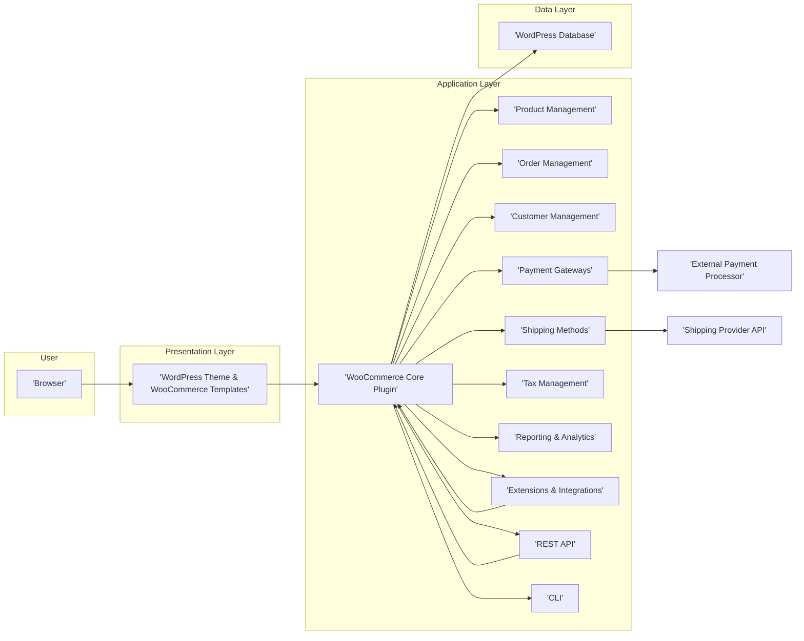
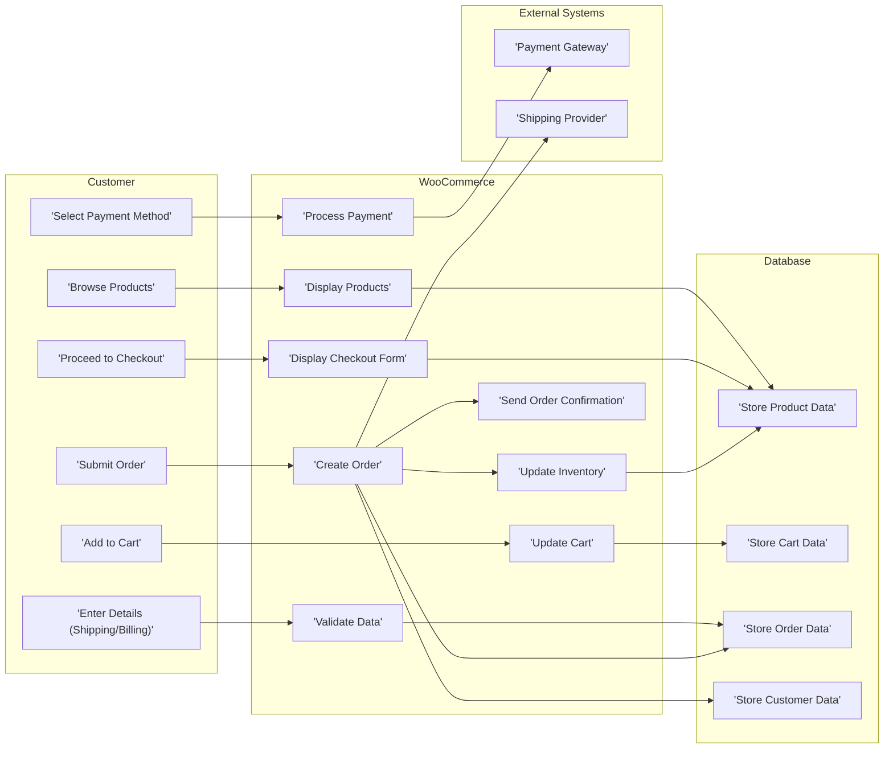

# Project Design Document: WooCommerce

**Version:** 1.1
**Date:** October 26, 2023
**Author:** AI Software Architect

## 1. Introduction

This document provides an enhanced design overview of the WooCommerce project, the widely adopted open-source e-commerce platform built as a plugin for WordPress. This revised document aims to offer a clearer and more detailed understanding of the system's architecture, core components, and data flows, specifically tailored for use in subsequent threat modeling exercises.

## 2. Goals and Objectives

The fundamental goals of WooCommerce are to:

*   Empower users to establish and effectively manage online storefronts.
*   Deliver a versatile and extensible platform suitable for selling both tangible and digital goods.
*   Offer a comprehensive suite of features encompassing product administration, order fulfillment, shipping logistics, and payment processing.
*   Achieve seamless integration within the WordPress content management system environment.
*   Foster a robust ecosystem of extensions and themes to enhance functionality and customization.

## 3. High-Level Architecture

WooCommerce functions as a WordPress plugin, augmenting the core WordPress capabilities with e-commerce functionalities. The architecture can be conceptually divided into the following distinct layers:

*   **Presentation Layer:** Primarily managed by WordPress themes and specialized WooCommerce templates. This layer is responsible for rendering the user interface elements, including product catalogs, shopping carts, checkout procedures, and user account management panels.
*   **Application Layer:** Encompasses the core logic of the WooCommerce plugin, managing business rules, data manipulation, and interactions with the underlying data storage. This layer includes modules dedicated to product lifecycle management, order processing, customer relationship management, payment gateway integrations, shipping method configurations, and reporting functionalities.
*   **Data Layer:** Consists of the WordPress database, which serves as the persistent storage mechanism for all WooCommerce-related data, including detailed product specifications, order records, customer profiles, and system configuration settings.

## 4. Detailed Architecture and Key Components

A more granular breakdown of the essential components within the WooCommerce architecture is provided below:

*   **WordPress Core:** Provides the foundational infrastructure, encompassing user management, content administration, and the plugin/theme ecosystem.
*   **WooCommerce Core Plugin:** The primary plugin file responsible for initializing WooCommerce and registering its fundamental functionalities within the WordPress environment.
*   **Product Management:**
    *   Facilitates the creation, modification, and organization of products (including simple, variable, grouped, and external/affiliate product types).
    *   Manages product attributes, categories, tags, and associated media (images, videos).
    *   Incorporates features for inventory tracking and stock level management.
*   **Order Management:**
    *   Oversees the complete order lifecycle, from initial placement to final completion.
    *   Monitors order status, payment confirmation, and shipping progress.
    *   Provides administrative tools for order adjustments, refunds, and cancellations.
*   **Customer Management:**
    *   Stores comprehensive customer details, including billing and delivery addresses.
    *   Maintains records of customer purchase history and relevant transaction data.
    *   Supports guest checkout options for users who prefer not to create accounts.
*   **Payment Gateways:**
    *   Offers an interface for integrating with diverse payment processing services (e.g., Stripe, PayPal, Square).
    *   Handles the secure processing of payments, including authorization and settlement.
    *   Supports secure storage of payment credentials (where applicable and in compliance with relevant regulations).
*   **Shipping Methods:**
    *   Enables the configuration of various shipping options and pricing structures (e.g., flat rate, free shipping, calculated rates based on weight or destination).
    *   Integrates with shipping carrier APIs to retrieve real-time shipping rates and generate shipping labels.
*   **Tax Management:**
    *   Manages the calculation and application of sales taxes based on geographical location and product classifications.
    *   Supports the configuration of complex tax rules and jurisdictions.
*   **Reporting and Analytics:**
    *   Provides insights into store performance through various reports, including sales summaries, customer behavior analysis, and inventory status updates.
*   **Extensions and Integrations:**
    *   WooCommerce's architecture is highly extensible through the use of plugins (extensions).
    *   These extensions can introduce new features, facilitate integrations with external services (e.g., marketing automation platforms, CRM systems), and customize existing functionalities.
*   **REST API (Application Programming Interface):**
    *   Offers a programmatic interface for interacting with WooCommerce data and functionalities.
    *   Allows developers to build custom integrations, mobile applications, and other external tools.
*   **CLI (Command Line Interface):**
    *   Provides command-line utilities for managing WooCommerce installations and performing administrative tasks efficiently.
*   **Action and Filter Hooks:**
    *   Leverages WordPress's hook system, enabling developers to modify and extend WooCommerce's behavior without directly altering the core plugin code, promoting maintainability and reducing conflicts.
*   **Admin Interface:** A set of pages within the WordPress admin area dedicated to managing WooCommerce settings, products, orders, and other e-commerce related functionalities.

## 5. Data Flow

The following diagram illustrates a simplified data flow for a typical customer purchase scenario:

**Detailed Data Flow Description (Example: Placing an Order):**

1. **Browse Products:** The customer explores products on the storefront (Presentation Layer), with product information retrieved from the WordPress database (Data Layer) via the WooCommerce plugin (Application Layer).
2. **Add to Cart:** When a customer adds a product to their shopping cart, the cart details are stored in the WordPress database (often utilizing options or custom database tables) and potentially within the user's session for temporary storage.
3. **Proceed to Checkout:** The customer navigates to the checkout page (Presentation Layer). WooCommerce retrieves the current cart contents from the database to display the order summary.
4. **Enter Details:** The customer provides their shipping and billing information through the checkout form. WooCommerce (Application Layer) performs validation on this input data to ensure completeness and correctness.
5. **Select Payment Method:** The customer chooses their preferred payment method. WooCommerce interacts with the corresponding payment gateway (External Systems) to initiate the payment processing sequence.
6. **Submit Order:** Upon final order submission, WooCommerce (Application Layer) undertakes the following actions:
    *   Transmits payment details to the selected Payment Gateway for authorization and processing.
    *   Generates a new order record within the WordPress database (Data Layer), capturing all relevant order information.
    *   Adjusts the inventory levels in the database to reflect the purchased items.
    *   May communicate with a Shipping Provider API (External Systems) to calculate shipping costs and potentially initiate the shipment process.
    *   Dispatches order confirmation notifications to both the customer and the store administrator via email.

## 6. Security Considerations (Initial Overview)

While a dedicated threat modeling exercise will delve deeper into security aspects, the following are key initial security considerations relevant to the WooCommerce architecture:

*   **Robust Input Validation:** Implementing rigorous validation of all user-supplied data (e.g., product descriptions, customer addresses, payment information) to mitigate injection vulnerabilities (such as SQL injection and Cross-Site Scripting - XSS).
*   **Secure Authentication and Authorization:** Employing secure mechanisms for managing user accounts (both customer and administrative) and enforcing strict access controls to protect sensitive data and functionalities.
*   **Payment Security Compliance:** Adhering to Payment Card Industry Data Security Standard (PCI DSS) requirements when handling payment card data. Utilizing reputable payment gateways and tokenization techniques to safeguard sensitive financial information.
*   **Data Protection Measures:** Implementing appropriate measures to protect sensitive customer and order data, including encryption both during transmission (in transit) and when stored (at rest).
*   **Proactive Vulnerability Management:** Establishing a process for regularly updating WordPress core, the WooCommerce plugin, and all installed extensions to apply security patches and address known vulnerabilities promptly.
*   **Careful Extension Management:** Exercising caution when installing extensions, particularly from unverified sources, as malicious or poorly coded extensions can introduce significant security risks.
*   **Secure Session Management:** Implementing secure session handling practices to prevent session hijacking and unauthorized access.
*   **Cross-Site Request Forgery (CSRF) Protection:** Employing anti-CSRF tokens to prevent malicious exploitation of authenticated user sessions.
*   **Implementation of Security Headers:** Utilizing security-related HTTP headers (e.g., Content Security Policy (CSP), HTTP Strict Transport Security (HSTS)) to enhance browser-side security.
*   **Rate Limiting and Throttling:** Implementing rate limiting mechanisms to protect against brute-force attacks targeting login forms and other sensitive endpoints.

## 7. Deployment

WooCommerce, as a WordPress plugin, is typically deployed within a standard WordPress hosting environment. Common deployment models include:

*   **Shared Hosting:** A budget-friendly option where multiple websites share server resources. Suitable for smaller stores with moderate traffic.
*   **VPS (Virtual Private Server) Hosting:** Offers greater control and dedicated resources compared to shared hosting, suitable for growing stores.
*   **Managed WordPress Hosting:** Specialized hosting environments optimized for WordPress, often including features like automated backups, staging environments, and enhanced security measures.
*   **Cloud Hosting (e.g., AWS, Google Cloud, Azure):** Provides highly scalable and flexible infrastructure, allowing for dynamic resource allocation based on demand, ideal for large or rapidly growing stores.

The typical deployment process involves:

1. Installing the WordPress content management system.
2. Installing the WooCommerce plugin through the WordPress admin interface.
3. Configuring core WooCommerce settings, such as store location, currency, and shipping zones.
4. Selecting and installing a WordPress theme that is compatible with WooCommerce.
5. Configuring payment gateway integrations and shipping method options.
6. Adding product listings and configuring individual product settings.

## 8. Technologies Used

*   **Primary Programming Languages:** PHP, JavaScript, HTML, CSS
*   **Database System:** MySQL (or MariaDB)
*   **Web Server Software:** Apache or Nginx
*   **Core Framework:** WordPress
*   **Templating Engine:** WordPress Templating System (primarily utilizing PHP)
*   **APIs:** REST API (for programmatic interaction), integration with various third-party APIs (e.g., payment processors, shipping carriers).

## 9. Future Considerations

*   **Scalability Enhancements:** As the store expands, consider implementing strategies for scaling the application and database infrastructure to accommodate increased traffic and data volumes effectively.
*   **Performance Optimization Strategies:** Implement caching mechanisms (both server-side and client-side), optimize database queries, and leverage a Content Delivery Network (CDN) to improve website loading speeds and overall performance.
*   **Accessibility Compliance:** Ensure the storefront and administrative interface adhere to accessibility guidelines (e.g., WCAG) to provide an inclusive experience for users with disabilities.
*   **Internationalization (i18n) and Localization (l10n) Improvements:** Enhance support for multiple languages and currencies to cater to a global customer base.

This enhanced document provides a more detailed and refined overview of the WooCommerce project design, intended to serve as a robust foundation for subsequent threat modeling activities and a clearer understanding of the system's intricacies.