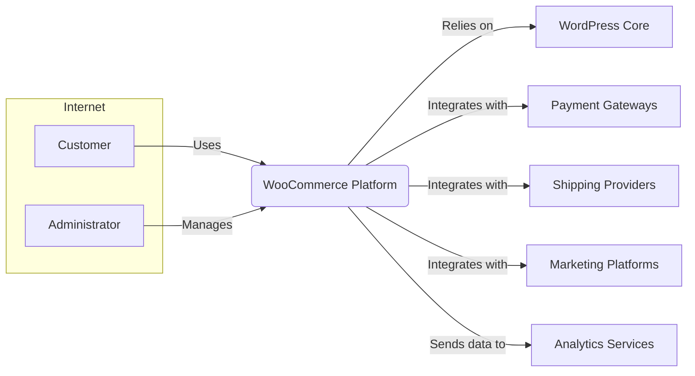
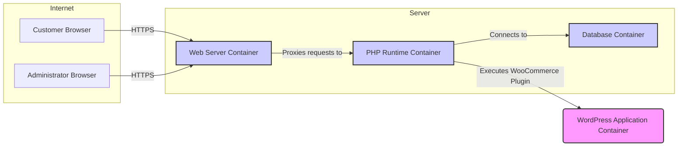

# BUSINESS POSTURE

- Business Priorities and Goals:
 - Enable businesses of all sizes to create and manage online stores.
 - Provide a flexible and customizable e-commerce platform that integrates seamlessly with WordPress.
 - Offer a wide range of features and extensions to support diverse business needs.
 - Maintain a large and active community of users, developers, and partners.
 - Ensure platform stability, reliability, and security for merchants and their customers.
- Business Risks:
 - Security vulnerabilities leading to data breaches, financial losses, and reputational damage.
 - Platform instability or downtime resulting in lost sales and customer dissatisfaction.
 - Lack of scalability to handle growing business demands and traffic.
 - Compatibility issues with WordPress core updates or third-party plugins.
 - Dependence on the WordPress ecosystem and its security posture.

# SECURITY POSTURE

- Existing Security Controls:
 - security control: Secure coding practices are generally followed by the development team, as evidenced by the project's active development and community scrutiny. (Location: Implicit in project development practices)
 - security control: Regular security updates and patches are released to address identified vulnerabilities. (Location: WooCommerce release notes and update channels)
 - security control: WordPress core security features are leveraged, such as user roles and permissions. (Location: WordPress documentation and WooCommerce integration)
 - security control: Input sanitization and output encoding are likely implemented to prevent common web vulnerabilities. (Location: Codebase analysis, though not explicitly documented in input)
 - security control: Use of HTTPS for secure communication is expected for e-commerce transactions. (Location: General e-commerce best practices and assumed configuration)
- Accepted Risks:
 - accepted risk: Vulnerabilities in third-party plugins and themes that extend WooCommerce functionality. (Location: Ecosystem dependency risk)
 - accepted risk: Security misconfigurations by users when setting up and managing their WooCommerce stores. (Location: User responsibility and complexity of configuration)
 - accepted risk: Potential for zero-day vulnerabilities in WordPress core or WooCommerce itself. (Location: Inherent risk in software development)
- Recommended Security Controls:
 - security control: Implement automated security testing (SAST/DAST) in the development pipeline.
 - security control: Conduct regular penetration testing by external security experts.
 - security control: Enhance security awareness training for developers, focusing on e-commerce specific threats.
 - security control: Implement a vulnerability disclosure program to encourage responsible reporting of security issues.
 - security control: Provide security hardening guidelines and best practices for WooCommerce store owners.
- Security Requirements:
 - Authentication:
  - Requirement: Secure authentication mechanisms for administrators to access the WooCommerce backend.
  - Requirement: Secure customer account creation and login processes.
  - Requirement: Support for strong password policies and multi-factor authentication for administrators.
 - Authorization:
  - Requirement: Role-based access control to manage administrator privileges within WooCommerce.
  - Requirement: Authorization checks to ensure users can only access and modify data they are permitted to.
  - Requirement: Clear separation of privileges between different user roles (e.g., shop manager, customer).
 - Input Validation:
  - Requirement: Comprehensive input validation on all user inputs to prevent injection attacks (SQL injection, XSS, etc.).
  - Requirement: Validation of data formats and types to ensure data integrity.
  - Requirement: Whitelisting approach for allowed input characters and patterns where applicable.
 - Cryptography:
  - Requirement: Encryption of sensitive data at rest, such as customer payment information and personal details in the database.
  - Requirement: Secure transmission of sensitive data in transit using HTTPS.
  - Requirement: Proper key management practices for cryptographic keys.
  - Requirement: Use of strong and up-to-date cryptographic algorithms and libraries.

# DESIGN

## C4 CONTEXT



- Context Diagram Elements:
 - - Name: Customer
   - Type: Person
   - Description: End users who browse products and make purchases through WooCommerce stores.
   - Responsibilities: Browse product catalog, place orders, manage their accounts, make payments.
   - Security controls: Strong customer password policies, secure payment processing integrations, protection of personal data.
 - - Name: Administrator
   - Type: Person
   - Description: Store owners and staff who manage the WooCommerce store, products, orders, and settings.
   - Responsibilities: Configure store settings, manage products and inventory, process orders, manage customer data, generate reports.
   - Security controls: Strong administrator password policies, multi-factor authentication, role-based access control, audit logging.
 - - Name: WooCommerce Platform
   - Type: Software System
   - Description: The core e-commerce platform built as a WordPress plugin, providing online store functionality.
   - Responsibilities: Product catalog management, shopping cart functionality, order processing, customer management, reporting, integration with WordPress and other services.
   - Security controls: Input validation, output encoding, authorization checks, secure session management, regular security updates.
 - - Name: WordPress Core
   - Type: Software System
   - Description: The underlying content management system that WooCommerce runs on. Provides core functionalities like user management, content management, and plugin framework.
   - Responsibilities: User authentication and authorization, content management, plugin and theme management, core security features.
   - Security controls: WordPress core security features, regular security updates, plugin and theme security scanning.
 - - Name: Payment Gateways
   - Type: External System
   - Description: Third-party services that process online payments for WooCommerce stores (e.g., Stripe, PayPal).
   - Responsibilities: Securely process customer payments, handle payment transactions, manage payment methods.
   - Security controls: PCI DSS compliance, secure API integrations, encryption of payment data.
 - - Name: Shipping Providers
   - Type: External System
   - Description: Third-party services that handle shipping and delivery of orders (e.g., UPS, FedEx).
   - Responsibilities: Calculate shipping rates, manage shipping labels, track shipments.
   - Security controls: Secure API integrations, data privacy compliance.
 - - Name: Marketing Platforms
   - Type: External System
   - Description: Third-party services used for marketing and customer engagement (e.g., Mailchimp, marketing automation tools).
   - Responsibilities: Email marketing, customer segmentation, marketing automation, promotional campaigns.
   - Security controls: Secure API integrations, data privacy compliance, consent management.
 - - Name: Analytics Services
   - Type: External System
   - Description: Third-party services used for website analytics and tracking user behavior (e.g., Google Analytics).
   - Responsibilities: Track website traffic, user behavior analysis, generate reports, provide insights.
   - Security controls: Data privacy compliance, anonymization of data, secure data transmission.

## C4 CONTAINER



- Container Diagram Elements:
 - - Name: WordPress Application Container
   - Type: Software Container
   - Description: Contains the WooCommerce plugin code running within the WordPress application. This is where the core e-commerce logic resides.
   - Responsibilities: Product catalog management, shopping cart functionality, order processing logic, customer management, interaction with WordPress core, API endpoints for integrations.
   - Security controls: Input validation, output encoding, authorization checks within WooCommerce code, secure session management, leveraging WordPress security APIs.
 - - Name: Web Server Container
   - Type: Infrastructure Container
   - Description: Handles incoming HTTP/HTTPS requests from users and proxies them to the PHP runtime container. Examples: Nginx, Apache.
   - Responsibilities: HTTP request handling, SSL/TLS termination, reverse proxying, static content serving, basic security features like rate limiting and request filtering.
   - Security controls: HTTPS configuration, web server hardening, rate limiting, request filtering, protection against common web attacks (e.g., DDoS).
 - - Name: PHP Runtime Container
   - Type: Infrastructure Container
   - Description: Executes the PHP code for WordPress and WooCommerce.
   - Responsibilities: PHP code execution, interaction with the database container, handling application logic.
   - Security controls: PHP runtime security configurations, secure coding practices in PHP, dependency management, protection against code execution vulnerabilities.
 - - Name: Database Container
   - Type: Infrastructure Container
   - Description: Stores all application data, including product information, customer data, order details, and WordPress configurations. Examples: MySQL, MariaDB.
   - Responsibilities: Data persistence, data retrieval, data integrity, database security.
   - Security controls: Database access controls, encryption at rest (if supported), regular backups, database hardening, protection against SQL injection.

## DEPLOYMENT

```mermaid
flowchart LR
    subgraph Cloud Provider (AWS, GCP, Azure)
        subgraph Region
            subgraph Availability Zone 1
                A[Load Balancer]
                B[Web Server Instance 1]
                C[PHP Application Instance 1]
            end
            subgraph Availability Zone 2
                D[Web Server Instance 2]
                E[PHP Application Instance 2]
            end
            F[Database Cluster]
        end
    end
    G[Customer Browser]
    H[Administrator Browser]

    G -- HTTPS --> A
    H -- HTTPS --> A
    A -- HTTP --> B & D
    B -- HTTP --> C
    D -- HTTP --> E
    C & E -- Database Connection --> F

    style A fill:#ccf,stroke:#333,stroke-width:2px
    style B fill:#ccf,stroke:#333,stroke-width:2px
    style C fill:#ccf,stroke:#333,stroke-width:2px
    style D fill:#ccf,stroke:#333,stroke-width:2px
    style E fill:#ccf,stroke:#333,stroke-width:2px
    style F fill:#ccf,stroke:#333,stroke-width:2px
```

- Deployment Diagram Elements:
 - - Name: Load Balancer
   - Type: Infrastructure Component
   - Description: Distributes incoming HTTPS traffic across multiple web server instances for high availability and scalability.
   - Responsibilities: Traffic distribution, SSL/TLS termination, health checks, routing requests to healthy instances.
   - Security controls: DDoS protection, SSL/TLS configuration, access control lists, security monitoring.
 - - Name: Web Server Instance (Web Server Container)
   - Type: Compute Instance
   - Description: Virtual machines or containers running web server software (e.g., Nginx, Apache) to handle HTTP requests. Deployed in multiple availability zones for redundancy.
   - Responsibilities: HTTP request handling, reverse proxying to application instances, serving static content.
   - Security controls: Instance hardening, security patching, intrusion detection systems, web server security configurations.
 - - Name: PHP Application Instance (PHP Runtime Container & WordPress Application Container)
   - Type: Compute Instance
   - Description: Virtual machines or containers running the PHP runtime and WordPress application with WooCommerce plugin. Deployed in multiple availability zones for redundancy.
   - Responsibilities: Executing PHP code, running WooCommerce application logic, interacting with the database.
   - Security controls: Application-level firewalls, runtime environment security, secure application configurations, regular security updates.
 - - Name: Database Cluster (Database Container)
   - Type: Database Service
   - Description: Managed database service (e.g., AWS RDS, Google Cloud SQL) providing a highly available and scalable database for WooCommerce data.
   - Responsibilities: Data persistence, data replication, backups, database management, ensuring data availability and integrity.
   - Security controls: Database access controls, encryption at rest, encryption in transit, database monitoring, regular backups, vulnerability scanning.

## BUILD

```mermaid
flowchart LR
    A[Developer] --> B{Code Changes};
    B -- Push --> C[GitHub Repository];
    C --> D[GitHub Actions Workflow];
    D --> E{Build & Test};
    E -- Success --> F{Security Scans (SAST, DAST)};
    F -- Success --> G{Artifacts};
    G --> H[Artifact Repository];
```

- Build Diagram Elements:
 - - Name: Developer
   - Type: Person
   - Description: Software developers who write and modify the WooCommerce codebase.
   - Responsibilities: Writing code, fixing bugs, implementing new features, committing code changes.
   - Security controls: Secure development environment, code review process, security awareness training.
 - - Name: Code Changes
   - Type: Code
   - Description: Modifications to the WooCommerce codebase made by developers.
   - Responsibilities: Implementing features, fixing bugs, addressing security vulnerabilities.
   - Security controls: Version control (Git), code review, static code analysis before commit.
 - - Name: GitHub Repository
   - Type: Code Repository
   - Description: Central repository for the WooCommerce source code, hosted on GitHub.
   - Responsibilities: Version control, code storage, collaboration, change tracking.
   - Security controls: Access control, branch protection, audit logging, vulnerability scanning by GitHub.
 - - Name: GitHub Actions Workflow
   - Type: CI/CD System
   - Description: Automated workflows defined in GitHub Actions to build, test, and perform security checks on code changes.
   - Responsibilities: Automated build process, running tests, executing security scans, creating build artifacts.
   - Security controls: Secure workflow definitions, access control to workflows, secret management, audit logging.
 - - Name: Build & Test
   - Type: Build Process
   - Description: Compilation, packaging, and unit testing of the WooCommerce codebase.
   - Responsibilities: Compiling code, running unit tests, creating deployable packages.
   - Security controls: Dependency scanning, build environment security, integrity checks of build tools.
 - - Name: Security Scans (SAST, DAST)
   - Type: Security Tooling
   - Description: Automated security scans performed on the codebase and build artifacts, including Static Application Security Testing (SAST) and potentially Dynamic Application Security Testing (DAST).
   - Responsibilities: Identifying potential security vulnerabilities in the code and build artifacts.
   - Security controls: Configuration of SAST/DAST tools, vulnerability reporting, integration with build pipeline.
 - - Name: Artifacts
   - Type: Build Output
   - Description: Deployable packages and build outputs generated by the build process.
   - Responsibilities: Packaging the application for deployment, creating distributable artifacts.
   - Security controls: Artifact signing, integrity checks, secure storage of artifacts.
 - - Name: Artifact Repository
   - Type: Storage System
   - Description: Secure storage location for build artifacts, ready for deployment.
   - Responsibilities: Securely storing build artifacts, versioning, access control.
   - Security controls: Access control, encryption at rest, audit logging, vulnerability scanning of repository.

# RISK ASSESSMENT

- Critical Business Processes:
 - Online Product Catalog Browsing and Search: Customers need to be able to browse and find products.
 - Shopping Cart and Checkout: Customers need to be able to add items to cart and complete purchases.
 - Payment Processing: Securely processing customer payments is crucial for revenue generation.
 - Order Management: Managing orders, shipping, and fulfillment is essential for operations.
 - Customer Account Management: Customers need to manage their accounts and order history.
 - Administrator Access and Store Management: Administrators need to manage the store effectively.
- Data Sensitivity:
 - Customer Personally Identifiable Information (PII): High sensitivity (e.g., names, addresses, email addresses, phone numbers). Requires strong protection due to privacy regulations (GDPR, CCPA, etc.).
 - Customer Payment Information: High sensitivity (e.g., credit card details, bank account information). Requires PCI DSS compliance and strong encryption.
 - Order Data: Medium sensitivity (e.g., order details, purchased products, shipping addresses). Important for business operations and customer service.
 - Product Data: Low sensitivity (e.g., product names, descriptions, images). Publicly available information.
 - Administrator Credentials: High sensitivity. Compromise can lead to full system control.

# QUESTIONS & ASSUMPTIONS

- Questions:
 - What specific SAST/DAST tools are currently used in the WooCommerce build process?
 - Are there regular penetration tests conducted for WooCommerce? If so, what is the frequency and scope?
 - What is the process for handling and responding to security vulnerabilities reported by the community or found internally?
 - Are there specific security hardening guidelines provided to WooCommerce store owners?
 - What is the data retention policy for customer PII and payment information?
 - What is the disaster recovery and business continuity plan for WooCommerce infrastructure?
- Assumptions:
 - WooCommerce is deployed in a typical cloud-based environment for scalability and availability.
 - Standard web application security best practices are generally followed in the development process.
 - HTTPS is enforced for all customer-facing and administrator interfaces.
 - Payment processing is outsourced to PCI DSS compliant payment gateways.
 - WordPress core security features are leveraged and considered a baseline security control.
 - The target audience for this document is familiar with cloud and web application security concepts.