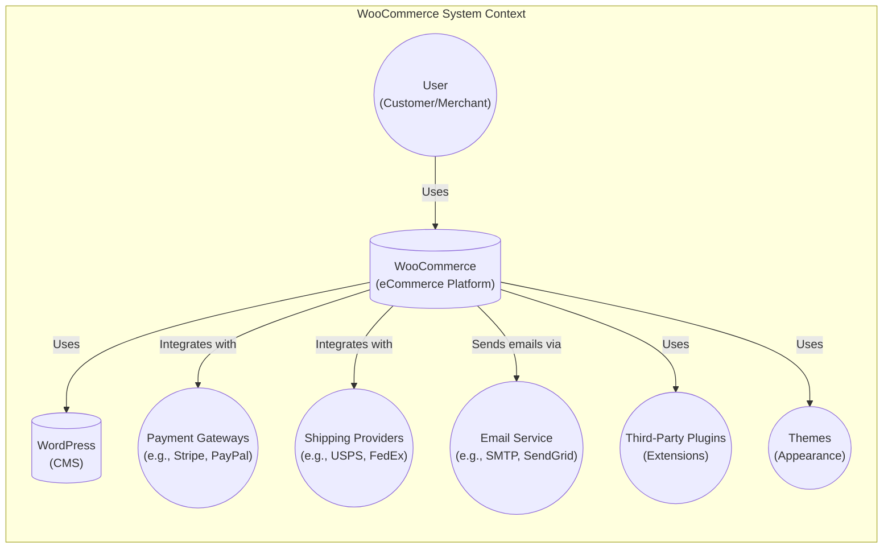
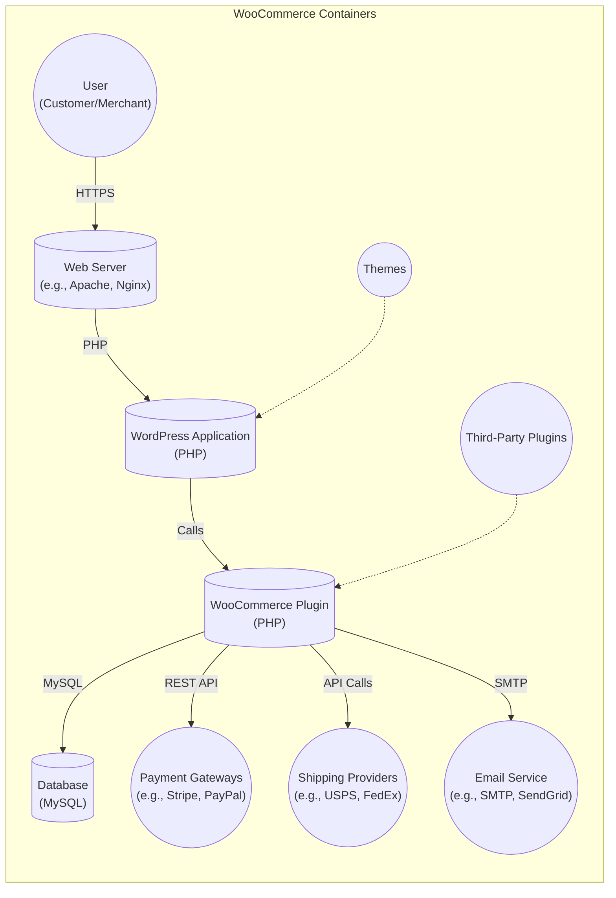
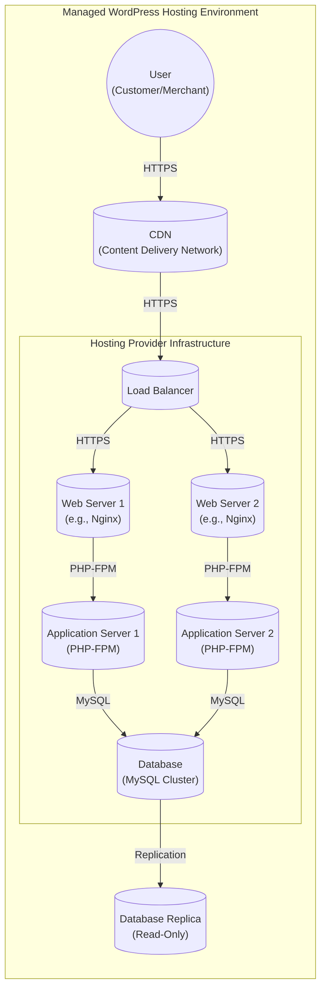
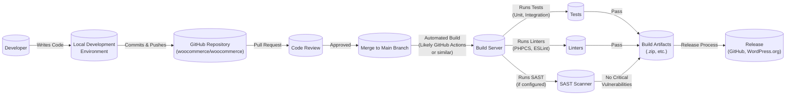

Okay, let's create a design document for the WooCommerce project based on the provided GitHub repository.

# BUSINESS POSTURE

WooCommerce is a customizable, open-source eCommerce platform built on WordPress.  It's designed for small to large-sized online merchants using WordPress.  The project's success hinges on its ability to provide a reliable, secure, and feature-rich platform for businesses to sell products and services online.

Business Priorities:

*   Enable merchants to easily set up and manage online stores.
*   Provide a wide range of features and extensions to cater to diverse business needs.
*   Maintain a secure and reliable platform to protect merchant and customer data.
*   Foster a vibrant community of developers and users.
*   Ensure compatibility with a wide range of WordPress themes and plugins.
*   Provide scalability to handle growing businesses.
*   Maintain a high level of performance and speed.

Business Goals:

*   Increase market share in the eCommerce platform space.
*   Grow the number of active installations.
*   Expand the ecosystem of extensions and integrations.
*   Maintain a high level of customer satisfaction.

Most Important Business Risks:

*   Security vulnerabilities that could lead to data breaches or financial losses for merchants.
*   Performance issues that could negatively impact the user experience and sales.
*   Compatibility issues with other plugins or themes that could disrupt store functionality.
*   Lack of scalability that could limit the growth of businesses using the platform.
*   Reputational damage due to security incidents or poor customer support.
*   Competition from other eCommerce platforms.

# SECURITY POSTURE

Existing Security Controls:

*   security control: Input validation: WooCommerce employs various input validation techniques to sanitize user inputs and prevent common web vulnerabilities like Cross-Site Scripting (XSS) and SQL Injection. Implemented throughout the codebase, particularly in forms and data processing functions.
*   security control: Output encoding: Data displayed to the user is properly encoded to prevent XSS attacks. Implemented in template files and data output functions.
*   security control: Authentication: WooCommerce integrates with WordPress's authentication system, leveraging user roles and capabilities to control access to different features and functionalities. Described in WordPress documentation and implemented in WooCommerce core.
*   security control: Authorization: Access control mechanisms are in place to ensure that users can only perform actions they are authorized to do. Implemented using WordPress's user roles and capabilities system.
*   security control: Session management: Secure session management practices are used to protect user sessions from hijacking and other attacks. Implemented using WordPress's session management functions.
*   security control: Regular updates: WooCommerce releases regular updates to address security vulnerabilities and improve the platform's overall security. Announced on the WooCommerce blog and development updates.
*   security control: Payment gateway integration: WooCommerce integrates with various secure payment gateways to process transactions securely. Documented in WooCommerce documentation and payment gateway documentation.
*   security control: Code reviews: Code reviews are part of the development process to identify and address potential security issues before they are merged into the codebase. Evident in the GitHub pull request process.
*   security control: Use of prepared statements: Prepared statements are used to prevent SQL injection vulnerabilities when interacting with the database. Implemented in database interaction functions.
*   security control: CSRF protection: Cross-Site Request Forgery (CSRF) protection is implemented to prevent attackers from performing unauthorized actions on behalf of a logged-in user. Implemented in form handling and AJAX requests.

Accepted Risks:

*   accepted risk: Reliance on third-party plugins and themes: WooCommerce's extensibility relies heavily on third-party plugins and themes, which may introduce security vulnerabilities that are outside of WooCommerce's direct control.
*   accepted risk: User error: Misconfiguration or improper use of WooCommerce by merchants can lead to security vulnerabilities.
*   accepted risk: Dependence on WordPress security: WooCommerce's security is inherently tied to the security of the underlying WordPress platform.

Recommended Security Controls:

*   Implement a robust Content Security Policy (CSP) to mitigate the impact of XSS attacks.
*   Introduce a Web Application Firewall (WAF) to protect against common web attacks.
*   Implement regular security audits and penetration testing to identify and address vulnerabilities proactively.
*   Provide security hardening guides and best practices for merchants.
*   Implement a bug bounty program to incentivize security researchers to report vulnerabilities.
*   Implement two-factor authentication (2FA) for administrator accounts.

Security Requirements:

*   Authentication:
    *   All users must be authenticated before accessing sensitive data or functionality.
    *   Support for strong passwords and password complexity requirements.
    *   Protection against brute-force attacks.
    *   Secure session management.
    *   Optional support for two-factor authentication (2FA).

*   Authorization:
    *   Role-based access control (RBAC) to restrict access to different features based on user roles.
    *   Granular permissions to control access to specific resources and actions.
    *   Regular review and auditing of user roles and permissions.

*   Input Validation:
    *   All user inputs must be validated and sanitized to prevent XSS, SQL injection, and other injection attacks.
    *   Use of whitelisting and input validation libraries.
    *   Validation of data types, lengths, and formats.

*   Cryptography:
    *   Use of strong, industry-standard cryptographic algorithms for storing sensitive data like passwords and API keys.
    *   Secure storage of cryptographic keys.
    *   Proper implementation of encryption for data in transit (HTTPS).
    *   Regular review and updating of cryptographic practices.

# DESIGN

## C4 CONTEXT

Element Descriptions:

*   Element:
    *   Name: User
    *   Type: Person
    *   Description: Represents both customers who purchase products and merchants who manage the store.
    *   Responsibilities: Customers browse products, add items to cart, checkout, and manage their accounts. Merchants manage products, orders, customers, and store settings.
    *   Security controls: Authentication, authorization, session management, CSRF protection.

*   Element:
    *   Name: WooCommerce
    *   Type: Software System
    *   Description: The core eCommerce platform that provides the functionality for online stores.
    *   Responsibilities: Managing products, orders, customers, payments, shipping, and other eCommerce-related features.
    *   Security controls: Input validation, output encoding, authentication, authorization, session management, CSRF protection, payment gateway integration, regular updates.

*   Element:
    *   Name: WordPress
    *   Type: Software System
    *   Description: The underlying Content Management System (CMS) that WooCommerce is built upon.
    *   Responsibilities: Providing the core platform, user management, content management, and plugin/theme architecture.
    *   Security controls: WordPress core security features, regular updates, user authentication, and authorization.

*   Element:
    *   Name: Payment Gateways
    *   Type: External System
    *   Description: Third-party services that process payments securely.
    *   Responsibilities: Handling payment transactions, securely storing payment information, and providing fraud prevention mechanisms.
    *   Security controls: PCI DSS compliance, encryption, tokenization, fraud detection.

*   Element:
    *   Name: Shipping Providers
    *   Type: External System
    *   Description: Third-party services that handle shipping and logistics.
    *   Responsibilities: Providing shipping rates, generating shipping labels, and tracking shipments.
    *   Security controls: Secure API communication, data encryption.

*   Element:
    *   Name: Email Service
    *   Type: External System
    *   Description: A service used to send transactional emails (e.g., order confirmations, shipping updates).
    *   Responsibilities: Sending emails reliably and securely.
    *   Security controls: SPF, DKIM, DMARC, secure SMTP configuration.

*   Element:
    *   Name: Third-Party Plugins
    *   Type: Software System
    *   Description: Extensions that add additional functionality to WooCommerce.
    *   Responsibilities: Providing specific features not included in the core platform.
    *   Security controls: Dependent on the individual plugin; ideally, they should follow secure coding practices.

*   Element:
    *   Name: Themes
    *   Type: Software System
    *   Description: Control the visual appearance of the WooCommerce store.
    *   Responsibilities: Defining the layout, styling, and presentation of the store.
    *   Security controls: Dependent on the individual theme; ideally, they should follow secure coding practices and avoid introducing vulnerabilities.

## C4 CONTAINER

Element Descriptions:

*   Element:
    *   Name: User
    *   Type: Person
    *   Description: Represents both customers and merchants interacting with the system.
    *   Responsibilities: Browsing, purchasing, managing store settings, etc.
    *   Security controls: Authentication, authorization, session management.

*   Element:
    *   Name: Web Server
    *   Type: Software System
    *   Description: Handles incoming HTTP requests and serves web pages.
    *   Responsibilities: Serving static content, routing requests to the WordPress application.
    *   Security controls: HTTPS configuration, WAF, access controls.

*   Element:
    *   Name: WordPress Application
    *   Type: Software System
    *   Description: The core WordPress application, including themes and core files.
    *   Responsibilities: Handling content management, user management, and plugin/theme interactions.
    *   Security controls: WordPress core security features, regular updates.

*   Element:
    *   Name: WooCommerce Plugin
    *   Type: Software System
    *   Description: The WooCommerce plugin code, containing the eCommerce functionality.
    *   Responsibilities: Managing products, orders, customers, payments, shipping, etc.
    *   Security controls: Input validation, output encoding, authentication, authorization, secure API communication.

*   Element:
    *   Name: Database
    *   Type: Database
    *   Description: Stores data for WordPress and WooCommerce, including products, orders, users, and settings.
    *   Responsibilities: Persisting data, providing data access to the application.
    *   Security controls: Database access controls, encryption at rest (if applicable), regular backups.

*   Element:
    *   Name: Payment Gateways
    *   Type: External System
    *   Description: Third-party services for processing payments.
    *   Responsibilities: Securely handling payment transactions.
    *   Security controls: PCI DSS compliance, encryption, tokenization.

*   Element:
    *   Name: Shipping Providers
    *   Type: External System
    *   Description: Third-party services for shipping and logistics.
    *   Responsibilities: Providing shipping rates, generating labels, tracking shipments.
    *   Security controls: Secure API communication.

*   Element:
    *   Name: Email Service
    *   Type: External System
    *   Description: Service for sending transactional emails.
    *   Responsibilities: Sending emails reliably and securely.
    *   Security controls: SPF, DKIM, DMARC, secure SMTP configuration.

*   Element:
    *   Name: Third-Party Plugins
    *   Type: Software System
    *   Description: Extensions that add functionality to WooCommerce.
    *   Responsibilities: Varies depending on the plugin.
    *   Security controls: Dependent on the individual plugin.

*   Element:
    *   Name: Themes
    *   Type: Software System
    *   Description: Control the visual appearance of the store.
    *   Responsibilities: Defining layout, styling, and presentation.
    *   Security controls: Dependent on the individual theme.

## DEPLOYMENT

Possible Deployment Solutions:

1.  Traditional Hosting: Deploying WordPress and WooCommerce on a shared, VPS, or dedicated server.
2.  Managed WordPress Hosting: Using a hosting provider that specializes in WordPress, offering optimized performance and security.
3.  Cloud Hosting: Deploying on cloud platforms like AWS, Google Cloud, or Azure, using services like EC2, App Engine, or Kubernetes.
4.  Headless Commerce: Decoupling the frontend from the backend, using WooCommerce as a backend API and a separate frontend framework.

Chosen Solution (for detailed description): Managed WordPress Hosting

Element Descriptions:

*   Element:
    *   Name: User
    *   Type: Person
    *   Description: Customer or merchant accessing the website.
    *   Responsibilities: Browsing, purchasing, managing store.
    *   Security controls: HTTPS, browser security features.

*   Element:
    *   Name: CDN
    *   Type: Infrastructure
    *   Description: Content Delivery Network for caching static assets.
    *   Responsibilities: Serving static content, reducing server load, improving performance.
    *   Security controls: HTTPS, DDoS protection.

*   Element:
    *   Name: Load Balancer
    *   Type: Infrastructure
    *   Description: Distributes traffic across multiple web servers.
    *   Responsibilities: Ensuring high availability, distributing load, handling failover.
    *   Security controls: HTTPS, SSL termination, health checks.

*   Element:
    *   Name: Web Server 1 & 2
    *   Type: Software System
    *   Description: Web servers (e.g., Nginx) serving the website.
    *   Responsibilities: Handling HTTP requests, serving static content, proxying to application servers.
    *   Security controls: HTTPS configuration, WAF, access controls, regular updates.

*   Element:
    *   Name: Application Server 1 & 2
    *   Type: Software System
    *   Description: Application servers (PHP-FPM) running WordPress and WooCommerce.
    *   Responsibilities: Executing PHP code, processing requests, interacting with the database.
    *   Security controls: Secure PHP configuration, regular updates, input validation, output encoding.

*   Element:
    *   Name: Database
    *   Type: Database
    *   Description: Primary database (MySQL cluster) storing data.
    *   Responsibilities: Persisting data, providing data access.
    *   Security controls: Database access controls, encryption at rest, regular backups, firewall.

*   Element:
    *   Name: Database Replica
    *   Type: Database
    *   Description: Read-only replica of the database for improved performance.
    *   Responsibilities: Handling read queries, reducing load on the primary database.
    *   Security controls: Same as primary database, but with read-only access.

## BUILD

The WooCommerce build process involves several steps, from development to creating release packages.  While the repository doesn't explicitly define a CI/CD pipeline in a single file (like a .github/workflows file), the process can be inferred from the repository structure, scripts, and contribution guidelines.

Build Process Description:

1.  Development: Developers write code and test it locally in their development environments.
2.  Commit & Push: Code changes are committed and pushed to the GitHub repository.
3.  Pull Request: Developers create pull requests to merge their changes into the main branch.
4.  Code Review: Other developers review the code for quality, security, and adherence to coding standards.
5.  Merge: Once approved, the pull request is merged into the main branch.
6.  Automated Build:  A build server (likely using GitHub Actions, although not explicitly defined in a single workflow file) is triggered by the merge.
7.  Tests: The build server runs automated tests, including unit and integration tests.
8.  Linters: Code linters (like PHPCS and ESLint, based on the `package.json` and `.phpcs.xml.dist` files) are run to check for code style and potential errors.
9.  SAST (Static Application Security Testing):  While not explicitly present in the repository's root, a SAST scanner *should* be part of the build process to identify potential security vulnerabilities. This is a recommended security control.
10. Build Artifacts: If all tests and checks pass, build artifacts (e.g., .zip files for release) are created.
11. Release: The build artifacts are used in the release process, which likely involves publishing to GitHub releases and the WordPress.org plugin directory.

Security Controls in Build Process:

*   Code Review: Manual review of code changes to identify potential security issues.
*   Automated Tests: Unit and integration tests to catch bugs and regressions that could lead to vulnerabilities.
*   Linters: Automated code analysis to enforce coding standards and identify potential errors.
*   SAST (Recommended): Static analysis to detect security vulnerabilities in the codebase.
*   Dependency Management:  `composer.json` and `package.json` are used to manage dependencies, and tools like Dependabot (likely configured) can help keep them updated and secure.
*   Build Automation:  Using a build server (likely GitHub Actions) ensures a consistent and repeatable build process.

# RISK ASSESSMENT

Critical Business Processes to Protect:

*   Order processing: Ensuring that orders are processed correctly and securely, without data loss or corruption.
*   Payment processing: Protecting customer payment information and preventing fraudulent transactions.
*   User account management: Safeguarding user accounts and preventing unauthorized access.
*   Product management: Ensuring the integrity and availability of product data.
*   Store configuration: Protecting store settings and preventing unauthorized modifications.

Data to Protect and Sensitivity:

*   Customer Personally Identifiable Information (PII): Name, address, email, phone number (High sensitivity).
*   Payment information: Credit card details, billing address (Extremely high sensitivity - handled by payment gateways, but WooCommerce must ensure secure integration).
*   Order details: Products purchased, order history, shipping information (High sensitivity).
*   User account credentials: Usernames, passwords (High sensitivity).
*   Store configuration data: API keys, settings (High sensitivity).
*   Product data: Product descriptions, prices, inventory (Medium sensitivity).

# QUESTIONS & ASSUMPTIONS

Questions:

*   What specific SAST tools are used (or planned to be used) in the build process?
*   Are there any existing security incident response plans in place?
*   What are the specific procedures for handling security vulnerabilities reported by external researchers?
*   What is the frequency and scope of security audits and penetration testing?
*   Are there any specific compliance requirements (e.g., GDPR, CCPA) that need to be considered?
*   What is the process for managing and auditing third-party plugins and themes?
*   Is there a documented threat model for WooCommerce?
*   What monitoring and logging systems are in place to detect and respond to security incidents?

Assumptions:

*   BUSINESS POSTURE: Assumes that maintaining a secure and reliable platform is a top priority for WooCommerce.
*   SECURITY POSTURE: Assumes that regular security updates are applied promptly. Assumes that developers follow secure coding practices. Assumes that basic security measures like HTTPS are in place.
*   DESIGN: Assumes that a managed WordPress hosting environment is a common deployment scenario. Assumes that GitHub Actions (or a similar CI/CD system) is used for automated builds, even though a complete workflow file isn't directly visible in the repository root. Assumes that code reviews are a standard part of the development process.