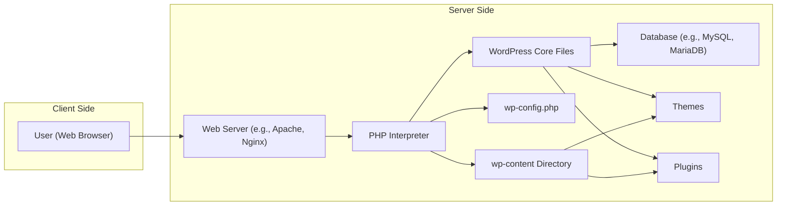

## Project Design Document: WordPress (Improved)

**1. Introduction**

This document provides a detailed architectural design of the WordPress content management system (CMS). It outlines the key components, their interactions, and data flows within the system, offering a comprehensive understanding for security analysis and threat modeling. The design is based on the open-source WordPress project available at [https://github.com/wordpress/wordpress](https://github.com/wordpress/wordpress). This document aims to be a valuable resource for identifying potential security vulnerabilities and informing mitigation strategies.

**2. Goals and Objectives**

*   Provide a clear, detailed, and accurate representation of the WordPress architecture.
*   Thoroughly identify the major components, their specific responsibilities, and key functionalities.
*   Precisely illustrate the critical data flows within the system for various user interactions and administrative tasks.
*   Establish a robust common understanding of the system's internal workings for security experts, developers, and stakeholders involved in threat modeling.
*   Serve as a reliable and up-to-date reference point for future development efforts, security audits, and enhancement initiatives.

**3. Scope**

This document focuses on the core architectural components of a typical self-hosted WordPress installation, providing sufficient detail for effective threat modeling. It includes:

*   The web server software (e.g., Apache, Nginx) and its role in handling requests.
*   The PHP interpreter and its execution environment for WordPress code.
*   The WordPress core files, encompassing the fundamental logic and functionalities of the CMS.
*   The database system (typically MySQL or MariaDB) responsible for persistent data storage.
*   Themes, detailing their role in presentation and interaction with the core.
*   Plugins, outlining their function in extending core functionalities and introducing new features.
*   User interactions, covering both front-end visitor access and back-end administrative operations.
*   Key configuration files, such as `wp-config.php`, and their significance.
*   The `wp-content` directory structure and its purpose in storing user-generated and extension-related content.

This document explicitly excludes:

*   In-depth analysis of specific individual themes and plugins beyond their general architectural role.
*   Detailed code-level implementation specifics within WordPress core, themes, or plugins.
*   Highly specific hosting environment configurations or infrastructure details.
*   Detailed interactions with external services like Content Delivery Networks (CDNs) unless they are integral to the core WordPress functionality (e.g., the plugin update mechanism).

**4. High-Level Architecture**

**5. Component Breakdown**

*   **User (Web Browser):** Represents the end-user interacting with the WordPress website. This includes:
    *   **Front-end visitors:** Accessing public content and features.
    *   **Authenticated users:** Logged-in users with specific roles and permissions.
    *   **Administrators:** Users with full control over the WordPress installation.
*   **Web Server (e.g., Apache, Nginx):**  The entry point for all HTTP requests. Key responsibilities include:
    *   Receiving and processing incoming HTTP requests from users.
    *   Serving static content (HTML, CSS, JavaScript, images).
    *   Forwarding dynamic requests to the PHP interpreter.
    *   Handling SSL/TLS encryption.
    *   Implementing access control and security rules (e.g., `.htaccess` for Apache).
*   **PHP Interpreter:** Executes the WordPress PHP code. Key responsibilities include:
    *   Processing PHP scripts within the WordPress core, themes, and plugins.
    *   Interacting with the database to retrieve and store data.
    *   Generating dynamic HTML content based on user requests and data.
    *   Managing sessions and cookies.
    *   Handling file uploads and downloads.
*   **WordPress Core Files:** The foundational files of the WordPress CMS. Key functionalities include:
    *   **Request Routing:** Determining which code handles a specific request.
    *   **User Management:** Handling user registration, login, roles, and permissions.
    *   **Content Management:** Providing functionalities for creating, editing, and managing posts, pages, and other content types.
    *   **Plugin and Theme API:** Providing hooks and filters for extending functionality.
    *   **Update Management:** Handling updates for the core, themes, and plugins.
    *   **Security Features:** Implementing core security measures (e.g., nonce verification).
*   **Database (e.g., MySQL, MariaDB):** Stores all persistent data for the WordPress installation. Key data includes:
    *   Posts and pages content.
    *   User accounts and profiles.
    *   Comments.
    *   Settings and configurations.
    *   Plugin and theme data.
*   **Themes:** Control the visual presentation and layout of the website. Key aspects include:
    *   **Template Files:** PHP files that define the structure and display of different page types.
    *   **Stylesheets (CSS):** Files that define the visual styling of the website.
    *   **JavaScript:** Files that add interactive elements and dynamic behavior to the front-end.
    *   **Theme Functions:** PHP code within the theme that can extend functionality.
*   **Plugins:** Extend the functionality of WordPress by adding new features, integrations, and customizations. Key aspects include:
    *   Adding new features and functionalities to the WordPress core.
    *   Integrating with external services and APIs.
    *   Modifying existing WordPress behavior through hooks and filters.
    *   Introducing new administrative interfaces and settings.
*   **`wp-config.php`:** A critical configuration file containing sensitive information. Key data includes:
    *   Database connection credentials (hostname, username, password, database name).
    *   Security keys and salts used for password hashing and cookie encryption.
    *   Table prefix.
    *   Debugging settings.
*   **`wp-content` Directory:**  A directory containing user-generated and extension-related content. Key subdirectories include:
    *   **`themes/`:** Contains installed themes.
    *   **`plugins/`:** Contains installed plugins.
    *   **`uploads/`:** Contains media files uploaded by users.
    *   **`upgrade/`:**  Used for temporary files during updates.

**6. Data Flow**

```mermaid
graph LR
    subgraph "Front-End Page Load Request"
        A1["User (Browser)"] -- "HTTP Request" --> B1["Web Server"]
        B1 -- "Route Request" --> C1["PHP Interpreter"]
        C1 -- "Load WordPress Core" --> D1["WordPress Core Files"]
        D1 -- "Determine Theme & Template" --> F1["Themes"]
        D1 -- "Query Database for Content" --> E1["Database"]
        E1 -- "Content Data" --> D1
        D1 -- "Render Page with Theme" --> C1
        C1 -- "HTTP Response (HTML, CSS, JS)" --> B1
        B1 -- "Serve Content" --> A1
    end

    subgraph "Back-End Admin Action (e.g., Saving a Post)"
        A2["Admin User (Browser)"] -- "HTTP Request (Admin Action)" --> B2["Web Server"]
        B2 -- "Authenticate User" --> C2["PHP Interpreter"]
        C2 -- "Load WordPress Core & Relevant Plugins" --> D2["WordPress Core Files & Plugins"]
        D2 -- "Authorize User Action" --> D2
        D2 -- "Process Data & Update Database" --> E2["Database"]
        E2 -- "Confirmation Response" --> D2
        D2 -- "Generate Admin Panel Response" --> C2
        C2 -- "HTTP Response" --> B2
        B2 -- "Serve Content" --> A2
    end

    subgraph "Plugin Activation"
        A3["Admin User (Browser)"] -- "Activate Plugin Request" --> B3["Web Server"]
        B3 -- "Process Activation Request" --> C3["PHP Interpreter"]
        C3 -- "Load WordPress Core & Plugin Management" --> D3["WordPress Core Files"]
        D3 -- "Write Plugin Activation Status to Database" --> E3["Database"]
        D3 -- "Execute Plugin Activation Hooks" --> G1["Plugins"]
        G1 -- "Perform Activation Tasks" --> G1
        D3 -- "Generate Confirmation Response" --> C3
        C3 -- "HTTP Response" --> B3
        B3 -- "Serve Content" --> A3
    end

    subgraph "Media Upload"
        A4["User (Admin/Editor)"] -- "Upload File" --> B4["Web Server"]
        B4 -- "Handle File Upload" --> C4["PHP Interpreter"]
        C4 -- "Load WordPress Core & Media Handling" --> D4["WordPress Core Files"]
        D4 -- "Validate & Process File" --> D4
        D4 -- "Save File to wp-content/uploads" --> I1["wp-content Directory"]
        D4 -- "Update Database with Media Information" --> E4["Database"]
        D4 -- "Generate Response" --> C4
        C4 -- "HTTP Response" --> B4
        B4 -- "Serve Content" --> A4
    end
```

**7. Key Interactions and Processes**

*   **User Request Lifecycle:**  A user initiates a request through their web browser. The web server receives this request and, for dynamic content, passes it to the PHP interpreter. WordPress core then takes over, routing the request, loading necessary components (themes, plugins), querying the database for data, and generating the HTML response, which is sent back to the user via the web server.
*   **Authentication and Authorization Flow:** When a user attempts to log in, WordPress verifies their credentials against the stored user data in the database. Upon successful authentication, a session is established. Subsequent requests are checked for valid session cookies. Authorization checks are performed based on the user's role and the requested action.
*   **Plugin and Theme Loading and Execution:** WordPress loads active themes and plugins during the request processing lifecycle. Plugins can hook into various points in the WordPress execution flow to modify behavior or add functionality. Themes dictate the presentation layer and interact with WordPress core to display content.
*   **Database Querying and Manipulation:** WordPress relies heavily on database interactions. The core, themes, and plugins use WordPress's database abstraction layer (`wpdb`) to perform queries (SELECT) to retrieve data and modifications (INSERT, UPDATE, DELETE) to persist changes.
*   **Content Creation and Management Workflow:** Users with appropriate permissions can create, edit, and manage content through the WordPress admin interface. This involves submitting data through forms, which are then processed by WordPress core and plugins, leading to updates in the database and potentially the `wp-content` directory (for media uploads).
*   **Update Mechanism:** WordPress has a built-in update system for the core, themes, and plugins. This process involves downloading update packages, verifying their integrity, and applying the updates, which may involve modifying files and database schema.

**8. Security Considerations (Detailed for Threat Modeling)**

This section expands on potential security concerns, providing more specific examples for threat modeling.

*   **Database Security:**
    *   **SQL Injection:** Exploiting vulnerabilities in database queries to execute malicious SQL code.
    *   **Exposure of Database Credentials:** Unauthorized access to `wp-config.php` or other means of revealing database credentials.
    *   **Database Backups Security:**  Compromised or exposed database backups.
    *   **Insufficient Database Permissions:** Overly permissive database user accounts.
*   **Authentication and Authorization:**
    *   **Brute-Force Attacks:** Attempting to guess user credentials through repeated login attempts.
    *   **Weak Password Policies:** Allowing users to set easily guessable passwords.
    *   **Privilege Escalation:** Exploiting vulnerabilities to gain higher-level access than intended.
    *   **Session Hijacking/Fixation:** Stealing or manipulating user session identifiers.
    *   **Insecure Password Storage:** Weak hashing algorithms or lack of salting.
    *   **Missing or Weak Multi-Factor Authentication (MFA).**
*   **Input Validation and Output Encoding:**
    *   **Cross-Site Scripting (XSS):** Injecting malicious scripts into web pages viewed by other users.
    *   **Cross-Site Request Forgery (CSRF):** Tricking authenticated users into performing unintended actions.
    *   **Code Injection (PHP, OS Command):** Injecting malicious code that is executed by the server.
    *   **Path Traversal:** Accessing files and directories outside the intended web root.
    *   **Local File Inclusion (LFI) / Remote File Inclusion (RFI):** Including malicious files from the local or remote file system.
*   **Plugin and Theme Security:**
    *   **Vulnerabilities in Third-Party Code:** Exploiting security flaws in poorly coded or outdated plugins and themes.
    *   **Supply Chain Attacks:** Compromised plugins or themes introducing malicious code.
    *   **Abandoned or Unmaintained Extensions:**  Vulnerabilities in extensions that are no longer updated.
*   **File Upload Security:**
    *   **Unrestricted File Uploads:** Allowing users to upload any type of file, potentially including malicious executables.
    *   **Insufficient File Validation:** Failing to properly validate uploaded files, leading to vulnerabilities.
    *   **Directory Traversal during Upload:**  Manipulating upload paths to place files in unintended locations.
*   **Configuration Security:**
    *   **Exposure of Sensitive Information:** Leaking API keys, secrets, or other sensitive data stored in configuration files or the database.
    *   **Insecure Default Configurations:** Using default settings that are not secure.
    *   **Improper Error Handling:** Revealing sensitive information through error messages.
*   **Web Server Security:**
    *   **Vulnerabilities in Web Server Software:** Exploiting known flaws in Apache or Nginx.
    *   **Misconfigurations:** Incorrectly configured web server settings leading to security weaknesses.
    *   **Information Disclosure:** Exposing sensitive information through server headers or directory listings.
*   **Update Management:**
    *   **Failure to Apply Security Updates:** Leaving known vulnerabilities unpatched.
    *   **Automated Update Failures:** Issues preventing automatic updates from being applied.
*   **Logging and Monitoring:**
    *   **Insufficient Logging:** Lack of detailed logs to track security events.
    *   **Inadequate Monitoring:** Failure to detect and respond to suspicious activity.

**9. Assumptions and Constraints**

*   This design assumes a standard, self-hosted WordPress installation without significant core modifications.
*   The database server is assumed to be located on the same network or have restricted access from the web server.
*   File system permissions are assumed to be configured according to WordPress best practices.
*   The PHP interpreter is assumed to be running with appropriate security settings and necessary extensions.
*   The focus remains on the logical architecture and common deployment scenarios, not highly customized or specialized setups.

**10. Future Considerations**

*   Detailed design specifications for specific WordPress subsystems, such as the REST API, WP-CLI, and the Cron system.
*   Analysis of integrations with common external services like CDNs, caching mechanisms, and email providers.
*   Considerations for scalability, performance optimization, and high availability deployments.
*   Development of comprehensive security hardening guidelines and best practices for each architectural component.
*   Detailed examination of the WordPress plugin and theme ecosystem security landscape.

This improved document provides a more detailed and comprehensive understanding of the WordPress architecture, making it a more effective resource for threat modeling and security analysis. The expanded component descriptions, refined data flow diagrams, and detailed security considerations offer a solid foundation for identifying and mitigating potential security risks.
