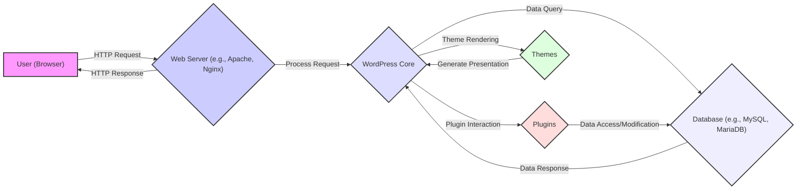
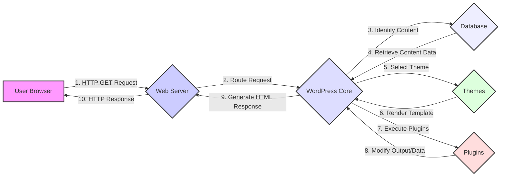
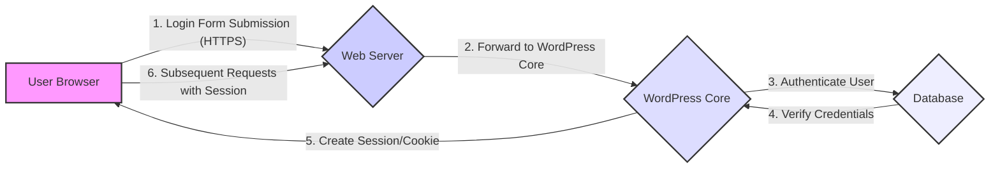

# Project Design Document: WordPress

**Version:** 1.1
**Date:** October 26, 2023
**Author:** AI Software Architect

## 1. Introduction

This document provides an enhanced architectural overview of the WordPress project, based on the codebase available at [https://github.com/wordpress/wordpress](https://github.com/wordpress/wordpress). This revised document aims to provide a more detailed and nuanced understanding of the system's architecture, specifically tailored for threat modeling activities. It expands on the initial version by providing more granular details about component interactions, data flows, and potential security implications.

## 2. Goals

*   Provide a clear and comprehensive description of the WordPress architecture, focusing on elements relevant to security.
*   Identify the major components and their interactions, with a deeper dive into their responsibilities and potential vulnerabilities.
*   Illustrate typical and critical data flows within a WordPress installation, highlighting potential attack vectors.
*   Elaborate on the key technologies and frameworks used, emphasizing their security characteristics.
*   Serve as a robust and detailed foundation for identifying potential security vulnerabilities and designing mitigation strategies during threat modeling.

## 3. High-Level Architecture

This diagram illustrates the fundamental interaction between a user, the web server, the core WordPress application, the database, plugins, and themes. It highlights the request-response cycle and the dependencies between components.

## 4. Component Breakdown (Enhanced)

This section provides a more detailed breakdown of the major components of the WordPress system, focusing on their roles and potential security implications:

*   **User (Browser):**
    *   Represents the end-user interacting with the WordPress website via a web browser.
    *   Initiates HTTP requests (GET, POST, etc.) to access content or perform actions.
    *   Receives and renders HTML, CSS, JavaScript, and other assets.
    *   *Security Implication:* Potential target for client-side attacks (e.g., XSS).

*   **Web Server (e.g., Apache, Nginx):**
    *   Acts as the entry point for all incoming requests.
    *   Handles static content serving and forwards dynamic requests to the PHP interpreter.
    *   Manages SSL/TLS encryption.
    *   May implement security features like request filtering and rate limiting.
    *   *Security Implication:* Misconfiguration can lead to vulnerabilities; outdated versions can be exploited.

*   **WordPress Core:**
    *   The central PHP application that manages content, users, and overall functionality.
    *   Responsible for routing requests, authenticating users, and enforcing access controls.
    *   Provides APIs and hooks for plugins and themes.
    *   Abstracts database interactions.
    *   *Security Implication:* Vulnerabilities in the core can have widespread impact; proper input validation and output encoding are crucial.

*   **Database (e.g., MySQL, MariaDB):**
    *   Stores all persistent data, including posts, pages, user credentials, and settings.
    *   Accessed by WordPress Core and sometimes directly by plugins.
    *   Requires proper access control and secure configuration.
    *   *Security Implication:* Susceptible to SQL injection attacks if queries are not properly sanitized; data breaches can occur if access is compromised.

*   **Plugins:**
    *   Extend WordPress functionality, adding features and integrations.
    *   Developed by third parties and vary significantly in quality and security.
    *   Have access to WordPress APIs and can interact with the database.
    *   *Security Implication:* Major source of vulnerabilities due to coding errors or malicious intent; require careful vetting and regular updates.

*   **Themes:**
    *   Control the visual presentation of the website.
    *   Composed of PHP templates, CSS, JavaScript, and images.
    *   Can execute PHP code and interact with the database.
    *   *Security Implication:* Can introduce vulnerabilities through insecure coding practices or by including malicious scripts.

## 5. Data Flow Diagram (Enhanced)

This section presents more detailed data flow diagrams for specific scenarios:

### 5.1. Typical Page Load

### 5.2. User Login

These diagrams illustrate the sequence of actions for common user interactions, highlighting potential points of vulnerability.

## 6. Key Technologies (Security Focus)

This section revisits the key technologies with a focus on their security implications:

*   **Programming Languages:**
    *   PHP: Requires careful coding practices to prevent vulnerabilities like SQL injection, XSS, and remote code execution.
    *   JavaScript: Susceptible to XSS attacks; requires careful handling of user input and output encoding.

*   **Database Systems:**
    *   MySQL/MariaDB: Requires secure configuration, strong passwords, and protection against SQL injection.

*   **Web Servers:**
    *   Apache/Nginx: Need to be configured securely to prevent information disclosure and other attacks; regular updates are crucial.

*   **Protocols:**
    *   HTTP/HTTPS: HTTPS is essential for encrypting communication and protecting sensitive data.

## 7. Deployment Model (Security Considerations)

The deployment environment significantly impacts security. Key considerations include:

*   **Shared Hosting:** Higher risk due to shared resources and potential for cross-site contamination.
*   **VPS/Dedicated Server:** Offers more control over security configurations but requires expertise.
*   **Cloud Hosting:** Security is a shared responsibility; proper configuration of cloud services is crucial.
*   **Containerization:** Can improve isolation and security if configured correctly.

Secure deployment practices include:

*   Regular security updates for the operating system and server software.
*   Firewall configuration to restrict access.
*   Intrusion detection and prevention systems.
*   Regular security audits and vulnerability scanning.

## 8. Key Security Considerations (Detailed)

This section expands on the initial security considerations, providing more specific examples of potential threats:

*   **Authentication and Authorization:**
    *   Brute-force attacks on login forms.
    *   Weak password policies.
    *   Insufficient protection of authentication cookies.
    *   Privilege escalation vulnerabilities.

*   **Input Validation and Sanitization:**
    *   SQL injection attacks through unsanitized database queries.
    *   Cross-site scripting (XSS) attacks due to unescaped output.
    *   Local File Inclusion (LFI) and Remote File Inclusion (RFI) vulnerabilities.

*   **Database Security:**
    *   SQL injection vulnerabilities.
    *   Database credentials exposed through misconfiguration.
    *   Lack of proper database access controls.

*   **Plugin and Theme Security:**
    *   Vulnerabilities in third-party code.
    *   Malicious plugins or themes.
    *   Outdated plugins and themes with known vulnerabilities.

*   **File Upload Security:**
    *   Uploading malicious executable files.
    *   Path traversal vulnerabilities during file uploads.

*   **Cross-Site Scripting (XSS):**
    *   Stored XSS: Malicious scripts stored in the database and executed for other users.
    *   Reflected XSS: Malicious scripts injected through URL parameters.

*   **Cross-Site Request Forgery (CSRF):**
    *   Unauthorized actions performed on behalf of an authenticated user.

*   **Security Updates:**
    *   Failure to apply security patches in a timely manner.

*   **Password Management:**
    *   Weak password hashing algorithms.
    *   Storing passwords in plaintext.

*   **Network Security:**
    *   Lack of firewall protection.
    *   Exposure of sensitive ports.

*   **Code Injection:**
    *   Remote code execution vulnerabilities through insecure deserialization or other flaws.

## 9. External Integrations

WordPress often integrates with external services, which introduces additional security considerations:

*   **Payment Gateways:** Secure handling of payment information is critical.
*   **Social Media Platforms:** OAuth vulnerabilities and data privacy concerns.
*   **Email Marketing Services:** Potential for phishing attacks if email sending is compromised.
*   **Content Delivery Networks (CDNs):** Security of assets served through the CDN.
*   **Third-Party APIs:** Authentication and authorization with external services.

## 10. Future Considerations

This design document will be continuously updated. Future enhancements include:

*   More detailed diagrams for specific functionalities (e.g., REST API interactions).
*   Inclusion of caching mechanisms and their security implications.
*   Detailed analysis of WordPress security features and best practices.
*   Specific threat models for different components and data flows.

This enhanced design document provides a more comprehensive and security-focused view of the WordPress architecture, serving as a valuable resource for threat modeling and security analysis.
