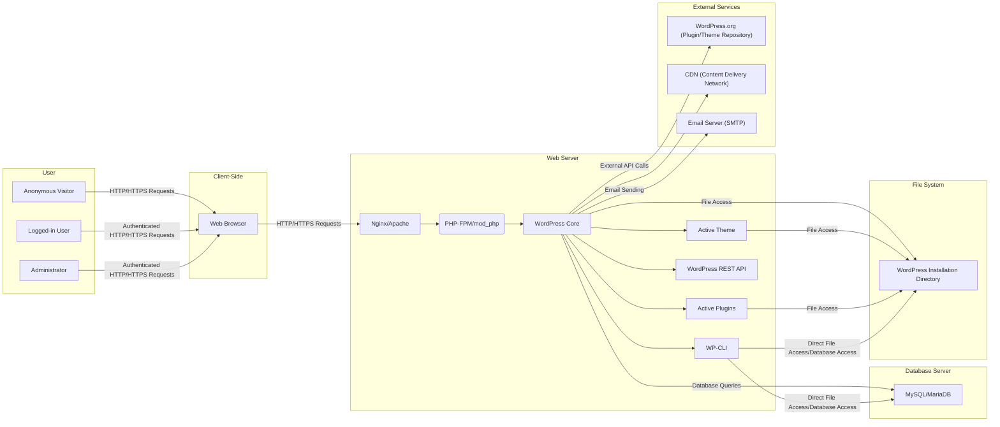

## Project Design Document: WordPress (Improved)

**Project Name:** WordPress

**Project Repository:** https://github.com/wordpress/wordpress

**Document Version:** 1.1

**Date:** October 26, 2023

**Author:** AI Software Architect

**1. Introduction**

This document provides an enhanced architectural design of the WordPress project, focusing on key components, data flow, and technologies. It is specifically tailored to facilitate threat modeling activities by providing a detailed understanding of the system's structure and interactions. This document aims to clearly outline the major elements of the WordPress system to enable the identification of potential security vulnerabilities and attack vectors.

**2. Project Overview**

WordPress is a widely adopted, open-source content management system (CMS) built using PHP and typically paired with a MySQL or MariaDB database. Its flexibility and extensive ecosystem of plugins and themes make it suitable for a wide range of websites and applications. The core functionality can be extended and customized significantly, which also introduces potential security considerations.

**3. Architectural Diagram**

**4. Component Breakdown**

*   **User Roles:**
    *   **Anonymous Visitor:**  Users who access the public-facing website without logging in.
    *   **Logged-in User:** Users who have an account and have authenticated to access restricted content or features.
    *   **Administrator:** Users with the highest level of privileges, capable of managing all aspects of the WordPress site.
*   **Client-Side:**
    *   **Web Browser:** The application used by users to interact with the WordPress website.
*   **Web Server:**
    *   **Nginx/Apache:** The web server software responsible for handling incoming HTTP/HTTPS requests.
    *   **PHP-FPM/mod_php:** The PHP processor responsible for executing WordPress code.
    *   **WordPress Core:** The fundamental PHP files that provide the core functionality of WordPress. This includes:
        *   **wp-config.php:**  Configuration file containing database credentials and other settings.
        *   **wp-settings.php:**  Initializes WordPress and loads core functions.
        *   **wp-includes/:** Directory containing core WordPress libraries and functions.
        *   **wp-admin/:** Directory containing the administrative interface.
    *   **Active Theme:** The currently selected theme that controls the website's presentation.
        *   **Template Files (PHP):**  Files responsible for generating HTML structure.
        *   **Style Sheets (CSS):** Files defining the visual styling.
        *   **JavaScript Files (JS):** Files providing dynamic behavior.
        *   **Assets (Images, Fonts):** Media files used by the theme.
    *   **Active Plugins:**  Installed and activated plugins that extend WordPress functionality. Each plugin consists of:
        *   **PHP Files:**  Code implementing the plugin's features.
        *   **Assets (CSS, JS, Images):**  Supporting files for the plugin.
    *   **WordPress REST API:**  An interface allowing programmatic access to WordPress data and functionality.
    *   **WP-CLI:** The command-line interface for managing WordPress installations.
*   **Database Server:**
    *   **MySQL/MariaDB:** The database system storing all website data.
        *   **wp_options:**  Stores site-wide settings.
        *   **wp_users:** Stores user account information.
        *   **wp_posts:** Stores posts, pages, and other content.
        *   **wp_comments:** Stores user comments.
        *   **wp_plugins:** Stores information about installed plugins.
        *   **wp_themes:** Stores information about installed themes.
*   **File System:**
    *   **WordPress Installation Directory:** The directory on the server where all WordPress files are located. This includes:
        *   **wp-content/uploads/:**  Directory for user-uploaded media files.
        *   **wp-content/plugins/:** Directory for installed plugins.
        *   **wp-content/themes/:** Directory for installed themes.
*   **External Services:**
    *   **WordPress.org (Plugin/Theme Repository):**  The official repository for downloading plugins and themes.
    *   **CDN (Content Delivery Network):**  A network of servers used to distribute static assets (images, CSS, JS) for faster loading times.
    *   **Email Server (SMTP):**  Used for sending emails from the WordPress site (e.g., password resets, notifications).

**5. Data Flow (Detailed)**

*   **Anonymous User Accessing a Page:**
    *   An anonymous user's web browser requests a page (e.g., homepage).
    *   The web server receives the request and passes it to PHP-FPM.
    *   WordPress Core is initiated, loading the active theme and relevant plugins.
    *   WordPress Core queries the database to retrieve the content for the requested page.
    *   The active theme's template files are used to structure the HTML output, incorporating data from the database.
    *   Plugins may hook into this process to modify content or add functionality.
    *   Static assets (CSS, JS, images) are often served via a CDN.
    *   The generated HTML is sent back to the web server and then to the user's browser.

*   **Logged-in User Submitting a Comment:**
    *   A logged-in user fills out a comment form and submits it.
    *   The browser sends an authenticated POST request to the web server.
    *   WordPress Core validates the user's authentication and the submitted data.
    *   WordPress Core sanitizes the comment content to prevent XSS attacks.
    *   The comment is stored in the `wp_comments` table in the database.
    *   Notifications might be sent via the configured email server.
    *   The user is redirected back to the page, potentially with the new comment displayed.

*   **Administrator Installing a Plugin:**
    *   An administrator navigates to the plugin installation section in the admin dashboard.
    *   The administrator searches for a plugin or uploads a plugin file.
    *   WordPress Core (with administrator privileges) may:
        *   Download the plugin from the WordPress.org repository.
        *   Extract the plugin files to the `wp-content/plugins/` directory.
        *   Add an entry for the plugin in the `wp_plugins` table in the database.
    *   The administrator can then activate the plugin, which may involve further database updates and file system modifications.

*   **WP-CLI Command Execution:**
    *   An administrator with server access executes a WP-CLI command (e.g., `wp user create`).
    *   WP-CLI directly interacts with the WordPress installation, bypassing the web server in some cases.
    *   WP-CLI can directly access the database and the file system to perform actions.

**6. Key Technologies**

*   **Programming Language:** PHP (primarily)
*   **Templating Engine:** PHP (native), potentially with templating libraries in themes/plugins
*   **Database:** MySQL or MariaDB
*   **Web Servers:** Nginx or Apache
*   **Front-end Technologies:** HTML, CSS, JavaScript
*   **Operating System:** Typically Linux-based servers
*   **Caching Mechanisms:**
    *   **Object Caching (e.g., Memcached, Redis):** Caching database query results.
    *   **Page Caching (e.g., WP Super Cache, W3 Total Cache):** Caching fully rendered HTML pages.
    *   **Opcode Caching (e.g., OPcache):** Caching compiled PHP code.
    *   **CDN (Content Delivery Network):** Caching static assets.

**7. Deployment Model**

*   **Self-Hosted:**
    *   Requires manual installation and configuration of the web server, PHP, and database.
    *   Provides full control over the environment but requires technical expertise for maintenance and security.
*   **Managed WordPress Hosting:**
    *   Hosting provider handles server management, security updates, and performance optimization.
    *   Offers convenience and often includes WordPress-specific features.
*   **WordPress.com:**
    *   A fully managed platform where WordPress is pre-installed and maintained by Automattic.
    *   Different tiers offer varying levels of customization and features.
*   **Containerized Deployments (e.g., Docker):**
    *   Packages WordPress and its dependencies into containers for consistent deployment across different environments.

**8. Security Considerations (Detailed)**

This section outlines potential security considerations for threat modeling.

*   **Authentication and Authorization:**
    *   **Brute-force attacks on login pages:** Attackers attempting to guess usernames and passwords.
    *   **Weak passwords:** Users choosing easily guessable passwords.
    *   **Insufficient privilege management:** Users having more permissions than necessary.
    *   **Session hijacking:** Attackers stealing user session cookies to gain unauthorized access.
*   **Input Validation and Sanitization:**
    *   **SQL Injection:** Malicious SQL code injected through vulnerable input fields.
    *   **Cross-Site Scripting (XSS):** Malicious scripts injected into website content, targeting other users.
    *   **Remote Code Execution (RCE):** Attackers exploiting vulnerabilities to execute arbitrary code on the server.
    *   **Path Traversal:** Attackers manipulating file paths to access sensitive files.
*   **Cross-Site Scripting (XSS):**
    *   **Stored XSS:** Malicious scripts permanently stored in the database (e.g., in comments).
    *   **Reflected XSS:** Malicious scripts injected through URL parameters or form submissions.
    *   **DOM-based XSS:** Exploiting vulnerabilities in client-side JavaScript code.
*   **Cross-Site Request Forgery (CSRF):**
    *   Attackers tricking authenticated users into performing unintended actions.
*   **SQL Injection:**
    *   Exploiting vulnerabilities in database queries to bypass security measures or manipulate data.
*   **File Inclusion Vulnerabilities:**
    *   **Local File Inclusion (LFI):** Attackers including local files on the server.
    *   **Remote File Inclusion (RFI):** Attackers including remote files from external sources.
*   **Plugin and Theme Security:**
    *   Vulnerabilities in third-party plugins and themes due to poor coding practices or lack of updates.
    *   Supply chain attacks through compromised plugins or themes.
*   **Database Security:**
    *   Weak database credentials.
    *   Unnecessary database privileges granted to the WordPress user.
    *   Lack of database encryption.
*   **File System Permissions:**
    *   Incorrect file and directory permissions allowing unauthorized access or modification.
*   **Regular Updates:**
    *   Failure to update WordPress core, themes, and plugins, leaving known vulnerabilities exposed.
*   **Security Headers:**
    *   Missing or misconfigured security headers (e.g., Content Security Policy, HTTP Strict Transport Security).
*   **HTTPS:**
    *   Not enforcing HTTPS, leading to data being transmitted in plaintext.
*   **WP-CLI Security:**
    *   Unauthorized access to WP-CLI.
    *   Using WP-CLI with insufficient security measures.

**9. Future Considerations**

*   **Headless WordPress Architecture:** Decoupling the front-end from the WordPress backend, potentially using a JavaScript framework for the front-end. This introduces new security considerations related to API security and authentication.
*   **GraphQL API:**  Exploring the use of GraphQL as an alternative to the REST API, requiring specific security measures for GraphQL endpoints.
*   **Improved Plugin/Theme Security Scanning:**  Integrating more robust security scanning tools into the WordPress ecosystem.

This improved design document provides a more detailed and nuanced understanding of the WordPress architecture, making it a more effective foundation for conducting thorough threat modeling activities. The added granularity in component descriptions, data flow, and security considerations will aid in identifying a wider range of potential threats and vulnerabilities.