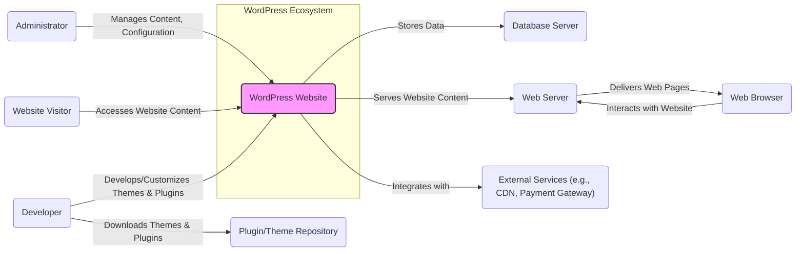
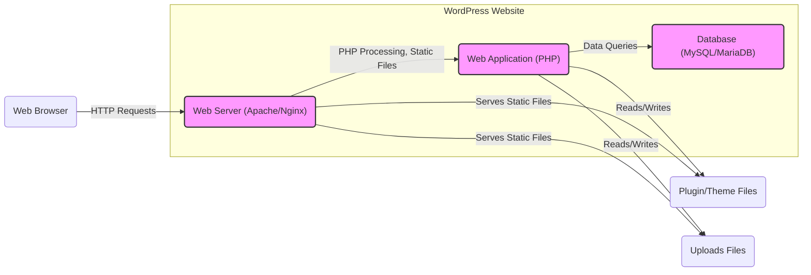
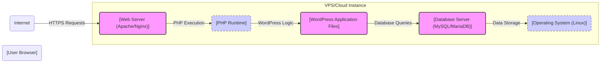

# BUSINESS POSTURE

WordPress is an open-source Content Management System (CMS) focused on providing a flexible and user-friendly platform for creating and managing websites and online content.

- Business Priorities and Goals:
  - Democratize publishing and make it accessible to everyone, regardless of technical skill.
  - Maintain a large and active open-source community to ensure continuous development, support, and innovation.
  - Provide a highly customizable and extensible platform through themes and plugins.
  - Ensure the platform is reliable, performant, and secure for millions of websites globally.

- Business Risks:
  - Security vulnerabilities in the core platform, themes, or plugins could lead to widespread website compromises and damage to user trust.
  - Scalability issues could impact the performance and availability of websites, especially during peak traffic.
  - Community fragmentation or decline could slow down development and innovation.
  - Competition from other CMS platforms and website builders could reduce market share.
  - Misuse of the platform for malicious purposes (e.g., hosting malware, spreading misinformation) could damage the reputation of WordPress and the open-source community.

# SECURITY POSTURE

WordPress, being a widely used open-source CMS, has a significant focus on security, but also faces inherent risks due to its extensibility and community-driven nature.

- Existing Security Controls:
  - security control: Regular security updates and patches for the core WordPress software. (Implemented by WordPress core development team and distributed through automatic updates and manual downloads).
  - security control: Plugin and theme security review process (partially implemented through the WordPress.org plugin/theme repository guidelines and community reviews, but not a formal security audit for all submissions).
  - security control: Security-focused development practices within the core team (documented in WordPress development guidelines and reflected in code commit history).
  - security control: User roles and permissions system to control access to administrative functions (implemented within WordPress core).
  - security control: Input sanitization and output escaping to prevent common web vulnerabilities like XSS (implemented throughout WordPress core, but plugin/theme developers are responsible for their code).
  - security control: Password hashing for user credentials (implemented within WordPress core using modern hashing algorithms).
  - security control: HTTPS support and recommendation for secure communication (documented in WordPress best practices and hosting requirements).

- Accepted Risks:
  - accepted risk: Security vulnerabilities in third-party plugins and themes due to the vast and open nature of the ecosystem.
  - accepted risk: Misconfiguration of WordPress instances by users leading to security weaknesses.
  - accepted risk: Social engineering attacks targeting WordPress administrators and users.
  - accepted risk: Distributed Denial of Service (DDoS) attacks against WordPress websites.
  - accepted risk: Brute-force attacks against login pages.

- Recommended Security Controls:
  - security control: Implement automated security scanning (SAST/DAST) in the WordPress core development pipeline.
  - security control: Enhance plugin and theme security review process with more rigorous automated and manual security checks before inclusion in the official repository.
  - security control: Provide more comprehensive security hardening guidelines and tools for WordPress administrators.
  - security control: Encourage and facilitate the adoption of multi-factor authentication (MFA) for WordPress user accounts.
  - security control: Implement rate limiting and brute-force protection mechanisms at the server level to protect login pages.

- Security Requirements:
  - Authentication:
    - Requirement: Secure user authentication mechanism for administrators, editors, and other user roles. (Implemented by WordPress core user management system).
    - Requirement: Support for strong passwords and password complexity enforcement. (Partially implemented by WordPress core, plugins can enhance password policies).
    - Requirement: Consider integration with external authentication providers (e.g., OAuth, SAML) for enterprise environments. (Achieved through plugins).
  - Authorization:
    - Requirement: Role-based access control (RBAC) to manage user permissions and access to different functionalities. (Implemented by WordPress core user roles and capabilities system).
    - Requirement: Principle of least privilege should be applied when assigning user roles. (User responsibility during WordPress setup and administration).
  - Input Validation:
    - Requirement: Robust input validation and sanitization for all user-supplied data to prevent injection attacks (SQL injection, XSS, etc.). (Partially implemented by WordPress core, plugin/theme developers are responsible for their code).
    - Requirement: Validation should be performed on both client-side and server-side. (Best practice for web development, WordPress core focuses on server-side).
  - Cryptography:
    - Requirement: Use of strong encryption algorithms for sensitive data at rest and in transit. (Password hashing implemented in core, HTTPS for transit security is recommended).
    - Requirement: Secure storage and management of cryptographic keys if used for plugin functionalities (e.g., encryption plugins). (Plugin developer responsibility).
    - Requirement: Proper handling of sensitive data in code and logs to avoid exposure. (WordPress core development practice, plugin/theme developer responsibility).

# DESIGN

WordPress is designed as a modular and extensible CMS, allowing users to create diverse websites. Its architecture is based on a core system with plugin and theme extensions.

## C4 CONTEXT

- Context Diagram Elements:
  - Element:
    - Name: WordPress Website
    - Type: Software System
    - Description: The WordPress Content Management System, providing website functionality and content management capabilities.
    - Responsibilities:
      - Managing website content (posts, pages, media).
      - Handling user requests and serving web pages.
      - Managing user accounts and permissions.
      - Providing an extensible platform for plugins and themes.
    - Security controls:
      - security control: Core security features (authentication, authorization, input validation).
      - security control: Regular security updates.
      - security control: Security configuration options (e.g., HTTPS enforcement).

  - Element:
    - Name: Administrator
    - Type: User Role
    - Description: Users with full control over the WordPress website, responsible for content management, configuration, and user management.
    - Responsibilities:
      - Creating and managing website content.
      - Configuring website settings.
      - Installing and managing plugins and themes.
      - Managing user accounts and permissions.
    - Security controls:
      - security control: Strong password policy.
      - security control: Multi-factor authentication (recommended).
      - security control: Principle of least privilege (only grant necessary permissions).

  - Element:
    - Name: Website Visitor
    - Type: User Role
    - Description: Public users who access and view the website content.
    - Responsibilities:
      - Viewing website content.
      - Interacting with website features (e.g., comments, forms).
    - Security controls:
      - security control: Protection against malicious content served by the website (website responsibility).
      - security control: Secure communication (HTTPS).

  - Element:
    - Name: Developer
    - Type: User Role
    - Description: Users who develop and customize WordPress themes and plugins, extending the functionality and appearance of WordPress websites.
    - Responsibilities:
      - Developing themes and plugins.
      - Contributing to WordPress core.
      - Ensuring the security and quality of their code.
    - Security controls:
      - security control: Secure coding practices.
      - security control: Code review and testing.
      - security control: Adherence to WordPress coding standards and security guidelines.

  - Element:
    - Name: Database Server
    - Type: Infrastructure Component
    - Description: Stores website data, including content, user information, and configuration settings. Typically MySQL or MariaDB.
    - Responsibilities:
      - Storing and retrieving website data.
      - Ensuring data integrity and availability.
    - Security controls:
      - security control: Database access control (restrict access to authorized users/processes).
      - security control: Regular database backups.
      - security control: Database server hardening.
      - security control: Encryption at rest (if required by regulations or sensitivity of data).

  - Element:
    - Name: Web Server
    - Type: Infrastructure Component
    - Description: Serves website content to users' browsers. Typically Apache or Nginx.
    - Responsibilities:
      - Handling HTTP requests.
      - Serving static and dynamic content.
      - Managing website traffic.
    - Security controls:
      - security control: Web server hardening.
      - security control: HTTPS configuration.
      - security control: Web Application Firewall (WAF) (optional, recommended for higher security).
      - security control: Rate limiting and DDoS protection (optional, recommended for high traffic websites).

  - Element:
    - Name: Web Browser
    - Type: Software System
    - Description: User's web browser used to access and interact with the WordPress website.
    - Responsibilities:
      - Rendering web pages.
      - Executing client-side scripts.
      - Interacting with the website.
    - Security controls:
      - security control: Browser security features (e.g., Content Security Policy (CSP) enforced by the website).
      - security control: User responsibility to keep browser updated and use security extensions.

  - Element:
    - Name: Plugin/Theme Repository
    - Type: Software System
    - Description: Central repository (e.g., WordPress.org) where users can download and install WordPress plugins and themes.
    - Responsibilities:
      - Hosting and distributing plugins and themes.
      - Providing a platform for developers to share their extensions.
      - (Limited) Security review of submitted plugins and themes.
    - Security controls:
      - security control: Plugin/theme submission guidelines and review process.
      - security control: Malware scanning of uploaded files.
      - security control: User ratings and community feedback.

  - Element:
    - Name: External Services
    - Type: Software System
    - Description: External services integrated with WordPress for additional functionalities, such as CDNs, payment gateways, email services, analytics, etc.
    - Responsibilities:
      - Providing specific functionalities to the WordPress website.
      - Handling data exchange with WordPress.
    - Security controls:
      - security control: Secure API integrations (HTTPS, API keys, authentication).
      - security control: Data privacy and security policies of external service providers.
      - security control: Regular review of integrated services and their security posture.

## C4 CONTAINER

- Container Diagram Elements:
  - Element:
    - Name: Web Application (PHP)
    - Type: Container
    - Description: WordPress core PHP application code, along with plugins and themes. Runs within the web server environment.
    - Responsibilities:
      - Handling dynamic content generation.
      - Processing user requests.
      - Interacting with the database.
      - Managing plugins and themes.
      - Implementing business logic of WordPress.
    - Security controls:
      - security control: Input validation and output escaping within PHP code.
      - security control: Secure coding practices in WordPress core, plugins, and themes.
      - security control: Regular security updates for WordPress core.
      - security control: Vulnerability scanning of PHP code (SAST).

  - Element:
    - Name: Database (MySQL/MariaDB)
    - Type: Container
    - Description: Relational database system used to store WordPress data.
    - Responsibilities:
      - Storing website content, user data, and configuration.
      - Providing data persistence.
      - Handling database queries from the web application.
    - Security controls:
      - security control: Database access control (user permissions, firewall).
      - security control: SQL injection prevention in web application code.
      - security control: Regular database backups.
      - security control: Database server hardening.
      - security control: Encryption at rest (optional).

  - Element:
    - Name: Web Server (Apache/Nginx)
    - Type: Container
    - Description: Web server software responsible for handling HTTP requests and serving website content.
    - Responsibilities:
      - Accepting HTTP requests from browsers.
      - Serving static files (HTML, CSS, JavaScript, images).
      - Forwarding dynamic requests to the PHP application.
      - Handling SSL/TLS termination (HTTPS).
    - Security controls:
      - security control: Web server hardening (configuration, access control).
      - security control: HTTPS configuration (TLS certificates).
      - security control: Web Application Firewall (WAF) (optional).
      - security control: DDoS protection (optional).
      - security control: Rate limiting (optional).

  - Element:
    - Name: Plugin/Theme Files
    - Type: Data Store
    - Description: File system directory where WordPress plugins and themes are stored.
    - Responsibilities:
      - Storing plugin and theme code files.
      - Providing access to plugin and theme files for the web application and web server.
    - Security controls:
      - security control: File system permissions (restrict write access).
      - security control: Regular security updates for plugins and themes.
      - security control: Plugin/theme security reviews (limited).

  - Element:
    - Name: Uploads Files
    - Type: Data Store
    - Description: File system directory where user-uploaded media files (images, documents, etc.) are stored.
    - Responsibilities:
      - Storing user-uploaded files.
      - Providing access to uploaded files for the web application and web server.
    - Security controls:
      - security control: File system permissions (restrict execution of uploaded files).
      - security control: Input validation and sanitization of uploaded files to prevent malicious uploads.
      - security control: Regular backups of uploads directory.

## DEPLOYMENT

WordPress can be deployed in various environments, from shared hosting to cloud platforms. A common deployment architecture is using a Virtual Private Server (VPS) or cloud instance.

- Deployment Diagram Elements:
  - Element:
    - Name: Operating System (Linux)
    - Type: Infrastructure
    - Description: Underlying operating system of the VPS or cloud instance, typically a Linux distribution.
    - Responsibilities:
      - Providing the base environment for running all software components.
      - Managing system resources (CPU, memory, disk).
      - Providing network connectivity.
    - Security controls:
      - security control: OS hardening (patching, firewall, access control).
      - security control: Regular OS updates.
      - security control: Security monitoring and logging.

  - Element:
    - Name: Web Server (Apache/Nginx)
    - Type: Software
    - Description: Web server software installed on the OS to handle HTTP requests.
    - Responsibilities:
      - Listening for HTTP/HTTPS requests on specified ports.
      - Serving static files.
      - Proxying dynamic requests to the PHP runtime.
    - Security controls:
      - security control: Web server hardening (configuration, modules).
      - security control: HTTPS configuration (TLS certificates).
      - security control: Access logging.

  - Element:
    - Name: PHP Runtime
    - Type: Software
    - Description: PHP interpreter and runtime environment required to execute WordPress PHP code.
    - Responsibilities:
      - Executing PHP scripts.
      - Providing necessary PHP extensions for WordPress.
    - Security controls:
      - security control: PHP runtime hardening (disable unnecessary functions, configure security settings).
      - security control: Regular PHP updates.
      - security control: PHP error logging (securely configured).

  - Element:
    - Name: WordPress Application Files
    - Type: Software
    - Description: WordPress core files, plugins, and themes deployed on the server's file system.
    - Responsibilities:
      - Containing the WordPress application code.
      - Being accessed and executed by the PHP runtime.
    - Security controls:
      - security control: File system permissions (restrict write access).
      - security control: Regular WordPress core, plugin, and theme updates.
      - security control: File integrity monitoring (optional).

  - Element:
    - Name: Database Server (MySQL/MariaDB)
    - Type: Software
    - Description: Database server software installed on the OS to store WordPress data.
    - Responsibilities:
      - Managing the WordPress database.
      - Storing and retrieving data.
    - Security controls:
      - security control: Database server hardening (configuration, access control).
      - security control: Database access control (user permissions, firewall).
      - security control: Regular database backups.
      - security control: Database audit logging.

## BUILD

The WordPress build process involves development, contribution, testing, and release management. For a typical WordPress website deployment, the "build" is more about assembling the components (WordPress core, plugins, themes) and configuring them. For WordPress core development itself, there is a more formal build and release process.

```mermaid
flowchart LR
    developer("Developer") --> code_repo("Code Repository (GitHub)")
    code_repo -- "Code Changes, Contributions" --> ci_pipeline("CI/CD Pipeline (WordPress.org Infrastructure)")
    ci_pipeline -- "Automated Builds, Tests, Security Checks" --> build_artifacts("Build Artifacts (ZIP Packages)")
    build_artifacts -- "Release & Distribution" --> wordpress_org("WordPress.org Download Servers")
    wordpress_org -- "Download WordPress" --> website_admin("Website Administrator")

    style ci_pipeline fill:#f9f,stroke:#333,stroke-width:2px
    style build_artifacts fill:#f9f,stroke:#333,stroke-width:2px
```

- Build Diagram Elements:
  - Element:
    - Name: Developer
    - Type: Actor
    - Description: WordPress core developers, plugin/theme developers, and community contributors who write and contribute code.
    - Responsibilities:
      - Writing and maintaining code.
      - Following coding standards and security guidelines.
      - Contributing to the WordPress project.
    - Security controls:
      - security control: Secure coding practices.
      - security control: Code review process.
      - security control: Developer training on security.

  - Element:
    - Name: Code Repository (GitHub)
    - Type: Software System
    - Description: GitHub repository hosting the WordPress core code and plugin/theme repositories.
    - Responsibilities:
      - Version control of the codebase.
      - Collaboration platform for developers.
      - Tracking code changes and issues.
    - Security controls:
      - security control: Access control to the repository (permissions).
      - security control: Branch protection and code review requirements.
      - security control: Audit logging of repository activities.

  - Element:
    - Name: CI/CD Pipeline (WordPress.org Infrastructure)
    - Type: Software System
    - Description: Automated system for building, testing, and releasing WordPress core and potentially plugins/themes.
    - Responsibilities:
      - Automating the build process.
      - Running automated tests (unit, integration, security).
      - Performing security checks (SAST, linters).
      - Creating build artifacts (ZIP packages).
    - Security controls:
      - security control: Secure build environment.
      - security control: Automated security scanning (SAST, linters).
      - security control: Dependency vulnerability scanning.
      - security control: Access control to the CI/CD pipeline.
      - security control: Audit logging of build and release processes.

  - Element:
    - Name: Build Artifacts (ZIP Packages)
    - Type: Data Store
    - Description: ZIP files containing the compiled and packaged WordPress core, plugins, or themes, ready for distribution.
    - Responsibilities:
      - Storing the build outputs.
      - Ensuring integrity of the build artifacts.
    - Security controls:
      - security control: Secure storage of build artifacts.
      - security control: Integrity checks (checksums, signatures) for build artifacts.
      - security control: Access control to build artifact storage.

  - Element:
    - Name: WordPress.org Download Servers
    - Type: Software System
    - Description: Servers hosting the WordPress.org website and distributing WordPress core, plugins, and themes to users.
    - Responsibilities:
      - Distributing WordPress software to users worldwide.
      - Ensuring availability and performance of downloads.
    - Security controls:
      - security control: Secure server infrastructure.
      - security control: DDoS protection.
      - security control: Content Delivery Network (CDN) for distribution.
      - security control: Integrity checks (checksums) for downloaded files.

  - Element:
    - Name: Website Administrator
    - Type: Actor
    - Description: Users who download and install WordPress to set up their websites.
    - Responsibilities:
      - Downloading WordPress from official sources.
      - Installing and configuring WordPress on their servers.
      - Maintaining and updating their WordPress websites.
    - Security controls:
      - security control: Downloading WordPress from trusted sources (WordPress.org).
      - security control: Following secure installation and configuration guidelines.
      - security control: Regularly updating WordPress core, plugins, and themes.

# RISK ASSESSMENT

- Critical Business Processes:
  - Website Availability: Ensuring websites powered by WordPress are accessible to users. Downtime can lead to loss of revenue, reputation damage, and user dissatisfaction.
  - Content Management: Protecting the integrity and confidentiality of website content. Unauthorized modification or deletion of content can disrupt operations and damage brand reputation.
  - User Data Protection: Safeguarding user data (e.g., user accounts, comments, personal information) from unauthorized access, modification, or disclosure. Data breaches can lead to legal liabilities, fines, and loss of user trust.
  - Plugin and Theme Ecosystem Integrity: Maintaining the security and trustworthiness of the WordPress plugin and theme ecosystem. Malicious or vulnerable plugins/themes can compromise website security and user data.

- Data Sensitivity:
  - High Sensitivity:
    - User Credentials (passwords, API keys): Confidentiality and integrity are critical to prevent unauthorized access.
    - Personally Identifiable Information (PII) of website users (if collected and stored): Confidentiality and integrity are crucial to comply with privacy regulations and maintain user trust.
    - Database backups: Confidentiality and integrity are essential to ensure data recovery and prevent unauthorized access to sensitive data.
  - Medium Sensitivity:
    - Website Content (posts, pages, media): Integrity and availability are important to maintain website functionality and brand reputation.
    - WordPress Configuration Data: Integrity and confidentiality are important to prevent misconfiguration and unauthorized access to website settings.
  - Low Sensitivity:
    - WordPress Core Code: Publicly available open-source code. Availability is important for website functionality.
    - Plugin and Theme Code: Publicly available open-source code (mostly). Availability is important for website functionality.

# QUESTIONS & ASSUMPTIONS

- Questions:
  - What are the specific security testing methodologies used in the WordPress core development CI/CD pipeline?
  - What is the formal process for security review of plugins and themes submitted to the WordPress.org repository?
  - Are there specific security certifications or compliance standards that WordPress core development adheres to?
  - What are the typical incident response procedures for security vulnerabilities discovered in WordPress core?

- Assumptions:
  - BUSINESS POSTURE:
    - The primary business goal is to maintain WordPress as the leading open-source CMS by ensuring its usability, extensibility, and security.
    - User trust and community support are critical for the success of WordPress.
  - SECURITY POSTURE:
    - WordPress core development team prioritizes security and actively addresses reported vulnerabilities.
    - The open-source nature of WordPress allows for community scrutiny and contribution to security improvements.
    - Users are responsible for properly configuring and maintaining the security of their WordPress installations, including plugins and themes.
  - DESIGN:
    - The described C4 Context, Container, Deployment, and Build diagrams represent a typical and simplified view of WordPress architecture.
    - The security controls listed are common best practices and may not be exhaustive.
    - The deployment model assumes a self-hosted WordPress instance on a VPS or cloud environment, which is a common scenario.