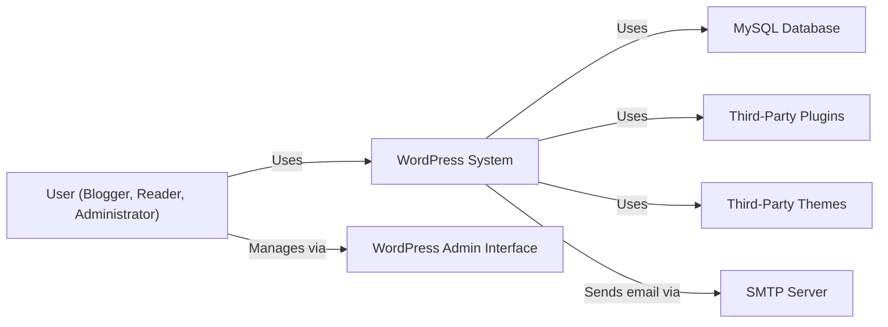
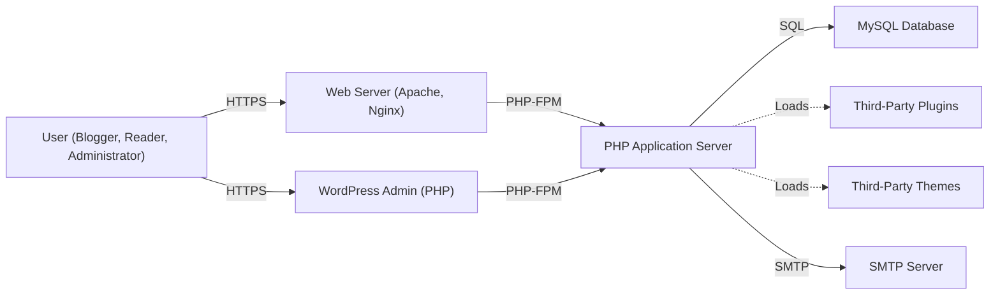
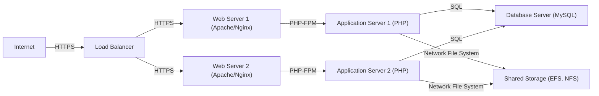
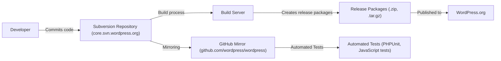

# BUSINESS POSTURE

WordPress is a widely-used, open-source content management system (CMS). Its ubiquity makes it a high-value target for attackers. The business priorities revolve around maintaining a stable, secure, and user-friendly platform that can be used by a wide range of users, from individual bloggers to large enterprises.

Business Priorities:

*   Maintainability: Easy to update and maintain, ensuring long-term viability.
*   Extensibility: Allow users to extend functionality via plugins and themes.
*   Usability: Simple and intuitive interface for users with varying technical skills.
*   Performance: Fast loading times and efficient resource utilization.
*   Security: Protect user data and prevent website defacement or compromise.
*   Community: Foster a large and active community of users and developers.
*   Reputation: Maintain a positive reputation as a reliable and secure CMS.

Business Goals:

*   Provide a platform for creating and managing websites.
*   Enable users to easily publish content online.
*   Offer a wide range of customization options.
*   Support a large ecosystem of plugins and themes.
*   Ensure the platform is secure and reliable.

Most Important Business Risks:

*   Website Defacement/Compromise: Unauthorized modification of website content or functionality.
*   Data Breaches: Exposure of sensitive user data (passwords, personal information).
*   Denial of Service: Attacks that make websites unavailable to legitimate users.
*   Plugin/Theme Vulnerabilities: Exploitation of security flaws in third-party extensions.
*   Reputation Damage: Loss of trust due to security incidents or poor performance.
*   Spam and Malicious Content: Abuse of the platform for distributing spam or malware.

# SECURITY POSTURE

Existing Security Controls:

*   security control: Input Validation: WordPress core includes functions for sanitizing and validating user input to prevent common vulnerabilities like Cross-Site Scripting (XSS) and SQL Injection. Implemented in core functions like `esc_html()`, `esc_attr()`, `sanitize_text_field()`, and the `wpdb` class.
*   security control: Output Encoding: WordPress uses functions to encode output, preventing XSS vulnerabilities. Implemented in core functions like `esc_html()`, `esc_attr()`, etc.
*   security control: Authentication: WordPress uses a cookie-based authentication system with password hashing (using PHPass). Implemented in the authentication system, including functions like `wp_authenticate()`, `wp_set_password()`, and related functions.
*   security control: Authorization: WordPress has a role-based access control (RBAC) system to manage user permissions. Implemented in the user roles and capabilities system, including functions like `current_user_can()`, `add_role()`, `add_cap()`, etc.
*   security control: File Permissions: WordPress recommends specific file and directory permissions to limit access. Described in documentation and often enforced by hosting providers.
*   security control: Database Security: WordPress uses prepared statements (via the `$wpdb` class) to protect against SQL injection. Implemented in the `$wpdb` class and its methods.
*   security control: Regular Updates: WordPress provides a built-in update mechanism for core, plugins, and themes. Implemented in the update system, accessible via the WordPress dashboard.
*   security control: Security Plugins: Many security plugins are available to enhance WordPress security (e.g., Wordfence, Sucuri Security). Implemented as third-party plugins.
*   security control: Nonces: WordPress uses nonces (number used once) to protect against Cross-Site Request Forgery (CSRF) attacks. Implemented in functions like `wp_nonce_field()`, `wp_verify_nonce()`.

Accepted Risks:

*   accepted risk: Third-Party Plugin/Theme Vulnerabilities: WordPress's extensibility relies on third-party plugins and themes, which are a common source of vulnerabilities. Users are responsible for choosing reputable plugins/themes and keeping them updated.
*   accepted risk: Brute-Force Attacks: While WordPress has some built-in protection, brute-force attacks against login pages remain a risk. Mitigation is often handled by security plugins or server-level configurations.
*   accepted risk: User Error: Misconfiguration or weak passwords can compromise security, despite the platform's built-in features.

Recommended Security Controls:

*   Implement Web Application Firewall (WAF): A WAF can provide an additional layer of defense against common web attacks.
*   Implement Two-Factor Authentication (2FA): 2FA adds a significant layer of security to user accounts.
*   Implement Content Security Policy (CSP): CSP helps mitigate XSS and other code injection attacks.
*   Implement Regular Security Audits: Periodic security audits (both automated and manual) can identify vulnerabilities.
*   Implement Hardening Measures: Various hardening techniques (e.g., disabling XML-RPC if not needed, disabling file editing in the dashboard) can improve security.

Security Requirements:

*   Authentication:
    *   Strong password policies (minimum length, complexity requirements).
    *   Protection against brute-force attacks (rate limiting, account lockout).
    *   Secure password storage (hashing and salting).
    *   Support for two-factor authentication (2FA).
    *   Secure session management (cookie security, session expiration).

*   Authorization:
    *   Fine-grained access control based on user roles and capabilities.
    *   Principle of least privilege (users should only have access to what they need).
    *   Protection against privilege escalation attacks.

*   Input Validation:
    *   Strict validation of all user input (including data from forms, URLs, and cookies).
    *   Whitelist validation (accepting only known good input) whenever possible.
    *   Sanitization of input to remove potentially harmful characters.

*   Cryptography:
    *   Use of strong, industry-standard cryptographic algorithms (e.g., AES, RSA, SHA-256).
    *   Secure key management practices.
    *   Protection of sensitive data in transit (using HTTPS).
    *   Protection of sensitive data at rest (e.g., database encryption).

# DESIGN

## C4 CONTEXT

Element Descriptions:

*   Element:
    *   Name: User (Blogger, Reader, Administrator)
    *   Type: Person
    *   Description: A person interacting with the WordPress website. This can be a content creator (blogger), a website visitor (reader), or a site administrator.
    *   Responsibilities:
        *   Blogger: Creating and publishing content.
        *   Reader: Viewing and interacting with content.
        *   Administrator: Managing the website, users, and content.
    *   Security controls: Authentication, Authorization, 2FA (if enabled).

*   Element:
    *   Name: WordPress System
    *   Type: Software System
    *   Description: The core WordPress application, including all core files and functionalities.
    *   Responsibilities:
        *   Content management.
        *   User management.
        *   Plugin and theme management.
        *   Rendering web pages.
        *   Handling user requests.
    *   Security controls: Input validation, Output encoding, Authentication, Authorization, Nonces, Regular updates.

*   Element:
    *   Name: MySQL Database
    *   Type: Database
    *   Description: The database used to store WordPress data, including posts, pages, users, and settings.
    *   Responsibilities:
        *   Storing and retrieving data.
        *   Ensuring data integrity.
    *   Security controls: Database user access control, Prepared statements, Encryption (if configured).

*   Element:
    *   Name: Third-Party Plugins
    *   Type: Software System
    *   Description: Optional extensions that add functionality to WordPress.
    *   Responsibilities: Varies depending on the plugin.
    *   Security controls: Dependent on the individual plugin; ideally, they should follow WordPress security best practices.

*   Element:
    *   Name: Third-Party Themes
    *   Type: Software System
    *   Description: Templates that control the visual appearance of the WordPress website.
    *   Responsibilities: Defining the website's layout and design.
    *   Security controls: Dependent on the individual theme; ideally, they should follow WordPress security best practices.

*   Element:
    *   Name: SMTP Server
    *   Type: Software System
    *   Description: An external server used for sending emails (e.g., password reset emails, notifications).
    *   Responsibilities: Sending emails on behalf of the WordPress website.
    *   Security controls: Secure connection (TLS/SSL), Authentication.

*   Element:
    *   Name: WordPress Admin Interface
    *   Type: Web Application
    *   Description: The web-based interface used to manage the WordPress website.
    *   Responsibilities:
        *   Providing access to administrative functions.
        *   User interface for managing content, users, settings, etc.
    *   Security controls: Authentication, Authorization, Input validation, Output encoding, Nonces.

## C4 CONTAINER

Element Descriptions:

*   Element:
    *   Name: User (Blogger, Reader, Administrator)
    *   Type: Person
    *   Description: A person interacting with the WordPress website.
    *   Responsibilities:
        *   Blogger: Creating and publishing content.
        *   Reader: Viewing and interacting with content.
        *   Administrator: Managing the website, users, and content.
    *   Security controls: Authentication, Authorization, 2FA (if enabled).

*   Element:
    *   Name: Web Server (Apache, Nginx)
    *   Type: Web Server
    *   Description: The web server that receives HTTP requests and serves web pages.
    *   Responsibilities:
        *   Handling HTTP requests.
        *   Serving static content (images, CSS, JavaScript).
        *   Passing PHP requests to the PHP application server.
    *   Security controls: Web server configuration hardening, TLS/SSL (HTTPS), WAF (if configured).

*   Element:
    *   Name: PHP Application Server
    *   Type: Application Server
    *   Description: The server that executes PHP code (WordPress core, plugins, and themes).
    *   Responsibilities:
        *   Executing PHP code.
        *   Interacting with the database.
        *   Generating dynamic content.
    *   Security controls: PHP configuration hardening, Input validation, Output encoding, Secure coding practices.

*   Element:
    *   Name: MySQL Database
    *   Type: Database
    *   Description: The database used to store WordPress data.
    *   Responsibilities:
        *   Storing and retrieving data.
        *   Ensuring data integrity.
    *   Security controls: Database user access control, Prepared statements, Encryption (if configured).

*   Element:
    *   Name: Third-Party Plugins
    *   Type: Software Component
    *   Description: Optional extensions that add functionality to WordPress.
    *   Responsibilities: Varies depending on the plugin.
    *   Security controls: Dependent on the individual plugin.

*   Element:
    *   Name: Third-Party Themes
    *   Type: Software Component
    *   Description: Templates that control the visual appearance of the website.
    *   Responsibilities: Defining the website's layout and design.
    *   Security controls: Dependent on the individual theme.

*   Element:
    *   Name: SMTP Server
    *   Type: Software System
    *   Description: An external server used for sending emails.
    *   Responsibilities: Sending emails on behalf of the WordPress website.
    *   Security controls: Secure connection (TLS/SSL), Authentication.

*   Element:
    *   Name: WordPress Admin (PHP)
    *   Type: Web Application
    *   Description: The PHP code that implements the WordPress admin interface.
    *   Responsibilities:
        *   Providing access to administrative functions.
        *   User interface for managing content, users, settings, etc.
    *   Security controls: Authentication, Authorization, Input validation, Output encoding, Nonces.

## DEPLOYMENT

Possible Deployment Solutions:

1.  Traditional Hosting: Deploying WordPress on a single server (shared, VPS, or dedicated).
2.  Managed WordPress Hosting: Using a hosting provider that specializes in WordPress.
3.  Cloud Hosting (IaaS): Deploying WordPress on cloud infrastructure (e.g., AWS EC2, Google Compute Engine, Azure VMs).
4.  Containerized Deployment (Docker, Kubernetes): Deploying WordPress using containers.
5.  Serverless Deployment: Using serverless functions to handle parts of the WordPress application (less common).

Chosen Solution: Cloud Hosting (IaaS) with High Availability

This solution provides good scalability, reliability, and control.

Element Descriptions:

*   Element:
    *   Name: Internet
    *   Type: Network
    *   Description: The global network connecting users to the WordPress website.
    *   Responsibilities: Routing traffic to the load balancer.
    *   Security controls: None (handled by subsequent components).

*   Element:
    *   Name: Load Balancer
    *   Type: Network Appliance
    *   Description: Distributes incoming traffic across multiple web servers.
    *   Responsibilities:
        *   Load balancing.
        *   Health checks.
        *   SSL termination (optional).
    *   Security controls: DDoS protection (if configured), WAF (if configured).

*   Element:
    *   Name: Web Server 1 / Web Server 2
    *   Type: Virtual Machine
    *   Description: Instances of web servers (Apache or Nginx) running on virtual machines.
    *   Responsibilities:
        *   Handling HTTP requests.
        *   Serving static content.
        *   Passing PHP requests to the application servers.
    *   Security controls: Web server configuration hardening, TLS/SSL (HTTPS).

*   Element:
    *   Name: Application Server 1 / Application Server 2
    *   Type: Virtual Machine
    *   Description: Instances of PHP application servers running on virtual machines.
    *   Responsibilities:
        *   Executing PHP code (WordPress core, plugins, themes).
        *   Interacting with the database.
    *   Security controls: PHP configuration hardening, Input validation, Output encoding.

*   Element:
    *   Name: Database Server (MySQL)
    *   Type: Virtual Machine / Database Service
    *   Description: The database server hosting the WordPress database. Could be a managed database service (e.g., AWS RDS, Google Cloud SQL) or a self-managed MySQL instance on a VM.
    *   Responsibilities:
        *   Storing and retrieving data.
        *   Ensuring data integrity.
    *   Security controls: Database user access control, Prepared statements, Encryption (at rest and in transit), Firewall rules.

*   Element:
    *   Name: Shared Storage (EFS, NFS)
    *   Type: Network File System
    *   Description: A shared storage service used to store files that need to be accessible by multiple application servers (e.g., uploads, themes, plugins).
    *   Responsibilities:
        *   Providing shared file storage.
        *   Ensuring data consistency.
    *   Security controls: Access control lists (ACLs), Encryption (if configured).

## BUILD

WordPress core development uses a combination of Subversion (SVN) and Git (for mirroring).  The build process is not fully automated in the same way as many modern CI/CD pipelines.  However, there are elements of automation and security checks.

Build Process Description:

1.  Developers commit code to the central Subversion repository.
2.  The Subversion repository is mirrored to a GitHub repository for easier access and collaboration.
3.  Automated tests (primarily PHPUnit for PHP code and JavaScript tests for JavaScript code) are run against the codebase. These tests are often triggered by commits or pull requests on the GitHub mirror.
4.  A build server (not fully automated in a CI/CD sense) is used to create release packages (.zip and .tar.gz files) from the Subversion repository. This process involves:
    *   Checking out the code from a specific tag or revision.
    *   Running build scripts (e.g., `grunt build` for JavaScript minification).
    *   Packaging the files into release archives.
5.  The release packages are published on WordPress.org for download.

Security Controls in the Build Process:

*   Code Review: WordPress core development involves extensive code review by multiple developers before changes are merged.
*   Automated Tests: PHPUnit and JavaScript tests help catch bugs and regressions, including some security-related issues.
*   Static Analysis: While not explicitly mentioned in the core build process, some developers and security researchers use static analysis tools to scan the codebase for vulnerabilities.
*   Manual Security Audits: Periodic security audits are conducted by the WordPress security team and external researchers.
*   Vulnerability Disclosure Program: WordPress has a vulnerability disclosure program that encourages security researchers to report vulnerabilities responsibly.

Areas for Improvement (Security):

*   Formalized CI/CD Pipeline: Implementing a more formalized CI/CD pipeline with automated security checks (SAST, DAST, dependency scanning) would significantly improve security.
*   Supply Chain Security: While WordPress core is relatively secure, the reliance on third-party plugins and themes introduces supply chain risks. Better mechanisms for vetting and monitoring plugins/themes are needed.
*   Software Bill of Materials (SBOM): Generating and maintaining an SBOM for WordPress core and potentially for popular plugins/themes would improve transparency and vulnerability management.

# RISK ASSESSMENT

Critical Business Processes to Protect:

*   Website Availability: Ensuring that websites remain accessible to users.
*   Content Integrity: Preventing unauthorized modification or deletion of website content.
*   User Data Management: Protecting user accounts and personal information.
*   Update Mechanism: Ensuring the secure and reliable delivery of updates.
*   Plugin/Theme Ecosystem: Maintaining a reasonably secure and functional ecosystem of extensions.

Data to Protect and Sensitivity:

*   User Passwords: Highly sensitive; must be hashed and salted.
*   User Personal Information (email addresses, names, etc.): Sensitive; requires protection against unauthorized access and disclosure.
*   Website Content (posts, pages, comments): Varies in sensitivity; some content may be public, while other content may be private or confidential.
*   Configuration Data (database credentials, API keys): Highly sensitive; must be protected from unauthorized access.
*   Session Data: Sensitive, as it can be used to hijack user sessions.

# QUESTIONS & ASSUMPTIONS

Questions:

*   What specific cloud provider and services are being used (if applicable)? This impacts the specific security controls available.
*   What is the expected traffic volume and growth rate? This affects scalability requirements.
*   What is the budget for security tools and services?
*   What level of security expertise is available within the team?
*   Are there any specific compliance requirements (e.g., GDPR, HIPAA)?
*   What is the process for managing and updating third-party plugins and themes?
*   Is there a formal incident response plan in place?
*   What is the backup and disaster recovery strategy?

Assumptions:

*   BUSINESS POSTURE: The primary goal is to maintain a secure and reliable platform for a wide range of users. The organization is willing to invest in security measures but may have limitations based on budget and resources.
*   SECURITY POSTURE: The existing security controls are based on WordPress core functionality and best practices. There is an awareness of the risks associated with third-party plugins and themes.
*   DESIGN: The deployment environment is assumed to be a cloud-based infrastructure with high availability. The build process is semi-automated, with a reliance on manual steps and code review.