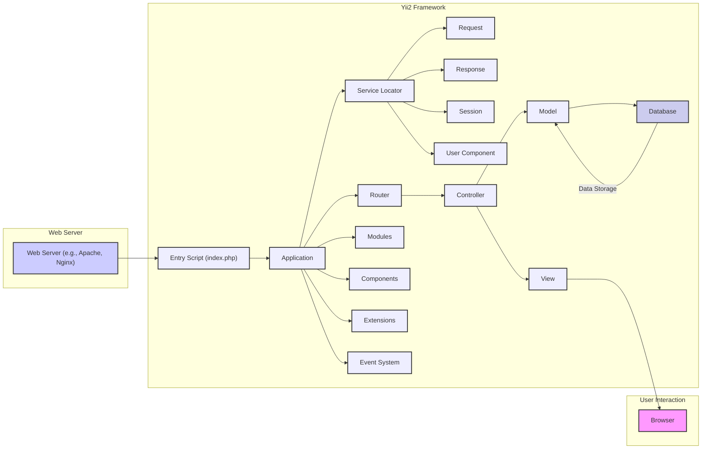

# Project Design Document: Yii2 Framework

**Version:** 1.1
**Date:** October 26, 2023
**Author:** AI Software Architect

## 1. Introduction

This document provides a detailed architectural design of the Yii2 PHP framework, focusing on aspects relevant to security analysis and threat modeling. It outlines the key components, their interactions, and the flow of data within the framework. This document serves as a foundation for identifying potential security vulnerabilities and attack vectors.

## 2. Goals and Objectives

The primary goal of this document is to provide a comprehensive architectural overview of Yii2, specifically tailored for threat modeling purposes. The objectives are to:

*   Clearly identify the major components and sub-components of the Yii2 framework.
*   Thoroughly describe the interactions and data flow between these components, highlighting potential entry and exit points.
*   Provide a detailed understanding of the request lifecycle within Yii2.
*   Elaborate on potential security considerations and areas of concern within the framework's architecture.
*   Serve as a definitive reference for subsequent threat modeling exercises.

## 3. Architectural Overview

Yii2 is a high-performance PHP framework best suited for developing web applications. It adheres to the Model-View-Controller (MVC) architectural pattern, promoting separation of concerns. Beyond the core MVC structure, Yii2 incorporates several key components and features that contribute to its functionality and security posture.

## 4. Component Breakdown

This section provides a detailed breakdown of the key components within the Yii2 framework:

*   **Entry Script (index.php):**
    *   The initial entry point for all web requests.
    *   Responsible for bootstrapping the Yii2 application instance.
    *   Sets up the application environment and includes necessary files.

*   **Application:**
    *   The central object managing the entire application lifecycle.
    *   Acts as a service locator, providing access to various components.
    *   Handles request processing and response generation at a high level.
    *   Manages application-level configurations.

*   **Service Locator:**
    *   A central registry for application components.
    *   Allows for loose coupling and easy access to shared resources.
    *   Components like `request`, `response`, `session`, and `user` are managed here.

*   **Request:**
    *   Represents the incoming HTTP request.
    *   Provides access to request parameters (GET, POST), headers, cookies, and uploaded files.
    *   A crucial entry point for user-supplied data, making it a key area for security considerations.

*   **Response:**
    *   Represents the outgoing HTTP response.
    *   Allows setting response headers, content, and status codes.
    *   Proper handling is essential to prevent information leakage and ensure secure communication.

*   **Session:**
    *   Manages user session data.
    *   Provides mechanisms for storing and retrieving user-specific information across multiple requests.
    *   Security considerations include session fixation, session hijacking, and secure storage of session data.

*   **User Component:**
    *   Handles user authentication and authorization.
    *   Provides methods for logging in, logging out, and checking user permissions.
    *   A critical component for securing access to application resources.

*   **Router:**
    *   Parses the incoming request URL and maps it to a specific controller and action.
    *   Plays a vital role in determining how requests are handled.
    *   Misconfigurations can lead to unintended access or exposure of functionality.

*   **Controller:**
    *   Acts as an intermediary between the Model and the View.
    *   Receives user input from the `Request` component.
    *   Interacts with `Models` to retrieve or manipulate data.
    *   Selects the appropriate `View` to render the response.
    *   Controller actions are often the target of direct user interaction and require careful security considerations.

*   **Model:**
    *   Represents the application's data and business logic.
    *   Typically interacts with data sources like databases.
    *   Enforces data validation rules to ensure data integrity.
    *   Vulnerable models can lead to data breaches or manipulation.

*   **View:**
    *   Responsible for rendering the user interface.
    *   Receives data from the `Controller` and displays it to the user.
    *   Uses template engines to generate HTML or other output formats.
    *   Proper output encoding is crucial to prevent Cross-Site Scripting (XSS) attacks.

*   **Database:**
    *   Provides persistent storage for application data.
    *   Yii2 supports various database systems through its Database Access Objects (DAO) and Active Record.
    *   Secure database configurations and proper query construction are essential to prevent SQL injection attacks.

*   **Modules:**
    *   Self-contained units of functionality with their own controllers, models, and views.
    *   Provide a way to organize and reuse application features.
    *   Security considerations apply to individual modules as well as their interactions.

*   **Components:**
    *   Reusable objects that provide specific functionalities, such as caching, logging, mailing, and security features.
    *   Contribute to the overall functionality and security of the application.

*   **Extensions:**
    *   Packages of code that extend the functionality of the Yii2 framework.
    *   Can introduce new components, modules, or other features.
    *   Security vulnerabilities in extensions can impact the entire application.

*   **Event System:**
    *   Allows components to subscribe to and trigger events.
    *   Provides a mechanism for decoupling components and extending functionality.
    *   Improperly secured event handlers could introduce vulnerabilities.

## 5. Data Flow

The typical data flow for a web request in Yii2 can be broken down into the following steps:

1. **User Request:** A user initiates a request through their browser (A).
2. **Web Server Reception:** The web server (B) receives the HTTP request.
3. **Entry Script Invocation:** The web server forwards the request to the `index.php` entry script (C).
4. **Application Bootstrapping:** The entry script initializes the `Application` (D) instance.
5. **Request Handling:** The `Application` utilizes the `Service Locator` (E) to access core components like `Request` (F).
6. **Routing:** The `Router` (J) analyzes the request URL from the `Request` component.
7. **Controller Resolution:** The `Router` determines the appropriate `Controller` (K) and action to handle the request.
8. **Controller Action Execution:** The specified action within the `Controller` is executed.
9. **Model Interaction:** The `Controller` may interact with `Models` (L) to retrieve or manipulate data, potentially involving database interaction (N).
10. **View Selection:** The `Controller` selects a `View` (M) to render the response.
11. **View Rendering:** The `View` uses data provided by the `Controller` to generate the output (e.g., HTML).
12. **Response Generation:** The rendered output is passed to the `Response` component (G).
13. **Response Transmission:** The `Response` is sent back to the web server (B).
14. **User Delivery:** The web server sends the response back to the user's browser (A).

## 6. Security Considerations

Based on the architecture and data flow, several key security considerations arise:

*   **Input Validation and Sanitization:**
    *   All user-supplied data entering through the `Request` component (query parameters, POST data, headers, cookies, file uploads) must be rigorously validated and sanitized to prevent injection attacks (SQL Injection, Cross-Site Scripting - XSS, Command Injection, etc.).
    *   Consider validation at both the model layer and the controller layer.

*   **Authentication and Authorization:**
    *   The `User Component` and related mechanisms must be robustly implemented to verify user identities and control access to resources.
    *   Implement strong password policies, multi-factor authentication where appropriate, and secure session management.
    *   Authorization checks should be performed before granting access to sensitive data or functionality.

*   **Cross-Site Request Forgery (CSRF) Protection:**
    *   Yii2 provides built-in CSRF protection mechanisms that should be enabled and properly configured to prevent malicious websites from performing unauthorized actions on behalf of authenticated users.

*   **Session Management Security:**
    *   Configure secure session settings, including using HTTP-only and secure flags for cookies.
    *   Implement measures to prevent session fixation and session hijacking.
    *   Consider using secure session storage mechanisms.

*   **Output Encoding:**
    *   Ensure that all data rendered in `Views` is properly encoded to prevent XSS vulnerabilities. Use appropriate encoding functions based on the output context (HTML, JavaScript, URL).

*   **Database Security:**
    *   Employ parameterized queries or prepared statements when interacting with the database through `Models` to prevent SQL injection attacks.
    *   Follow the principle of least privilege when granting database access to the application.
    *   Securely store database credentials.

*   **File Upload Security:**
    *   Implement strict validation on file uploads, including file type, size, and content.
    *   Store uploaded files outside the webroot and prevent direct access.
    *   Scan uploaded files for malware.

*   **Error Handling and Logging:**
    *   Implement secure error handling to avoid leaking sensitive information in error messages.
    *   Maintain comprehensive and secure logs for auditing, debugging, and incident response. Ensure logs do not contain sensitive data.

*   **Dependency Management:**
    *   Regularly update Yii2 core and all extensions to patch known vulnerabilities.
    *   Use a dependency management tool like Composer to manage and track dependencies.
    *   Be aware of the security posture of third-party libraries.

*   **Security Headers:**
    *   Configure appropriate HTTP security headers in the `Response` component to enhance security (e.g., Content Security Policy (CSP), HTTP Strict Transport Security (HSTS), X-Frame-Options, X-Content-Type-Options).

*   **Secure Communication (HTTPS):**
    *   Enforce HTTPS to encrypt communication between the user's browser and the web server, protecting sensitive data in transit.

*   **Event System Security:**
    *   Carefully consider the security implications of event handlers, especially those that handle sensitive data or trigger critical actions.

## 7. Assumptions and Constraints

*   This document describes the general architecture of the Yii2 framework. Specific application implementations may introduce custom components, middleware, or configurations that are not explicitly covered here.
*   The security considerations listed are not exhaustive and should be further explored during a dedicated threat modeling exercise.
*   It is assumed that the underlying server infrastructure and PHP environment are also configured securely.

## 8. Future Considerations

*   Detailed design of specific security components and features within Yii2 (e.g., the security component, authentication methods).
*   Integration with external authentication and authorization providers (e.g., OAuth 2.0, SAML).
*   Security considerations for RESTful APIs built with Yii2.
*   Deployment architecture and security best practices for different deployment environments.
*   Regular review and updates to this document to reflect changes in the Yii2 framework and evolving security threats.
