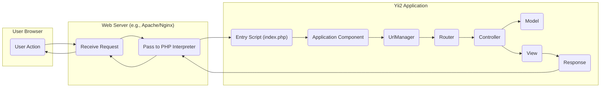
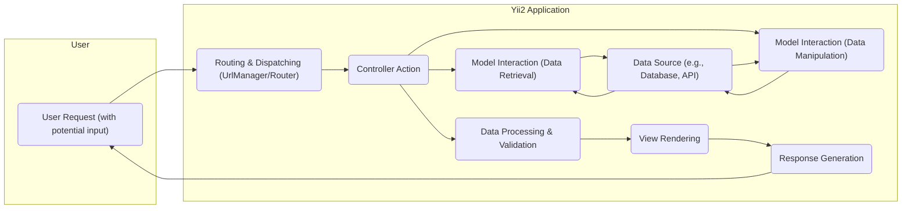

## Project Design Document: Yii Framework 2 (Improved)

**1. Introduction**

This document provides an enhanced design overview of the Yii Framework 2 (Yii2), a high-performance PHP framework particularly well-suited for developing diverse web applications. The primary objective of this document is to offer a detailed understanding of the framework's architecture, its core components, and the flow of data within it. This detailed design serves as a crucial foundation for subsequent threat modeling activities, enabling a more thorough and effective security analysis.

**2. Goals**

*   Deliver a clear and comprehensive description of the Yii2 framework's architecture and its constituent components.
*   Accurately identify and illustrate the key data flows and interactions that occur within the framework during request processing.
*   Highlight specific areas of potential security concern within the Yii2 framework to guide future threat modeling efforts.
*   Serve as a reliable and detailed reference point for security assessments, architectural reviews, and development best practices.

**3. Target Audience**

This document is primarily intended for:

*   Security engineers and architects who are responsible for conducting threat modeling and security assessments of applications built with the Yii2 framework.
*   Developers actively working with Yii2 who require a deeper and more nuanced understanding of the framework's internal workings and architecture.
*   DevOps engineers and system administrators involved in the deployment, configuration, and ongoing maintenance of Yii2 applications and their underlying infrastructure.

**4. System Architecture**

Yii2 is built upon the Model-View-Controller (MVC) architectural pattern, which promotes separation of concerns and enhances code organization. The typical lifecycle of a web request within a Yii2 application involves the following sequence of steps:

*   A user initiates an action within their web browser, such as clicking a link, submitting a form, or navigating to a specific URL.
*   The web server (e.g., Apache or Nginx), acting as the entry point, receives the incoming HTTP request.
*   The web server then forwards the request to the PHP interpreter, which is responsible for executing the PHP code.
*   The Yii2 application's entry script (typically `index.php` for web requests) is executed. This script bootstraps the application environment.
*   The application's central `Application` component takes control, managing the request lifecycle and coordinating other components.
*   The `UrlManager` component analyzes the requested URL to determine the intended route within the application.
*   The `Router` component uses the determined route to dispatch the request to the appropriate `Controller` and its corresponding action method.
*   The `Controller` action, acting as an intermediary, interacts with `Model` components to retrieve, manipulate, or validate data.
*   The `Controller` action then selects and renders a `View` component, passing it the necessary data to generate the user interface (e.g., HTML).
*   The rendered output from the `View` is packaged into an HTTP `Response`.
*   The `Response` is sent back to the user's browser via the web server, completing the request cycle.

**5. Key Components**

*   **Entry Scripts:** (`index.php`, `yii`) - These are the initial scripts executed for web requests and console commands, respectively. They are responsible for initializing the application environment and bootstrapping the framework.
*   **Application:** This is the central component that orchestrates the entire application lifecycle. It manages configuration settings, handles incoming requests, and coordinates the interaction between other components.
*   **Components:** These are reusable objects that provide specific functionalities within the framework. Key components include:
    *   `Request`: Represents the incoming HTTP request, providing access to headers, parameters, and other request data. *Security Note: Proper handling of request data is crucial to prevent vulnerabilities like XSS and parameter tampering.*
    *   `Response`: Represents the outgoing HTTP response, allowing modification of headers, body, and status codes. *Security Note: Securely setting response headers, such as Content-Security-Policy, is important for defense-in-depth.*
    *   `UrlManager`: Responsible for parsing incoming request URLs and generating URLs for the application. *Security Note: Misconfigured URL rules can lead to unintended access or information disclosure.*
    *   `Router`: Matches incoming requests to the appropriate controllers and their actions based on the parsed URL.
    *   `Session`: Manages user session data, allowing the application to maintain state across multiple requests. *Security Note: Secure session management is vital to prevent session hijacking and fixation attacks.*
    *   `User`: Handles user authentication and authorization, determining who the current user is and what actions they are permitted to perform. *Security Note: Robust authentication and authorization mechanisms are fundamental for security.*
    *   `ErrorHandler`: Catches and handles PHP errors and exceptions, providing a centralized mechanism for error reporting and logging. *Security Note: Avoid disclosing sensitive information in error messages in production environments.*
    *   `Security`: Provides a suite of security-related functionalities, including password hashing, data encryption, and cross-site scripting (XSS) prevention.
    *   `Db`: Offers functionalities for interacting with databases, including query building and data manipulation. *Security Note: Secure database interaction is paramount to prevent SQL injection vulnerabilities.*
    *   `Mailer`: Facilitates the sending of emails from the application. *Security Note: Proper sanitization of email content is important to prevent email injection attacks.*
    *   `Cache`: Provides various caching mechanisms to improve application performance by storing frequently accessed data.
    *   `Log`: Handles application logging, allowing developers to record events and debug issues. *Security Note: Secure logging practices are essential for auditing and incident response.*
*   **Controllers:** These components handle user requests, interact with models to retrieve or manipulate data, and then select and render the appropriate views to generate the response.
*   **Models:** Represent the application's data and business logic. They typically interact with data sources like databases to persist and retrieve information.
*   **Views:** Responsible for rendering the user interface, typically generating HTML, JSON, or XML output based on the data provided by the controller.
*   **Modules:** Self-contained units of functionality that encapsulate controllers, models, views, and other components related to a specific feature or area of the application.
*   **Widgets:** Reusable UI components that can be embedded within views to provide dynamic and interactive elements.
*   **Helpers:** Static classes containing collections of commonly used utility functions that simplify common tasks.
*   **Events:** A mechanism that allows different components within the application to communicate with each other by triggering and responding to specific events.
*   **Extensions:** Packages of reusable code that extend the framework's core functionality, often providing integrations with third-party libraries or services. *Security Note:  Carefully vet and regularly update extensions to mitigate risks associated with vulnerable dependencies.*

**6. Data Flow**

A detailed view of the data flow during a typical web request provides insights into potential points of interaction and potential vulnerabilities:

*   **Incoming Request:** A user initiates an action, sending an HTTP request to the web server. This request may contain user input through various methods (GET parameters, POST data, cookies, etc.).
*   **Routing and Dispatching:** The `UrlManager` and `Router` analyze the incoming request URL to determine the corresponding controller and action to handle the request. This process involves mapping the URL to a specific route defined in the application's configuration.
*   **Controller Action Execution:** The selected controller action is executed. This is where the core logic for handling the request resides.
*   **Model Interaction (Data Retrieval/Manipulation):** The controller often interacts with one or more models to retrieve data from data sources (e.g., databases, external APIs) or to manipulate existing data. This interaction involves constructing and executing queries or API calls.
*   **Data Processing and Validation:** Models typically perform business logic and data validation to ensure the integrity and consistency of the data. This step is crucial for preventing invalid or malicious data from being processed.
*   **View Rendering:** The controller passes the necessary data to a designated view. The view then uses this data to generate the appropriate response content, such as HTML for web pages or JSON for API responses.
*   **Response Generation:** The `Response` component takes the rendered output from the view and constructs the final HTTP response. This includes setting headers (e.g., content type, caching directives) and the response body.
*   **Outgoing Response:** The completed HTTP response is sent back to the user's browser via the web server, completing the request-response cycle.

**7. Security Considerations (Detailed)**

This section expands on potential security concerns within the Yii2 framework, providing more specific examples:

*   **Input Validation:**
    *   **Vulnerability:** Failure to properly sanitize and validate user input can lead to Cross-Site Scripting (XSS) attacks (e.g., injecting malicious JavaScript into form fields) and SQL Injection vulnerabilities (e.g., crafting malicious SQL queries through input fields).
    *   **Yii2 Mechanisms:** Yii2 provides features like input filters, validation rules, and HTML encoding helpers to mitigate these risks.
*   **Output Encoding:**
    *   **Vulnerability:** Improperly encoding output displayed to users can result in XSS vulnerabilities, where malicious scripts are injected into the rendered HTML.
    *   **Yii2 Mechanisms:** Yii2's view rendering engine and helper functions provide mechanisms for HTML encoding to prevent XSS.
*   **Authentication and Authorization:**
    *   **Vulnerability:** Weak authentication mechanisms (e.g., easily guessable passwords, lack of multi-factor authentication) or flawed authorization logic can allow unauthorized users to access sensitive data or perform restricted actions.
    *   **Yii2 Mechanisms:** Yii2 offers built-in support for authentication and authorization, including user management, role-based access control (RBAC), and authentication filters.
*   **Session Management:**
    *   **Vulnerability:** Vulnerabilities in session handling, such as using predictable session IDs or not properly protecting session cookies, can lead to session hijacking or fixation attacks.
    *   **Yii2 Mechanisms:** Yii2 provides secure session management features, including session ID regeneration and secure cookie settings.
*   **Cross-Site Request Forgery (CSRF):**
    *   **Vulnerability:** Lack of CSRF protection allows attackers to trick authenticated users into performing unintended actions on the application.
    *   **Yii2 Mechanisms:** Yii2 includes built-in CSRF protection mechanisms that should be enabled for all state-changing requests.
*   **SQL Injection:**
    *   **Vulnerability:** Improperly constructed database queries, especially those incorporating user input without proper sanitization, can allow attackers to execute arbitrary SQL commands.
    *   **Yii2 Mechanisms:** Yii2's ActiveRecord and Query Builder provide parameterized queries and data binding to prevent SQL injection.
*   **File Upload Vulnerabilities:**
    *   **Vulnerability:** Unrestricted file uploads can lead to various attacks, including remote code execution (by uploading malicious scripts), denial of service (by uploading large files), and defacement.
    *   **Yii2 Mechanisms:** Yii2 provides mechanisms for validating file uploads based on type, size, and other criteria.
*   **Dependency Management:**
    *   **Vulnerability:** Using vulnerable third-party libraries or components can introduce security risks into the application.
    *   **Yii2 Mechanisms:**  Utilizing Composer for dependency management allows for easier updates and vulnerability tracking. Regularly updating dependencies is crucial.
*   **Error Handling and Information Disclosure:**
    *   **Vulnerability:** Verbose error messages displayed in production environments can reveal sensitive information about the application's internal workings, aiding attackers.
    *   **Yii2 Mechanisms:** Yii2 allows for configuring different error handling behavior for development and production environments.
*   **Security Headers:**
    *   **Vulnerability:** Lack of appropriate security headers (e.g., Content-Security-Policy, HTTP Strict Transport Security) can expose the application to various attacks.
    *   **Yii2 Mechanisms:** Security headers can be configured within the web server or the Yii2 application's response component.
*   **Cryptographic Practices:**
    *   **Vulnerability:** Weak or improper use of cryptography (e.g., using outdated algorithms, storing sensitive data in plaintext) can compromise sensitive data.
    *   **Yii2 Mechanisms:** Yii2's `Security` component provides secure cryptographic functions.
*   **Access Control:**
    *   **Vulnerability:** Insufficiently defined or enforced access control can lead to unauthorized access to resources and functionalities.
    *   **Yii2 Mechanisms:** Yii2's authorization framework (RBAC) allows for fine-grained control over user permissions.

**8. Deployment Considerations**

Secure deployment of Yii2 applications requires careful attention to the underlying infrastructure and configuration:

*   **Web Server Configuration (Apache/Nginx):**
    *   Disable unnecessary modules and features.
    *   Configure proper access controls and virtual host settings.
    *   Implement HTTPS and enforce secure connections.
    *   Set appropriate security headers (e.g., HSTS, CSP, X-Frame-Options).
*   **PHP Configuration:**
    *   Disable dangerous PHP functions.
    *   Set appropriate `open_basedir` restrictions.
    *   Configure error reporting to avoid displaying sensitive information in production.
    *   Keep the PHP version up-to-date with security patches.
*   **Database Security:**
    *   Use strong and unique passwords for database users.
    *   Restrict database access to only necessary hosts and users.
    *   Regularly update the database server software.
    *   Consider using network segmentation to isolate the database server.
*   **File System Permissions:**
    *   Set restrictive file system permissions to prevent unauthorized modification of application files.
    *   Ensure web server user has minimal necessary permissions.
*   **HTTPS Enforcement:**
    *   Obtain and configure SSL/TLS certificates.
    *   Redirect all HTTP traffic to HTTPS.
    *   Enforce HTTPS using HSTS headers.
*   **Regular Updates:**
    *   Keep the Yii2 framework, its extensions, PHP, the web server, and the operating system updated with the latest security patches.
    *   Implement a process for regularly checking for and applying updates.

**9. Assumptions and Constraints**

*   This document provides a general overview of the Yii Framework 2 architecture. Specific implementations and configurations may vary depending on the application's requirements.
*   The focus is primarily on the security aspects inherent to the framework's design. Security vulnerabilities introduced by custom application code are outside the scope of this document but should be considered during application-level threat modeling.
*   It is assumed that developers and administrators have a foundational understanding of web application security principles.

**10. Future Work**

This improved design document lays a solid groundwork for subsequent security analysis. Future steps include:

*   Conducting a comprehensive threat modeling exercise using this document as a reference, specifically identifying potential threats and vulnerabilities for each component and data flow.
*   Analyzing potential attack vectors and evaluating the likelihood and impact of identified threats.
*   Developing specific mitigation strategies and security controls to address the identified vulnerabilities.
*   Creating a detailed threat model report that outlines the findings and recommendations for improving the security posture of Yii2 applications.
*   Regularly reviewing and updating this design document and the associated threat model to reflect changes in the framework, application, or threat landscape.
