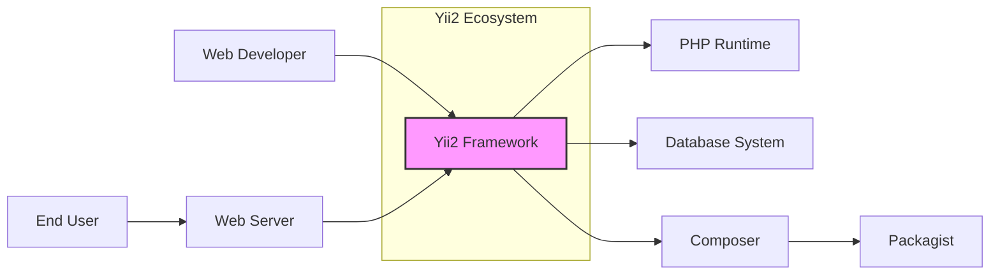
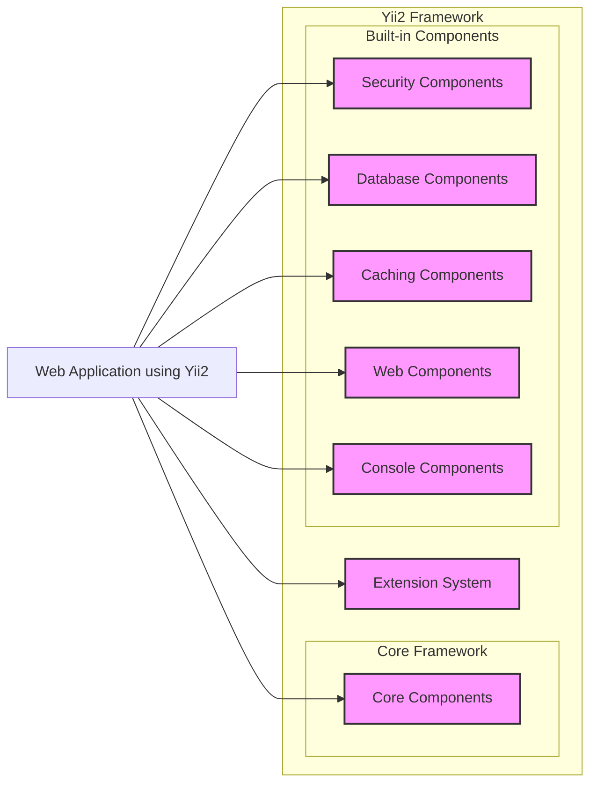
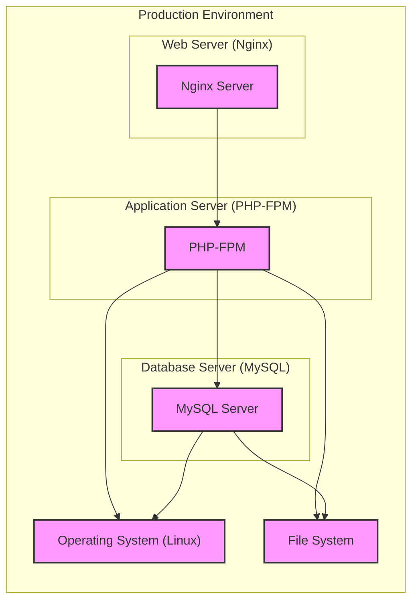
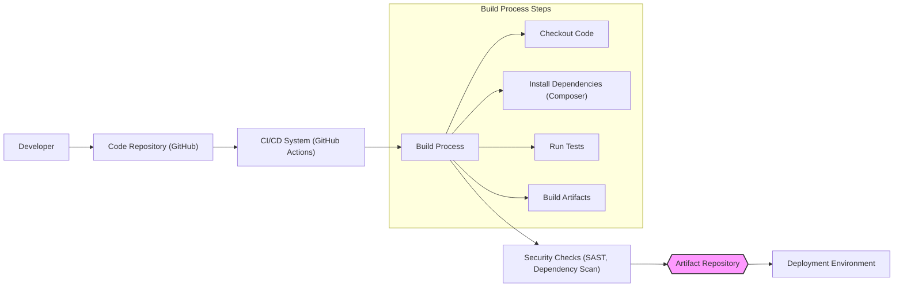

# BUSINESS POSTURE

- Business Priorities and Goals:
  - Yii2 is a high-performance PHP framework best for developing Web 2.0 applications.
  - It aims to be efficient, extensible and feature-rich while remaining easy to learn and use.
  - Primary goal is to provide developers with a robust and secure foundation for building web applications rapidly.
  - Focus on developer productivity and application performance.
- Business Risks:
  - Security vulnerabilities in the framework could lead to widespread security issues in applications built on top of it.
  - Risk of community-driven development introducing vulnerabilities if not properly vetted.
  - Dependency on open-source contributions for security updates and maintenance.
  - Potential for misuse of framework features leading to insecure applications if developers lack security awareness.

# SECURITY POSTURE

- Existing Security Controls:
  - security control: Input validation mechanisms are provided within the framework to help developers sanitize user inputs. Described in Yii2 documentation under "Input Validation".
  - security control: Output encoding features are available to prevent cross-site scripting (XSS) attacks. Described in Yii2 documentation under "Security Best Practices".
  - security control: Cross-Site Request Forgery (CSRF) protection is built-in and can be enabled. Described in Yii2 documentation under "Security Best Practices".
  - security control: Authentication and authorization components are provided to manage user identities and access control. Described in Yii2 documentation under "Authentication" and "Authorization".
  - security control: Password hashing utilities are available for securely storing user passwords. Described in Yii2 documentation under "Security Best Practices".
  - security control: Secure development practices are encouraged through documentation and community guidelines. Evident in Yii2 documentation and community forums.
- Accepted Risks:
  - accepted risk: Reliance on developers to correctly implement and utilize the security features provided by the framework.
  - accepted risk: Potential vulnerabilities in third-party extensions or libraries used with Yii2.
  - accepted risk: Security of applications built with Yii2 is ultimately the responsibility of the application developers.
- Recommended Security Controls:
  - security control: Implement automated Static Application Security Testing (SAST) on Yii2 core code to identify potential vulnerabilities early in the development lifecycle.
  - security control: Conduct regular security audits and penetration testing of Yii2 framework by external security experts.
  - security control: Establish a clear vulnerability disclosure and response process for Yii2 framework.
  - security control: Promote security awareness training for developers using Yii2, focusing on secure coding practices specific to the framework.
  - security control: Implement dependency scanning to identify and manage vulnerabilities in third-party libraries used by Yii2.
- Security Requirements:
  - Authentication:
    - Requirement: The framework should provide secure and flexible authentication mechanisms supporting various strategies (e.g., username/password, OAuth).
    - Requirement: Support for multi-factor authentication (MFA) should be considered for enhanced security.
  - Authorization:
    - Requirement: The framework should offer robust authorization mechanisms, including role-based access control (RBAC).
    - Requirement: Authorization should be consistently applied across all application components and functionalities.
  - Input Validation:
    - Requirement: The framework must provide comprehensive input validation capabilities to prevent injection attacks (SQL injection, XSS, etc.).
    - Requirement: Input validation should be applied at multiple layers (client-side and server-side).
  - Cryptography:
    - Requirement: Secure cryptographic functions should be used for sensitive operations like password hashing and data encryption.
    - Requirement: Best practices for key management and secure storage of cryptographic keys should be followed.
    - Requirement: Support for HTTPS should be enforced to protect data in transit.

# DESIGN

## C4 CONTEXT

- Context Diagram Elements:
  - Element:
    - Name: "Yii2 Framework"
    - Type: Software System
    - Description: The Yii2 PHP framework itself, providing the core functionalities and components for building web applications.
    - Responsibilities: Provides structure, components, and tools for web application development; Handles request routing, security features, database interaction, and more.
    - Security controls: Input validation, output encoding, CSRF protection, authentication and authorization components, password hashing utilities, secure coding guidelines in documentation.
  - Element:
    - Name: "Web Developer"
    - Type: Person
    - Description: Developers who use the Yii2 framework to build web applications.
    - Responsibilities: Develops, maintains, and deploys web applications using Yii2; Configures and utilizes Yii2 security features in their applications.
    - Security controls: Responsible for secure coding practices, proper use of Yii2 security features, and application-level security configurations.
  - Element:
    - Name: "End User"
    - Type: Person
    - Description: Users who interact with web applications built using the Yii2 framework.
    - Responsibilities: Uses web applications to access information or perform tasks.
    - Security controls: Relies on the security of the web application and the underlying Yii2 framework to protect their data and interactions.
  - Element:
    - Name: "PHP Runtime"
    - Type: Software System
    - Description: The PHP runtime environment required to execute Yii2 applications.
    - Responsibilities: Executes PHP code, including the Yii2 framework and applications built with it.
    - Security controls: Security configurations of the PHP runtime environment (e.g., disabled functions, open_basedir restrictions), security updates for PHP.
  - Element:
    - Name: "Database System"
    - Type: Software System
    - Description: Database systems (e.g., MySQL, PostgreSQL) used by Yii2 applications to store and retrieve data.
    - Responsibilities: Stores application data; Provides data persistence and retrieval for Yii2 applications.
    - Security controls: Database access controls, encryption at rest and in transit, database hardening, regular security patching.
  - Element:
    - Name: "Web Server"
    - Type: Software System
    - Description: Web servers (e.g., Apache, Nginx) that host and serve Yii2 applications.
    - Responsibilities: Serves web application content to end users; Handles HTTP requests and responses; Provides a platform for running PHP applications.
    - Security controls: Web server configurations (e.g., TLS/SSL configuration, access controls), web server security modules (e.g., mod_security), regular security patching.
  - Element:
    - Name: "Composer"
    - Type: Software System
    - Description: A dependency manager for PHP, used to manage Yii2 framework and its dependencies.
    - Responsibilities: Manages project dependencies; Installs and updates Yii2 framework and related libraries.
    - Security controls: Integrity checks of downloaded packages, secure source for package downloads (Packagist), dependency vulnerability scanning.
  - Element:
    - Name: "Packagist"
    - Type: Software System
    - Description: The main public repository for PHP packages, used by Composer to download Yii2 and its dependencies.
    - Responsibilities: Hosts and distributes PHP packages, including Yii2 framework and extensions.
    - Security controls: Package signing (if implemented), vulnerability scanning of hosted packages, repository security.

## C4 CONTAINER

- Container Diagram Elements:
  - Element:
    - Name: "Core Components"
    - Type: Container
    - Description: Fundamental components of the Yii2 framework, providing core functionalities like request handling, routing, and application structure.
    - Responsibilities: Manages the application lifecycle, handles incoming requests, routes requests to appropriate controllers, provides base classes and interfaces.
    - Security controls: Core framework code undergoes security reviews and testing; Input validation and output encoding mechanisms are implemented within these components.
  - Element:
    - Name: "Security Components"
    - Type: Container
    - Description: Components specifically designed for security functionalities, such as authentication, authorization, password hashing, and CSRF protection.
    - Responsibilities: Provides security features to protect applications from common web vulnerabilities; Manages user authentication and authorization; Implements cryptographic functions.
    - Security controls: Security audits of security components; Secure implementation of cryptographic algorithms; Regular updates to address security vulnerabilities.
  - Element:
    - Name: "Database Components"
    - Type: Container
    - Description: Components that facilitate interaction with various database systems.
    - Responsibilities: Provides database abstraction layer; Handles database connections, queries, and data manipulation; Protects against SQL injection through parameterized queries and ORM.
    - Security controls: Parameterized queries and ORM to prevent SQL injection; Secure database connection configurations; Input validation before database queries.
  - Element:
    - Name: "Caching Components"
    - Type: Container
    - Description: Components for implementing caching mechanisms to improve application performance.
    - Responsibilities: Caches data to reduce database load and improve response times.
    - Security controls: Secure storage of cached data (especially sensitive data); Cache invalidation mechanisms to prevent serving stale or compromised data.
  - Element:
    - Name: "Web Components"
    - Type: Container
    - Description: Components specific to web application development, handling HTTP requests and responses, sessions, and web-related functionalities.
    - Responsibilities: Manages HTTP requests and responses; Handles user sessions; Provides web-specific utilities and functionalities.
    - Security controls: Session management security (session fixation protection, secure session cookies); Protection against HTTP header injection; Input validation of HTTP request parameters.
  - Element:
    - Name: "Console Components"
    - Type: Container
    - Description: Components for developing console applications and command-line tools using Yii2.
    - Responsibilities: Provides a framework for building console commands and applications.
    - Security controls: Input validation for console command arguments; Secure handling of sensitive data in console applications.
  - Element:
    - Name: "Extension System"
    - Type: Container
    - Description: Mechanisms for extending Yii2 functionality through extensions and packages.
    - Responsibilities: Allows developers to add new features and functionalities to Yii2 framework.
    - Security controls: Code review and security vetting of popular and officially recommended extensions; Dependency scanning for vulnerabilities in extensions.
  - Element:
    - Name: "Web Application using Yii2"
    - Type: Software System
    - Description: An example of a web application built using the Yii2 framework. Represents applications that utilize Yii2.
    - Responsibilities: Implements specific business logic and functionalities using Yii2 framework.
    - Security controls: Application-level security controls implemented by developers using Yii2 framework, leveraging Yii2's security features.

## DEPLOYMENT

- Deployment Architecture Options:
  - Option 1: Traditional LAMP/LEMP stack (Linux, Apache/Nginx, MySQL, PHP)
  - Option 2: Cloud-based deployment (AWS, Azure, GCP) using virtual machines or containers.
  - Option 3: Containerized deployment using Docker and orchestration platforms like Kubernetes.

- Detailed Deployment Architecture (Option 1: Traditional LEMP stack):

- Deployment Diagram Elements:
  - Element:
    - Name: "Nginx Server"
    - Type: Software
    - Description: Web server responsible for serving static content and proxying requests to PHP-FPM.
    - Responsibilities: Handles HTTP requests, serves static files, reverse proxy to PHP-FPM, TLS/SSL termination.
    - Security controls: Web server hardening (disabling unnecessary modules, setting appropriate permissions), TLS/SSL configuration, rate limiting, web application firewall (WAF).
  - Element:
    - Name: "PHP-FPM"
    - Type: Software
    - Description: FastCGI Process Manager, responsible for executing PHP code of the Yii2 application.
    - Responsibilities: Executes PHP scripts, manages PHP processes, interacts with the database server.
    - Security controls: PHP runtime hardening (disable dangerous functions, open_basedir restrictions), PHP-FPM configuration (process isolation), regular PHP security updates.
  - Element:
    - Name: "MySQL Server"
    - Type: Software
    - Description: Database server used to store application data.
    - Responsibilities: Stores and manages application data, provides data persistence.
    - Security controls: Database access controls, database hardening, encryption at rest and in transit, regular database security updates, principle of least privilege for database users.
  - Element:
    - Name: "Operating System (Linux)"
    - Type: Infrastructure
    - Description: Linux operating system hosting the web server, application server, and database server.
    - Responsibilities: Provides the underlying operating system environment for all software components.
    - Security controls: OS hardening, regular OS security updates, firewall configuration, intrusion detection system (IDS), intrusion prevention system (IPS).
  - Element:
    - Name: "File System"
    - Type: Infrastructure
    - Description: File system where application code, configuration files, and data are stored.
    - Responsibilities: Stores application files, configuration, and data.
    - Security controls: File system permissions, access controls, encryption at rest for sensitive data, regular backups.

## BUILD

- Build Process Elements:
  - Element:
    - Name: "Developer"
    - Type: Person
    - Description: Software developer writing and committing code changes.
    - Responsibilities: Writes code, performs local testing, commits code to the repository.
    - Security controls: Secure coding practices, code reviews, local security testing.
  - Element:
    - Name: "Code Repository (GitHub)"
    - Type: Software System
    - Description: Git repository hosted on GitHub, storing the Yii2 framework source code.
    - Responsibilities: Version control, source code management, collaboration platform.
    - Security controls: Access controls (authentication and authorization for repository access), branch protection, audit logs, vulnerability scanning of repository dependencies (GitHub Dependabot).
  - Element:
    - Name: "CI/CD System (GitHub Actions)"
    - Type: Software System
    - Description: Continuous Integration and Continuous Delivery system, automating the build, test, and deployment processes. Example using GitHub Actions.
    - Responsibilities: Automates build, test, and deployment pipelines; Executes build scripts and security checks.
    - Security controls: Secure CI/CD pipeline configuration, access controls to CI/CD system, secrets management for credentials, audit logs of CI/CD activities.
  - Element:
    - Name: "Build Process"
    - Type: Automated Process
    - Description: Automated steps to compile, package, and prepare the Yii2 framework for distribution or deployment.
    - Responsibilities: Compiles code (if necessary), installs dependencies (using Composer), runs tests, packages build artifacts.
    - Security controls: Build environment security (secure build agents), dependency integrity checks (Composer lock file), secure artifact creation.
      - Sub-element: "Checkout Code" - Retrieves the latest code from the repository. Security control: Secure connection to repository.
      - Sub-element: "Install Dependencies (Composer)" - Installs PHP dependencies using Composer. Security control: Composer integrity checks, dependency vulnerability scanning.
      - Sub-element: "Run Tests" - Executes automated tests (unit, integration, etc.). Security control: Secure test environment, test code security.
      - Sub-element: "Build Artifacts" - Creates distributable packages or deployment artifacts. Security control: Secure artifact creation process, artifact signing (if applicable).
  - Element:
    - Name: "Security Checks (SAST, Dependency Scan)"
    - Type: Automated Process
    - Description: Automated security scans performed during the build process.
    - Responsibilities: Static Application Security Testing (SAST) to identify code vulnerabilities, Dependency scanning to identify vulnerable dependencies.
    - Security controls: SAST tool configuration and updates, dependency scanning tool configuration and updates, vulnerability reporting and remediation process.
  - Element:
    - Name: "Artifact Repository"
    - Type: Software System
    - Description: Repository for storing build artifacts (e.g., packaged framework releases).
    - Responsibilities: Stores and manages build artifacts, provides access to artifacts for deployment.
    - Security controls: Access controls to artifact repository, artifact integrity checks, secure storage of artifacts.
  - Element:
    - Name: "Deployment Environment"
    - Type: Environment
    - Description: Target environment where the Yii2 framework or applications built with it are deployed (e.g., staging, production).
    - Responsibilities: Hosts and runs the deployed application.
    - Security controls: Deployment environment security controls as described in the DEPLOYMENT section.

# RISK ASSESSMENT

- Critical Business Processes:
  - For Yii2 framework itself: Maintaining the integrity, availability, and confidentiality of the framework code and distribution packages. Ensuring the framework is secure and reliable for developers to build upon.
  - For applications built with Yii2: The critical business processes depend on the specific application. Generally, these include providing services to end-users, processing transactions, managing data, and maintaining business operations.
- Data Sensitivity:
  - For Yii2 framework itself: Source code is publicly available, but build artifacts and release processes need to be protected to ensure integrity and prevent supply chain attacks. Developer credentials and infrastructure access keys are highly sensitive.
  - For applications built with Yii2: Data sensitivity varies greatly depending on the application. It can range from publicly accessible content to highly sensitive personal data, financial information, or proprietary business data. The sensitivity level is determined by the application's purpose and the data it handles.

# QUESTIONS & ASSUMPTIONS

- BUSINESS POSTURE:
  - Question: What is the intended target audience for Yii2 framework (e.g., small businesses, enterprises, specific industries)?
  - Assumption: Yii2 aims to be a general-purpose framework suitable for a wide range of web application projects.
  - Question: What is the acceptable level of risk for security vulnerabilities in the Yii2 framework?
  - Assumption:  A low tolerance for security vulnerabilities is assumed, given the potential impact on applications built using Yii2.
- SECURITY POSTURE:
  - Question: What secure development lifecycle (SDLC) practices are currently in place for Yii2 development?
  - Assumption: Basic secure development practices are followed, including code reviews and some level of security testing, but details are not explicitly stated in the input.
  - Question: Is there a formal vulnerability disclosure and response process for Yii2?
  - Assumption: A community-driven vulnerability reporting and patching process exists, but the formality and responsiveness are not fully defined.
  - Question: Are there any specific compliance requirements (e.g., PCI DSS, HIPAA) that Yii2 framework needs to adhere to?
  - Assumption: Yii2 itself is not directly subject to specific compliance regulations, but applications built with it might be, and Yii2 aims to provide features to help developers meet those requirements.
- DESIGN:
  - Question: What is the expected scale and performance requirements for applications built with Yii2?
  - Assumption: Yii2 is designed for medium to large-scale web applications with reasonable performance expectations.
  - Question: Are there specific deployment environments or platforms that Yii2 is primarily optimized for?
  - Assumption: Yii2 is designed to be deployable on common web server environments (LAMP/LEMP) and cloud platforms.
  - Question: What is the process for managing and securing third-party extensions and dependencies used with Yii2?
  - Assumption: Developers are responsible for managing and securing third-party extensions, and dependency management is primarily handled by Composer. Yii2 provides some guidance but doesn't enforce strict security controls over extensions.