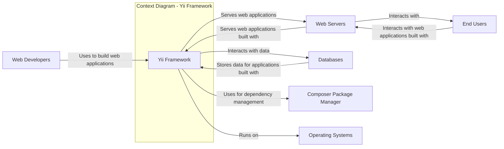
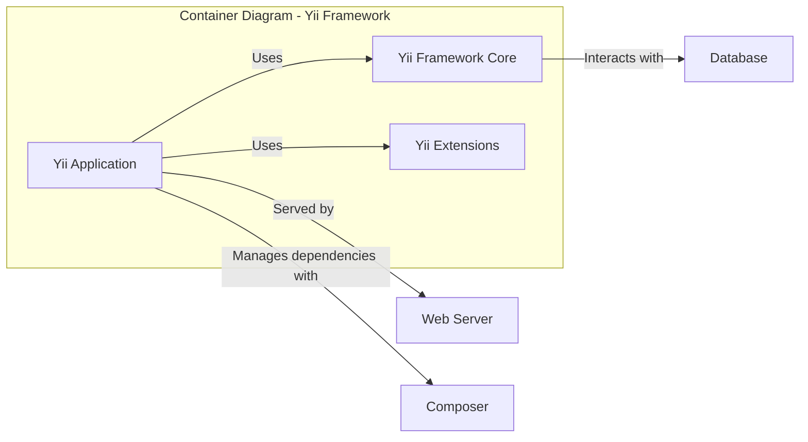
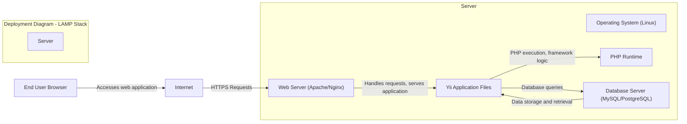

# BUSINESS POSTURE

- Business Priorities and Goals:
  - Provide a robust, efficient, and feature-rich PHP framework for developing modern web applications.
  - Enable rapid application development and reduce development costs for users.
  - Offer a flexible and extensible architecture to accommodate diverse project requirements.
  - Maintain a strong and active community to support users and contribute to the framework's evolution.
  - Ensure the framework is secure and reliable to build trustworthy web applications.
- Business Risks:
  - Security vulnerabilities in the framework could lead to widespread security breaches in applications built with Yii, damaging the framework's reputation and user trust.
  - Performance bottlenecks or inefficiencies in the framework could result in slow applications, negatively impacting user experience and adoption.
  - Lack of essential features or poor documentation could hinder developer productivity and limit the framework's appeal.
  - Incompatibility with new PHP versions or evolving web technologies could lead to obsolescence and reduced usage.
  - A decline in community support could slow down development, bug fixes, and security updates, making the framework less attractive over time.

# SECURITY POSTURE

- Existing Security Controls:
  - security control Input validation: Yii framework provides mechanisms for input validation through its form handling and validation rules features. Implemented in `yii\validators` namespace and form classes.
  - security control Output encoding: Yii framework encourages and provides helpers for output encoding to prevent Cross-Site Scripting (XSS) vulnerabilities. Implemented using `HtmlPurifier` and `yii\helpers\Html` class.
  - security control Authentication and Authorization components: Yii framework offers built-in components for authentication and authorization, allowing developers to implement user login, access control, and role-based permissions. Implemented in `yii\web\User` and `yii\rbac` components.
  - security control Database security practices: Yii framework promotes the use of parameterized queries and Active Record to prevent SQL Injection vulnerabilities. Implemented in `yii\db\Query` and `yii\db\ActiveRecord`.
  - security control Security documentation: Yii framework provides security-related documentation and best practices to guide developers in building secure applications. Described in Yii documentation website under Security section.
- Accepted Risks:
  - accepted risk Reliance on developers to correctly implement security best practices and utilize the framework's security features.
  - accepted risk Potential vulnerabilities in third-party extensions or libraries used with Yii framework.
  - accepted risk Security misconfigurations during application deployment and server setup.
- Recommended Security Controls:
  - security control Automated Security Testing: Implement automated Static Application Security Testing (SAST) and Dynamic Application Security Testing (DAST) in the development pipeline to identify potential vulnerabilities early.
  - security control Dependency Scanning: Regularly scan project dependencies for known vulnerabilities using tools like Composer audit or dedicated dependency scanning services.
  - security control Security Code Reviews: Conduct regular security-focused code reviews, especially for critical components and security-sensitive areas of the framework.
  - security control Vulnerability Disclosure Program: Establish a clear vulnerability disclosure program to allow security researchers and users to report security issues responsibly.
- Security Requirements:
  - Authentication:
    - Requirement for flexible authentication mechanisms to support various authentication strategies (e.g., username/password, OAuth, API keys).
    - Requirement for secure session management to protect user sessions from hijacking and unauthorized access.
    - Requirement for protection against brute-force attacks on login forms and authentication endpoints.
  - Authorization:
    - Requirement for robust authorization mechanisms to control access to resources and functionalities based on user roles and permissions.
    - Requirement for fine-grained access control to manage permissions at different levels (e.g., application, module, controller, action).
    - Requirement for secure API authorization to protect API endpoints from unauthorized access.
  - Input Validation:
    - Requirement for comprehensive input validation to prevent various injection attacks (e.g., SQL Injection, Cross-Site Scripting, Command Injection).
    - Requirement for server-side validation to ensure data integrity and security, even if client-side validation is bypassed.
    - Requirement for proper handling of invalid input to avoid application errors and security vulnerabilities.
  - Cryptography:
    - Requirement for secure password hashing algorithms to protect user passwords from being compromised in case of a data breach.
    - Requirement for encryption of sensitive data at rest and in transit to protect confidentiality.
    - Requirement for secure random number generation for cryptographic operations and security-sensitive functionalities.

# DESIGN

## C4 CONTEXT



- Context Diagram Elements:
  - - Name: Yii Framework
    - Type: Software System
    - Description: A high-performance PHP framework best for developing Web 2.0 applications. It provides a solid foundation to build scalable web applications quickly.
    - Responsibilities: Provides a set of features and tools for building web applications, including routing, database interaction, templating, security features, and more.
    - Security controls: Implements various security features and best practices to help developers build secure applications (input validation, output encoding, authentication, authorization).
  - - Name: Web Developers
    - Type: Person
    - Description: Software developers who use the Yii Framework to build web applications.
    - Responsibilities: Develop, maintain, and deploy web applications using the Yii Framework. Responsible for utilizing the framework's features securely and implementing application-specific security measures.
    - Security controls: Responsible for following secure coding practices, utilizing framework security features correctly, and implementing application-level security controls.
  - - Name: End Users
    - Type: Person
    - Description: Users who interact with web applications built using the Yii Framework through web browsers or other clients.
    - Responsibilities: Use web applications to access information, perform actions, and interact with the system.
    - Security controls: Rely on the security of the web applications and the underlying infrastructure to protect their data and privacy.
  - - Name: Web Servers
    - Type: Software System
    - Description: Web servers like Apache or Nginx that host and serve web applications built with the Yii Framework.
    - Responsibilities: Serve web application files, handle HTTP requests, and manage communication between the application and end users.
    - Security controls: Web server configuration (firewall, access control, TLS/SSL), security updates, and protection against web server vulnerabilities.
  - - Name: Databases
    - Type: Software System
    - Description: Database systems like MySQL, PostgreSQL, or MariaDB used to store and manage data for web applications built with the Yii Framework.
    - Responsibilities: Store application data, provide data access and retrieval, and ensure data integrity and availability.
    - Security controls: Database access control, encryption at rest and in transit, regular backups, security hardening, and protection against SQL injection attacks.
  - - Name: Composer Package Manager
    - Type: Software System
    - Description: A dependency manager for PHP that is used to install and manage Yii Framework and its extensions.
    - Responsibilities: Manage project dependencies, download and install libraries, and update packages.
    - Security controls: Dependency vulnerability scanning, using trusted package sources, and verifying package integrity.
  - - Name: Operating Systems
    - Type: Infrastructure
    - Description: Operating systems like Linux, Windows, or macOS on which the Yii Framework and web applications are deployed and run.
    - Responsibilities: Provide the underlying platform for running the framework, web servers, and databases.
    - Security controls: Operating system security hardening, security updates, access control, and system monitoring.

## C4 CONTAINER



- Container Diagram Elements:
  - - Name: Yii Framework Core
    - Type: Container - PHP Code
    - Description: The core PHP code of the Yii Framework, providing the fundamental functionalities and components. Includes core libraries, base classes, and essential features like routing, request handling, and basic security mechanisms.
    - Responsibilities: Provides the foundation for building Yii applications, handles core framework logic, and offers basic security features.
    - Security controls: Implements core security features like input filtering, output encoding helpers, and basic authentication/authorization components. Subject to security audits and community scrutiny.
  - - Name: Yii Extensions
    - Type: Container - PHP Code
    - Description: Optional packages and modules that extend the functionality of the Yii Framework. Extensions can provide features like user management, payment gateways, API integrations, and more.
    - Responsibilities: Provide additional functionalities and features to Yii applications, extending the framework's capabilities.
    - Security controls: Security of extensions depends on the extension developers. Yii community provides some level of review, but developers should carefully evaluate and audit extensions before use. Dependency scanning is recommended.
  - - Name: Yii Application
    - Type: Container - PHP Code
    - Description: The web application built by developers using the Yii Framework. This is the custom application code that utilizes the framework's features to implement specific business logic and functionalities.
    - Responsibilities: Implements the specific features and functionalities of the web application, handles user requests, interacts with data, and provides the user interface.
    - Security controls: Application-level security controls implemented by developers, utilizing Yii's security features and following secure coding practices. Includes authentication, authorization, input validation, and protection against application-specific vulnerabilities.
  - - Name: Web Server
    - Type: Container - Web Server Software
    - Description: Web server software (e.g., Apache, Nginx) responsible for serving the Yii application to end users.
    - Responsibilities: Host and serve the Yii application, handle HTTP requests, manage static files, and provide web server functionalities.
    - Security controls: Web server configuration (TLS/SSL, security headers), access control, firewall, and regular security updates.
  - - Name: Database
    - Type: Container - Database Software
    - Description: Database system (e.g., MySQL, PostgreSQL) used by the Yii application to store and manage data.
    - Responsibilities: Store application data, manage database connections, and provide data persistence.
    - Security controls: Database access control, user permissions, encryption at rest and in transit, regular backups, and security hardening.
  - - Name: Composer
    - Type: Container - Package Manager
    - Description: PHP dependency manager used to install and manage Yii Framework, extensions, and other PHP libraries required by the Yii application.
    - Responsibilities: Manage project dependencies, download and install packages, and update libraries.
    - Security controls: Using secure package sources, dependency vulnerability scanning, and verifying package integrity.

## DEPLOYMENT

- Deployment Architecture Options:
  - Option 1: Traditional LAMP/LEMP stack (Linux, Apache/Nginx, MySQL/PostgreSQL, PHP) on a single server or virtual machine.
  - Option 2: Cloud-based deployment on platforms like AWS, Google Cloud, or Azure using services like EC2, Compute Engine, or Azure VMs with managed databases and web servers.
  - Option 3: Containerized deployment using Docker and orchestration platforms like Kubernetes, allowing for scalability and portability.

- Detailed Deployment Architecture (Option 1: LAMP Stack on a Single Server):



- Deployment Diagram Elements (LAMP Stack on a Single Server):
  - - Name: Server
    - Type: Infrastructure - Physical or Virtual Server
    - Description: A single server (physical or virtual machine) hosting all components of the LAMP stack.
    - Responsibilities: Provides the physical or virtual infrastructure for running the operating system, web server, PHP runtime, Yii application, and database server.
    - Security controls: Server hardening, operating system security updates, firewall, intrusion detection system (IDS), and physical security of the server (if applicable).
  - - Name: Operating System (Linux)
    - Type: Software - Operating System
    - Description: Linux operating system installed on the server, providing the base platform for other components.
    - Responsibilities: Manages system resources, provides security features, and supports the execution of other software.
    - Security controls: OS hardening, security updates, access control, user management, and system monitoring.
  - - Name: Web Server (Apache/Nginx)
    - Type: Software - Web Server
    - Description: Web server software (Apache or Nginx) responsible for handling HTTP requests and serving the Yii application.
    - Responsibilities: Listen for incoming HTTP requests, serve static files, proxy requests to PHP runtime, and manage web server functionalities.
    - Security controls: Web server configuration (TLS/SSL, security headers, access control), firewall, and regular security updates.
  - - Name: PHP Runtime
    - Type: Software - Runtime Environment
    - Description: PHP runtime environment responsible for executing the Yii application code.
    - Responsibilities: Execute PHP code, manage PHP processes, and provide PHP functionalities.
    - Security controls: PHP configuration hardening (disable dangerous functions, limit resource usage), security updates, and using a secure PHP version.
  - - Name: Yii Application Files
    - Type: Software - Application Code
    - Description: The files and directories containing the Yii application code, including framework files, application-specific code, and assets.
    - Responsibilities: Contains the application logic, framework code, and resources required to run the web application.
    - Security controls: File system permissions, regular backups, and secure deployment practices.
  - - Name: Database Server (MySQL/PostgreSQL)
    - Type: Software - Database Server
    - Description: Database server software (MySQL or PostgreSQL) used to store and manage application data.
    - Responsibilities: Store application data, manage database connections, and provide data persistence.
    - Security controls: Database access control, user permissions, encryption at rest and in transit, regular backups, and security hardening.
  - - Name: Internet
    - Type: Network - Public Network
    - Description: The public internet network through which end users access the web application.
    - Responsibilities: Provides connectivity between end users and the server hosting the application.
    - Security controls: Network security measures (firewalls, intrusion detection systems) at the server and network level.
  - - Name: End User Browser
    - Type: Software - Web Browser
    - Description: Web browser used by end users to access and interact with the web application.
    - Responsibilities: Render web pages, send HTTP requests, and display application content to users.
    - Security controls: Browser security features (Content Security Policy, XSS protection), user awareness of phishing and malicious websites, and browser security updates.

## BUILD

```mermaid
flowchart LR
    subgraph "Build Process"
    developer["Developer"]
    code_repository["Code Repository (GitHub)"]
    build_server["Build Server (CI/CD)"]
    package_manager["Package Manager (Composer)"]
    artifact_repository["Artifact Repository"]
    end

    developer -- "Code changes" --> code_repository
    code_repository -- "Webhook/Trigger" --> build_server
    build_server -- "Checkout code" --> code_repository
    build_server -- "Install dependencies" --> package_manager
    build_server -- "Run tests, linters, SAST" --> yii_application_deploy
    build_server -- "Build artifacts" --> artifact_repository
    artifact_repository -- "Deploy to environments" --> web_server_deploy

    subgraph "Security Checks in Build Server"
    style fill:#f9f,stroke:#333,stroke-width:2px
    sast["SAST Scanner"]
    linter["Code Linter"]
    dependency_scan["Dependency Scanner"]
    test_suite["Test Suite"]
    end
    build_server -- "Run" --> sast
    build_server -- "Run" --> linter
    build_server -- "Run" --> dependency_scan
    build_server -- "Run" --> test_suite
    end
```

- Build Process Elements:
  - - Name: Developer
    - Type: Person
    - Description: Software developer writing and modifying the Yii application code.
    - Responsibilities: Write secure code, commit code changes to the repository, and participate in code reviews.
    - Security controls: Secure coding practices, code reviews, and using secure development tools.
  - - Name: Code Repository (GitHub)
    - Type: Software - Version Control System
    - Description: Git repository hosted on GitHub, used for version control and collaboration.
    - Responsibilities: Store source code, track changes, manage branches, and facilitate collaboration among developers.
    - Security controls: Access control (branch permissions, repository visibility), audit logs, and secure repository settings.
  - - Name: Build Server (CI/CD)
    - Type: Software - Automation Server
    - Description: Continuous Integration/Continuous Delivery (CI/CD) server (e.g., GitHub Actions, Jenkins) automating the build, test, and deployment process.
    - Responsibilities: Automate build process, run tests, perform security checks, and create deployable artifacts.
    - Security controls: Secure build server configuration, access control, secure credentials management, and build pipeline security.
  - - Name: Package Manager (Composer)
    - Type: Software - Dependency Manager
    - Description: Composer used to manage PHP dependencies for the Yii application during the build process.
    - Responsibilities: Install and manage project dependencies, download libraries, and update packages.
    - Security controls: Using secure package sources, dependency vulnerability scanning (Composer audit), and verifying package integrity.
  - - Name: Artifact Repository
    - Type: Software - Artifact Storage
    - Description: Repository for storing build artifacts (e.g., packaged application files) ready for deployment.
    - Responsibilities: Store and manage build artifacts, provide versioning, and ensure artifact integrity.
    - Security controls: Access control, artifact integrity checks (checksums), and secure artifact storage.
  - - Name: SAST Scanner
    - Type: Software - Security Tool
    - Description: Static Application Security Testing (SAST) tool used to analyze source code for potential security vulnerabilities.
    - Responsibilities: Identify potential security flaws in the code without executing it.
    - Security controls: SAST tool configuration, vulnerability reporting, and integration into the build pipeline.
  - - Name: Code Linter
    - Type: Software - Code Quality Tool
    - Description: Code linter used to analyze code for coding style issues, potential bugs, and code quality problems.
    - Responsibilities: Enforce coding standards, identify potential code quality issues, and improve code maintainability.
    - Security controls: Linter configuration to enforce security best practices and identify potential security-related code patterns.
  - - Name: Dependency Scanner
    - Type: Software - Security Tool
    - Description: Dependency scanner used to check project dependencies for known vulnerabilities.
    - Responsibilities: Identify vulnerable dependencies and provide reports for remediation.
    - Security controls: Dependency scanner configuration, vulnerability database updates, and integration into the build pipeline.
  - - Name: Test Suite
    - Type: Software - Testing Framework
    - Description: Automated test suite (unit tests, integration tests) used to verify the functionality and stability of the application.
    - Responsibilities: Ensure code quality, detect regressions, and verify application functionality.
    - Security controls: Security-focused test cases, integration tests covering security functionalities, and regular test execution.

# RISK ASSESSMENT

- Critical Business Processes:
  - Web applications built using Yii Framework are the critical business processes. The framework's security and reliability directly impact the security and availability of these applications. Compromise of the framework can lead to widespread compromise of applications built upon it.
- Data Sensitivity:
  - Data sensitivity depends on the specific applications built using Yii. The framework itself does not handle specific business data, but it provides the foundation for applications that may handle highly sensitive data, including:
    - Personally Identifiable Information (PII) of users (names, addresses, emails, phone numbers).
    - Financial data (credit card information, transaction history).
    - Authentication credentials (passwords, API keys).
    - Business-critical data (customer data, intellectual property, trade secrets).
  - The sensitivity level of data handled by applications built with Yii can range from low (publicly available information) to high (sensitive personal or financial data), depending on the application's purpose and functionality.

# QUESTIONS & ASSUMPTIONS

- Questions:
  - What is the target risk appetite for applications built with Yii Framework (e.g., startup with higher risk tolerance vs. Fortune 500 with strict security requirements)?
  - Are there specific compliance requirements (e.g., GDPR, PCI DSS, HIPAA) that applications built with Yii Framework need to adhere to?
  - What are the most common deployment environments for Yii Framework applications (cloud, on-premises, hybrid)?
  - Are there specific security tools or technologies that are commonly used or recommended with Yii Framework applications?
  - What is the process for reporting and addressing security vulnerabilities in Yii Framework itself and in Yii extensions?
- Assumptions:
  - The design document assumes a general web application security context, focusing on common web application vulnerabilities and security best practices.
  - It is assumed that applications built with Yii Framework will handle user data and require standard security controls like authentication, authorization, input validation, and protection against common web attacks.
  - The deployment architecture described is a common LAMP stack setup, but other deployment options are also possible.
  - The build process includes basic security checks like SAST and dependency scanning, but more advanced security measures may be necessary depending on the risk profile of the application.
  - The security recommendations are general best practices and may need to be tailored based on the specific requirements and risk assessment of individual applications built with Yii Framework.