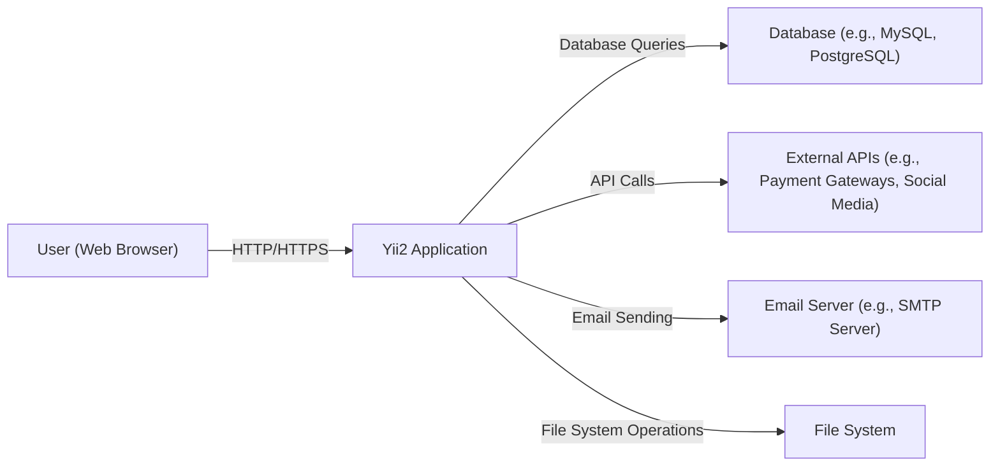
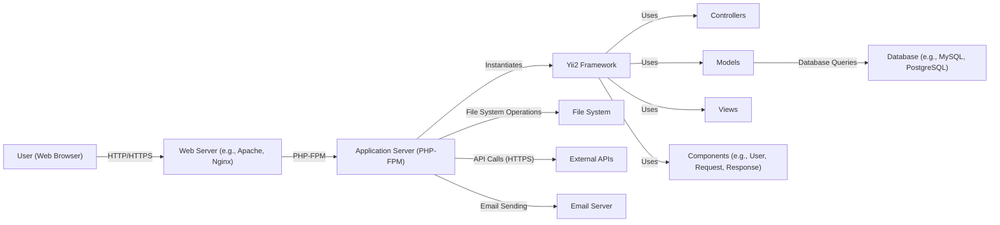
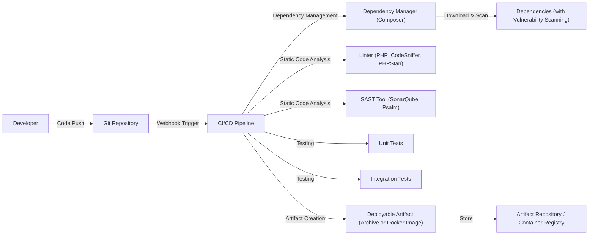

Okay, let's create a design document for the Yii2 PHP framework based on the provided GitHub repository.

# BUSINESS POSTURE

Yii2 is a high-performance PHP framework best for developing Web 2.0 applications.  It's a mature, open-source project.  The business priorities likely revolve around:

*   Maintaining a strong reputation for performance and security within the PHP community.
*   Ensuring ease of use and rapid development capabilities for its users (developers).
*   Providing a stable and reliable platform for building a wide range of web applications.
*   Fostering a vibrant community and ecosystem around the framework.
*   Attracting and retaining contributors to ensure the framework's continued development and maintenance.
*   Adaptability to evolving web development standards and best practices.

Business risks that need to be addressed:

*   Security vulnerabilities in the framework could lead to widespread exploitation of applications built with Yii2, damaging the framework's reputation and potentially exposing users to significant risks.
*   Failure to keep up with PHP language updates and evolving web standards could lead to obsolescence.
*   Lack of community engagement could lead to stagnation and decline in the framework's usage.
*   Competition from other PHP frameworks (e.g., Laravel, Symfony) could erode Yii2's market share.
*   Inadequate documentation or support could hinder adoption and frustrate users.

# SECURITY POSTURE

Based on the repository and general knowledge of secure development practices, here's a likely security posture:

*   security control: Input validation: Yii2 provides built-in mechanisms for validating user input, including rules for data types, formats, and lengths. This is crucial for preventing common web vulnerabilities like cross-site scripting (XSS) and SQL injection. Described in Yii2 documentation and implemented in components.
*   security control: Output encoding: Yii2 encourages proper encoding of output to prevent XSS vulnerabilities.  This involves escaping data before displaying it in HTML, JavaScript, or other contexts. Described in Yii2 documentation and implemented in components.
*   security control: CSRF protection: Yii2 includes built-in protection against Cross-Site Request Forgery (CSRF) attacks, typically through the use of CSRF tokens. Described in Yii2 documentation and implemented in components.
*   security control: SQL injection prevention: Yii2's database access layer (using PDO and prepared statements or ActiveRecord) helps prevent SQL injection vulnerabilities. Described in Yii2 documentation and implemented in components.
*   security control: Authentication and authorization: Yii2 provides components for user authentication (verifying user identity) and authorization (controlling access to resources). Described in Yii2 documentation and implemented in components.
*   security control: Secure configuration management: Yii2 encourages secure configuration practices, such as storing sensitive information (e.g., database credentials) outside of the webroot. Described in Yii2 documentation.
*   security control: Session management: Yii2 provides secure session management features, including options for using secure cookies (HTTPS only) and regenerating session IDs. Described in Yii2 documentation and implemented in components.
*   security control: Regular security updates: The Yii2 development team regularly releases security updates and patches to address vulnerabilities. Described in Yii2 documentation and implemented in components.
*   accepted risk: Dependency vulnerabilities: Like any project with external dependencies, Yii2 is susceptible to vulnerabilities in third-party libraries.  While the team likely vets dependencies, there's always a residual risk.
*   accepted risk: Misconfiguration by developers: While Yii2 provides secure defaults and tools, developers can still introduce vulnerabilities through misconfiguration or insecure coding practices.
*   accepted risk: Zero-day vulnerabilities:  There's always a risk of undiscovered vulnerabilities (zero-days) that could be exploited before a patch is available.

Recommended security controls (high priority):

*   security control: Implement a robust Content Security Policy (CSP) to mitigate the impact of XSS vulnerabilities.
*   security control: Enforce strong password policies and consider offering multi-factor authentication (MFA) options.
*   security control: Regularly conduct security audits and penetration testing of the framework and its components.
*   security control: Implement a dependency vulnerability scanning process to identify and address known vulnerabilities in third-party libraries.
*   security control: Provide clear and comprehensive security documentation and guidelines for developers using the framework.

Security Requirements:

*   Authentication:
    *   Support for various authentication methods (e.g., username/password, OAuth, OpenID Connect).
    *   Secure storage of user credentials (e.g., using strong hashing algorithms).
    *   Protection against brute-force attacks.
    *   Session management with secure cookies and session ID regeneration.
*   Authorization:
    *   Role-Based Access Control (RBAC) or Attribute-Based Access Control (ABAC).
    *   Fine-grained control over access to resources and actions.
    *   Protection against privilege escalation attacks.
*   Input Validation:
    *   Comprehensive validation of all user input.
    *   Whitelist-based validation where possible.
    *   Protection against common web vulnerabilities (XSS, SQL injection, etc.).
*   Cryptography:
    *   Use of strong, industry-standard cryptographic algorithms.
    *   Secure key management practices.
    *   Protection of sensitive data in transit and at rest.
    *   Support for HTTPS.

# DESIGN

## C4 CONTEXT

Element Descriptions:

*   Element:
    *   Name: User (Web Browser)
    *   Type: Person
    *   Description: A user interacting with the Yii2 application through a web browser.
    *   Responsibilities: Initiates requests, views responses, provides input.
    *   Security controls: Browser-based security controls (e.g., same-origin policy, cookie security).

*   Element:
    *   Name: Yii2 Application
    *   Type: Software System
    *   Description: The web application built using the Yii2 framework.
    *   Responsibilities: Handles user requests, processes data, interacts with other systems, renders responses.
    *   Security controls: Input validation, output encoding, CSRF protection, authentication, authorization, session management.

*   Element:
    *   Name: Database (e.g., MySQL, PostgreSQL)
    *   Type: Software System
    *   Description: The database used to store application data.
    *   Responsibilities: Stores and retrieves data.
    *   Security controls: Database access controls, encryption at rest, regular backups.

*   Element:
    *   Name: External APIs (e.g., Payment Gateways, Social Media)
    *   Type: Software System
    *   Description: Third-party APIs used by the application.
    *   Responsibilities: Provides specific functionalities (e.g., payment processing, social login).
    *   Security controls: API keys, OAuth, secure communication (HTTPS).

*   Element:
    *   Name: Email Server (e.g., SMTP Server)
    *   Type: Software System
    *   Description: The server used to send emails.
    *   Responsibilities: Sends emails on behalf of the application.
    *   Security controls: Authentication, encryption (TLS/SSL).

*   Element:
    *   Name: File System
    *   Type: Software System
    *   Description: Local file system.
    *   Responsibilities: Store files.
    *   Security controls: File system permissions.

## C4 CONTAINER

Element Descriptions:

*   Element:
    *   Name: User (Web Browser)
    *   Type: Person
    *   Description: A user interacting with the Yii2 application.
    *   Responsibilities: Initiates requests, views responses.
    *   Security controls: Browser security features.

*   Element:
    *   Name: Web Server (e.g., Apache, Nginx)
    *   Type: Container
    *   Description: The web server that receives requests from the user.
    *   Responsibilities: Handles HTTP requests, serves static content, forwards requests to the application server.
    *   Security controls: Web server configuration (e.g., HTTPS, access controls).

*   Element:
    *   Name: Application Server (PHP-FPM)
    *   Type: Container
    *   Description: The PHP-FPM process that executes the Yii2 application code.
    *   Responsibilities: Executes PHP code, handles application logic.
    *   Security controls: PHP configuration (e.g., disabling dangerous functions).

*   Element:
    *   Name: Yii2 Framework
    *   Type: Container
    *   Description: The core Yii2 framework.
    *   Responsibilities: Provides the foundation for the application, including routing, request handling, and component management.
    *   Security controls: Built-in security features (input validation, output encoding, etc.).

*   Element:
    *   Name: Controllers
    *   Type: Component
    *   Description: Handle user requests and interact with models and views.
    *   Responsibilities: Process user input, interact with models, render views.
    *   Security controls: Input validation, authorization checks.

*   Element:
    *   Name: Models
    *   Type: Component
    *   Description: Represent data and business logic.
    *   Responsibilities: Interact with the database, encapsulate business rules.
    *   Security controls: Data validation, secure data access.

*   Element:
    *   Name: Views
    *   Type: Component
    *   Description: Render data for presentation to the user.
    *   Responsibilities: Display data, generate HTML output.
    *   Security controls: Output encoding, XSS prevention.

*   Element:
    *   Name: Components (e.g., User, Request, Response)
    *   Type: Component
    *   Description: Reusable components that provide specific functionalities.
    *   Responsibilities: Varies depending on the component.
    *   Security controls: Varies depending on the component.

*   Element:
    *   Name: Database (e.g., MySQL, PostgreSQL)
    *   Type: Container
    *   Description: The database used to store application data.
    *   Responsibilities: Stores and retrieves data.
    *   Security controls: Database access controls, encryption.

*   Element:
    *   Name: External APIs
    *   Type: Container
    *   Description: External services.
    *   Responsibilities: Provide external services.
    *   Security controls: API keys, OAuth, secure communication (HTTPS).

*   Element:
    *   Name: Email Server
    *   Type: Container
    *   Description: External email server.
    *   Responsibilities: Sends emails.
    *   Security controls: Authentication, encryption (TLS/SSL).

*   Element:
    *   Name: File System
    *   Type: Container
    *   Description: Local file system.
    *   Responsibilities: Store files.
    *   Security controls: File system permissions.

## DEPLOYMENT

Possible deployment solutions:

1.  Traditional LAMP/LEMP stack on a single server.
2.  Cloud-based deployment using virtual machines (e.g., AWS EC2, Google Compute Engine, Azure VMs).
3.  Containerized deployment using Docker and Kubernetes.
4.  Serverless deployment using platforms like AWS Lambda or Azure Functions (less common for a full framework like Yii2, but possible for specific components).

Chosen solution (for detailed description): Containerized deployment using Docker and Kubernetes.

```mermaid
graph LR
    DevMachine["Developer Machine"] -- "Code Push" --> GitRepo["Git Repository (e.g., GitHub)"]
    GitRepo -- "Webhook Trigger" --> CI_CD["CI/CD Pipeline (e.g., Jenkins, GitLab CI, GitHub Actions)"]
    CI_CD -- "Build & Test" --> DockerBuild["Docker Build Server"]
    DockerBuild -- "Push Image" --> ContainerRegistry["Container Registry (e.g., Docker Hub, ECR, GCR)"]
    ContainerRegistry -- "Pull Image" --> KubernetesCluster["Kubernetes Cluster"]
    KubernetesCluster -- "Deploys" --> Pod_App["Pod (Yii2 Application)"]
    KubernetesCluster -- "Deploys" --> Pod_DB["Pod (Database)"]
    Pod_App -- "Uses" --> Service_App["Service (Yii2 App)"]
    Pod_DB -- "Uses" --> Service_DB["Service (Database)"]
    Service_App -- "Exposes" --> Ingress["Ingress (Load Balancer)"]
    Ingress -- "HTTP/HTTPS" --> User["User (Web Browser)"]
    KubernetesCluster -- "Manages" --> PersistentVolume["Persistent Volume (Storage)"]

```

Element Descriptions:

*   Element:
    *   Name: Developer Machine
    *   Type: Node
    *   Description: The developer's local workstation.
    *   Responsibilities: Code development, testing, and pushing to the Git repository.
    *   Security controls: Local security measures (e.g., firewall, antivirus).

*   Element:
    *   Name: Git Repository (e.g., GitHub)
    *   Type: Node
    *   Description: The source code repository.
    *   Responsibilities: Stores the application code and version history.
    *   Security controls: Access controls, branch protection rules.

*   Element:
    *   Name: CI/CD Pipeline (e.g., Jenkins, GitLab CI, GitHub Actions)
    *   Type: Node
    *   Description: The continuous integration and continuous deployment pipeline.
    *   Responsibilities: Automates the build, test, and deployment process.
    *   Security controls: Secure access to the pipeline, secrets management.

*   Element:
    *   Name: Docker Build Server
    *   Type: Node
    *   Description: The server that builds the Docker image.
    *   Responsibilities: Creates the Docker image containing the Yii2 application.
    *   Security controls: Secure access to the build server.

*   Element:
    *   Name: Container Registry (e.g., Docker Hub, ECR, GCR)
    *   Type: Node
    *   Description: The registry that stores the Docker image.
    *   Responsibilities: Stores and manages Docker images.
    *   Security controls: Access controls, image scanning for vulnerabilities.

*   Element:
    *   Name: Kubernetes Cluster
    *   Type: Node
    *   Description: The Kubernetes cluster that orchestrates the deployment.
    *   Responsibilities: Manages the deployment and scaling of the application containers.
    *   Security controls: Kubernetes security features (e.g., RBAC, network policies).

*   Element:
    *   Name: Pod (Yii2 Application)
    *   Type: Node
    *   Description: A Kubernetes pod running the Yii2 application container.
    *   Responsibilities: Executes the application code.
    *   Security controls: Container security best practices.

*   Element:
    *   Name: Pod (Database)
    *   Type: Node
    *   Description: A Kubernetes pod running the database container.
    *   Responsibilities: Runs the database server.
    *   Security controls: Database security best practices.

*   Element:
    *   Name: Service (Yii2 App)
    *   Type: Node
    *   Description: A Kubernetes service that exposes the Yii2 application pods.
    *   Responsibilities: Provides a stable endpoint for accessing the application.
    *   Security controls: Network policies.

*   Element:
    *   Name: Service (Database)
    *   Type: Node
    *   Description: A Kubernetes service that exposes the database pod.
    *   Responsibilities: Provides a stable endpoint for accessing the database.
    *   Security controls: Network policies.

*   Element:
    *   Name: Ingress (Load Balancer)
    *   Type: Node
    *   Description: A Kubernetes ingress that acts as a load balancer and entry point to the cluster.
    *   Responsibilities: Routes external traffic to the appropriate services.
    *   Security controls: TLS termination, access controls.

*   Element:
    *   Name: User (Web Browser)
    *   Type: Person
    *   Description: The user accessing the application.
    *   Responsibilities: Initiates requests.
    *   Security controls: Browser security features.

*   Element:
    *   Name: Persistent Volume (Storage)
    *   Type: Node
    *   Description: Persistent storage for the database and potentially other application data.
    *   Responsibilities: Provides persistent storage.
    *   Security controls: Encryption at rest, access controls.

## BUILD

The build process for Yii2 applications typically involves several steps, from code development to creating a deployable artifact.  Here's a description of a secure build process, incorporating common best practices:

1.  **Development:** Developers write code on their local machines, using an IDE or text editor. They use version control (Git) to manage changes and collaborate.

2.  **Code Push:** Developers push their code changes to a central Git repository (e.g., GitHub, GitLab, Bitbucket).

3.  **CI/CD Trigger:** A push to a specific branch (e.g., `main`, `develop`) triggers the CI/CD pipeline (e.g., Jenkins, GitLab CI, GitHub Actions).

4.  **Dependency Management:** The CI/CD pipeline uses a dependency manager (e.g., Composer for PHP) to download and install the required libraries and frameworks, including Yii2 itself.  This step should include:
    *   **Dependency Scanning:**  A tool like `composer audit` or a dedicated dependency scanning tool (e.g., Snyk, Dependabot) is used to check for known vulnerabilities in the dependencies.  The build should fail if vulnerabilities above a certain severity threshold are found.
    *   **Signed Packages (Recommended):**  If available, the system should verify the digital signatures of downloaded packages to ensure they haven't been tampered with.

5.  **Static Code Analysis:**
    *   **Linters:**  A linter (e.g., PHP_CodeSniffer, PHPStan) is used to enforce coding standards and identify potential code quality issues.
    *   **SAST (Static Application Security Testing):**  A SAST tool (e.g., SonarQube, Psalm, Phan) is used to scan the codebase for potential security vulnerabilities (e.g., XSS, SQL injection, code injection).  The build should fail if vulnerabilities above a certain severity threshold are found.

6.  **Testing:**
    *   **Unit Tests:**  Unit tests are run to verify the functionality of individual components.
    *   **Integration Tests:**  Integration tests are run to verify the interaction between different components.
    *   **Acceptance Tests (Optional):**  Automated acceptance tests may be run to verify the application meets the specified requirements.

7.  **Artifact Creation:** If all tests and security checks pass, the CI/CD pipeline creates a deployable artifact. This could be:
    *   A simple archive (e.g., .zip, .tar.gz) containing the application code and dependencies.
    *   A Docker image containing the application code, dependencies, and runtime environment.

8.  **Artifact Storage:** The deployable artifact is stored in a secure location, such as:
    *   A dedicated artifact repository (e.g., Nexus, Artifactory).
    *   A container registry (e.g., Docker Hub, ECR, GCR) if a Docker image was created.

9.  **Deployment (Handled in the Deployment section):** The artifact is deployed to the target environment.

# RISK ASSESSMENT

*   **Critical Business Processes:**
    *   User authentication and authorization.
    *   Data management (CRUD operations on application data).
    *   Interaction with external services (if applicable).
    *   Email sending (if applicable).
    *   Maintaining the integrity and availability of the web application.

*   **Data Sensitivity:**
    *   **User Data:**  This could include personally identifiable information (PII) such as names, email addresses, passwords (hashed), and potentially more sensitive data depending on the specific application built with Yii2.  Sensitivity: High.
    *   **Application Data:**  This depends entirely on the specific application. It could range from low sensitivity (e.g., public content) to extremely high sensitivity (e.g., financial data, health information). Sensitivity: Variable (Low to High).
    *   **Configuration Data:**  This includes database credentials, API keys, and other sensitive configuration settings. Sensitivity: High.
    *   **Session Data:**  This includes session IDs and any data stored in user sessions. Sensitivity: Medium to High.

# QUESTIONS & ASSUMPTIONS

*   **Questions:**
    *   What specific types of applications are most commonly built with Yii2 within the organization using this design document? (This helps tailor the risk assessment.)
    *   What are the specific regulatory compliance requirements (e.g., GDPR, HIPAA, PCI DSS) that apply to applications built with Yii2?
    *   What is the organization's risk tolerance level? (This influences the security controls that should be prioritized.)
    *   What is the existing infrastructure for deployment and hosting of Yii2 applications?
    *   What is the level of security expertise within the development team?
    *   Are there any specific security concerns or past incidents related to Yii2 applications?
    *   What is budget for security tools and processes?

*   **Assumptions:**
    *   BUSINESS POSTURE: The organization values the security and reliability of its web applications.
    *   BUSINESS POSTURE: The organization has a process for responding to security incidents.
    *   SECURITY POSTURE: Developers using Yii2 have some basic understanding of secure coding practices.
    *   SECURITY POSTURE: The organization has a process for managing and updating dependencies.
    *   DESIGN: The Yii2 framework is used as intended, following its documentation and best practices.
    *   DESIGN: A relatively standard web application architecture is used (web server, application server, database).
    *   DESIGN: The deployment environment is reasonably secure (e.g., firewalled, access-controlled).
    *   DESIGN: Regular backups of the database and application code are performed.
    *   DESIGN: Basic monitoring and logging are in place.