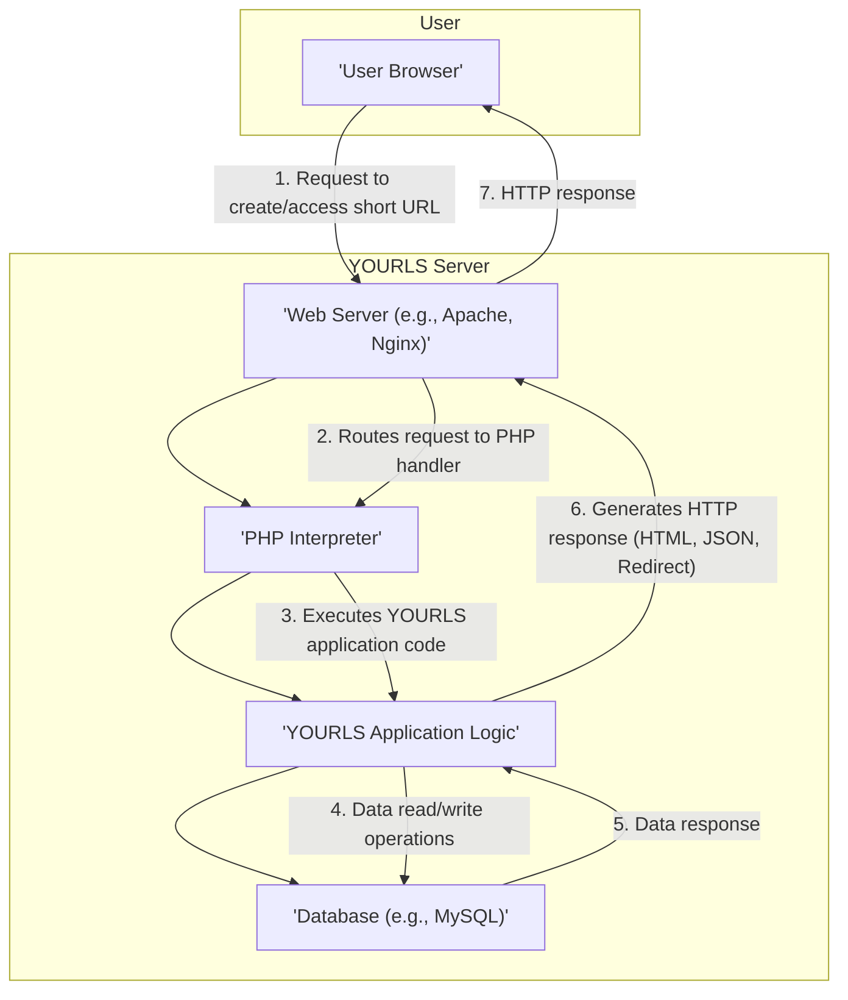
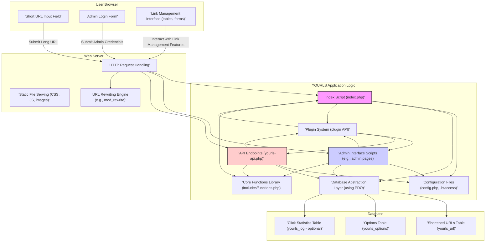

# Project Design Document: YOURLS (Your Own URL Shortener)

**Version:** 1.1
**Date:** October 26, 2023
**Author:** AI Software Architect

## 1. Introduction

This document provides a detailed design overview of the YOURLS (Your Own URL Shortener) project, an open-source PHP script enabling users to host their own URL shortening service. The primary purpose of this document is to clearly articulate the system's architecture, key components, and data flow. This detailed design will serve as the foundation for subsequent threat modeling activities, allowing for a comprehensive assessment of potential security vulnerabilities.

## 2. Goals

* To provide a fully functional and customizable URL shortening service.
* To enable users to generate short URLs with optional custom keywords.
* To offer basic tracking of click statistics for shortened URLs.
* To provide an administrative interface for managing shortened links and system settings.
* To be self-hosted, granting users full control over their data and service.
* To be extensible through a plugin system, allowing for community contributions and feature enhancements.

## 3. Non-Goals

* Implementing advanced, real-time analytics beyond basic click counts (e.g., geographic data, user demographics).
* Providing a sophisticated user management system with fine-grained access control beyond a single administrative user.
* Offering a highly scalable, globally distributed service with built-in load balancing and redundancy.
* Integrating with external third-party services for features like automatic link previews, social media sharing, or advanced link cloaking.
* Providing core support for database systems other than MySQL, although plugin support for other databases is possible.

## 4. System Architecture

YOURLS adopts a traditional three-tier architectural pattern, separating concerns into distinct layers:

* **Presentation Tier:**  The user-facing interface, primarily a web-based administrative panel and the mechanism for redirecting short URLs.
* **Application Tier:** The core PHP application logic responsible for handling URL shortening requests, redirection logic, API interactions, and administrative functions.
* **Data Tier:** The persistent storage layer, typically a MySQL database, used to store short and long URL mappings, configuration settings, and optional click statistics.

### 4.1. High-Level Architecture Diagram



### 4.2. Detailed Component Diagram



## 5. Data Flow

The primary data flow within YOURLS involves two key scenarios: the process of shortening a new URL and the process of accessing an existing shortened URL.

### 5.1. Shortening a URL

* **User Action:** A user submits a long URL, either through the administrative web interface or via the API.
* **Web Server:** Receives the incoming HTTP request containing the long URL.
* **PHP Interpreter:** Executes the relevant YOURLS application logic, typically within `yourls-api.php` for API requests or a script handling form submissions in the admin interface.
* **YOURLS Application:**
    * **Input Validation:** Validates the submitted long URL format and potentially checks for disallowed patterns.
    * **Duplicate Check:** Queries the database to determine if the long URL has already been shortened.
    * **Short URL Generation:** If the URL is new, generates a unique short URL keyword using a defined algorithm or accepts a custom keyword provided by the user (if available and not already in use).
    * **Data Storage:** Stores the mapping between the generated short URL keyword and the original long URL in the `yourls_url` table within the database. This may also include metadata like the creation timestamp and the IP address of the submitter.
    * **Response:** Returns the newly created short URL to the user in the HTTP response (either as HTML in the web interface or as JSON in the API response).

```mermaid
flowchart TD
    A["'User Browser/API Client'"] -- "1. Submit Long URL" --> B["'Web Server'"]
    B -- "2. Route to PHP handler" --> C["'PHP Interpreter'"]
    C -- "3. Execute YOURLS Logic (API or Admin)" --> D["'YOURLS Application'"]
    D -- "4. Validate Long URL" --> D
    D -- "5. Check if URL exists in DB" --> E["'Database'"]
    E -- "6. Response (exists/not exists)" --> D
    alt Not Exists
        D -- "7. Generate Short URL Keyword" --> D
        D -- "8. Store URL Mapping in DB" --> E
        E -- "9. Confirmation" --> D
    end
    D -- "10. Return Short URL" --> C
    C -- "11. HTTP Response (with Short URL)" --> B
    B -- "12. Display Short URL to User" --> A
```

### 5.2. Accessing a Shortened URL

* **User Action:** A user attempts to access a shortened URL by clicking on a link or entering it directly into their browser.
* **Web Server:** Receives the HTTP request for the short URL.
* **PHP Interpreter:** Executes the YOURLS redirection logic, primarily handled by `yourls-loader.php`.
* **YOURLS Application:**
    * **Keyword Extraction:** Extracts the short URL keyword from the requested URL path.
    * **Database Lookup:** Queries the `yourls_url` table in the database to find the corresponding long URL based on the extracted keyword.
    * **Redirection:**
        * **Success:** If a match is found, optionally increments the click counter in the `yourls_log` table (if enabled) and issues an HTTP redirect response (typically a 301 Permanent Redirect or a 302 Found redirect) to the original long URL.
        * **Failure:** If no matching short URL keyword is found in the database, it generates and returns an HTTP 404 Not Found error page.
* **Response:** The user's browser is either redirected to the target long URL or receives an error page.

```mermaid
flowchart TD
    A["'User Browser'"] -- "1. Request Short URL" --> B["'Web Server'"]
    B -- "2. Route to PHP handler" --> C["'PHP Interpreter'"]
    C -- "3. Execute YOURLS Logic (Redirection)" --> D["'YOURLS Application'"]
    D -- "4. Extract Short URL Keyword" --> D
    D -- "5. Lookup Long URL in DB" --> E["'Database'"]
    E -- "6. Return Long URL (or null)" --> D
    alt Long URL Found
        D -- "7. Increment Click Count (optional)" --> E
        E -- "8. Confirmation (optional)" --> D
        D -- "9. Issue HTTP Redirect to Long URL" --> C
    else Long URL Not Found
        D -- "10. Generate HTTP 404 Response" --> C
    end
    C -- "11. HTTP Response (Redirect or 404)" --> B
    B -- "12. Browser navigates to Long URL or displays error" --> A
```

## 6. Key Components

* **`index.php`:** The primary entry point for the administrative web interface, providing access to link management, statistics, and settings.
* **`yourls-loader.php`:** The core script responsible for handling requests to shortened URLs and performing the redirection to the original long URL.
* **`yourls-api.php`:** Provides a programmatic API for interacting with YOURLS, allowing external applications to create, retrieve, and manage short URLs.
* **`config.php`:** The central configuration file containing essential settings such as database connection details, site URL, security salts, and enabled plugins.
* **Database (MySQL):** The persistent data store for YOURLS, comprising the following key tables:
    * **`yourls_url`:** Stores the core mapping between short URL keywords and their corresponding long URLs, along with creation timestamps, submitter IP addresses, and custom short URL status.
    * **`yourls_options`:** Stores various YOURLS configuration settings, such as the URL shortening method, administrative password hashes, and enabled features.
    * **`yourls_log` (optional):**  Records click events for shortened URLs, including timestamps, referring URLs, and user agent information (if enabled).
* **Plugins:**  A modular system allowing developers to extend YOURLS functionality by adding new features, integrations, or modifying existing behavior. Plugins can hook into various points in the YOURLS execution flow.
* **Themes:** Control the visual appearance and layout of the administrative interface, allowing for customization.

## 7. Security Considerations (Preliminary)

This section outlines initial security considerations relevant to the YOURLS design. These points will be further investigated and expanded upon during the threat modeling process.

* **Authentication and Authorization:** Securely authenticating administrative users and ensuring only authorized users can access administrative functions. This includes strong password hashing and protection against brute-force attacks.
* **Input Validation and Sanitization:** Rigorously validating and sanitizing all user-provided input, including long URLs, custom keywords, and administrative form data, to prevent injection attacks (e.g., SQL injection, Cross-Site Scripting).
* **Cross-Site Scripting (XSS) Prevention:** Implementing measures to prevent the injection of malicious scripts into the web interface, both in stored data and reflected through URL parameters.
* **Cross-Site Request Forgery (CSRF) Protection:** Protecting against unauthorized actions performed by a user without their consent, typically by using anti-CSRF tokens in administrative forms.
* **SQL Injection Prevention:** Ensuring that all database queries are parameterized or properly escaped to prevent the execution of malicious SQL code.
* **Data Protection and Confidentiality:** Securely storing sensitive information, such as database credentials in `config.php`, and protecting user data according to privacy best practices.
* **Redirection Security:** Preventing the creation of short URLs that redirect to malicious or unintended websites. This might involve blacklisting certain domains or implementing checks on the target URL.
* **Plugin Security:**  Recognizing that plugins can introduce vulnerabilities and implementing measures to mitigate this risk, such as reviewing plugin code or providing guidelines for secure plugin development.
* **Denial of Service (DoS) Prevention:** Considering potential vulnerabilities that could be exploited to overwhelm the server and disrupt service availability. This might involve rate limiting or input validation to prevent resource exhaustion.
* **Information Disclosure:** Preventing the unintentional exposure of sensitive information through error messages, debugging output, or insecure file permissions.

## 8. Deployment Considerations

YOURLS is typically deployed on a web server environment capable of running PHP and connecting to a MySQL database. Common deployment scenarios include:

* **Traditional LAMP/LEMP Stack:** Deployment on a Linux server with Apache or Nginx as the web server, MySQL as the database, and PHP as the scripting language. Configuration involves setting up virtual hosts, configuring the web server to route requests to the YOURLS installation directory, and ensuring proper PHP configuration with necessary extensions (e.g., PDO for database interaction).
* **Containerization (e.g., Docker):** Deploying YOURLS within Docker containers provides a consistent and isolated environment. This typically involves creating a Dockerfile that sets up the necessary dependencies (web server, PHP, MySQL client) and copies the YOURLS codebase. Docker Compose can be used to orchestrate multi-container deployments.
* **Cloud Platforms:**  Deploying YOURLS on cloud platforms like AWS, Google Cloud, or Azure using virtual machines, managed container services (e.g., ECS, GKE, AKS), or platform-as-a-service (PaaS) offerings. Cloud-specific configurations may involve setting up load balancers, managed databases, and object storage for static assets.

Configuration steps generally involve:

* Setting up the web server to point to the YOURLS installation directory.
* Ensuring PHP is installed and configured with necessary extensions.
* Creating a MySQL database and user for YOURLS.
* Configuring the `config.php` file with the correct database credentials and site URL.
* Setting appropriate file permissions for security.
* Configuring URL rewriting rules (e.g., using `.htaccess` for Apache or server blocks for Nginx) to route short URL requests to `yourls-loader.php`.

## 9. Future Considerations

* **Enhanced Analytics and Reporting:**  Integrating with external analytics services or developing more comprehensive built-in analytics dashboards to provide insights into link performance and user behavior.
* **Improved User Management:** Implementing a more granular user management system with different roles and permissions for managing links and accessing administrative features.
* **Expanded Database Support:**  Improving the database abstraction layer to natively support a wider range of database systems beyond MySQL without relying solely on plugin development.
* **API Enhancements:**  Expanding the API functionality to support more complex operations and provide more detailed information about shortened links.
* **Two-Factor Authentication (2FA):** Implementing 2FA for administrative logins to enhance security.
* **Link Expiration and Management:** Adding features to set expiration dates for shortened links and provide more advanced link management options.
* **Rate Limiting and Abuse Prevention:** Implementing more robust mechanisms to prevent abuse of the URL shortening service, such as rate limiting API requests and preventing the creation of excessive numbers of short URLs.

This improved design document provides a more detailed and comprehensive overview of the YOURLS project. It offers a solid foundation for understanding the system's inner workings and will be instrumental in conducting a thorough threat modeling exercise.