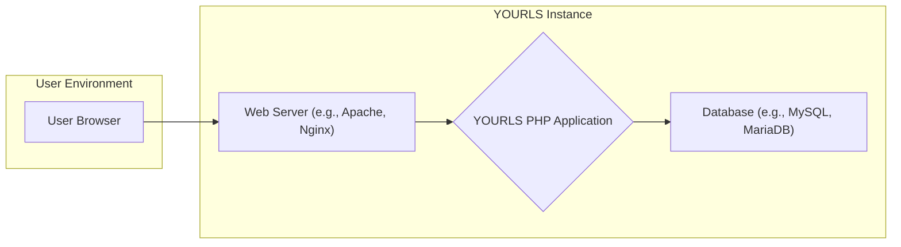
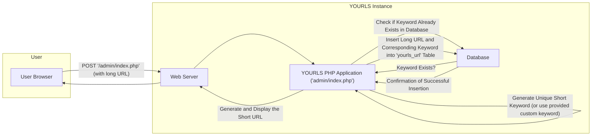
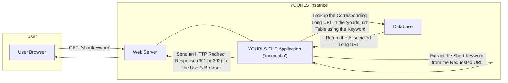

# Project Design Document: YOURLS (Your Own URL Shortener)

**Version:** 1.1
**Date:** October 26, 2023
**Author:** AI Software Architect

## 1. Introduction

This document provides a detailed design overview of the YOURLS (Your Own URL Shortener) project, an open-source PHP script that empowers users to host their own URL shortening service. This document aims to provide a comprehensive understanding of the system's architecture, components, and data flow, serving as a solid foundation for subsequent threat modeling activities.

### 1.1. Purpose

The primary purpose of this document is to meticulously outline the design of YOURLS specifically for security analysis and threat modeling. It details the system's architecture, individual components, and their interactions to facilitate the precise identification of potential vulnerabilities and associated security risks.

### 1.2. Scope

This document comprehensively covers the core functionalities inherent to YOURLS, including:

*   The process of generating shortened URLs from longer ones.
*   The mechanism for redirecting users from short URLs to their original destinations.
*   The administrative web interface used for managing links and viewing usage statistics.
*   The plugin system that allows for extending the base functionality.
*   Fundamental security features, such as password protection for accessing the administrative area.

This document intentionally excludes:

*   In-depth implementation details of specific functions or code segments.
*   Specific deployment configurations, such as detailed web server setup instructions.
*   Integrations with external third-party services beyond the core plugin architecture.

### 1.3. Target Audience

This document is primarily intended for:

*   Security engineers and architects tasked with conducting threat modeling and security assessments of YOURLS deployments.
*   Software developers who require a thorough understanding of the system's architecture for maintenance, debugging, or extending its functionality.
*   Operations teams responsible for the deployment, configuration, and ongoing management of YOURLS instances.

## 2. System Overview

YOURLS is fundamentally a self-hosted web application for URL shortening, built using PHP and typically relying on a relational database management system (RDBMS), such as MySQL or MariaDB, for persistent data storage. Users interact with YOURLS via standard web browsers, utilizing both the public redirection service and the secured administrative panel.

### 2.1. High-Level Architecture

### 2.2. Key Features

*   **Short URL Generation:** The capability to accept a long, unwieldy URL and generate a shorter, more manageable alternative.
*   **URL Redirection:** The core function of seamlessly redirecting users accessing a short URL to its corresponding original long URL.
*   **Custom Short URLs:** The option for users to define specific, memorable keywords for their shortened URLs, enhancing usability.
*   **Statistics Tracking:** The collection and recording of click counts and referrer information for each generated short URL, providing valuable usage insights.
*   **Administrative Interface:** A dedicated web-based interface providing administrators with tools to manage links, basic user accounts (if enabled), and system settings.
*   **Plugin System:** A modular architecture allowing developers to extend the core functionality of YOURLS through the creation and installation of plugins.
*   **API:** A programmatic interface enabling external applications and services to interact with YOURLS functionalities.

## 3. Component Details

This section provides a more granular description of the key components that constitute the YOURLS system.

### 3.1. Web Server

*   **Description:** The software responsible for handling incoming HTTP requests from users' browsers. Common examples include Apache HTTP Server and Nginx.
*   **Functionality:**
    *   Receives all HTTP requests directed at the YOURLS instance, encompassing both public redirection requests and administrative panel access.
    *   Routes dynamic content requests to the PHP interpreter for processing.
    *   Serves static files, such as CSS, JavaScript, and images, if any.
    *   Manages the establishment and maintenance of secure connections using SSL/TLS encryption.
*   **Security Considerations:**
    *   Potential vulnerabilities inherent in the web server software itself, requiring regular patching and updates.
    *   Risks associated with misconfigurations, such as inadvertently exposing sensitive configuration files or enabling directory listing.
    *   Susceptibility to Denial of Service (DoS) attacks targeting the web server's ability to handle requests.

### 3.2. YOURLS PHP Application

*   **Description:** The central PHP codebase of YOURLS, encapsulating all the core business logic and functionalities of the application.
*   **Key Files and Directories:**
    *   `index.php`: The primary script responsible for handling redirection logic when a short URL is accessed.
    *   `admin/index.php`: The entry point for the administrative web interface, handling authentication and management tasks.
    *   `includes/`: Contains essential core functions, database interaction logic, API endpoint handlers, and other supporting code.
        *   `functions.php`: Houses core functions used throughout the application.
        *   `load-plugins.php`: Manages the loading and initialization of installed plugins.
        *   `database-functions.php`: Contains functions for interacting with the database.
    *   `plugins/`: The designated directory where plugin files are stored, allowing for modular extensions of functionality.
    *   `.htaccess` (for Apache): Configuration file used by Apache to define URL rewriting rules and security directives.
    *   `config.php`: The crucial configuration file storing sensitive information such as database connection credentials and other application-specific settings.
*   **Functionality:**
    *   Receives processed requests from the web server.
    *   Implements the logic for creating new short URLs, looking up corresponding long URLs, and performing redirections.
    *   Manages user authentication and authorization for accessing the administrative interface.
    *   Facilitates interaction with the underlying database for data persistence.
    *   Executes code provided by installed plugins, extending core capabilities.
    *   Provides the defined API endpoints for external interaction.
*   **Security Considerations:**
    *   Potential PHP code vulnerabilities, including but not limited to SQL injection, cross-site scripting (XSS), and remote code execution (RCE).
    *   Risks associated with insecure handling of user-supplied input, potentially leading to exploits.
    *   Vulnerabilities that may be introduced by poorly written or malicious plugins.
    *   The risk of exposing sensitive information, particularly database credentials stored in `config.php`.
    *   Weaknesses in session management, potentially leading to session hijacking.
    *   Susceptibility to cross-site request forgery (CSRF) attacks targeting the administrative interface.

### 3.3. Database

*   **Description:** The persistent storage layer for YOURLS, typically implemented using a relational database system like MySQL or MariaDB.
*   **Key Tables (Example):**
    *   `yourls_url`: Stores the core mapping between short URL keywords and their corresponding long URLs. Key columns include `keyword`, `url`, `date`, `ip`, and `clicks`.
    *   `yourls_options`: Stores various configuration settings for the YOURLS installation.
    *   `yourls_log` (optional): Stores detailed click statistics, including timestamps and referring URLs.
    *   `yourls_users` (if enabled): Stores user credentials for accessing the administrative interface.
*   **Functionality:**
    *   Provides persistent storage and retrieval of URL mappings.
    *   Stores application-wide configuration parameters.
    *   Optionally stores detailed click statistics for tracking purposes.
    *   Stores user authentication credentials when user management is enabled.
*   **Security Considerations:**
    *   Vulnerability to SQL injection attacks originating from the PHP application if database queries are not properly sanitized and parameterized.
    *   Risks associated with weak database credentials, potentially allowing unauthorized access.
    *   Potential for unauthorized access to the database server itself if not properly secured.
    *   The risk of data breaches leading to the exposure of sensitive information stored within the database.

### 3.4. Plugins

*   **Description:**  Independent modules that extend the base functionality of YOURLS without modifying the core codebase. Typically implemented as PHP files within the `plugins/` directory.
*   **Functionality:** Plugins can introduce a wide range of new features, such as:
    *   Support for alternative URL schemes or custom shortlink formats.
    *   More advanced or specialized statistics tracking and reporting.
    *   Integration with external third-party services and APIs.
    *   Implementation of enhanced security features or custom authentication mechanisms.
*   **Security Considerations:**
    *   Potential for vulnerabilities within the plugin code itself, mirroring the security concerns of the core application.
    *   The risk of installing malicious plugins that could compromise the security or functionality of the YOURLS instance.
    *   Insecure processes for installing, updating, or managing plugins, potentially introducing vulnerabilities.

## 4. Data Flow

This section illustrates the typical flow of data within the YOURLS system for two primary use cases: the creation of a short URL and the redirection process.

### 4.1. Short URL Creation

**Steps:**

1. The user submits a long URL, typically through a form in the administrative interface.
2. The web server receives the HTTP POST request containing the long URL.
3. The request is routed to the `admin/index.php` script within the YOURLS PHP application.
4. The PHP application meticulously validates and sanitizes the provided long URL to prevent malicious input.
5. The application generates a unique short keyword automatically or utilizes a custom keyword provided by the user.
6. The application queries the database to verify that the generated or provided short keyword is not already in use.
7. The database responds, indicating whether the keyword is already present.
8. If the keyword is unique, the long URL and its corresponding short keyword are inserted as a new record into the `yourls_url` table.
9. The database confirms the successful insertion of the new URL mapping.
10. The PHP application constructs the complete short URL and prepares it for display.
11. The web server sends the HTTP response back to the user's browser, displaying the newly created short URL.

### 4.2. URL Redirection

**Steps:**

1. The user attempts to access a short URL by clicking on a link or entering it directly into their browser's address bar.
2. The web server receives the HTTP GET request for the short URL.
3. The request is routed to the `index.php` script within the YOURLS PHP application.
4. The PHP application extracts the short keyword from the requested URL path.
5. The application queries the `yourls_url` table in the database to find the long URL associated with the extracted short keyword.
6. The database returns the corresponding long URL.
7. The PHP application generates an HTTP redirect response (typically a 301 Permanent Redirect or a 302 Found redirect) with the long URL as the target.
8. The web server sends the redirect response back to the user's browser.
9. The user's browser automatically follows the redirect, navigating to the original long URL.

## 5. Security Considerations

This section details specific security considerations based on the system's design. This serves as a starting point for a more comprehensive threat modeling exercise.

*   **Input Validation and Sanitization:** Rigorously validate and sanitize all user-provided input, whether submitted through the administrative interface or via the API, to prevent injection attacks such as SQL injection and cross-site scripting (XSS).
*   **Authentication and Authorization:** Implement strong authentication mechanisms for the administrative interface, including the consideration of multi-factor authentication (MFA). Enforce proper authorization controls to restrict access to sensitive functionalities based on user roles.
*   **Session Management:** Securely manage user sessions by utilizing secure cookies with the `HttpOnly` and `Secure` flags set. Regularly regenerate session IDs to mitigate the risk of session hijacking.
*   **Cross-Site Scripting (XSS) Prevention:**  Thoroughly sanitize all output rendered within the administrative interface to prevent stored XSS attacks. Employ appropriate escaping mechanisms based on the output context.
*   **Cross-Site Request Forgery (CSRF) Protection:** Implement robust CSRF protection mechanisms, such as synchronizer tokens (anti-CSRF tokens), within the administrative interface to prevent unauthorized actions on behalf of authenticated users.
*   **SQL Injection Prevention:**  Utilize parameterized queries or prepared statements exclusively when interacting with the database to eliminate the risk of SQL injection vulnerabilities. Avoid constructing SQL queries through string concatenation of user input.
*   **Remote Code Execution (RCE) Mitigation:**  Minimize the potential for RCE vulnerabilities by diligently keeping the core YOURLS installation and all installed plugins up-to-date with the latest security patches. Exercise extreme caution when installing plugins from untrusted or unverified sources.
*   **Database Security Hardening:**  Secure the database server by enforcing strong and unique passwords for all database users, restricting network access to the database server, and ensuring the database software is regularly updated.
*   **Configuration Security:**  Protect the `config.php` file, which contains sensitive database credentials and other configuration information. Restrict access to this file at the web server level using appropriate file permissions and access controls.
*   **Plugin Security Management:** Implement mechanisms to verify the integrity and security of plugins before installation. Educate users on the risks associated with installing plugins from untrusted sources. Consider implementing a plugin vetting process.
*   **Denial of Service (DoS) Attack Mitigation:** Implement rate limiting on both the redirection service and the administrative interface to mitigate potential DoS attacks. Consider using a web application firewall (WAF) for enhanced protection.
*   **Open Redirect Prevention:**  Carefully validate and sanitize input used in redirection logic to prevent the system from being abused as an open redirector for phishing or other malicious purposes.
*   **HTTPS Enforcement:**  Enforce the use of HTTPS across the entire YOURLS instance to encrypt all communication between users and the server, protecting sensitive data in transit. Configure HTTP Strict Transport Security (HSTS) to further enhance security.

## 6. Deployment Model

YOURLS is commonly deployed within a standard web server environment. Typical deployment configurations include:

*   **LAMP Stack:**  A popular open-source web service stack consisting of Linux as the operating system, Apache HTTP Server as the web server, MySQL or MariaDB as the database management system, and PHP as the scripting language.
*   **LEMP Stack:**  A similar stack to LAMP, but utilizing Nginx as the web server instead of Apache.

The typical deployment process involves the following steps:

1. Setting up a web server (either Apache or Nginx) on a suitable operating system.
2. Installing PHP and all necessary PHP extensions required by YOURLS (e.g., PDO for database interaction, `mbstring`, `curl`).
3. Setting up a database server (MySQL or MariaDB) and creating a dedicated database for YOURLS.
4. Downloading the YOURLS source code and extracting it to the web server's document root or a designated subdirectory.
5. Configuring the `config.php` file with the appropriate database connection credentials and other settings.
6. Configuring the web server to correctly handle URL rewriting rules, typically using `.htaccess` files for Apache or within the server block configuration for Nginx. This is crucial for the short URL redirection functionality.
7. Implementing security best practices for the web server and database, including setting appropriate file permissions, disabling unnecessary modules, and hardening the database configuration.

## 7. Dependencies

*   **PHP:**  The primary programming language for YOURLS. Requires specific PHP extensions to be enabled for full functionality.
    *   `pdo` (PHP Data Objects) for database interaction.
    *   `pdo_mysql` (or equivalent for other database systems) for MySQL/MariaDB support.
    *   `mbstring` for handling multi-byte strings.
    *   `curl` for making HTTP requests (often used by plugins).
*   **Database:**  A relational database management system for persistent data storage.
    *   MySQL or MariaDB are the most commonly used options.
*   **Web Server:**  Handles incoming HTTP requests and serves the YOURLS application.
    *   Apache HTTP Server or Nginx are the recommended web servers.

## 8. Future Considerations

*   **Enhanced User Management System:** Implement a more robust user management system with granular roles and permissions for the administrative interface, allowing for better control over access and privileges.
*   **Advanced Analytics and Reporting:** Develop more sophisticated analytics and reporting features, providing administrators with deeper insights into link usage patterns, geographic data, and referrer information.
*   **API Expansion and Improvements:**  Expand the existing API with more comprehensive endpoints to enable a wider range of programmatic interactions with YOURLS functionalities. Implement API authentication and authorization mechanisms.
*   **Integration of Built-in Security Features:** Explore the possibility of integrating advanced security features directly into the core of YOURLS, such as built-in two-factor authentication, rate limiting, and basic intrusion detection capabilities.

## 9. Conclusion

This document provides a comprehensive and detailed design overview of the YOURLS project, emphasizing its key architectural components, data flow processes, and crucial security considerations. This information is essential for conducting thorough and effective threat modeling exercises aimed at identifying and mitigating potential security vulnerabilities. A solid understanding of the system's architecture and the interactions between its components is paramount for security professionals to accurately assess risks and recommend appropriate security controls to protect YOURLS deployments.