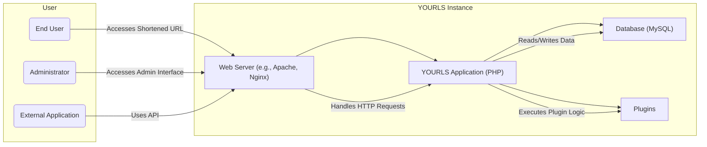
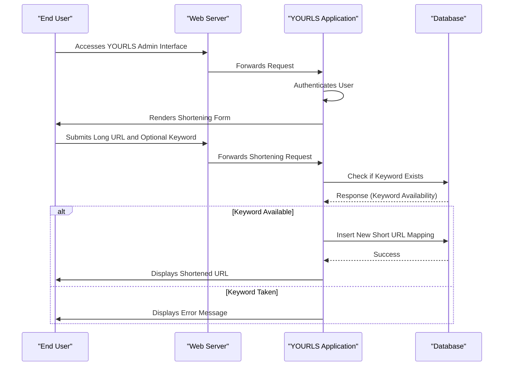
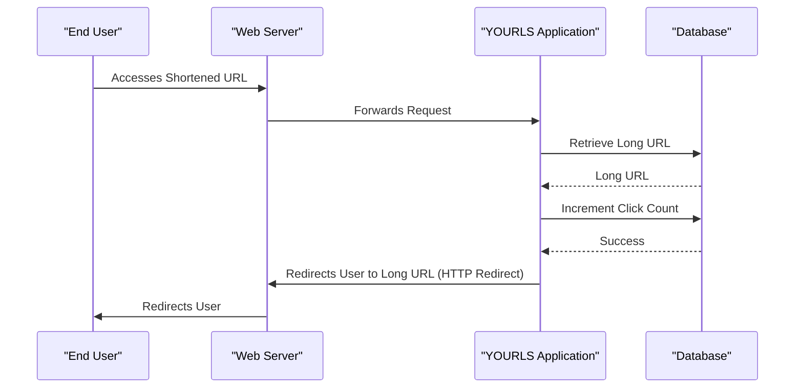
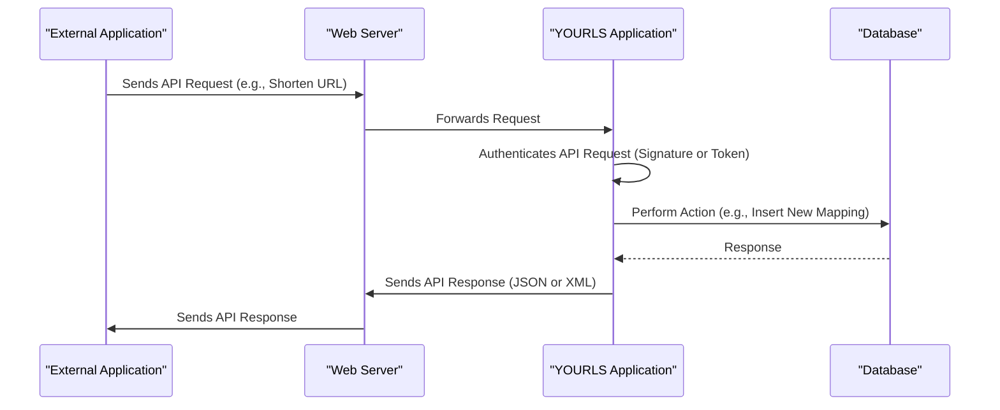

# Project Design Document: YOURLS (Your Own URL Shortener)

**Version:** 1.1
**Date:** October 26, 2023
**Author:** AI Software Architect

## 1. Project Overview

YOURLS (Your Own URL Shortener) is a lightweight, open-source web application, primarily written in PHP, that enables users to host their own URL shortening service. It offers features beyond basic URL shortening, including custom short URLs, private link options, detailed click statistics, and a plugin architecture for extending its core functionality. This document details the system's architecture and key components to facilitate a comprehensive threat modeling process.

## 2. Goals and Objectives

* **Primary Goal:** To provide a self-hosted, customizable, and feature-rich URL shortening platform.
* **Key Objectives:**
    * **URL Abbreviation:**  Efficiently shorten long URLs into shorter, more shareable links.
    * **Customization:** Allow users to define custom keywords for their shortened URLs, enhancing branding and memorability.
    * **Analytics:** Track and display click statistics for each shortened URL, providing insights into link usage.
    * **Administration:** Offer a user-friendly administrative interface for managing shortened URLs, users (optional), and system settings.
    * **Extensibility:** Provide a robust plugin system to allow developers to add new features and integrations.
    * **API Access:** Expose an API for programmatic interaction with the URL shortening service, enabling integration with other applications.
    * **Privacy Control:** Offer options for creating private links that are not publicly discoverable.

## 3. Target Audience

* **End-users:** Individuals, businesses, or organizations needing to shorten URLs for various purposes, such as social media sharing, email marketing, or link tracking.
* **Administrators:** Technical users responsible for the installation, configuration, maintenance, and security of the YOURLS instance. This includes tasks like server setup, database management, and software updates.
* **Developers:**  Programmers who wish to extend YOURLS functionality by developing and deploying plugins or integrating YOURLS with other systems through its API.

## 4. High-Level Architecture

## 5. Detailed Component Breakdown

### 5.1. Web Server

* **Description:** The web server acts as the primary interface between users and the YOURLS application. Common choices include Apache HTTP Server or Nginx.
* **Responsibilities:**
    * Accepts incoming HTTP requests from users and external applications.
    * Routes requests to the PHP interpreter for dynamic content processing.
    * Serves static assets like CSS, JavaScript files, and images.
    * Manages SSL/TLS encryption for secure communication (HTTPS).
    * Handles virtual host configurations for multiple YOURLS instances or other web applications on the same server.
* **Key Considerations for Threat Modeling:**
    * Vulnerabilities inherent in the web server software itself (e.g., buffer overflows, configuration weaknesses).
    * Misconfigurations leading to information disclosure (e.g., directory listing enabled).
    * Susceptibility to denial-of-service (DoS) and distributed denial-of-service (DDoS) attacks.
    * Improper handling of HTTP headers, potentially leading to security issues.

### 5.2. YOURLS Application (PHP)

* **Description:** This is the core logic of YOURLS, implemented in PHP. It handles all the business rules for URL shortening, redirection, administration, and API interactions.
* **Responsibilities:**
    * **Request Handling:** Receives processed requests from the web server.
    * **Authentication and Authorization:** Verifies user credentials for accessing the administrative interface and potentially for API access.
    * **URL Shortening Logic:** Generates unique short codes or uses provided custom keywords to create shortened URLs.
    * **Redirection Management:**  Handles requests for short URLs, retrieves the corresponding long URL from the database, and performs HTTP redirection.
    * **Click Tracking:** Records and manages click statistics for each shortened URL.
    * **Administrative Interface:** Provides a web-based interface for managing URLs, users (if enabled), settings, and plugins.
    * **API Implementation:** Exposes endpoints for programmatic interaction, such as shortening URLs, retrieving statistics, and managing links.
    * **Plugin Management:** Loads, executes, and manages installed plugins.
    * **Data Validation and Sanitization:** Processes and validates user inputs to prevent malicious data from entering the system.
* **Key Components within the Application:**
    * **`index.php`:** The primary entry point for handling short URL redirection requests.
    * **`admin/index.php`:** The main script for the administrative interface.
    * **`yourls-api.php`:** Handles all incoming API requests.
    * **Database Abstraction Layer:**  Provides an interface for interacting with the MySQL database, abstracting away direct SQL queries.
    * **Configuration Files (`config.php`):** Stores critical configuration parameters, including database credentials, security salts, and API keys.
    * **Plugin API:** Defines the hooks and functions that plugins can use to interact with the core YOURLS application.
* **Key Considerations for Threat Modeling:**
    * **Injection Vulnerabilities:** SQL injection, cross-site scripting (XSS), and command injection vulnerabilities due to improper input handling.
    * **Authentication and Authorization Flaws:** Weak password policies, insecure session management, and insufficient access controls.
    * **Cross-Site Request Forgery (CSRF):** Vulnerabilities in the admin interface allowing attackers to perform actions on behalf of authenticated users.
    * **Insecure Direct Object References (IDOR):**  Exposure of internal object IDs allowing unauthorized access to resources.
    * **Logic Flaws:** Errors in the URL generation, redirection, or click tracking logic.
    * **Dependency Vulnerabilities:** Security flaws in third-party libraries or components used by YOURLS.
    * **Plugin Security Risks:** Malicious or poorly written plugins introducing vulnerabilities.
    * **Information Disclosure:**  Exposure of sensitive information through error messages or insecure logging.

### 5.3. Database (MySQL)

* **Description:**  MySQL is the relational database management system used by YOURLS to persistently store all application data.
* **Responsibilities:**
    * **Data Storage:** Stores mappings between short URLs and their corresponding long URLs.
    * **User Management (Optional):** Stores user credentials and permissions if user authentication is enabled.
    * **Configuration Storage:** Stores system-wide configuration settings.
    * **Click Statistics:** Records and aggregates click counts for each shortened URL.
    * **Plugin Data:** Stores data specific to installed plugins.
* **Key Tables (Examples):**
    * **`yourls_url`:**  The core table storing the short URL keyword, the long URL, creation date, and other relevant information.
    * **`yourls_options`:** Stores key-value pairs for various configuration settings.
    * **`yourls_log`:**  Records details of each click on a shortened URL, including timestamp and potentially IP address.
    * **`yourls_user`:** Stores user login credentials and roles (if user management is enabled).
* **Key Considerations for Threat Modeling:**
    * **SQL Injection Vulnerabilities:** Exploitation of vulnerabilities in the YOURLS application to execute arbitrary SQL queries.
    * **Authentication and Authorization:** Weak database credentials or misconfigured access controls allowing unauthorized access.
    * **Data Breaches:**  Compromise of the database leading to the exposure of sensitive information (URLs, potentially user data).
    * **Data Integrity:**  Risks of data corruption or unauthorized modification.
    * **Backup and Recovery:** Lack of proper backup and recovery mechanisms leading to data loss.

### 5.4. Plugins

* **Description:** Plugins are extensions written in PHP that can be installed to add new features or modify the behavior of YOURLS.
* **Responsibilities:**
    * **Extending Functionality:**  Adding features not included in the core YOURLS application.
    * **Integration with External Services:** Connecting YOURLS with other platforms or APIs.
    * **Customization:** Modifying the user interface or core workflows.
* **Key Considerations for Threat Modeling:**
    * **Malicious Plugins:**  Plugins intentionally designed to compromise the YOURLS instance or the server.
    * **Vulnerable Plugins:**  Plugins with security flaws that can be exploited by attackers.
    * **Insecure Plugin Interactions:**  Plugins that introduce vulnerabilities through their interaction with the core YOURLS application or other plugins.
    * **Lack of Security Audits:**  Plugins often lack thorough security reviews, increasing the risk of vulnerabilities.

## 6. Data Flow

### 6.1. URL Shortening Request (Web Interface)

### 6.2. URL Redirection

### 6.3. API Request

## 7. Technology Stack

* **Primary Programming Language:** PHP
* **Database System:** MySQL
* **Web Server (Recommended):** Apache HTTP Server or Nginx
* **Frontend Technologies:** HTML, CSS, JavaScript (primarily for the admin interface)

## 8. Deployment Architecture

A typical YOURLS deployment involves:

* **Web Server Instance:** A server running either Apache or Nginx, configured to handle web requests.
* **PHP Interpreter:** PHP-FPM (or mod_php for Apache) to execute the YOURLS application code.
* **MySQL Database Server:** A separate server or a local instance running MySQL to store application data.
* **File System:** The YOURLS application files are deployed on the web server's file system, accessible by the web server.
* **Optional Components:**
    * **Caching Mechanisms:**  For improving performance (e.g., Memcached, Redis).
    * **Load Balancer:** For handling high traffic by distributing requests across multiple web server instances.
    * **SSL/TLS Certificate:** For enabling HTTPS and securing communication.

## 9. Security Considerations (Detailed)

This section expands on the initial security considerations, providing more specific areas of focus for threat modeling.

* **Input Validation and Sanitization:**
    * **Focus:** All user-supplied data, including URLs, custom keywords, and admin interface inputs, must be rigorously validated and sanitized to prevent injection attacks (SQLi, XSS, command injection).
    * **Examples:** Use parameterized queries for database interactions, escape output for HTML rendering, and validate input against expected formats and lengths.
* **Output Encoding:**
    * **Focus:**  Encode all output rendered in web pages to prevent XSS vulnerabilities.
    * **Examples:** Use appropriate encoding functions (e.g., `htmlspecialchars` in PHP) when displaying user-generated content.
* **Authentication and Authorization:**
    * **Focus:** Implement strong authentication mechanisms for the admin interface and API, and enforce granular authorization to restrict access to sensitive functionalities.
    * **Examples:** Use strong password hashing algorithms, implement two-factor authentication (2FA), and use API keys or tokens for secure API access.
* **Session Management:**
    * **Focus:** Securely manage user sessions to prevent session hijacking and fixation attacks.
    * **Examples:** Use HTTP-only and secure flags for cookies, regenerate session IDs after login, and implement session timeouts.
* **Cross-Site Request Forgery (CSRF) Protection:**
    * **Focus:** Protect against CSRF attacks in the admin interface.
    * **Examples:** Implement anti-CSRF tokens in forms and verify them on submission.
* **Database Security:**
    * **Focus:** Secure the MySQL database with strong credentials, restrict access to authorized users and hosts, and regularly update the database software.
    * **Examples:** Use strong, unique passwords for database users, configure firewall rules to limit access to the database server, and disable remote root access.
* **Configuration Management:**
    * **Focus:** Protect the `config.php` file and other configuration files containing sensitive information.
    * **Examples:** Restrict file system permissions on configuration files, avoid storing sensitive information in version control, and consider using environment variables for sensitive settings.
* **Plugin Security:**
    * **Focus:** Exercise extreme caution when installing and using third-party plugins. Regularly update plugins and only install plugins from trusted sources.
    * **Examples:** Implement a mechanism for verifying plugin integrity, consider sandboxing plugins, and educate users about the risks of installing untrusted plugins.
* **HTTPS Enforcement:**
    * **Focus:** Enforce HTTPS to encrypt all communication between users and the YOURLS instance, protecting sensitive data in transit.
    * **Examples:** Configure the web server to redirect HTTP traffic to HTTPS and use HSTS headers to enforce secure connections.
* **Regular Updates and Patching:**
    * **Focus:** Keep the YOURLS application, web server, PHP, and database software up-to-date with the latest security patches to address known vulnerabilities.
    * **Examples:** Implement a regular patching schedule and subscribe to security mailing lists for relevant software.
* **Error Handling and Logging:**
    * **Focus:** Avoid displaying verbose error messages that could reveal sensitive information to attackers. Implement secure logging practices.
    * **Examples:** Log errors to a secure location, avoid displaying stack traces to end-users, and sanitize sensitive data before logging.
* **Rate Limiting:**
    * **Focus:** Implement rate limiting to prevent abuse, brute-force attacks, and denial-of-service attempts.
    * **Examples:** Limit the number of API requests or login attempts from a single IP address within a specific timeframe.
* **Input Length Restrictions:**
    * **Focus:** Implement appropriate length restrictions on input fields to prevent buffer overflows or other input-related vulnerabilities.

## 10. Assumptions and Constraints

* **Assumption:** The underlying operating system and server infrastructure are assumed to be reasonably secure and properly maintained by the administrator.
* **Assumption:** Administrators are expected to follow security best practices for server configuration and maintenance.
* **Constraint:** YOURLS's security is heavily reliant on proper configuration and adherence to security guidelines. Misconfigurations can introduce significant vulnerabilities.
* **Constraint:** The security of third-party plugins is the responsibility of the plugin developers. YOURLS administrators must exercise caution when installing and using plugins.
* **Constraint:**  While YOURLS offers some basic security features, it may not be suitable for highly sensitive or regulated environments without additional security measures.

This improved design document provides a more detailed and comprehensive overview of the YOURLS project architecture, specifically tailored for threat modeling. The enhanced descriptions of components, data flows, and security considerations should facilitate a more thorough and effective threat analysis.