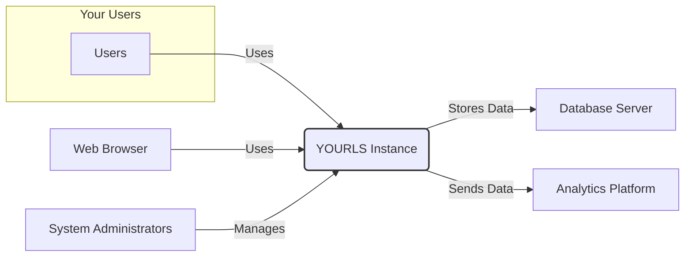

# BUSINESS POSTURE

This project, YOURLS (Your Own URL Shortener), aims to provide users with a self-hosted, customizable, and privacy-focused alternative to public URL shortening services. The primary business priority is to empower users with control over their link data and branding, offering a solution that can be tailored to specific needs and integrated into existing workflows.

Business goals include:

- Providing a self-hosted URL shortening solution.
- Offering customization options for branded short links.
- Ensuring user privacy and data control.
- Enabling link analytics and tracking (optional).
- Supporting integration with other systems and services.

Most important business risks to be addressed:

- Data loss or corruption due to infrastructure failures or security breaches.
- Service unavailability impacting link redirection and business operations.
- Unauthorized access to the YOURLS instance and its data.
- Reputation damage due to security vulnerabilities or data breaches.
- Performance issues affecting user experience and link redirection speed.

# SECURITY POSTURE

Existing security controls:

- security control: HTTPS enforcement for secure communication between users and the YOURLS instance. (Implemented at web server level, e.g., Apache/Nginx configuration).
- security control: User authentication for accessing the administrative interface. (Implemented within YOURLS application logic).
- security control: Password hashing for storing user credentials securely. (Implemented within YOURLS application logic).
- security control: Input sanitization to prevent basic XSS vulnerabilities. (Implemented within YOURLS application logic).
- security control: Database parameterization to mitigate SQL injection risks. (Implemented within YOURLS application logic).
- accepted risk: Reliance on self-hosting implies shared responsibility for infrastructure security (OS, web server, database).
- accepted risk: Open-source nature means vulnerability information is publicly available, requiring timely patching.
- accepted risk: Default configurations might not be hardened, requiring manual security configuration.

Recommended security controls:

- security control: Implement a Content Security Policy (CSP) to mitigate XSS attacks. (Implemented at web server level, HTTP header configuration).
- security control: Regularly update YOURLS and its dependencies to patch known vulnerabilities. (Implemented through system administration and maintenance procedures).
- security control: Implement a Web Application Firewall (WAF) to protect against common web attacks. (Implemented as a network security appliance or cloud-based WAF).
- security control: Conduct regular security audits and penetration testing to identify and address vulnerabilities. (Implemented through periodic security assessments).
- security control: Implement rate limiting to protect against brute-force attacks and denial-of-service attempts. (Implemented at web server or WAF level).
- security control: Enable and configure security logging and monitoring to detect and respond to security incidents. (Implemented through system and application logging and SIEM integration).

Security requirements:

- Authentication:
    - requirement: Secure authentication mechanism for administrative users.
    - requirement: Consider multi-factor authentication (MFA) for enhanced security.
    - requirement: Implement strong password policies and enforce password complexity.
- Authorization:
    - requirement: Role-based access control to manage user permissions within the administrative interface.
    - requirement: Principle of least privilege should be applied to user roles and database access.
- Input Validation:
    - requirement: Comprehensive input validation on all user-supplied data to prevent injection attacks (SQL, XSS, command injection).
    - requirement: Input validation should be performed on both client-side and server-side.
    - requirement: Sanitize and encode output data to prevent XSS vulnerabilities.
- Cryptography:
    - requirement: Use HTTPS for all communication to ensure data confidentiality and integrity in transit.
    - requirement: Securely store sensitive data, such as API keys or database credentials, using encryption at rest.
    - requirement: Use strong cryptographic algorithms and libraries for password hashing and other cryptographic operations.

# DESIGN

## C4 CONTEXT



Context Diagram Elements:

- Element:
    - Name: Users
    - Type: Person
    - Description: End-users who access shortened URLs.
    - Responsibilities: Access shortened URLs, potentially share them.
    - Security controls: None directly, rely on YOURLS instance security.
- Element:
    - Name: YOURLS Instance
    - Type: Software System
    - Description: The YOURLS application itself, responsible for shortening URLs, redirecting, and managing links.
    - Responsibilities: Shorten URLs, redirect short URLs to original URLs, manage link data, provide administrative interface.
    - Security controls: Authentication, authorization, input validation, HTTPS, password hashing, security logging.
- Element:
    - Name: Web Browser
    - Type: Software System
    - Description: User's web browser used to access shortened URLs and the YOURLS administrative interface.
    - Responsibilities: Render web pages, send requests to YOURLS, handle user interactions.
    - Security controls: Browser security features (CSP, XSS protection, etc.), user-configured security settings.
- Element:
    - Name: Analytics Platform
    - Type: External System
    - Description: Optional external analytics platform (e.g., Google Analytics) to track link clicks and usage.
    - Responsibilities: Collect and analyze link click data.
    - Security controls: Data privacy policies of the analytics platform, secure data transmission to the platform.
- Element:
    - Name: Database Server
    - Type: Software System
    - Description: Database server (e.g., MySQL) used by YOURLS to store link data, user information, and configuration.
    - Responsibilities: Store and retrieve data for YOURLS.
    - Security controls: Database access controls, encryption at rest (optional), database hardening.
- Element:
    - Name: System Administrators
    - Type: Person
    - Description: Individuals responsible for installing, configuring, maintaining, and securing the YOURLS instance.
    - Responsibilities: Install and configure YOURLS, manage users, monitor system health, apply security patches, perform backups.
    - Security controls: Strong authentication for server access, access control to server resources, security training.

## C4 CONTAINER

```mermaid
flowchart LR
    subgraph "YOURLS Instance"
        direction TB
        A["Web Server"
        \n(Nginx/Apache)]
        B["PHP Application"
        \n(YOURLS Code)]
        C["Database"
        \n(MySQL/MariaDB)]
    end
    D[Web Browser]
    E[Users]

    D -- HTTPS --> A
    E -- HTTPS --> A
    A -- FastCGI/PHP-FPM --> B
    B -- Database Connection --> C

    classDef container stroke:#333,stroke-width:2px;
    class A,B,C container;
```

Container Diagram Elements:

- Element:
    - Name: Web Server (Nginx/Apache)
    - Type: Container
    - Description: Web server responsible for handling HTTP/HTTPS requests, serving static content, and proxying requests to the PHP application.
    - Responsibilities: HTTP request handling, TLS termination, static content serving, reverse proxy to PHP application, access control, rate limiting, WAF integration.
    - Security controls: HTTPS configuration, access control lists, rate limiting, WAF rules, security logging, CSP implementation.
- Element:
    - Name: PHP Application (YOURLS Code)
    - Type: Container
    - Description: The YOURLS PHP application code, responsible for core URL shortening logic, administrative interface, and database interaction.
    - Responsibilities: URL shortening, redirection logic, user authentication and authorization, input validation, database interaction, administrative interface, security logging.
    - Security controls: Input validation, output encoding, secure coding practices, password hashing, database parameterization, session management, vulnerability scanning during build.
- Element:
    - Name: Database (MySQL/MariaDB)
    - Type: Container
    - Description: Database system used to store YOURLS data, including URLs, user information, and settings.
    - Responsibilities: Data persistence, data retrieval, data integrity.
    - Security controls: Database access controls, user permissions, encryption at rest (optional), regular backups, database hardening, security patching.

## DEPLOYMENT

Deployment Architecture: Single Server (Self-Hosted)

```mermaid
flowchart LR
    subgraph "Server"
        direction TB
        A[Operating System
        \n(Linux)]
        subgraph Containers
            B["Web Server Container"
            \n(Nginx/Apache)]
            C["PHP Application Container"
            \n(PHP-FPM + YOURLS)]
            D["Database Container"
            \n(MySQL/MariaDB)]
        end
    end
    E[Internet]
    F[Users]

    E -- HTTPS --> A
    F -- HTTPS --> A
    A -- Runs --> B
    A -- Runs --> C
    A -- Runs --> D
    B -- Network --> C
    C -- Network --> D

    classDef deployment stroke:#333,stroke-width:2px;
    class A,B,C,D deployment;
```

Deployment Diagram Elements:

- Element:
    - Name: Server
    - Type: Infrastructure
    - Description: A physical or virtual server hosting the YOURLS instance.
    - Responsibilities: Provide infrastructure for running containers, network connectivity, resource allocation.
    - Security controls: Operating system hardening, firewall configuration, intrusion detection system (IDS), security monitoring, access control to server resources.
- Element:
    - Name: Operating System (Linux)
    - Type: Software
    - Description: Linux operating system running on the server, providing the base environment for containers.
    - Responsibilities: Resource management, process isolation, security features, system services.
    - Security controls: Kernel hardening, security updates, access control, auditing, security modules (e.g., SELinux, AppArmor).
- Element:
    - Name: Web Server Container (Nginx/Apache)
    - Type: Container
    - Description: Containerized web server instance.
    - Responsibilities: Same as Web Server Container in C4 Container diagram.
    - Security controls: Container image security scanning, minimal container image, resource limits, network policies.
- Element:
    - Name: PHP Application Container (PHP-FPM + YOURLS)
    - Type: Container
    - Description: Containerized PHP-FPM instance running the YOURLS application code.
    - Responsibilities: Same as PHP Application Container in C4 Container diagram.
    - Security controls: Container image security scanning, minimal container image, resource limits, network policies, application-level security controls.
- Element:
    - Name: Database Container (MySQL/MariaDB)
    - Type: Container
    - Description: Containerized database server instance.
    - Responsibilities: Same as Database Container in C4 Container diagram.
    - Security controls: Container image security scanning, minimal container image, resource limits, network policies, database-level security controls.
- Element:
    - Name: Internet
    - Type: Environment
    - Description: Public internet network through which users access the YOURLS instance.
    - Responsibilities: Network connectivity.
    - Security controls: None directly, rely on network security and YOURLS instance security.
- Element:
    - Name: Users
    - Type: Person
    - Description: End-users accessing YOURLS via the internet.
    - Responsibilities: Access YOURLS.
    - Security controls: User-side security practices (strong passwords, secure devices).

## BUILD

```mermaid
flowchart LR
    A[Developer] --> B{Code Changes};
    B -- Commit & Push --> C[Version Control System\n(GitHub)];
    C --> D[CI/CD Pipeline\n(GitHub Actions)];
    D --> E{Build Stage\n(Linting, SAST, Dependency Check)};
    E -- Success --> F{Test Stage\n(Unit Tests, Integration Tests)};
    E -- Failure --> G[Build Failure Notification];
    F -- Success --> H{Package Stage\n(Create Artifacts)};
    F -- Failure --> G;
    H --> I[Artifact Repository\n(GitHub Packages)];
    I --> J[Deployment System];

    classDef build stroke:#333,stroke-width:2px;
    class A,B,C,D,E,F,H,I,J build;
    class G build,error;
    classDef error fill:#fdd;
```

Build Process Description:

1. Developer makes code changes and commits them to a Version Control System (e.g., GitHub).
2. Pushing code changes to the repository triggers the CI/CD pipeline (e.g., GitHub Actions).
3. The Build Stage performs security checks:
    - Linting: Code style and potential errors are checked using linters.
    - SAST (Static Application Security Testing): Static analysis tools scan the code for potential vulnerabilities.
    - Dependency Check: Dependencies are analyzed for known vulnerabilities.
4. If the Build Stage fails (e.g., linting errors, SAST findings, vulnerable dependencies), a Build Failure Notification is sent to developers.
5. If the Build Stage is successful, the Test Stage is executed, running unit and integration tests.
6. If the Test Stage fails, a Build Failure Notification is sent.
7. If the Test Stage is successful, the Package Stage creates build artifacts (e.g., a ZIP archive of the YOURLS application).
8. Build artifacts are stored in an Artifact Repository (e.g., GitHub Packages).
9. The Deployment System retrieves artifacts from the repository for deployment to target environments.

Build Diagram Elements:

- Element:
    - Name: Developer
    - Type: Person
    - Description: Software developer contributing to the YOURLS project.
    - Responsibilities: Writing code, committing changes, fixing bugs, addressing security vulnerabilities.
    - Security controls: Secure development practices, code review, security awareness training.
- Element:
    - Name: Version Control System (GitHub)
    - Type: Software System
    - Description: Central repository for source code, tracking changes and facilitating collaboration.
    - Responsibilities: Source code management, version control, collaboration, access control.
    - Security controls: Access control, branch protection, audit logging, vulnerability scanning of repository.
- Element:
    - Name: CI/CD Pipeline (GitHub Actions)
    - Type: Software System
    - Description: Automated pipeline for building, testing, and deploying YOURLS.
    - Responsibilities: Build automation, testing automation, security checks, deployment automation.
    - Security controls: Secure pipeline configuration, access control to pipeline definitions, secret management, vulnerability scanning of pipeline components.
- Element:
    - Name: Build Stage (Linting, SAST, Dependency Check)
    - Type: Pipeline Stage
    - Description: Stage in the CI/CD pipeline focused on building the application and performing security checks.
    - Responsibilities: Code compilation (if needed), linting, SAST scanning, dependency vulnerability scanning.
    - Security controls: SAST tools, dependency scanning tools, secure build environment.
- Element:
    - Name: Test Stage (Unit Tests, Integration Tests)
    - Type: Pipeline Stage
    - Description: Stage in the CI/CD pipeline focused on running automated tests.
    - Responsibilities: Unit testing, integration testing, ensuring code quality and functionality.
    - Security controls: Secure test environment, test data management, security testing (optional).
- Element:
    - Name: Package Stage (Create Artifacts)
    - Type: Pipeline Stage
    - Description: Stage in the CI/CD pipeline focused on packaging the build artifacts.
    - Responsibilities: Creating deployable packages (e.g., ZIP, Docker image).
    - Security controls: Artifact signing (optional), secure artifact creation process.
- Element:
    - Name: Artifact Repository (GitHub Packages)
    - Type: Software System
    - Description: Repository for storing build artifacts.
    - Responsibilities: Artifact storage, versioning, access control.
    - Security controls: Access control, artifact integrity checks, vulnerability scanning of repository.
- Element:
    - Name: Deployment System
    - Type: Software System
    - Description: System responsible for deploying build artifacts to target environments.
    - Responsibilities: Deployment automation, environment management, configuration management.
    - Security controls: Secure deployment process, access control to deployment system, infrastructure as code (IaC).
- Element:
    - Name: Build Failure Notification
    - Type: Notification
    - Description: Automated notification sent to developers in case of build or test failures.
    - Responsibilities: Alert developers about build issues.
    - Security controls: Secure notification channels.

# RISK ASSESSMENT

Critical business processes we are trying to protect:

- URL redirection: Ensuring that shortened URLs reliably redirect to the intended destination. Service disruption would impact users' ability to access content through shortened links.
- Link management: Maintaining the integrity and availability of link data, including original URLs, short URLs, and associated metadata. Data loss or corruption would lead to broken links and loss of valuable information.
- Administrative access: Securing the administrative interface to prevent unauthorized modification of links, settings, and user data. Unauthorized access could lead to data breaches, service disruption, and malicious link manipulation.

Data we are trying to protect and their sensitivity:

- Original URLs: Potentially sensitive information depending on the content being linked. Could include confidential documents, private websites, or internal resources. Sensitivity: Medium to High, depending on use case.
- Short URLs: Less sensitive in isolation, but linked to original URLs. Sensitivity: Low.
- Link metadata (creation date, click counts, custom keywords): Can reveal usage patterns and potentially sensitive information about link usage. Sensitivity: Low to Medium.
- User credentials (usernames, hashed passwords): Highly sensitive. Compromise could lead to unauthorized administrative access and data breaches. Sensitivity: High.
- YOURLS configuration data (database credentials, API keys): Highly sensitive. Compromise could lead to unauthorized access to the database and other systems. Sensitivity: High.
- Logs (access logs, error logs): Can contain sensitive information if not properly managed. Sensitivity: Low to Medium.

# QUESTIONS & ASSUMPTIONS

Questions:

- What is the intended scale of YOURLS usage (number of users, number of links, traffic volume)? This will influence scalability and performance requirements.
- Are there specific compliance requirements (e.g., GDPR, HIPAA) that need to be considered? This will impact data privacy and security controls.
- What is the expected level of technical expertise of the users who will be self-hosting YOURLS? This will influence the complexity of security configurations and documentation needed.
- Are there any specific integrations with other systems or services planned beyond basic analytics? This will impact the context diagram and security considerations for integrations.
- What is the acceptable downtime for the YOURLS service? This will influence availability requirements and disaster recovery planning.

Assumptions:

- The primary deployment model is self-hosting on a single server or virtual machine.
- Users have basic technical skills to install and configure web applications and databases.
- Security is a significant concern, and the design should prioritize common web application security best practices.
- The project aims for a balance between security, usability, and performance.
- The provided GitHub repository represents the core functionality and codebase of YOURLS.