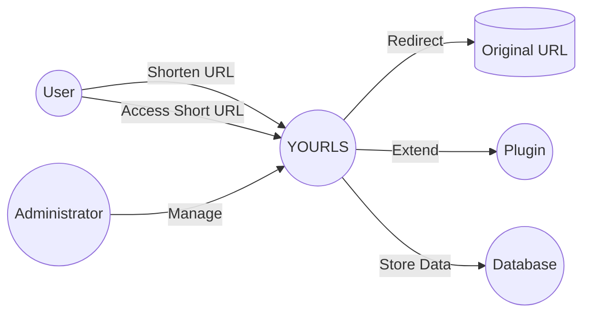
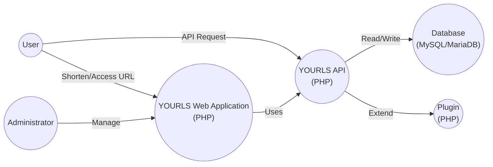
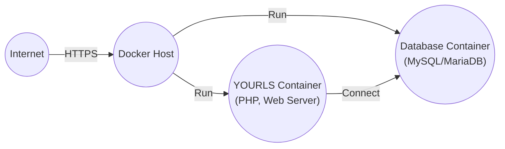
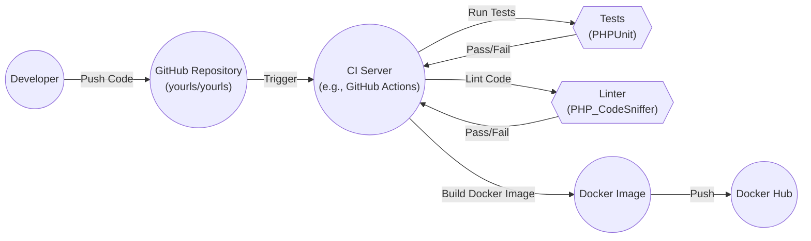

# BUSINESS POSTURE

Business Priorities and Goals:

*   Provide a free, open-source, self-hosted URL shortening service.
*   Offer a lightweight and customizable alternative to commercial URL shorteners.
*   Enable users to maintain control over their data and branding.
*   Provide a simple, easy-to-use platform for creating and managing short links.
*   Support extensibility through plugins.
*   Maintain a small codebase for ease of maintenance and security auditing.

Business Risks:

*   Reputational damage due to service abuse (e.g., phishing, malware distribution).
*   Service downtime or unavailability impacting user experience.
*   Data breaches or unauthorized access to user data (although the data is generally considered low sensitivity).
*   Legal or regulatory issues arising from user-generated content or service misuse.
*   Lack of adoption or community support hindering long-term sustainability.
*   Vulnerabilities in the software leading to exploitation.

# SECURITY POSTURE

Existing Security Controls:

*   security control: Input validation: YOURLS performs input validation on user-supplied URLs and custom short URLs to prevent common injection attacks. (Implemented in various functions throughout the codebase, particularly in `includes/functions-formatting.php` and `includes/functions-url.php`).
*   security control: CSRF protection: YOURLS uses CSRF tokens to protect against Cross-Site Request Forgery attacks on sensitive actions. (Implemented in `includes/functions-html.php` and verified in various action handling files).
*   security control: Rate limiting: YOURLS includes basic rate limiting to mitigate brute-force attacks and denial-of-service attempts. (Implemented in `includes/functions-api.php` and configurable via options).
*   security control: Password hashing: User passwords are not stored in plain text, but are hashed. (Implemented in `includes/functions-auth.php`).
*   security control: Plugin architecture: Allows for extending functionality and security features through plugins. (Implemented in `includes/functions-plugins.php`).
*   security control: .htaccess files: Default `.htaccess` files are provided to restrict access to sensitive directories and files. (Provided in the root directory and `includes` directory).
*   security control: Admin area access control: Access to the administrative interface is restricted to authenticated users. (Implemented in `admin/index.php` and related files).

Accepted Risks:

*   accepted risk: Limited built-in protection against sophisticated attacks: YOURLS relies heavily on correct server configuration and optional plugins for advanced security features.
*   accepted risk: Dependence on third-party libraries: While YOURLS minimizes external dependencies, it still relies on some libraries (e.g., PHPMailer, if configured), which could introduce vulnerabilities.
*   accepted risk: Potential for plugin vulnerabilities: The plugin architecture, while beneficial, introduces the risk of vulnerabilities in third-party plugins.
*   accepted risk: User responsibility for server security: YOURLS users are responsible for securing their underlying server environment (e.g., web server, database, operating system).

Recommended Security Controls:

*   security control: Implement Content Security Policy (CSP): A CSP header can significantly reduce the risk of XSS attacks by controlling the resources the browser is allowed to load.
*   security control: Implement Subresource Integrity (SRI) for included JavaScript and CSS files: This helps ensure that fetched resources haven't been tampered with.
*   security control: Enhance brute-force protection: Consider more robust brute-force mitigation techniques, such as IP-based blocking or account lockout after multiple failed login attempts.
*   security control: Regularly update dependencies: Establish a process for regularly updating PHPMailer and any other dependencies to address security vulnerabilities.
*   security control: Security audit of plugins: Encourage or provide a mechanism for security auditing of commonly used plugins.
*   security control: Two-Factor Authentication (2FA): Implement 2FA for administrative accounts to enhance login security.

Security Requirements:

*   Authentication:
    *   All administrative actions require authentication.
    *   Passwords must be securely hashed using a strong, one-way hashing algorithm (bcrypt or Argon2).
    *   Implement account lockout or other measures to prevent brute-force attacks on user accounts.
    *   Consider offering two-factor authentication (2FA) for enhanced security.

*   Authorization:
    *   Access to administrative functions should be restricted to authorized users only.
    *   Implement role-based access control (RBAC) if different levels of administrative privileges are needed.

*   Input Validation:
    *   All user-supplied input (URLs, custom keywords, form data) must be strictly validated and sanitized to prevent injection attacks (SQL injection, XSS, etc.).
    *   Use a whitelist approach for validation whenever possible, allowing only known-good characters and patterns.
    *   Validate both the length and format of input data.

*   Cryptography:
    *   Use HTTPS for all communication between the client and the server.
    *   Store sensitive data (e.g., API keys, database credentials) securely, preferably using environment variables or a dedicated secrets management solution.
    *   If storing any sensitive data at rest, use strong encryption.

# DESIGN

## C4 CONTEXT

Element Descriptions:

*   Element:
    *   Name: User
    *   Type: Person
    *   Description: A person who uses YOURLS to shorten URLs or access shortened URLs.
    *   Responsibilities: Submits URLs to be shortened, clicks on shortened URLs.
    *   Security controls: None (relies on YOURLS and the destination website's security).

*   Element:
    *   Name: YOURLS
    *   Type: Software System
    *   Description: The YOURLS URL shortening application.
    *   Responsibilities: Shortens URLs, redirects users to original URLs, provides an administrative interface.
    *   Security controls: Input validation, CSRF protection, rate limiting, password hashing, plugin architecture, .htaccess files, admin area access control.

*   Element:
    *   Name: Original URL
    *   Type: External System
    *   Description: The original, long URL that the user wants to shorten.
    *   Responsibilities: Serves the content associated with the long URL.
    *   Security controls: Not controlled by YOURLS; relies on the destination website's security.

*   Element:
    *   Name: Administrator
    *   Type: Person
    *   Description: A person who manages the YOURLS installation.
    *   Responsibilities: Configures YOURLS, manages users, installs plugins, monitors the system.
    *   Security controls: Strong password, secure access to the server.

*   Element:
    *   Name: Plugin
    *   Type: Software System
    *   Description: An optional extension that adds functionality to YOURLS.
    *   Responsibilities: Varies depending on the plugin.
    *   Security controls: Depends on the specific plugin; should follow secure coding practices.

*   Element:
    *   Name: Database
    *   Type: Software System
    *   Description: Database to store data.
    *   Responsibilities: Store data.
    *   Security controls: Access control, encryption at rest, regular backups.

## C4 CONTAINER

Element Descriptions:

*   Element:
    *   Name: User
    *   Type: Person
    *   Description: A person who uses YOURLS to shorten URLs or access shortened URLs.
    *   Responsibilities: Submits URLs to be shortened, clicks on shortened URLs.
    *   Security controls: None (relies on YOURLS and the destination website's security).

*   Element:
    *   Name: YOURLS Web Application (PHP)
    *   Type: Web Application
    *   Description: The main web interface for YOURLS, handling user interaction and redirection.
    *   Responsibilities: Renders the user interface, handles URL shortening requests, redirects users to original URLs.
    *   Security controls: Input validation, CSRF protection, rate limiting, output encoding.

*   Element:
    *   Name: Administrator
    *   Type: Person
    *   Description: A person who manages the YOURLS installation.
    *   Responsibilities: Configures YOURLS, manages users, installs plugins, monitors the system.
    *   Security controls: Strong password, secure access to the server, 2FA (recommended).

*   Element:
    *   Name: YOURLS API (PHP)
    *   Type: API
    *   Description: The API endpoint for interacting with YOURLS programmatically.
    *   Responsibilities: Handles API requests for shortening URLs, retrieving statistics, etc.
    *   Security controls: Input validation, API key authentication, rate limiting.

*   Element:
    *   Name: Database (MySQL/MariaDB)
    *   Type: Database
    *   Description: The database used to store YOURLS data (short URLs, original URLs, statistics, etc.).
    *   Responsibilities: Stores and retrieves data.
    *   Security controls: Database user access control, strong passwords, regular backups, encryption at rest (recommended).

*   Element:
    *   Name: Plugin (PHP)
    *   Type: Web Application
    *   Description: An optional extension that adds functionality to YOURLS.
    *   Responsibilities: Varies depending on the plugin.
    *   Security controls: Depends on the specific plugin; should follow secure coding practices.

## DEPLOYMENT

Possible Deployment Solutions:

1.  Traditional LAMP/LEMP Stack: YOURLS deployed on a server running Apache or Nginx, MySQL/MariaDB, and PHP.
2.  Docker Container: YOURLS packaged as a Docker container, simplifying deployment and portability.
3.  Cloud Hosting (e.g., AWS, Google Cloud, Azure): YOURLS deployed on a cloud platform using virtual machines, managed databases, and other cloud services.

Chosen Solution (Detailed Description): Docker Container

Element Descriptions:

*   Element:
    *   Name: Internet
    *   Type: External
    *   Description: The public internet.
    *   Responsibilities: Provides access to the YOURLS instance.
    *   Security controls: Relies on the security of the Docker host and network configuration.

*   Element:
    *   Name: Docker Host
    *   Type: Server
    *   Description: The server or virtual machine that runs the Docker engine and hosts the YOURLS and database containers.
    *   Responsibilities: Runs the Docker containers, provides network connectivity.
    *   Security controls: Firewall, SSH access control, regular security updates, intrusion detection system (recommended).

*   Element:
    *   Name: YOURLS Container (PHP, Web Server)
    *   Type: Container
    *   Description: A Docker container running the YOURLS application, including PHP and a web server (e.g., Apache or Nginx).
    *   Responsibilities: Executes the YOURLS code, handles web requests.
    *   Security controls: Container isolation, minimal base image, regular image updates, non-root user (recommended).

*   Element:
    *   Name: Database Container (MySQL/MariaDB)
    *   Type: Container
    *   Description: A Docker container running the MySQL or MariaDB database.
    *   Responsibilities: Stores and retrieves YOURLS data.
    *   Security controls: Container isolation, strong database password, limited network access, regular backups, encryption at rest (recommended).

## BUILD

Build Process Description:

1.  Developer pushes code changes to the YOURLS GitHub repository.
2.  A CI server (e.g., GitHub Actions) is triggered by the push event.
3.  The CI server runs automated tests (e.g., PHPUnit) to verify the code's functionality.
4.  The CI server runs a linter (e.g., PHP_CodeSniffer) to check for code style and potential errors.
5.  If the tests and linter pass, the CI server builds a Docker image for YOURLS.
6.  The Docker image is pushed to a container registry (e.g., Docker Hub).

Security Controls:

*   security control: Automated testing: PHPUnit tests help ensure code quality and prevent regressions.
*   security control: Code linting: PHP_CodeSniffer enforces coding standards and helps identify potential vulnerabilities.
*   security control: CI/CD pipeline: GitHub Actions automates the build and testing process, ensuring consistency and reducing manual errors.
*   security control: Docker image: Packaging YOURLS as a Docker image simplifies deployment and improves security by isolating the application and its dependencies.
*   security control: Minimal base image: Using a minimal base image for the Docker container reduces the attack surface.
*   security control: Regular image updates: Regularly updating the base image and dependencies helps patch security vulnerabilities.

# RISK ASSESSMENT

Critical Business Processes:

*   URL shortening: The core functionality of YOURLS, allowing users to create short links.
*   URL redirection: Ensuring that short links correctly redirect users to the original URLs.
*   Service availability: Maintaining the uptime and accessibility of the YOURLS service.
*   Data integrity: Ensuring the accuracy and consistency of the data stored in the database.

Data Sensitivity:

*   Short URLs and original URLs: Generally considered low sensitivity, as they are often publicly accessible. However, some URLs may contain sensitive information or be used for internal purposes, making them moderately sensitive in certain contexts.
*   Usernames and password hashes: Moderately sensitive. While passwords are hashed, a breach could expose usernames and potentially allow attackers to attempt to crack the hashes.
*   API keys (if used): Highly sensitive. API keys grant access to the YOURLS API and should be protected accordingly.
*   Statistics (e.g., click counts): Low sensitivity, but could be used for competitive analysis or to identify popular links.
*   Custom keywords: Low to moderate sensitivity, depending on the keywords chosen by users.

# QUESTIONS & ASSUMPTIONS

Questions:

*   What is the expected traffic volume and user base for the YOURLS instance? This will influence the choice of deployment architecture and scaling considerations.
*   Are there any specific regulatory or compliance requirements that need to be considered (e.g., GDPR, CCPA)?
*   What is the organization's risk tolerance for service downtime or data breaches?
*   What level of support and maintenance is expected for the YOURLS instance?
*   Are there any plans to integrate YOURLS with other systems or services?
*   Is there a specific version of PHP or MySQL/MariaDB required or recommended?
*   What is the process for handling security vulnerabilities reported in YOURLS or its dependencies?

Assumptions:

*   BUSINESS POSTURE: The primary goal is to provide a reliable and functional URL shortening service, with security being a significant but not necessarily the absolute highest priority.
*   SECURITY POSTURE: The organization has a basic understanding of security principles and is willing to implement reasonable security measures.
*   DESIGN: The deployment environment will be properly secured, including firewall rules, SSH access control, and regular security updates. The database will be backed up regularly. Users will be responsible for choosing strong passwords.