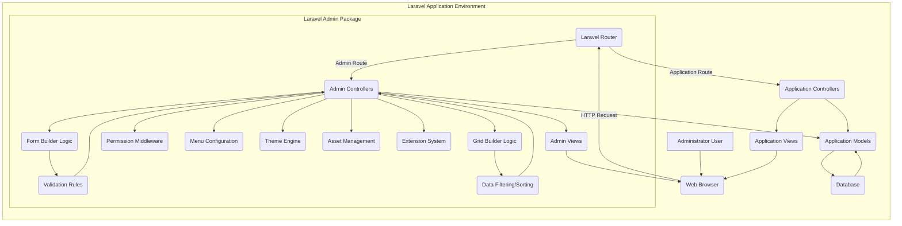
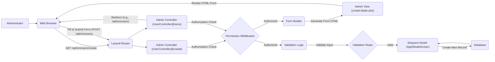

# Project Design Document: Laravel Admin Interface Generator

**Version:** 1.1
**Date:** October 26, 2023
**Author:** AI Software Architect

## 1. Introduction

This document provides an enhanced design overview of the Laravel Admin interface generator project, based on the open-source repository: [https://github.com/z-song/laravel-admin](https://github.com/z-song/laravel-admin). This revised document aims to offer a more detailed and precise understanding of the system's architecture, components, data flow, and critical security considerations, specifically tailored for effective threat modeling. It serves as a refined foundational resource for security assessments, development planning, and ongoing maintenance.

## 2. Goals

The core objectives of Laravel Admin are to:

*   Expedite the creation of administrative backends for Laravel applications, reducing development time.
*   Offer a highly customizable and extensible framework for managing application data and business logic through an administrative interface.
*   Streamline common administrative tasks, notably Create, Read, Update, and Delete (CRUD) operations, with minimal manual coding.
*   Present a user-friendly and intuitive interface for administrators to interact with application data and settings.
*   Integrate seamlessly and non-intrusively with existing Laravel applications, adhering to Laravel's conventions.

## 3. System Architecture

Laravel Admin operates as a Laravel package, extending the base Laravel application with administrative interface capabilities. It strictly adheres to the Model-View-Controller (MVC) architectural pattern inherent in Laravel, leveraging its features for routing, request handling, and view rendering.

### 3.1. High-Level Architecture

### 3.2. Detailed Architecture

The system is composed of the following distinct layers and components, providing a structured approach to administrative interface generation:

*   **Routing Layer:** Laravel's robust routing system is extended by Laravel Admin to intercept and manage requests specifically targeting the administrative interface. These routes are typically prefixed (e.g., `/admin/*`) to differentiate them from standard application routes.
*   **Admin Controllers:** These controllers, often auto-generated or extended, handle incoming requests to the admin panel. They orchestrate interactions between models, form/grid builders, and views, enforcing authorization and managing data flow.
*   **Eloquent Models (Leveraged):** Laravel Admin directly utilizes the existing Eloquent ORM models defined within the core Laravel application. It avoids introducing redundant model definitions, ensuring consistency and data integrity.
*   **Admin Views (Blade Templates):**  The package provides a collection of pre-designed Blade templates that form the visual structure of the admin panel. These templates handle the presentation of data, forms, navigation, and other UI elements.
*   **Form Builder Component:** This is a central component for dynamically generating HTML forms. Developers define form fields, types, validation rules, and layout configurations programmatically, which are then rendered into interactive forms within the admin panel.
*   **Grid/Table Builder Component:** This component facilitates the dynamic generation of data tables for displaying collections of records. It offers built-in features for sorting, filtering, searching, pagination, and exporting data.
*   **Authentication and Authorization Middleware:** Laravel Admin integrates with Laravel's authentication services and typically provides its own middleware to enforce access control within the admin panel. This middleware verifies user authentication and checks permissions against defined roles or policies.
*   **Menu Management System:** A configurable system allows developers to define the structure and items within the admin panel's navigation menu, providing a clear and organized way for administrators to access different sections.
*   **Extension System/API:** Laravel Admin often includes an extension mechanism or API, enabling developers to create custom functionalities, add new features, integrate with external services, or modify the default behavior of the admin panel.
*   **Configuration Management:** Configuration files (typically within the `config/admin.php` structure) allow developers to customize various aspects of the admin panel, such as database connections (if different), default settings, UI preferences, and security configurations.
*   **Asset Management:**  The package manages its own CSS, JavaScript, and image assets required for styling and interactive elements within the admin panel. These assets are typically published to the public directory of the Laravel application.

## 4. Components

The key functional components within Laravel Admin are:

*   **Admin Panel Core (`\Encore\Admin` namespace):**  The fundamental classes, interfaces, and core logic that drive the admin panel's functionality, including request handling, view rendering, and core service providers.
*   **CRUD Controllers (`app/Admin/Controllers`):** Auto-generated or manually created controllers responsible for handling CRUD operations for specific Eloquent models within the admin interface.
*   **Form Builder (`\Encore\Admin\Form`):**  A class responsible for programmatically constructing input forms. It allows defining field types (text, select, textarea, etc.), validation rules, custom attributes, and form layouts.
*   **Grid Builder (`\Encore\Admin\Grid`):** A class for dynamically generating data tables. It provides methods for defining columns, adding filters, sorting, pagination, export options, and custom actions.
*   **Show Builder (`\Encore\Admin\Show`):**  A component for displaying the details of a single record in a structured format, often used for "view" actions.
*   **Tree Builder (`\Encore\Admin\Tree`):**  A specialized component for displaying and managing hierarchical data structures.
*   **Widgets (`\Encore\Admin\Widgets`):**  Reusable UI components like boxes, charts, and info cards that can be integrated into admin panel views.
*   **Actions (`\Encore\Admin\Actions`):**  Customizable actions that can be performed on individual records or groups of records within the grid view (e.g., custom buttons, API calls).
*   **Tools (`\Encore\Admin\Tools`):**  Customizable tools that appear in the grid header, such as import/export buttons or custom search filters.
*   **Menu (`\Encore\Admin\Facades\Admin::menu()`):**  A facade and related classes for defining and managing the admin panel's navigation menu structure.
*   **Permission System (`\Encore\Admin\Auth`):**  Classes and middleware for managing user roles and permissions within the admin panel, often integrated with Laravel's authorization features.
*   **Theme System (Configuration-based):**  The ability to customize the visual appearance through configuration options and potentially custom CSS or themes.
*   **Asset Manager (`\Encore\Admin\Admin::css()` and `Admin::js()`):**  Methods for including CSS and JavaScript assets within admin panel views.
*   **Extension Manager (Through Composer and Service Providers):**  Leverages Laravel's package management system (Composer) and service providers to integrate and manage extensions.
*   **Configuration Loader (`config/admin.php`):**  Handles loading and managing the configuration settings specific to the admin panel.
*   **Localization (`resources/lang/vendor/admin`):**  Supports internationalization by allowing translation of admin panel interface elements.

## 5. Data Flow

Let's examine a more detailed data flow scenario involving creating a new user through the admin panel:

1. **Administrator Access:** An administrator navigates to the "Create User" page within the admin panel in their web browser (e.g., `/admin/users/create`).
2. **Route Resolution:** The Laravel router matches the request to the appropriate Laravel Admin controller action (e.g., `UserController@create`).
3. **Authorization Check:** The Laravel Admin authorization middleware verifies if the logged-in user has the necessary permissions to access the "create user" functionality.
4. **Form Generation:** The controller utilizes the Form Builder component to generate the HTML form for creating a new user. This form includes fields defined in the controller (e.g., name, email, password). Validation rules defined in the Form Builder are also rendered as HTML attributes or client-side JavaScript.
5. **View Rendering:** The controller passes the generated form to the appropriate Blade template, which renders the HTML for the "Create User" page.
6. **User Input:** The administrator fills out the form fields and submits the form.
7. **Form Submission Request:** The browser sends an HTTP POST request to the server, targeting the appropriate Laravel Admin controller action for storing new users (e.g., `UserController@store`).
8. **Route Matching:** The Laravel router directs the request to the `UserController@store` action.
9. **Authorization Check:** The authorization middleware again verifies the user's permissions.
10. **Input Validation:** The `store` method in the controller uses Laravel's validation features, potentially leveraging the validation rules defined in the Form Builder, to validate the submitted data.
11. **Model Interaction:** If the validation passes, the controller instantiates the relevant Eloquent model (e.g., `App\Models\User`) and uses the submitted data to create a new record in the database.
12. **Data Persistence:** The Eloquent ORM interacts with the database to insert the new user record.
13. **Redirection:** Upon successful creation, the controller typically redirects the administrator to a listing page (e.g., `/admin/users`) or a "success" notification.

## 6. Security Considerations (For Enhanced Threat Modeling)

When conducting threat modeling for applications using Laravel Admin, consider these specific vulnerabilities and attack vectors:

*   **Authentication and Authorization Vulnerabilities:**
    *   **Weak Password Policies:**  If Laravel Admin doesn't enforce strong password policies, accounts are susceptible to brute-force attacks.
    *   **Insufficient Authorization Checks:**  Missing or flawed authorization checks in controllers or middleware could allow unauthorized access to sensitive data or actions.
    *   **Role/Permission Misconfiguration:** Incorrectly configured roles and permissions can lead to privilege escalation, where a user gains access to functionalities they shouldn't have.
    *   **Session Management Weaknesses:** Vulnerabilities like session fixation or predictable session IDs could allow attackers to hijack administrator sessions.
*   **Input Validation and Output Encoding Issues:**
    *   **Cross-Site Scripting (XSS):**  Failure to properly sanitize user inputs within form builders or when displaying data in grids can lead to stored or reflected XSS attacks.
    *   **SQL Injection:**  If custom database queries are used within Laravel Admin controllers without proper parameter binding, they could be vulnerable to SQL injection attacks.
    *   **Cross-Site Request Forgery (CSRF):**  Missing or improperly implemented CSRF protection on admin panel forms could allow attackers to perform actions on behalf of authenticated administrators.
    *   **Mass Assignment Vulnerabilities:** If not carefully managed, mass assignment could allow attackers to modify unintended model attributes through form submissions.
    *   **File Upload Vulnerabilities:** If file upload functionality is enabled, insufficient validation of file types and content can lead to malicious file uploads and potential remote code execution.
*   **Dependency Vulnerabilities:**
    *   **Outdated Packages:**  Vulnerabilities in third-party packages used by Laravel Admin (including Laravel itself) can be exploited if not regularly updated.
*   **Access Control and Deployment Security:**
    *   **Publicly Accessible Admin Routes:**  Failure to restrict access to `/admin` routes can expose the admin panel to unauthorized users.
    *   **Insecure Server Configuration:**  Misconfigured web servers or firewalls can create vulnerabilities.
    *   **Exposed Debug Information:**  Leaving debugging mode enabled in production can reveal sensitive information.
*   **Data Protection Concerns:**
    *   **Sensitive Data Exposure:**  Ensure sensitive data (like passwords) is properly hashed and not stored in plain text.
    *   **Lack of Encryption:**  Failure to use HTTPS can expose admin panel traffic to eavesdropping.
*   **Error Handling and Logging:**
    *   **Information Disclosure through Errors:**  Verbose error messages can reveal sensitive system information to attackers.
    *   **Insufficient Logging:**  Lack of comprehensive logging of admin actions hinders auditing and incident response.
*   **Form Builder Specific Threats:**
    *   **Manipulation of Form Fields:** Attackers might try to manipulate hidden form fields or parameters to bypass validation or inject malicious data.
    *   **Client-Side Validation Bypass:** Relying solely on client-side validation is insecure, as it can be easily bypassed. Server-side validation is crucial.
*   **Grid Builder Specific Threats:**
    *   **Data Export Vulnerabilities:**  If export functionality is not properly secured, sensitive data could be exposed.
    *   **Bulk Actions Abuse:**  If bulk actions are not carefully implemented with proper authorization, attackers might be able to perform unauthorized actions on multiple records.

## 7. Deployment

Deploying Laravel Admin involves standard Laravel application deployment practices, with key security considerations:

*   **Secure Server Environment:** Utilize a hardened web server (e.g., Nginx, Apache) with appropriate security configurations.
*   **PHP Security:** Ensure a secure and up-to-date version of PHP is used, with necessary security extensions enabled.
*   **Database Security:** Secure the database server with strong credentials, restricted access, and regular backups.
*   **HTTPS Implementation:** Enforce HTTPS to encrypt all communication between the administrator's browser and the server.
*   **Firewall Configuration:** Implement a firewall to restrict access to the server and only allow necessary ports.
*   **Regular Security Audits:** Conduct regular security audits and penetration testing to identify and address potential vulnerabilities.
*   **Dependency Management:** Keep all dependencies, including Laravel and Laravel Admin, up-to-date with the latest security patches.
*   **Environment Variable Security:** Securely manage environment variables and avoid storing sensitive information directly in configuration files.
*   **Admin Route Protection:** Ensure that the `/admin` routes are protected by authentication middleware, preventing public access.
*   **Rate Limiting:** Implement rate limiting on login attempts to mitigate brute-force attacks.

## 8. Future Considerations

Potential enhancements and future directions for Laravel Admin, with security implications, include:

*   **Enhanced Security Features:**
    *   Built-in support for multi-factor authentication (MFA).
    *   More granular permission management and attribute-based access control.
    *   Integration with security scanning tools.
    *   Content Security Policy (CSP) headers configuration.
*   **Improved User Interface and Experience:**
    *   More customizable themes with security considerations (avoiding loading external, potentially malicious resources).
    *   Accessibility improvements.
*   **Advanced Form and Grid Features:**
    *   More complex form field types with robust sanitization.
    *   Advanced filtering and searching capabilities with protection against injection attacks.
*   **API Integration:**
    *   Secure API endpoints for programmatic access to admin functionalities.
    *   OAuth 2.0 support for secure API authentication.
*   **Enhanced Logging and Auditing:**
    *   More detailed logging of admin actions, including changes made to data.
    *   Integration with security information and event management (SIEM) systems.

This revised document provides a more detailed and security-focused design overview of the Laravel Admin project. It aims to be a valuable resource for security professionals and developers involved in building and maintaining applications that utilize this package.