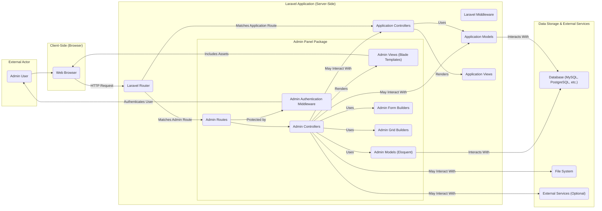

## Project Design Document: Laravel Admin Panel (Improved)

**1. Introduction**

This document provides an enhanced and more detailed design overview of the Laravel Admin Panel project (based on the repository: https://github.com/z-song/laravel-admin). Building upon the previous version, this iteration aims for greater clarity and specificity, particularly in areas relevant to security analysis and threat modeling. The information presented is derived from the publicly available code and common architectural patterns for such admin panel generators.

**2. Goals**

*   Provide a comprehensive and refined architectural overview of the Laravel Admin Panel.
*   Clearly identify key components, their responsibilities, and their interactions with greater detail.
*   Describe the data flow within the system for specific use cases, enhancing understanding of potential vulnerabilities.
*   Explicitly highlight potential security threats and vulnerabilities for future threat modeling activities.

**3. Target Audience**

This document is intended for:

*   Security architects and engineers responsible for in-depth threat modeling and security assessments.
*   Developers actively working on, extending, or integrating with the Laravel Admin Panel.
*   Operations and DevOps teams responsible for the secure deployment, configuration, and maintenance of applications utilizing the admin panel.

**4. System Overview**

The Laravel Admin Panel is a Laravel package designed to accelerate the development of administrative backends for Laravel applications. It offers a suite of pre-built UI components, form and grid builders, and authentication mechanisms, allowing developers to quickly create interfaces for managing application data, users, and configurations. It tightly integrates with Laravel's core functionalities and conventions.

**5. Architectural Design**

The Laravel Admin Panel adheres to the Model-View-Controller (MVC) architectural pattern inherent in the Laravel framework. It extends this pattern by providing specialized controllers, views, and models tailored for administrative tasks. The package acts as a layer on top of the core Laravel application.

**5.1. High-Level Architecture Diagram**

**5.2. Component Description**

*   **Admin User (AU):** A human user with the necessary credentials and roles to access and interact with the administrative interface.
*   **Web Browser (WB):** The client application used by the Admin User to send requests to and receive responses from the Laravel application.
*   **Admin Controllers (ADC):**  PHP classes within the `laravel-admin` package responsible for handling incoming HTTP requests related to administrative tasks (e.g., managing users, editing content). They contain the business logic for these actions.
*   **Admin Views (ADV):** Blade template files that define the structure, layout, and presentation of the admin panel's user interface. They are rendered by the controllers to generate HTML responses.
*   **Admin Models (ADM):** Eloquent models provided by the `laravel-admin` package. These may directly interact with the database or extend/relate to the application's core models.
*   **Admin Routes (ADR):** Route definitions specifically for the admin panel, typically grouped under a specific prefix or middleware. These routes map URLs to specific Admin Controller actions.
*   **Admin Form Builders (AFB):** Classes that provide a fluent interface for generating HTML forms within the admin panel, simplifying form creation and handling.
*   **Admin Grid Builders (AGB):** Classes that facilitate the creation of data tables with features like sorting, filtering, pagination, and exporting, used for displaying lists of resources.
*   **Admin Authentication Middleware (AAM):** Laravel middleware provided by the `laravel-admin` package to enforce authentication and authorization for accessing admin panel routes. It verifies if the current user is logged in and has the necessary permissions.
*   **Laravel Router (LRC):** The component of the Laravel framework responsible for matching incoming HTTP requests to the appropriate route definition.
*   **Laravel Middleware (LMC):**  Provides a mechanism for filtering HTTP requests entering the application. `Admin Authentication Middleware` is a specific example.
*   **Application Controllers (ACC):** Controllers defined within the main Laravel application, handling non-administrative functionalities.
*   **Application Models (ACM):** Eloquent models representing the core data entities of the application. Admin Panel components often interact with these models.
*   **Application Views (ACV):** Blade templates for the front-end or public-facing parts of the Laravel application.
*   **Database (DB):** The persistent data storage for the application, typically a relational database system.
*   **File System (FS):** The server's file system, used for storing uploaded files, configuration files, and other assets.
*   **External Services (ES):** Optional external services that the admin panel might interact with (e.g., email services, third-party APIs).

**6. Data Flow (Specific Use Cases)**

To better understand potential vulnerabilities, let's examine the data flow for two common use cases:

**6.1. Admin User Login:**

1. The Admin User (AU) accesses the login page in their Web Browser (WB).
2. The browser sends a POST request with login credentials to a defined Admin Route (ADR).
3. The Laravel Router (LRC) directs the request to the appropriate Admin Controller (ADC) responsible for authentication.
4. The Admin Authentication Middleware (AAM) attempts to authenticate the user against the configured authentication guard (typically using data from the Database (DB)).
5. Upon successful authentication, the user's session is established, and they are redirected to the admin dashboard.
6. If authentication fails, an error message is displayed via an Admin View (ADV).

**6.2. Creating a New User via Admin Panel:**

1. The Admin User (AU) navigates to the "Create User" page in the Web Browser (WB).
2. The browser sends a GET request to an Admin Route (ADR).
3. The Laravel Router (LRC) directs the request to the relevant Admin Controller (ADC).
4. The Admin Controller (ADC) uses the Admin Form Builder (AFB) to generate the HTML form for creating a new user, which is rendered by an Admin View (ADV) and sent back to the browser.
5. The Admin User (AU) fills out the form and submits it.
6. The browser sends a POST request with the form data to another Admin Route (ADR).
7. The Laravel Router (LRC) directs the request back to the Admin Controller (ADC).
8. The Admin Controller (ADC) processes the submitted data, potentially performing validation.
9. The Admin Controller (ADC) interacts with an Admin Model (ADM) or an Application Model (ACM) to create the new user record in the Database (DB).
10. Upon successful creation, the user is typically redirected to a list of users or a success message is displayed via an Admin View (ADV).

**7. Security Considerations and Potential Threats**

Based on the architecture and data flow, here are specific security considerations and potential threats for threat modeling:

*   **Authentication and Authorization:**
    *   **Brute-force attacks:** Attackers attempting to guess admin credentials.
    *   **Credential stuffing:** Using compromised credentials from other breaches.
    *   **Session fixation/hijacking:** Exploiting vulnerabilities in session management to gain unauthorized access.
    *   **Insufficient password policies:** Weak or default passwords being used.
    *   **Authorization bypass:** Circumventing access controls to perform actions beyond the user's privileges.
*   **Input Validation and Output Encoding:**
    *   **Cross-Site Scripting (XSS):** Injecting malicious scripts into admin views through unvalidated input fields, potentially targeting other admin users.
    *   **SQL Injection:** Injecting malicious SQL code through form fields or URL parameters, potentially allowing attackers to read, modify, or delete database data.
    *   **Cross-Site Request Forgery (CSRF):** Tricking authenticated admin users into making unintended requests.
    *   **Mass assignment vulnerabilities:**  Allowing users to modify unintended model attributes through form submissions.
    *   **Command Injection:** Injecting malicious commands into system calls if the admin panel interacts with the operating system.
*   **Data Handling and Storage:**
    *   **Insecure password storage:** Passwords not being properly hashed and salted.
    *   **Exposure of sensitive data:**  Accidental disclosure of sensitive information in logs, error messages, or database backups.
    *   **Insecure file uploads:** Allowing the upload of malicious files that could be executed on the server.
*   **Dependency Management:**
    *   **Vulnerabilities in third-party packages:** Exploiting known security flaws in the libraries used by `laravel-admin`.
    *   **Supply chain attacks:** Compromised dependencies introducing malicious code.
*   **Access Control:**
    *   **Privilege escalation:**  Lower-privileged admin users gaining access to higher-level functionalities.
    *   **Insecure API endpoints:** If the admin panel exposes APIs, these could be vulnerable to unauthorized access.
*   **Deployment Security:**
    *   **Exposed configuration files:** Sensitive information like database credentials being accessible.
    *   **Insecure server configuration:**  Misconfigured web servers allowing unauthorized access or information disclosure.
    *   **Lack of HTTPS:**  Sensitive data transmitted over unencrypted connections.
*   **Logging and Auditing:**
    *   **Insufficient logging:**  Making it difficult to detect and investigate security incidents.
    *   **Inadequate audit trails:**  Lack of records of administrative actions.

**8. Deployment Considerations (Security Focused)**

Secure deployment of the Laravel Admin Panel involves:

*   **Secure Environment Configuration:**  Utilizing environment variables for sensitive information and ensuring proper file permissions.
*   **Web Server Hardening:**  Configuring the web server (Nginx, Apache) with security best practices, disabling unnecessary features, and implementing security headers (e.g., Content Security Policy, HTTP Strict Transport Security).
*   **Network Security Measures:** Implementing firewalls, intrusion detection/prevention systems, and network segmentation to restrict access.
*   **Enforcing HTTPS:**  Using TLS certificates to encrypt all communication between the browser and the server.
*   **Regular Security Updates:**  Keeping the operating system, web server, PHP, and all dependencies (including the `laravel-admin` package) up-to-date with the latest security patches.
*   **Database Security:**  Securing the database server, using strong passwords, and limiting access.
*   **Input Sanitization and Validation:** Implementing robust input validation on both the client-side and server-side.

**9. Assumptions and Constraints**

*   This design document is based on the general architecture and common functionalities of the `laravel-admin` package. Specific implementations and customizations may introduce variations.
*   It is assumed that the underlying Laravel application adheres to general security best practices.
*   The focus is on architectural and data flow aspects relevant to security. Detailed code-level analysis is outside the scope of this document.

**10. Future Considerations**

*   Conducting detailed threat modeling workshops based on this design document to identify specific attack vectors and mitigation strategies.
*   Performing security code reviews of the `laravel-admin` package and integrating applications to identify potential vulnerabilities.
*   Implementing regular security audits and penetration testing to assess the effectiveness of security controls.
*   Establishing robust security monitoring and alerting mechanisms to detect and respond to security incidents.
*   Developing and enforcing secure coding guidelines for developers working with the admin panel.

This improved design document provides a more comprehensive and security-focused overview of the Laravel Admin Panel. It serves as a valuable resource for understanding the system's architecture, data flow, and potential security vulnerabilities, facilitating more effective threat modeling and security assessments.