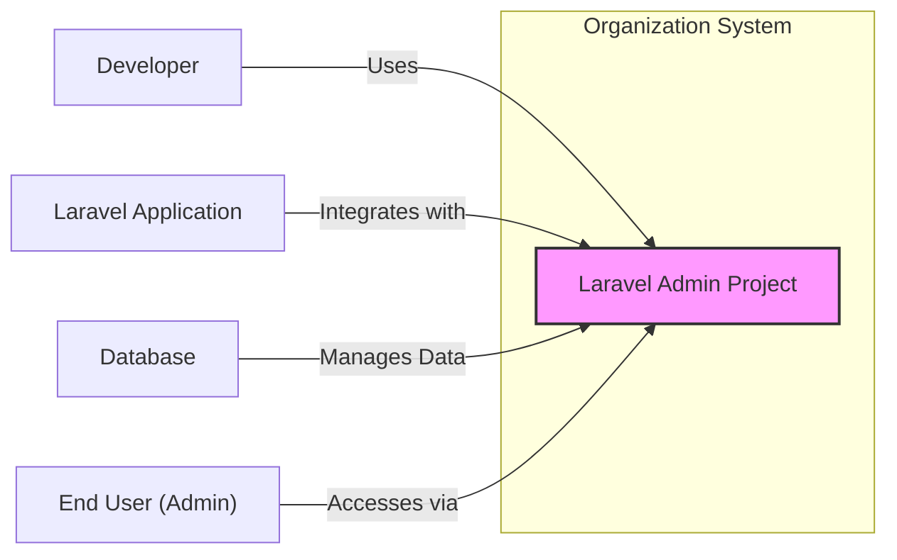
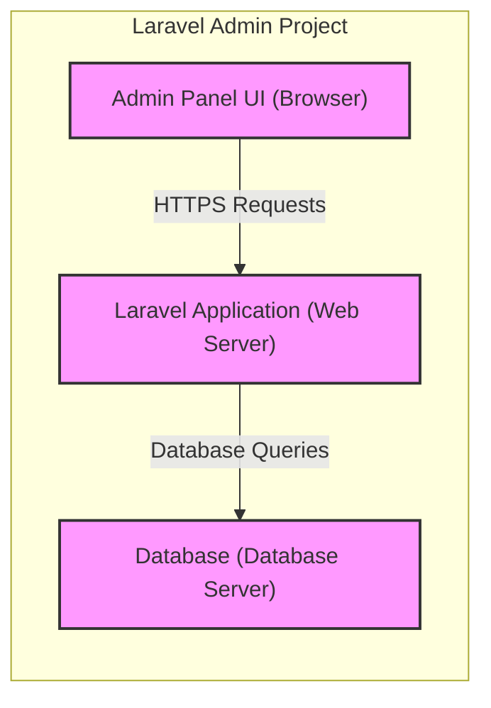
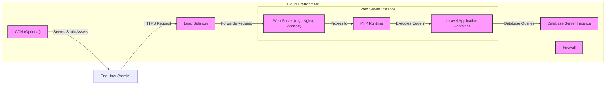

# BUSINESS POSTURE

This project, `laravel-admin`, aims to provide a rapid development tool for building administration interfaces for Laravel applications. The primary business goal is to accelerate the development of back-office systems, content management systems (CMS), and customer relationship management (CRM) applications built with Laravel. This speed of development translates to reduced development costs and faster time-to-market for applications requiring administrative interfaces.

Key business priorities are:
- Rapid application development:  `laravel-admin` should significantly reduce the time and effort required to build admin panels.
- Ease of use: The tool should be intuitive and easy for developers to learn and use.
- Customization and extensibility: While providing rapid scaffolding, it should also allow for customization to meet specific project needs.
- Stability and reliability: The generated admin panels should be stable and reliable in production environments.

Most important business risks to address:
- Security vulnerabilities in generated admin panels: If `laravel-admin` introduces security flaws, it could compromise the applications that use it. This is a critical risk as admin panels often handle sensitive data and critical operations.
- Compatibility issues with different Laravel versions or other packages:  Lack of compatibility can hinder adoption and increase development effort.
- Maintainability and long-term support:  If the project is not actively maintained, it could become a liability for projects relying on it.
- Vendor lock-in: Over-reliance on `laravel-admin` might create vendor lock-in, making it difficult to migrate to other solutions in the future.

# SECURITY POSTURE

Existing security controls:
- security control: Laravel framework's built-in security features are likely leveraged, such as protection against SQL injection, cross-site scripting (XSS), and cross-site request forgery (CSRF). Implemented within the Laravel framework itself.
- security control: Input validation and sanitization are expected to be implemented within the generated admin panels, likely using Laravel's validation mechanisms. Implemented within the `laravel-admin` generated code and Laravel framework.
- security control: Authentication and authorization mechanisms are provided by `laravel-admin`, likely based on Laravel's authentication and authorization features. Implemented within `laravel-admin` package.
- security control: Password hashing is expected to be used for storing user credentials, leveraging Laravel's hashing facilities. Implemented within `laravel-admin` package and Laravel framework.

Accepted risks:
- accepted risk: Potential for vulnerabilities in third-party dependencies used by `laravel-admin`. Risk is partially mitigated by Laravel's ecosystem and community scrutiny, but requires ongoing dependency updates and vulnerability scanning.
- accepted risk: Misconfiguration of generated admin panels by developers. Developers need to be educated on secure configuration practices.
- accepted risk:  Security vulnerabilities introduced through customizations and extensions by developers. Developers are responsible for the security of their custom code.

Recommended security controls:
- security control: Implement automated security scanning (SAST/DAST) in the development pipeline for `laravel-admin` itself and for projects that use it.
- security control: Conduct regular security audits and penetration testing of `laravel-admin` and example applications built with it.
- security control: Provide clear security guidelines and best practices documentation for developers using `laravel-admin`.
- security control: Implement dependency vulnerability scanning and automated updates for `laravel-admin` and generated projects.
- security control: Encourage and facilitate community security contributions and vulnerability reporting.

Security requirements:
- Authentication:
    - security requirement: Secure user authentication to the admin panel, supporting strong password policies and potentially multi-factor authentication.
    - security requirement: Role-Based Access Control (RBAC) to manage user permissions and access to different parts of the admin panel.
    - security requirement: Session management to securely handle user sessions and prevent session hijacking.
- Authorization:
    - security requirement: Fine-grained authorization controls to restrict access to specific data and actions based on user roles and permissions.
    - security requirement: Ensure proper authorization checks are performed before granting access to any sensitive data or functionality.
- Input validation:
    - security requirement: Robust input validation and sanitization for all user inputs to prevent injection attacks (SQL injection, XSS, etc.).
    - security requirement: Input validation should be applied both on the client-side and server-side.
- Cryptography:
    - security requirement: Use strong encryption for sensitive data at rest and in transit. Leverage HTTPS for all communication.
    - security requirement: Securely store and manage cryptographic keys.
    - security requirement: Use password hashing with strong algorithms (e.g., bcrypt) and salts.

# DESIGN

## C4 CONTEXT

Context Diagram Elements:

- Element:
    - Name: Laravel Admin Project
    - Type: Software System
    - Description:  The `laravel-admin` package itself, providing admin panel generation and scaffolding capabilities for Laravel applications.
    - Responsibilities:
        - Generate admin panel code based on configuration.
        - Provide UI components and functionalities for admin interfaces.
        - Handle user authentication and authorization within the admin panel.
    - Security controls:
        - Input validation and sanitization in generated code.
        - Authentication and authorization mechanisms.
        - Secure session management.

- Element:
    - Name: Developer
    - Type: Person
    - Description: Software developers who use `laravel-admin` to build admin panels for their Laravel applications.
    - Responsibilities:
        - Configure and customize `laravel-admin` for specific application needs.
        - Integrate `laravel-admin` into Laravel projects.
        - Deploy and maintain applications using `laravel-admin`.
    - Security controls:
        - Secure development practices when customizing and extending `laravel-admin`.
        - Proper configuration of security settings in `laravel-admin`.

- Element:
    - Name: Laravel Application
    - Type: Software System
    - Description: The Laravel web application that integrates and utilizes the admin panel generated by `laravel-admin`.
    - Responsibilities:
        - Provide the core business logic and data for the application.
        - Interact with the admin panel for data management and administration tasks.
        - Enforce application-level security policies.
    - Security controls:
        - Application-level authentication and authorization.
        - Data access controls.
        - Input validation and output encoding.

- Element:
    - Name: Database
    - Type: Data Store
    - Description: The database system used by the Laravel application to store and manage application data, including data managed through the admin panel.
    - Responsibilities:
        - Persist application data.
        - Provide data access to the Laravel application and admin panel.
        - Ensure data integrity and availability.
    - Security controls:
        - Database access controls and authentication.
        - Data encryption at rest (if required).
        - Regular backups and disaster recovery.

- Element:
    - Name: End User (Admin)
    - Type: Person
    - Description:  Administrators or users who access the admin panel generated by `laravel-admin` to manage the Laravel application.
    - Responsibilities:
        - Manage application data and configurations through the admin panel.
        - Monitor application status and performance.
        - Perform administrative tasks.
    - Security controls:
        - Strong password management.
        - Multi-factor authentication (recommended).
        - Principle of least privilege access.

## C4 CONTAINER

Container Diagram Elements:

- Element:
    - Name: Admin Panel UI
    - Type: Client-side Application
    - Description: The front-end interface of the admin panel, rendered in a web browser. Built using HTML, CSS, and JavaScript, likely leveraging frameworks like Vue.js or similar.
    - Responsibilities:
        - Present the admin panel UI to the end user.
        - Handle user interactions and input.
        - Communicate with the Laravel Application backend via HTTPS requests.
    - Security controls:
        - Client-side input validation.
        - Protection against XSS vulnerabilities in UI components.
        - Secure handling of user credentials (if any client-side storage).

- Element:
    - Name: Laravel Application
    - Type: Web Application
    - Description: The Laravel backend application that serves the admin panel UI and handles API requests from the UI. This includes the `laravel-admin` package and the developer's application code.
    - Responsibilities:
        - Serve the admin panel UI.
        - Handle user authentication and authorization.
        - Process API requests from the UI to manage data and perform actions.
        - Interact with the database.
        - Enforce server-side security policies.
    - Security controls:
        - Server-side input validation and sanitization.
        - Authentication and authorization middleware.
        - Secure session management.
        - Protection against SQL injection, CSRF, and other server-side vulnerabilities.
        - Rate limiting and request throttling.

- Element:
    - Name: Database
    - Type: Database Server
    - Description: The database server (e.g., MySQL, PostgreSQL) used to store application data.
    - Responsibilities:
        - Store and manage application data.
        - Process database queries from the Laravel Application.
        - Ensure data persistence and availability.
    - Security controls:
        - Database access controls and authentication.
        - Database firewall (optional).
        - Data encryption at rest (optional).
        - Regular database backups.

## DEPLOYMENT

Deployment Architecture: Cloud-based Web Hosting (e.g., AWS, Google Cloud, Azure)

Deployment Diagram Elements:

- Element:
    - Name: Load Balancer
    - Type: Network Device
    - Description: Distributes incoming HTTPS traffic across multiple Web Server Instances for scalability and high availability.
    - Responsibilities:
        - Traffic distribution.
        - Health checks for Web Server Instances.
        - SSL termination.
    - Security controls:
        - DDoS protection.
        - SSL/TLS configuration.
        - Access control lists.

- Element:
    - Name: Web Server Instance
    - Type: Compute Instance (Virtual Machine or Container)
    - Description:  A virtual machine or container running the web server (e.g., Nginx, Apache), PHP runtime, and the Laravel Application Container.
    - Responsibilities:
        - Host the web application.
        - Serve static content and dynamic pages.
        - Execute PHP code.
    - Security controls:
        - Operating system hardening.
        - Web server configuration security.
        - Regular security patching.
        - Intrusion detection/prevention system (IDS/IPS).

- Element:
    - Name: Web Server (e.g., Nginx, Apache)
    - Type: Software
    - Description:  The web server software responsible for handling HTTP requests and serving static content, and proxying requests to the PHP runtime.
    - Responsibilities:
        - Handling HTTP requests.
        - Serving static files.
        - Proxying requests to PHP-FPM.
    - Security controls:
        - Web server configuration security (e.g., disabling unnecessary modules, setting proper permissions).
        - Rate limiting.
        - Request filtering.

- Element:
    - Name: PHP Runtime
    - Type: Software
    - Description: The PHP runtime environment responsible for executing the Laravel application code.
    - Responsibilities:
        - Executing PHP code.
        - Managing application dependencies.
    - Security controls:
        - Keeping PHP runtime updated with security patches.
        - Secure PHP configuration (e.g., disabling dangerous functions).

- Element:
    - Name: Laravel Application Container
    - Type: Software Container
    - Description:  A containerized environment running the Laravel application code, including `laravel-admin` and the developer's application logic.
    - Responsibilities:
        - Running the Laravel application.
        - Handling application logic and data processing.
    - Security controls:
        - Container image security scanning.
        - Principle of least privilege for container processes.
        - Resource limits for containers.

- Element:
    - Name: Database Server Instance
    - Type: Database Server Instance (Virtual Machine or Managed Service)
    - Description: A virtual machine or managed database service hosting the database system.
    - Responsibilities:
        - Storing and managing application data.
        - Processing database queries.
    - Security controls:
        - Database access controls and authentication.
        - Database firewall.
        - Data encryption at rest and in transit.
        - Regular database backups.

- Element:
    - Name: CDN (Optional)
    - Type: Content Delivery Network
    - Description:  A Content Delivery Network to cache and serve static assets (CSS, JavaScript, images) closer to users, improving performance.
    - Responsibilities:
        - Caching and serving static content.
        - Reducing latency for static asset delivery.
    - Security controls:
        - CDN security configurations (e.g., access controls, HTTPS).
        - Protection against CDN-specific attacks.

- Element:
    - Name: Firewall
    - Type: Network Security Device
    - Description: Network firewall to control inbound and outbound traffic to the Web Server and Database Server Instances.
    - Responsibilities:
        - Network traffic filtering.
        - Blocking unauthorized access.
    - Security controls:
        - Firewall rules based on the principle of least privilege.
        - Intrusion detection/prevention (optional).

## BUILD

```mermaid
graph LR
    A["Developer"] -- Code Changes --> B["Version Control System (e.g., GitHub)"]
    B -- Push Code --> C["CI/CD Pipeline (e.g., GitHub Actions)"]
    C -- Build & Test --> D["Build Artifacts (e.g., Docker Image, PHP Packages)"]
    D -- Push Artifacts --> E["Artifact Repository (e.g., Docker Registry, Package Registry)"]
    E -- Deploy Artifacts --> F["Deployment Environment"]

    subgraph "CI/CD Pipeline"
        C1["Source Code Checkout"]
        C2["Dependency Resolution"]
        C3["Build Application"]
        C4["Unit & Integration Tests"]
        C5["Security Scans (SAST, Dependency Check)"]
        C6["Build Artifacts"]
    end
    C --> C1
    C1 --> C2
    C2 --> C3
    C3 --> C4
    C4 --> C5
    C5 --> C6
    C6 --> D

    style A fill:#f9f,stroke:#333,stroke-width:2px
    style B fill:#f9f,stroke:#333,stroke-width:2px
    style C fill:#f9f,stroke:#333,stroke-width:2px
    style D fill:#f9f,stroke:#333,stroke-width:2px
    style E fill:#f9f,stroke:#333,stroke-width:2px
    style F fill:#f9f,stroke:#333,stroke-width:2px
    style C1 fill:#ccf,stroke:#333,stroke-width:1px
    style C2 fill:#ccf,stroke:#333,stroke-width:1px
    style C3 fill:#ccf,stroke:#333,stroke-width:1px
    style C4 fill:#ccf,stroke:#333,stroke-width:1px
    style C5 fill:#ccf,stroke:#333,stroke-width:1px
    style C6 fill:#ccf,stroke:#333,stroke-width:1px
```

Build Process Description:

1. Developer commits code changes and pushes them to a Version Control System (e.g., GitHub).
2. A CI/CD pipeline (e.g., GitHub Actions, Jenkins) is triggered upon code push.
3. The CI/CD pipeline performs the following steps:
    - Source Code Checkout: Retrieves the latest code from the repository.
    - Dependency Resolution: Resolves and downloads project dependencies (e.g., PHP packages using Composer).
    - Build Application: Compiles or builds the application if necessary (for PHP projects, this might involve tasks like asset compilation).
    - Unit & Integration Tests: Executes automated unit and integration tests to ensure code quality and functionality.
    - Security Scans: Performs security scans, including:
        - Static Application Security Testing (SAST) to identify potential vulnerabilities in the code.
        - Dependency vulnerability checks to identify known vulnerabilities in project dependencies.
    - Build Artifacts: Creates build artifacts, such as Docker images or deployable PHP packages.
4. Build Artifacts are pushed to an Artifact Repository (e.g., Docker Registry, Package Registry).
5. The artifacts from the repository are then deployed to the target Deployment Environment.

Build Process Security Controls:

- security control: Secure Version Control System: Using a secure and access-controlled version control system (e.g., GitHub with branch protection, access controls).
- security control: Automated CI/CD Pipeline: Automating the build and deployment process to reduce manual errors and ensure consistency.
- security control: Static Application Security Testing (SAST): Integrating SAST tools into the CI/CD pipeline to automatically scan code for vulnerabilities.
- security control: Dependency Vulnerability Scanning: Using tools to scan project dependencies for known vulnerabilities and alert developers.
- security control: Code Linting and Style Checks: Enforcing code quality and consistency through linters and style checks.
- security control: Unit and Integration Tests: Automated tests to ensure code functionality and prevent regressions.
- security control: Secure Artifact Repository: Using a secure artifact repository with access controls to store build artifacts.
- security control: Build Environment Security: Securing the CI/CD build environment itself to prevent tampering and unauthorized access.
- security control: Code Signing (optional): Signing build artifacts to ensure integrity and authenticity.

# RISK ASSESSMENT

Critical business processes we are trying to protect:
- Management of application data: The admin panel is used to create, read, update, and delete critical application data. Data integrity and availability are crucial.
- User management and access control: The admin panel manages user accounts and permissions, which are essential for securing the application and its data.
- System configuration and monitoring:  Admin panels often provide access to system configuration and monitoring tools, which are critical for maintaining system stability and security.

Data we are trying to protect and their sensitivity:
- Application data: This is highly sensitive as it represents the core business information. Sensitivity depends on the specific application but can include personally identifiable information (PII), financial data, or confidential business information.
- User credentials: Passwords and other authentication factors for admin panel users are highly sensitive and must be protected to prevent unauthorized access.
- System configuration data: Configuration settings for the application and infrastructure can be sensitive and should be protected from unauthorized modification.
- Audit logs: Logs containing information about user actions and system events can be sensitive and valuable for security monitoring and incident response.

# QUESTIONS & ASSUMPTIONS

Questions:
- What type of applications will be built using `laravel-admin`? (e.g., CMS, CRM, internal tools). This will help to better understand the sensitivity of the data being managed.
- What are the specific compliance requirements for applications built with `laravel-admin`? (e.g., GDPR, HIPAA, PCI DSS). This will influence the required security controls.
- What is the expected scale and performance requirements for applications using `laravel-admin`? This will impact deployment architecture decisions.
- What level of customization and extension is expected for `laravel-admin` in typical projects? This will influence security considerations for custom code.
- What is the organization's risk appetite regarding security vulnerabilities in third-party components? This will guide decisions on dependency management and vulnerability scanning.

Assumptions:
- Assumption: `laravel-admin` is intended to be used in web applications that handle sensitive data.
- Assumption: Security is a high priority for applications built using `laravel-admin`.
- Assumption: Developers using `laravel-admin` have a basic understanding of web application security principles.
- Assumption: The deployment environment is a cloud-based infrastructure.
- Assumption: A CI/CD pipeline is used for building and deploying applications using `laravel-admin`.