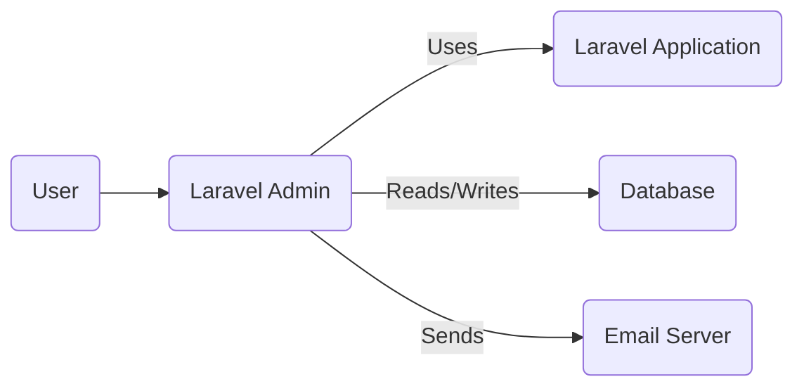
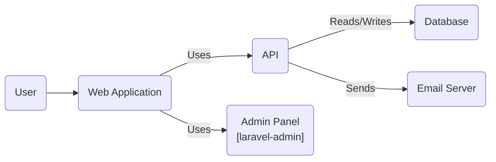
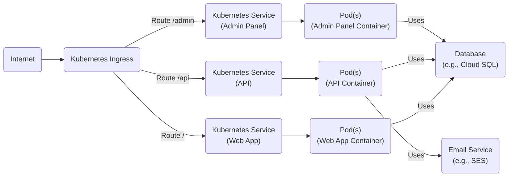
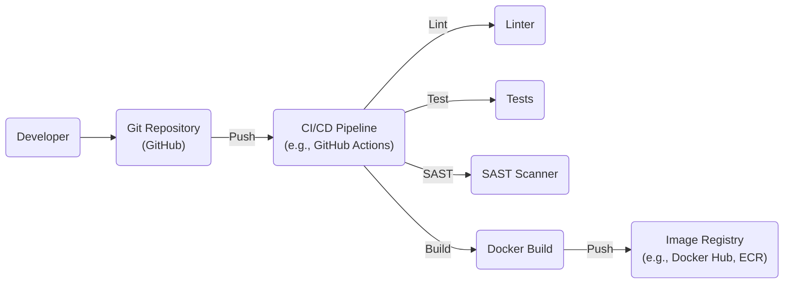

Okay, let's create a design document for the `laravel-admin` project.

# BUSINESS POSTURE

Business Priorities and Goals:

*   Provide a fast and efficient way to build administration interfaces for Laravel applications.
*   Reduce development time and cost associated with creating admin panels.
*   Offer a customizable and extensible platform to meet diverse administrative needs.
*   Provide a user-friendly interface for managing application data and functionality.
*   Maintain a good level of security to protect sensitive data and prevent unauthorized access.

Most Important Business Risks:

*   Unauthorized access to sensitive data or functionality through the admin interface.
*   Data breaches or leaks due to vulnerabilities in the `laravel-admin` package or its dependencies.
*   Disruption of service due to misconfiguration or exploitation of vulnerabilities.
*   Reputational damage due to security incidents.
*   Compliance violations related to data privacy and security.
*   Supply chain attacks through compromised dependencies.

# SECURITY POSTURE

Existing Security Controls:

*   security control: Authentication: Laravel's built-in authentication system is used to manage user logins and access control. (Described in Laravel documentation and `laravel-admin` documentation).
*   security control: Authorization: `laravel-admin` provides role-based access control (RBAC) features to restrict access to specific resources and actions based on user roles. (Described in `laravel-admin` documentation).
*   security control: Input Validation: Laravel's validation features are used to validate user input and prevent common web vulnerabilities like cross-site scripting (XSS) and SQL injection. (Described in Laravel documentation and used throughout `laravel-admin` code).
*   security control: CSRF Protection: Laravel's built-in CSRF protection is used to prevent cross-site request forgery attacks. (Described in Laravel documentation and enabled by default).
*   security control: Encryption: Laravel's encryption features are used to protect sensitive data at rest and in transit. (Described in Laravel documentation).
*   security control: Database Security: Relies on Laravel's database security best practices, including parameterized queries or ORM usage to prevent SQL injection. (Described in Laravel documentation).

Accepted Risks:

*   accepted risk: The security of the `laravel-admin` interface is highly dependent on the secure configuration and implementation by the developers using the package.
*   accepted risk: Dependencies on third-party packages introduce potential supply chain risks.
*   accepted risk: The default configuration may not be suitable for all environments and requires careful review and customization.

Recommended Security Controls:

*   security control: Implement regular security audits and penetration testing of applications using `laravel-admin`.
*   security control: Enforce strong password policies and multi-factor authentication (MFA).
*   security control: Implement comprehensive logging and monitoring to detect and respond to security incidents.
*   security control: Keep `laravel-admin` and all its dependencies up to date with the latest security patches.
*   security control: Implement a robust vulnerability management program.
*   security control: Use a Content Security Policy (CSP) to mitigate XSS attacks.
*   security control: Implement strict file upload validation to prevent malicious file uploads.
*   security control: Regularly review and update the RBAC configuration to ensure least privilege.

Security Requirements:

*   Authentication:
    *   All users must be authenticated before accessing the admin interface.
    *   Support for multi-factor authentication should be considered.
    *   Strong password policies must be enforced.
    *   Session management must be secure, with appropriate timeouts and protection against session hijacking.

*   Authorization:
    *   Access to resources and actions must be controlled based on user roles and permissions.
    *   The principle of least privilege must be applied.
    *   Regular review and auditing of user roles and permissions are required.

*   Input Validation:
    *   All user input must be validated to prevent common web vulnerabilities.
    *   Validation rules must be strict and specific to the expected data type.
    *   Output encoding should be used to prevent XSS.

*   Cryptography:
    *   Sensitive data must be encrypted at rest and in transit.
    *   Strong, industry-standard cryptographic algorithms must be used.
    *   Key management must be secure.

# DESIGN

## C4 CONTEXT

Element Descriptions:

*   Element:
    *   Name: User
    *   Type: Person
    *   Description: A person who interacts with the Laravel Admin interface.
    *   Responsibilities: Accessing and managing application data and functionality through the admin panel.
    *   Security controls: Authentication, Authorization.

*   Element:
    *   Name: Laravel Admin
    *   Type: Software System
    *   Description: The administration interface built using the `laravel-admin` package.
    *   Responsibilities: Providing a user interface for managing the Laravel application, handling user authentication and authorization, and interacting with the database and other services.
    *   Security controls: Authentication, Authorization, Input Validation, CSRF Protection, Encryption.

*   Element:
    *   Name: Laravel Application
    *   Type: Software System
    *   Description: The main Laravel application that `laravel-admin` is used to manage.
    *   Responsibilities: Providing the core business logic and functionality of the application.
    *   Security controls: Dependent on the specific application implementation.

*   Element:
    *   Name: Database
    *   Type: Database
    *   Description: The database used by the Laravel application and accessed by `laravel-admin`.
    *   Responsibilities: Storing application data.
    *   Security controls: Database access controls, encryption at rest.

*   Element:
    *   Name: Email Server
    *   Type: Software System
    *   Description: The email server used by the Laravel application for sending emails.
    *   Responsibilities: Sending emails.
    *   Security controls: Secure email configuration, TLS encryption.

## C4 CONTAINER

Element Descriptions:

*   Element:
    *   Name: User
    *   Type: Person
    *   Description: A person who interacts with the Laravel Admin interface.
    *   Responsibilities: Accessing and managing application data and functionality through the admin panel.
    *   Security controls: Authentication, Authorization.

*   Element:
    *   Name: Web Application
    *   Type: Container: Web Browser
    *   Description: The main web application, potentially including user-facing components.
    *   Responsibilities: Serving the user interface, handling user interactions.
    *   Security controls: Input validation, output encoding, CSRF protection.

*   Element:
    *   Name: API
    *   Type: Container: API Application
    *   Description: The backend API of the Laravel application.
    *   Responsibilities: Providing the core business logic and data access.
    *   Security controls: Authentication, authorization, input validation, rate limiting.

*   Element:
    *   Name: Admin Panel
    *   Type: Container: Web Application
    *   Description: The administration interface built using `laravel-admin`. This is a separate container within the overall application.
    *   Responsibilities: Providing the user interface for managing the application, handling user authentication and authorization for the admin panel.
    *   Security controls: Authentication, Authorization, Input Validation, CSRF Protection, Encryption.

*   Element:
    *   Name: Database
    *   Type: Container: Database
    *   Description: The database used by the Laravel application.
    *   Responsibilities: Storing application data.
    *   Security controls: Database access controls, encryption at rest.

*   Element:
    *   Name: Email Server
    *   Type: Container: Email Server
    *   Description: The email server used by the Laravel application.
    *   Responsibilities: Sending emails.
    *   Security controls: Secure email configuration, TLS encryption.

## DEPLOYMENT

Possible Deployment Solutions:

1.  Traditional Web Server (Apache/Nginx) + PHP + Database Server (MySQL/PostgreSQL) on a single server or separate servers.
2.  Cloud-based deployment using services like AWS Elastic Beanstalk, Google App Engine, or Azure App Service.
3.  Containerized deployment using Docker and Kubernetes.

Chosen Solution (for detailed description): Containerized deployment using Docker and Kubernetes.

Element Descriptions:

*   Element:
    *   Name: Internet
    *   Type: External
    *   Description: The public internet.
    *   Responsibilities: Routing traffic to the Kubernetes cluster.
    *   Security controls: Firewall, DDoS protection.

*   Element:
    *   Name: Kubernetes Ingress
    *   Type: Infrastructure Node
    *   Description: The entry point for external traffic into the Kubernetes cluster.
    *   Responsibilities: Routing traffic to the appropriate services based on rules.
    *   Security controls: TLS termination, Web Application Firewall (WAF).

*   Element:
    *   Name: ServiceAdmin
    *   Type: Kubernetes Service
    *   Description: Kubernetes Service for the Admin Panel.
    *   Responsibilities: Load balancing traffic across Admin Panel pods.
    *   Security controls: Network policies.

*   Element:
    *   Name: ServiceAPI
    *   Type: Kubernetes Service
    *   Description: Kubernetes Service for the API.
    *   Responsibilities: Load balancing traffic across API pods.
    *   Security controls: Network policies.

*   Element:
    *   Name: ServiceWebApp
    *   Type: Kubernetes Service
    *   Description: Kubernetes Service for the Web Application.
    *   Responsibilities: Load balancing traffic across Web Application pods.
    *   Security controls: Network policies.

*   Element:
    *   Name: PodAdmin
    *   Type: Kubernetes Pod
    *   Description: Pod(s) running the Admin Panel container.
    *   Responsibilities: Running the Admin Panel application.
    *   Security controls: Container security context, resource limits.

*   Element:
    *   Name: PodAPI
    *   Type: Kubernetes Pod
    *   Description: Pod(s) running the API container.
    *   Responsibilities: Running the API application.
    *   Security controls: Container security context, resource limits.

*   Element:
    *   Name: PodWebApp
    *   Type: Kubernetes Pod
    *   Description: Pod(s) running the Web Application container.
    *   Responsibilities: Running the Web Application.
    *   Security controls: Container security context, resource limits.

*   Element:
    *   Name: Database
    *   Type: External: Database
    *   Description: A managed database service (e.g., Cloud SQL, RDS).
    *   Responsibilities: Storing application data.
    *   Security controls: Database access controls, encryption at rest, firewall rules.

*   Element:
    *   Name: Email
    *   Type: External: Software System
    *   Description: A managed email service (e.g., SES, SendGrid).
    *   Responsibilities: Sending emails.
    *   Security controls: API key authentication, TLS encryption.

## BUILD

Build Process Description:

1.  Developer commits and pushes code changes to the Git repository (GitHub).
2.  A CI/CD pipeline (e.g., GitHub Actions, Jenkins) is triggered by the push event.
3.  The pipeline runs a linter to check code style and potential errors.
4.  The pipeline runs unit and integration tests.
5.  The pipeline runs a Static Application Security Testing (SAST) scanner to identify potential security vulnerabilities in the code.
6.  If all checks pass, the pipeline builds a Docker image for the application.
7.  The Docker image is pushed to an image registry (e.g., Docker Hub, Amazon ECR).

Security Controls:

*   security control: Code review: All code changes should be reviewed by another developer before merging.
*   security control: Linting: Use a linter to enforce code style and identify potential errors.
*   security control: Automated testing: Implement comprehensive unit and integration tests to ensure code quality and prevent regressions.
*   security control: SAST scanning: Use a SAST scanner to identify potential security vulnerabilities in the code.
*   security control: Dependency scanning: Scan dependencies for known vulnerabilities.
*   security control: Image signing: Sign Docker images to ensure their integrity and authenticity.
*   security control: Least privilege: The CI/CD pipeline should have only the necessary permissions to perform its tasks.

# RISK ASSESSMENT

Critical Business Processes:

*   User authentication and authorization.
*   Data management (CRUD operations) through the admin interface.
*   Application configuration and management.
*   Email sending (if applicable).

Data Sensitivity:

*   User data (usernames, passwords, roles, permissions, potentially PII). Sensitivity: High
*   Application data (depends on the specific application, could range from low to high sensitivity).
*   Configuration data (database credentials, API keys). Sensitivity: High

# QUESTIONS & ASSUMPTIONS

Questions:

*   What specific types of data will be managed through the `laravel-admin` interface?
*   Are there any specific compliance requirements (e.g., GDPR, HIPAA) that need to be considered?
*   What is the expected user base size and growth rate?
*   What is the existing infrastructure and deployment environment?
*   Are there any existing security policies or guidelines that need to be followed?
*   What level of logging and monitoring is currently in place?
*   What is the process for managing and updating dependencies?

Assumptions:

*   BUSINESS POSTURE: The organization has a moderate risk appetite and prioritizes security but also needs a rapid development cycle.
*   SECURITY POSTURE: The development team has basic knowledge of secure coding practices. Laravel's built-in security features are utilized but may not be fully configured or optimized.
*   DESIGN: The application uses a standard Laravel architecture with a relational database. The deployment environment is likely cloud-based or containerized. The build process is automated using a CI/CD pipeline.