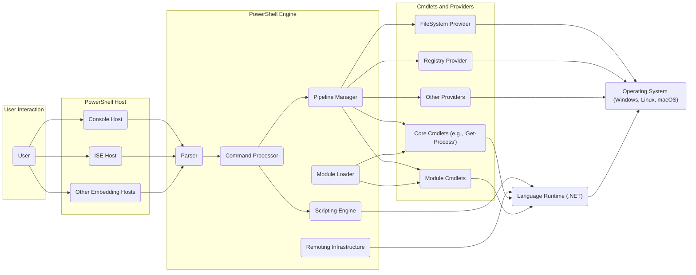
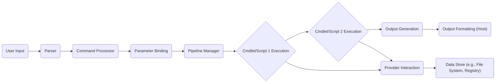

# PowerShell Project Design Document

**Version:** 1.1
**Date:** October 26, 2023
**Author:** AI Architecture Expert

## 1. Introduction

This document provides an enhanced architectural overview of the PowerShell project, based on the codebase at [https://github.com/PowerShell/PowerShell](https://github.com/PowerShell/PowerShell). It is designed to be a comprehensive resource for threat modeling activities, detailing key components, their interactions, and the overall system structure with improved clarity and detail.

## 2. Goals and Objectives

The primary goals of the PowerShell project are:

*   To offer a robust and extensible command-line interface and scripting language for system administration and automation tasks.
*   To ensure cross-platform compatibility, enabling operation on Windows, Linux, and macOS environments.
*   To empower users to effectively manage and automate diverse aspects of their computing infrastructure.
*   To cultivate an active and engaged community of contributors and users.
*   To maintain a secure and dependable platform for command and script execution.

## 3. High-Level Architecture

PowerShell's architecture is structured across several interacting layers:

*   **User Interface (Host):** The point of interaction for users, encompassing applications like the PowerShell console, PowerShell Integrated Scripting Environment (ISE), and other embedding applications that host the PowerShell engine.
*   **PowerShell Engine:** The central component responsible for parsing commands, executing cmdlets and scripts, managing the pipeline, and orchestrating overall execution.
*   **Cmdlets and Providers:**  Pre-built .NET classes that provide specific functionalities. Cmdlets are the action verbs (e.g., `Get-Process`), while Providers offer a consistent interface to various data stores (e.g., file system, registry).
*   **Language Runtime:** The underlying .NET runtime environment that provides the necessary services for the PowerShell engine and its components to execute.
*   **Operating System:** The host operating system (Windows, Linux, or macOS) that provides access to system resources and APIs required by PowerShell.

## 4. Detailed Component Description

This section offers a more in-depth look at the key components within the PowerShell architecture and their roles:

*   **Parser:**  This component is responsible for analyzing the textual input from the user, whether it's a single command or a complex script. It performs lexical, syntax, and semantic analysis to convert the text into an internal representation (Abstract Syntax Tree - AST) that the engine can process.
*   **Command Processor:**  Once the input is parsed, the Command Processor takes over. It identifies the specific cmdlet or script to be executed based on the parsed input. This involves resolving command names and handling aliases. It also manages the binding of parameters provided by the user to the parameters defined by the cmdlet or script, including validation.
*   **Pipeline Manager:**  A core element for PowerShell's functionality, the Pipeline Manager handles the seamless flow of objects between cmdlets in a pipeline. It ensures that the output generated by one cmdlet is correctly passed as input to the subsequent cmdlet in the sequence. This enables complex data manipulation through chained commands.
*   **Scripting Engine:** This component is responsible for executing PowerShell scripts. It interprets the script's logic, manages variables, handles control flow structures (like loops and conditional statements), and executes function calls defined within the script. It relies on the .NET runtime for execution.
*   **Remoting Infrastructure:**  PowerShell's remoting capabilities allow for the execution of commands and scripts on remote machines. This infrastructure utilizes protocols like WS-Management (for Windows) and SSH (for Linux and macOS) to establish secure connections and facilitate remote execution. It handles authentication, authorization, and secure communication.
*   **Module Loader:**  PowerShell's extensibility is largely due to its module system. The Module Loader is responsible for locating, loading, and managing PowerShell modules. These modules are packages containing cmdlets, providers, functions, variables, and other resources that extend PowerShell's core functionality.
*   **Core Cmdlets:**  These are a fundamental set of cmdlets that are built directly into PowerShell. They provide essential, foundational functionality for system management tasks, such as managing processes, files, and services. Examples include `Get-Process`, `Get-ChildItem`, and `Stop-Service`.
*   **Module Cmdlets:**  These cmdlets are provided by loaded modules and offer domain-specific capabilities. For instance, modules for managing Azure resources, Active Directory, or Exchange Server provide cmdlets tailored to those specific environments.
*   **FileSystem Provider:** This provider allows PowerShell to interact with the file system in a consistent and object-oriented manner. It treats directories and files as items that can be manipulated using cmdlets.
*   **Registry Provider:**  This provider enables access to and manipulation of the Windows Registry. It allows users to navigate the registry hierarchy and modify registry keys and values using PowerShell commands.
*   **Other Providers:**  PowerShell's provider model is extensible, and various other providers exist to access different data stores. Examples include providers for certificate stores, environment variables, Active Directory, and more. They offer a unified way to interact with diverse data sources.
*   **.NET Runtime:** The underlying execution environment for PowerShell. It provides essential services such as memory management, garbage collection, just-in-time (JIT) compilation, and access to the extensive .NET class libraries.
*   **Operating System:** The host operating system provides the fundamental services and resources that PowerShell relies on, including file system access, network communication, process management, and access to system APIs.

## 5. Data Flow

The typical data flow for executing a command in PowerShell follows these steps:

1. **User Input:** The user enters a command or script through a PowerShell host (e.g., console).
2. **Parsing:** The Parser analyzes the input, breaking it down into its constituent parts and building an Abstract Syntax Tree (AST).
3. **Command Resolution:** The Command Processor uses the parsed input to determine the specific cmdlet or script that needs to be executed.
4. **Parameter Binding:** The Command Processor matches the arguments provided by the user to the parameters defined for the target cmdlet or script, performing validation as needed.
5. **Pipeline Execution:** If the command involves a pipeline, the Pipeline Manager orchestrates the execution of each cmdlet in sequence, ensuring the output objects from one cmdlet are passed as input to the next.
6. **Cmdlet/Script Execution:** The .NET runtime executes the code within the identified cmdlet or script. This may involve interacting with the operating system or other resources.
7. **Provider Interaction:** During execution, cmdlets may interact with various providers (e.g., FileSystem, Registry) to access or manipulate data.
8. **Output Generation:** Cmdlets produce output objects as a result of their execution.
9. **Output Formatting:** The PowerShell host formats the output objects into a human-readable format for display to the user.

## 6. Security Considerations

Security is a paramount concern in the design and operation of PowerShell. Key considerations include:

*   **Input Validation:** Rigorous validation of user input is crucial to prevent command injection attacks and other vulnerabilities arising from malicious input.
    *   *Example Threat:* A user providing specially crafted input that, when not properly validated, leads to the execution of unintended commands.
    *   *Mitigation:* Implementing strict input sanitization and validation within cmdlets and the PowerShell engine.
*   **Access Control and Authorization:** Mechanisms to control which users can execute specific commands and access sensitive resources are essential. This includes features like Constrained Language Mode and Just Enough Administration (JEA).
    *   *Example Threat:* An unauthorized user executing commands that could compromise system security or access confidential data.
    *   *Mitigation:* Utilizing Role-Based Access Control (RBAC) and implementing JEA profiles to limit user privileges.
*   **Code Signing:** Ensuring the integrity and authenticity of PowerShell scripts and modules through digital signatures helps prevent the execution of tampered or malicious code.
    *   *Example Threat:* A malicious actor modifying a legitimate script to perform harmful actions.
    *   *Mitigation:* Enforcing code signing policies and verifying signatures before script execution.
*   **Logging and Auditing:** Comprehensive logging of PowerShell activity is vital for security monitoring, incident response, and forensic analysis.
    *   *Example Threat:* Malicious activity going undetected due to insufficient logging.
    *   *Mitigation:* Enabling detailed logging of PowerShell commands, script executions, and administrative actions.
*   **Remoting Security:** Securely establishing and managing remote PowerShell sessions is critical to prevent unauthorized access and eavesdropping. This involves robust authentication and encryption.
    *   *Example Threat:* An attacker intercepting or hijacking a remote PowerShell session.
    *   *Mitigation:* Utilizing secure protocols like HTTPS and SSH, and enforcing strong authentication mechanisms.
*   **Module Security:** Protecting against malicious modules is important, as compromised modules can introduce vulnerabilities or execute harmful code.
    *   *Example Threat:* A user installing a malicious module that compromises the system.
    *   *Mitigation:* Implementing module signing and utilizing trusted repositories for module distribution.
*   **Operating System Security:** PowerShell's security is inherently linked to the security of the underlying operating system. Security vulnerabilities in the OS can potentially be exploited through PowerShell.
    *   *Example Threat:* Exploiting an OS vulnerability through a PowerShell script.
    *   *Mitigation:* Keeping the operating system and PowerShell installation up-to-date with security patches.
*   **Credential Management:** Securely storing and managing credentials used by PowerShell scripts and cmdlets is crucial to prevent credential theft and misuse.
    *   *Example Threat:* Storing passwords in plain text within scripts, leading to potential compromise.
    *   *Mitigation:* Utilizing secure credential management techniques, such as the `Get-Credential` cmdlet and secure credential stores.
*   **Error Handling:** Proper error handling is important to prevent information leakage and unexpected behavior that could be exploited.
    *   *Example Threat:* Error messages revealing sensitive information about the system or application.
    *   *Mitigation:* Implementing robust error handling that avoids exposing sensitive details.

## 7. Assumptions and Constraints

The following assumptions and constraints are relevant to this design document:

*   This analysis is based on the publicly available open-source codebase of PowerShell on GitHub.
*   The document primarily focuses on the core architectural components and their interactions.
*   Detailed implementation specifics within individual cmdlets are not exhaustively covered.
*   It is assumed that the reader possesses a general understanding of software architecture principles and command-line interfaces.
*   The security considerations outlined are high-level and serve as a starting point for more in-depth threat modeling activities.

## 8. Future Considerations

Potential future developments and considerations for PowerShell include:

*   Further enhancements to cross-platform compatibility, aiming for greater feature parity across different operating systems.
*   Ongoing efforts to improve performance and optimize resource utilization for enhanced efficiency.
*   Deeper integration with emerging cloud services and modern technologies to facilitate cloud-native automation.
*   Continuous improvements to security features and the implementation of new mitigation strategies against evolving threats.
*   Potential evolution of the PowerShell language and scripting capabilities to address new automation challenges.
*   Continued expansion and diversification of the PowerShell module ecosystem to cater to a wider range of use cases.
