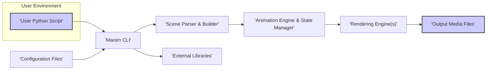
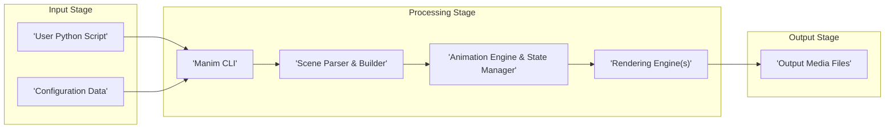
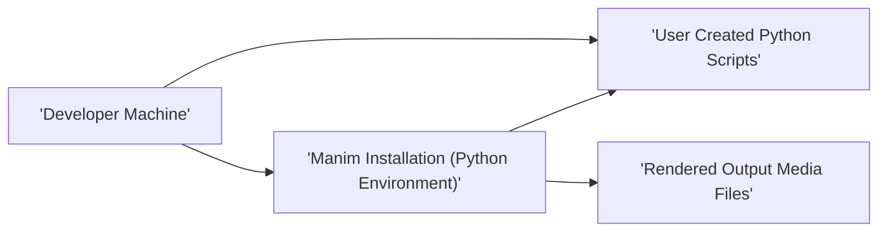

## Project Design Document: Manim - Mathematical Animation Engine

**Version:** 1.1
**Date:** October 26, 2023
**Author:** Gemini (AI Language Model)

### 1. Project Overview

Manim is a Python library designed to create explanatory mathematical animations. It empowers users, including mathematicians and educators, to visually communicate complex mathematical concepts through programmatically defined animations. The core functionality involves users writing Python scripts that Manim then renders into high-quality video or image outputs.

### 2. Goals and Objectives

* **Primary Goal:** To provide a highly flexible and powerful software tool for the creation of mathematical animations.
* **Objectives:**
    * Enable programmatic definition of intricate animation sequences.
    * Facilitate the generation of high-fidelity visual outputs suitable for educational materials and presentations.
    * Offer a comprehensive suite of built-in mathematical primitives and animation effects.
    * Maintain an architecture that supports extensibility and customization to accommodate diverse user requirements.
    * Ensure a well-documented and intuitive Application Programming Interface (API) for ease of use.

### 3. Target Audience

* Mathematicians engaged in research and education.
* Educators at all levels (K-12 through higher education) seeking engaging visual aids.
* Content creators specializing in Science, Technology, Engineering, and Mathematics (STEM) education.
* Software developers with an interest in creative coding, data visualization, and mathematical expression.

### 4. System Architecture

The Manim system operates through a series of distinct stages, transforming user-defined scripts into visual outputs:

* **Scripting Phase:** Users author Python scripts that precisely describe the desired animations.
* **Configuration Phase:** Manim's behavior is customized via command-line arguments, dedicated configuration files, and in-script settings.
* **Parsing and Scene Construction Phase:** The provided Python script is parsed and interpreted, resulting in the creation of an in-memory scene representation. This scene encapsulates all animation elements and their properties.
* **Animation Rendering Phase:** The constructed scene is rendered frame by frame. This process leverages selected rendering engines to translate the scene's state into visual data.
* **Output Generation Phase:** The sequence of rendered frames is then encoded and assembled into final output media files, such as videos or image sequences.

### 5. Data Flow

The core data flow within Manim involves the progressive transformation of a user's textual script into a visual representation:

* **Input Stage:**
    * **User Python Script:** This script serves as the primary input, containing Python code that defines the mathematical objects, their properties, and the animations to be applied.
    * **Configuration Data:** Settings that govern the rendering process, output formats, and various operational parameters. This can originate from command-line arguments, configuration files (`manim.cfg`), or embedded within the Python script.
* **Processing Stage:**
    * The **Manim CLI** acts as the entry point, receiving the user script and configuration details.
    * The **Scene Parser & Builder** component analyzes the Python script, interpreting its instructions to construct an internal representation of the animation scene. This involves instantiating mathematical objects (Mobjects) and defining their initial states and animation sequences.
    * The **Animation Engine & State Manager** orchestrates the animation process. It manages the timing and execution of animations, updating the properties of Mobjects frame by frame according to the defined animation logic.
    * The **Rendering Engine(s)** translate the scene's state at each frame into visual data. This typically involves using libraries like Cairo for vector graphics or potentially OpenGL for more complex or hardware-accelerated rendering.
* **Output Stage:**
    * **Output Media Files:** The final output, typically video files (e.g., `.mp4`, `.mov`) or sequences of image files (e.g., `.png`), representing the rendered animation.

### 6. Key Components

* **Manim CLI (Command Line Interface):** The primary interface through which users interact with Manim. It handles:
    * Receiving user commands and script paths.
    * Loading and applying configuration settings.
    * Initiating the parsing and rendering pipeline.
    * Managing the execution of the Manim system.
* **Configuration System:** Responsible for managing all configurable aspects of Manim's operation, including:
    * Rendering quality and resolution settings.
    * Output file paths and naming conventions.
    * Background color and scene defaults.
    * Integration with external tools like LaTeX and FFmpeg.
    * Configuration sources include command-line arguments, `manim.cfg` files, and in-script settings, with a defined order of precedence.
* **Scene Parser & Builder:** This component is crucial for understanding the user's intent as expressed in the Python script. It performs the following tasks:
    * Parsing the Python code to identify Mobjects, animations, and scene structure.
    * Constructing an in-memory representation of the `Scene` object, populating it with the defined Mobjects and their initial states.
    * Resolving dependencies and relationships between different elements within the scene.
* **Animation Engine & State Manager:** The core logic that drives the animation process over time. Its responsibilities include:
    * Managing the timeline of the animation.
    * Executing animation functions to update the properties of Mobjects frame by frame.
    * Interpolating values to create smooth transitions between animation states.
    * Providing mechanisms for creating custom animations and manipulating animation timing.
* **Rendering Engine(s):** Manim supports multiple rendering backends to generate the visual output:
    * **Cairo Renderer:** The most common backend, utilizing the Cairo graphics library for high-quality 2D vector graphics rendering. Suitable for most mathematical animations.
    * **OpenGL Renderer:** An alternative backend that leverages the OpenGL API for potentially faster rendering, especially for complex 3D scenes or when hardware acceleration is beneficial.
    * The rendering engine takes the current state of the scene and translates it into pixel data for each frame.
* **Mobjects (Mathematical Objects):** The fundamental visual primitives in Manim, representing mathematical entities. Examples include:
    * Points, lines, circles, polygons, and other geometric shapes.
    * Text, both plain and LaTeX-rendered mathematical expressions.
    * Graphs, charts, and other data visualizations.
    * Groups of Mobjects that can be manipulated as a single unit.
    * Mobjects have properties like color, position, size, and orientation that can be animated.
* **Animations:** Define how Mobjects change over time, creating the visual motion. Manim provides a rich library of built-in animations:
    * **Transformations:**  Moving, rotating, scaling, and morphing Mobjects.
    * **Appearances and Disappearances:** Fading in, fading out, creating, and uncreating Mobjects.
    * **Color Changes:** Modifying the color of Mobjects.
    * **Custom Animations:** Users can define their own animation functions to achieve specific effects.
* **Camera:** Simulates a virtual camera viewing the scene, allowing users to control:
    * The portion of the scene that is visible in the rendered output.
    * Zoom level and panning.
    * Camera movement to follow specific objects or highlight areas of interest.
* **External Libraries:** Manim relies on a suite of external Python libraries for various functionalities:
    * **NumPy:** For efficient numerical computations and array manipulation, essential for handling geometric data and animation calculations.
    * **SciPy:** Provides advanced scientific and technical computing capabilities.
    * **Pillow (PIL):** For image processing tasks.
    * **Cairo:** The core library for 2D vector graphics rendering in the primary rendering engine.
    * **FFmpeg:** A crucial dependency for encoding rendered frames into video and audio files.
    * **Colour:** For advanced color manipulation and management.
    * **Pycairo:** Python bindings for the Cairo graphics library, enabling its use within Manim.
    * **Tqdm:** Used to display progress bars during the rendering process, providing feedback to the user.
    * **LaTeX:**  Used for rendering mathematical formulas and equations within animations.

### 7. Security Considerations (Detailed)

This section expands on the initial security considerations, providing more specific potential threats and vulnerabilities.

* **User Script Execution (Arbitrary Code Execution):**
    * **Threat:** Malicious users could craft Python scripts to execute arbitrary code on the system running Manim.
    * **Attack Vectors:**
        * Scripts that use `os.system`, `subprocess`, or similar modules to execute shell commands.
        * Scripts that attempt to read or write sensitive files outside the intended output directory.
        * Scripts that exploit vulnerabilities in imported Python libraries.
        * Scripts designed to consume excessive CPU, memory, or disk resources, leading to denial-of-service.
    * **Mitigation Strategies (Potential):**
        * Implementing sandboxing or containerization to isolate the Manim process.
        * Static analysis of user scripts to detect potentially dangerous code patterns.
        * Restricting access to sensitive modules or functions within the Manim environment.
        * Clearly documenting the risks associated with executing untrusted scripts.
* **Dependency Management Vulnerabilities:**
    * **Threat:** Manim relies on numerous third-party libraries, which may contain security vulnerabilities.
    * **Attack Vectors:** Exploiting known vulnerabilities in outdated or unpatched dependencies.
    * **Mitigation Strategies:**
        * Regularly updating dependencies to their latest stable versions.
        * Using dependency scanning tools to identify known vulnerabilities.
        * Employing a `requirements.txt` or similar mechanism to manage and pin dependency versions.
        * Considering the use of virtual environments to isolate project dependencies.
* **Configuration Vulnerabilities:**
    * **Threat:** Improperly configured settings could create security risks.
    * **Attack Vectors:**
        * Setting output paths to sensitive directories, potentially overwriting important files.
        * Disabling security features or warnings through configuration.
        * Exposing sensitive information through verbose logging or debugging settings.
    * **Mitigation Strategies:**
        * Providing secure default configurations.
        * Clearly documenting the security implications of different configuration options.
        * Implementing input validation and sanitization for configuration values.
        * Restricting configuration changes to authorized users or processes.
* **Output File Security:**
    * **Threat:** Rendered output files might contain sensitive information or be placed in insecure locations.
    * **Attack Vectors:**
        * Outputting videos or images containing confidential data without proper access controls.
        * Writing output files to publicly accessible directories.
    * **Mitigation Strategies:**
        * Educating users about the importance of securing output files.
        * Providing options for encrypting output files.
        * Implementing access controls on the output directory.
* **Code Injection (Less Likely):**
    * **Threat:** While less probable in typical usage, vulnerabilities in Manim's parsing or rendering logic could potentially be exploited.
    * **Attack Vectors:** Crafting malicious input scripts designed to exploit parsing errors or buffer overflows in the rendering engine.
    * **Mitigation Strategies:**
        * Thoroughly testing parsing and rendering components for vulnerabilities.
        * Implementing input validation and sanitization within the parsing logic.
        * Using memory-safe programming practices in the development of Manim.

### 8. Deployment Model

Manim is primarily deployed as a local development tool installed directly on a user's machine.

* **Security Implications of Local Deployment:**
    * The security of Manim installations heavily relies on the security of the user's machine.
    * If the user's machine is compromised, the Manim installation and any generated outputs could also be at risk.
    * Users need to be responsible for keeping their operating system and Python environment secure and up-to-date.

### 9. Technologies Used

* **Primary Programming Language:** Python
* **Key Graphics Libraries:** Cairo (primarily), potentially OpenGL
* **Video and Audio Encoding:** FFmpeg
* **Essential Core Libraries:** NumPy, SciPy, Pillow (PIL), Colour
* **Build System and Package Management:** pip (Python Package Installer)
* **Mathematical Typesetting:** LaTeX (for rendering mathematical expressions)

### 10. Future Considerations

* **Web-Based Interface:** Developing a web-based interface for Manim could enhance accessibility but would introduce significant new security considerations related to web application security (e.g., authentication, authorization, cross-site scripting (XSS), cross-site request forgery (CSRF)).
* **Cloud-Based Rendering Services:** Offloading rendering tasks to cloud infrastructure could improve performance for computationally intensive animations. However, this would necessitate secure mechanisms for handling user scripts and output data in the cloud, including encryption and access control.
* **Enhanced Security Features:** Implementing features directly within Manim to mitigate security risks:
    * **Script Sandboxing:**  Restricting the capabilities of user scripts to prevent malicious actions.
    * **Static Code Analysis Integration:** Automatically scanning user scripts for potential security vulnerabilities.
    * **Dependency Vulnerability Scanning:**  Integrating tools to automatically check for and alert users about vulnerabilities in Manim's dependencies.

This improved design document provides a more detailed and nuanced understanding of the Manim project, particularly with respect to its architecture, data flow, and potential security considerations. This enhanced information will be valuable for conducting a thorough threat modeling exercise.