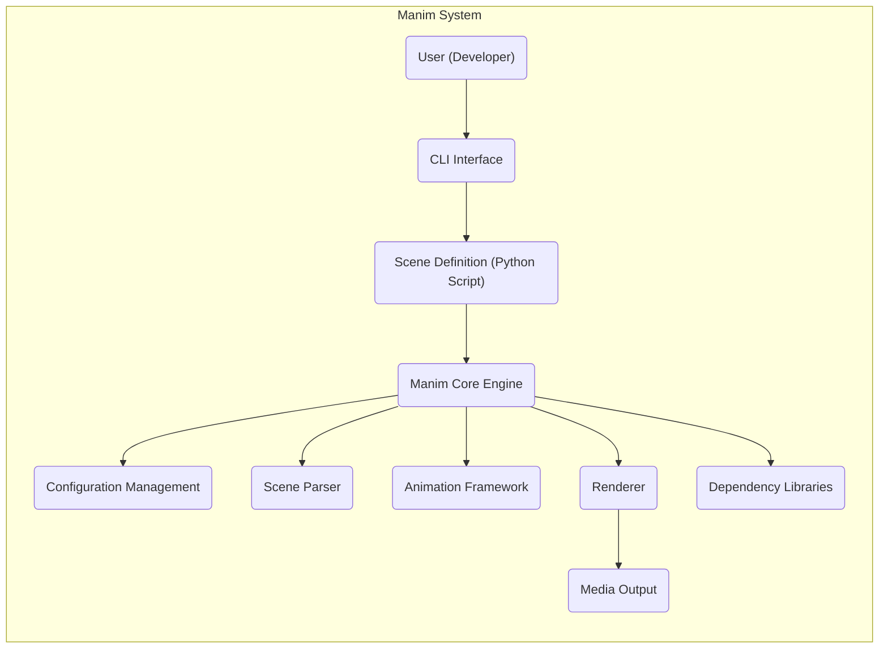
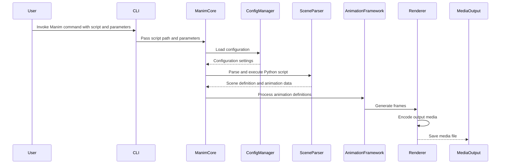

# Project Design Document: Manim - Mathematical Animation Engine

**Version:** 1.1
**Date:** October 26, 2023
**Author:** AI Software Architect

## 1. Introduction

This document provides an enhanced architectural design of the Manim (Mathematical Animation Engine) project, as found on the GitHub repository [https://github.com/3b1b/manim](https://github.com/3b1b/manim). Building upon the initial design, this version offers greater detail and clarity, specifically tailored for effective threat modeling activities.

Manim is a Python library designed for creating precise and explanatory mathematical animations programmatically. Its strength lies in providing users with fine-grained control over the visual elements and their temporal evolution. This revised design document delves deeper into the system's components, their interactions, and the flow of data, with a heightened focus on aspects relevant to potential security vulnerabilities.

## 2. Goals

The primary goals of this enhanced design document are:

*   Provide a more granular and detailed outline of the Manim project's architecture.
*   Clearly delineate the responsibilities and interactions of key components.
*   Offer a more precise description of the data flow within the system, highlighting potential data manipulation points.
*   Serve as a robust and comprehensive foundation for subsequent threat modeling exercises, enabling the identification of a wider range of potential threats.
*   Act as an improved reference for understanding the intricacies of the system's design and operation.

## 3. System Architecture

Manim's architecture is structured around distinct layers and components that collaborate to transform user-defined Python scripts into visual animations. The following provides a more detailed breakdown:

*   **User Interface (Command Line Interface - CLI):**
    *   The primary interface through which users interact with Manim.
    *   Accepts commands to initiate the rendering process for specific Python scripts.
    *   Handles command-line argument parsing and validation.
*   **Scene Definition (Python Scripts):**
    *   User-authored Python code that defines the animation's content and logic.
    *   Utilizes the Manim API to create mathematical objects (Mobjects), animations, and scenes.
    *   Represents the primary input and a potential source of malicious code.
*   **Manim Core Engine:**
    *   The central orchestrator responsible for managing the animation lifecycle.
    *   Loads and manages configuration settings.
    *   Delegates tasks to other components, such as the Scene Parser and Renderer.
    *   Handles error management and logging.
*   **Configuration Management:**
    *   Manages settings that control rendering parameters, output formats, and other system-wide configurations.
    *   Can involve reading configuration files (e.g., `manim.cfg`) or accepting command-line overrides.
    *   Influences the behavior of the Renderer and other components.
*   **Scene Parser:**
    *   Responsible for interpreting the Python script provided by the user.
    *   Dynamically executes the user's code to construct the scene graph and animation definitions.
    *   A critical component from a security perspective due to its direct interaction with user-supplied code.
*   **Animation Framework:**
    *   Provides the foundational building blocks for creating animations.
    *   Includes classes and methods for defining transformations, interpolations, and object manipulations.
    *   Offers a high-level API to simplify the creation of complex animation sequences.
*   **Renderer:**
    *   Generates the visual output of the animation based on the scene graph and animation data.
    *   Handles the drawing of Mobjects and the application of transformations.
    *   Supports various rendering backends (e.g., Cairo, OpenGL).
    *   Responsible for encoding the rendered frames into the final output format.
*   **Media Output:**
    *   The final rendered animation, typically in the form of video files (e.g., MP4, GIF) or sequences of image files.
    *   Stored in the file system at a location determined by configuration or command-line arguments.
*   **Dependency Libraries:**
    *   External Python libraries that Manim relies on for various functionalities.
    *   Examples include `numpy`, `scipy`, `Pillow`, `Cairo`, and potentially external binaries like `ffmpeg`.

## 4. Data Flow

The data flow within Manim involves a series of transformations, starting from the user's Python script and culminating in the rendered animation output. The following steps provide a more detailed breakdown:

1. **User Authors Python Script:** The user creates a Python file containing the definitions of scenes, mathematical objects, and animations, utilizing the Manim API. This script represents the initial data input.
2. **User Invokes Manim via CLI:** The user executes a Manim command through the command-line interface, specifying the path to the Python script to be rendered and potentially other parameters.
3. **CLI Passes Script Path and Parameters to Manim Core:** The CLI acts as the entry point, parsing the command and passing the script path and any specified parameters to the Manim Core Engine.
4. **Manim Core Loads and Applies Configuration:** The engine reads configuration settings from files or command-line arguments, determining rendering parameters such as resolution, frame rate, and output format. These settings influence subsequent processing steps.
5. **Scene Parser Interprets and Executes the Script:** The Scene Parser reads the specified Python script and dynamically executes its contents. This execution constructs the scene graph, instantiates Mobjects, and defines animations based on the user's code. This is a critical point where malicious code could be executed.
6. **Animation Framework Processes Animation Definitions:** The Animation Framework takes the parsed animation definitions and manages their lifecycle. It calculates intermediate states and transformations for objects over time, preparing the data for rendering.
7. **Renderer Generates Frames:** The Renderer receives the animation data from the Animation Framework and generates individual frames (images) representing each step of the animation. This involves drawing the Mobjects with their current transformations applied, utilizing the chosen rendering backend.
8. **Renderer Encodes Output Media:** The Renderer encodes the sequence of generated frames into the desired output format (e.g., MP4 video, GIF animation, PNG image sequence). This process may involve invoking external tools like `ffmpeg`.
9. **Media Output is Saved:** The final rendered animation (video or images) is saved to the file system at the specified output path.

## 5. Key Components

This section provides a more granular examination of the key components within the Manim architecture, highlighting their specific responsibilities and interactions:

*   **CLI Interface:**
    *   **Responsibility:**  Provides the command-line interface for user interaction, handling command parsing, validation, and dispatching to the Manim Core Engine.
    *   **Interaction:** Receives user input, passes relevant information to the Manim Core, and potentially displays output or error messages.
*   **Scene Definition (Python Scripts):**
    *   **Responsibility:** Contains the user-defined Python code that dictates the content and behavior of the animation. This includes instantiating Mobjects, defining animations, and structuring scenes.
    *   **Interaction:** Provides the primary input data for the Scene Parser. The Manim Core Engine loads and passes this script to the parser.
*   **Manim Core Engine:**
    *   **Responsibility:**  The central control unit responsible for orchestrating the entire rendering process. It manages the lifecycle of scenes and animations, coordinates component interactions, and handles overall execution flow.
    *   **Interaction:**  Receives input from the CLI, interacts with the Configuration Manager, invokes the Scene Parser, manages the Animation Framework, and triggers the Renderer.
*   **Configuration Management:**
    *   **Responsibility:** Loads, manages, and provides access to configuration settings that govern the rendering process. This includes parameters like resolution, frame rate, output directories, and rendering quality.
    *   **Interaction:**  Read by the Manim Core Engine at the beginning of the rendering process. Provides configuration data to other components, particularly the Renderer.
*   **Scene Parser:**
    *   **Responsibility:**  Reads, interprets, and executes the user-provided Python script. It dynamically constructs the scene graph and extracts animation definitions.
    *   **Interaction:** Receives the Python script from the Manim Core Engine. Its output (scene graph and animation data) is passed back to the Manim Core and the Animation Framework.
*   **Animation Framework:**
    *   **Responsibility:** Provides the classes and methods necessary for defining and manipulating animations. This includes handling interpolations, transformations, and the temporal evolution of Mobjects.
    *   **Interaction:** Receives animation definitions from the Scene Parser (via the Manim Core). Provides the Renderer with the data needed to generate individual frames.
*   **Renderer:**
    *   **Responsibility:** Generates the visual output of the animation. This involves drawing Mobjects, applying transformations, and encoding the resulting frames into the desired output format.
    *   **Interaction:** Receives animation data from the Animation Framework and configuration settings from the Configuration Manager. Outputs the rendered animation to the Media Output.
*   **Media Output:**
    *   **Responsibility:** The storage location for the final rendered animation files.
    *   **Interaction:** Receives the rendered output from the Renderer and saves it to the file system. The location and format are determined by configuration settings.
*   **Dependency Libraries:**
    *   **Responsibility:** Provide external functionalities required by Manim, such as numerical computation (`numpy`), scientific computing (`scipy`), image manipulation (`Pillow`), and graphics rendering (`Cairo`).
    *   **Interaction:**  Different components of Manim utilize these libraries as needed. For example, the Renderer might use Cairo for drawing, and the Animation Framework might use `numpy` for calculations.

## 6. Security Considerations (Pre-Threat Modeling)

This section expands on the initial security considerations, providing more specific examples and categorizing potential threats:

*   **Input Validation and Code Execution (Python Scripts):**
    *   **Threat:** Maliciously crafted Python scripts could execute arbitrary code on the user's system, leading to data breaches, system compromise, or denial of service.
    *   **Examples:**
        *   Scripts using `os.system()` or `subprocess` to execute external commands.
        *   Scripts attempting to read or write sensitive files outside the intended output directory.
        *   Scripts exploiting vulnerabilities in imported libraries.
*   **Dependency Management:**
    *   **Threat:** Vulnerabilities in Manim's dependencies could be exploited if not properly managed and updated.
    *   **Examples:**
        *   Using outdated versions of libraries with known security flaws.
        *   Dependencies introducing supply chain attacks.
*   **File System Access:**
    *   **Threat:** Improper handling of file paths could allow attackers to read or write arbitrary files on the system.
    *   **Examples:**
        *   Path traversal vulnerabilities in output file naming or temporary file handling.
        *   Insufficient restrictions on file access permissions.
*   **Resource Consumption:**
    *   **Threat:** Malicious scripts could be designed to consume excessive system resources (CPU, memory, disk space), leading to denial of service.
    *   **Examples:**
        *   Scripts creating infinitely looping animations.
        *   Scripts generating extremely large output files.
*   **Configuration Security:**
    *   **Threat:** If configuration files are not properly secured, attackers could modify settings to compromise the system or the rendering process.
    *   **Examples:**
        *   Modifying output paths to overwrite critical files.
        *   Changing rendering settings to introduce vulnerabilities.
*   **External Processes (ffmpeg):**
    *   **Threat:** Vulnerabilities in external tools like `ffmpeg`, used for video encoding, could be exploited.
    *   **Examples:**
        *   Passing specially crafted input to `ffmpeg` to trigger vulnerabilities.
        *   Compromised versions of `ffmpeg` being used.

## 7. Deployment Model

Manim's typical deployment model remains focused on local installation, but potential alternative deployments warrant consideration for security implications:

*   **Local Installation:**
    *   **Description:** Users install Manim and its dependencies directly on their personal computers.
    *   **Security Considerations:** Relies on the user's system security. Vulnerabilities could impact the user's machine directly.
*   **Containerized Deployment (Docker):**
    *   **Description:** Manim is run within a Docker container, providing isolation from the host system.
    *   **Security Considerations:** Can improve security by limiting the impact of vulnerabilities within the container. Requires careful configuration of the container image.
*   **Cloud-Based Rendering Services:**
    *   **Description:** Manim is deployed on cloud infrastructure to handle computationally intensive rendering tasks.
    *   **Security Considerations:** Introduces new security considerations related to cloud security, data transmission, and access control. Requires careful management of cloud resources and permissions.
*   **Integration with Web Applications:**
    *   **Description:** Manim's rendering capabilities are integrated into web applications, allowing users to create and render animations through a web interface.
    *   **Security Considerations:** Significantly increases the attack surface. Requires robust input validation, secure communication protocols, and protection against web-based attacks (e.g., cross-site scripting).

## 8. Assumptions and Constraints

The following assumptions and constraints remain relevant, with added nuance:

*   **Trusted User Environment:** While the user is generally assumed not to be intentionally malicious towards their *own* system, this assumption weakens when considering scenarios like shared environments or compromised accounts. The threat model needs to account for potentially malicious input even from legitimate users.
*   **Dependency Availability and Integrity:**  It's assumed that required dependencies are installed. However, the integrity of these dependencies (i.e., they haven't been tampered with) is a crucial security consideration. Mechanisms for verifying dependency integrity should be explored.
*   **Standard Operating System:**  While primarily targeting standard desktop OSes, the behavior and security implications might differ across platforms.
*   **Focus on Core Functionality:**  The primary focus remains on core rendering. However, interactions with external tools and the file system are integral to this functionality and must be considered.

## 9. Future Considerations

Building on the initial considerations, future steps should include:

*   **Comprehensive Threat Modeling:** Conduct detailed threat modeling sessions using frameworks like STRIDE to identify potential vulnerabilities based on this design document.
*   **Input Sanitization and Validation:** Implement robust input validation and sanitization techniques for user-provided Python scripts to mitigate code execution risks. Consider sandboxing or other isolation mechanisms.
*   **Dependency Management and Security Scanning:** Implement processes for managing dependencies, including regular updates and security vulnerability scanning. Utilize tools like `pip-audit` or `safety`.
*   **Secure File Handling:** Enforce secure file handling practices, including proper path validation and access controls, to prevent unauthorized file access.
*   **Least Privilege Principle:** Apply the principle of least privilege to component interactions and file system access.
*   **Security Audits and Penetration Testing:** Conduct regular security audits and penetration testing to identify and address potential vulnerabilities.
*   **Consideration of a Security Policy:** Develop a clear security policy for the Manim project, outlining security guidelines and best practices.

This enhanced design document provides a more detailed and nuanced understanding of the Manim project's architecture, serving as a more robust foundation for identifying and mitigating potential security threats.