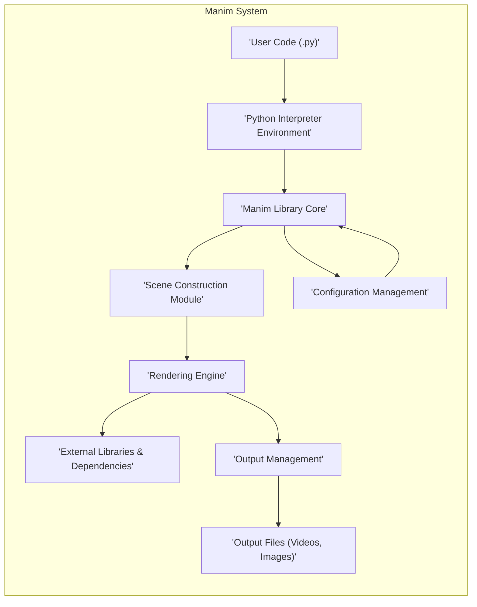
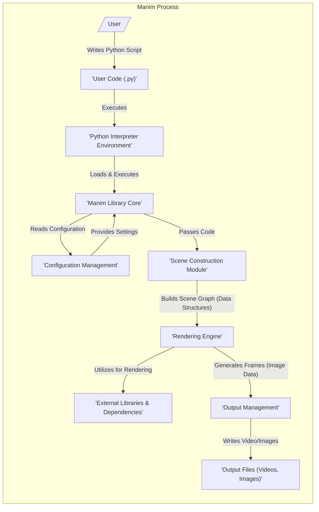

## Project Design Document: Manim - Mathematical Animation Engine (Improved)

**1. Introduction**

This document provides an enhanced design overview of the Manim project, a Python library for creating explanatory math videos. This detailed design serves as a crucial foundation for subsequent threat modeling activities by clearly outlining the system's architecture, components, and data flows.

**2. Project Overview**

Manim is a command-line tool and Python library enabling users to programmatically generate mathematical animations. Users author Python scripts that define scenes, mathematical objects, and animations. Manim then interprets these scripts, renders the animations frame by frame, and encodes them into video files. The core functionality encompasses Python code interpretation, manipulation of graphical objects, and video output encoding.

**3. System Architecture**

The Manim system comprises the following key components:

*   **User Code:** Python scripts authored by users to define animation logic.
*   **Manim Library Core:** The central Python library providing classes and functions for scene creation, object manipulation, animation definition, and rendering orchestration.
*   **Python Interpreter Environment:** The runtime environment (e.g., CPython) where the Manim library and user code are executed.
*   **Scene Construction Module:**  Responsible for building the internal representation of the animation scene based on user code.
*   **Rendering Engine:** The component that generates individual frames (images) based on the constructed scene description.
*   **External Libraries & Dependencies:** Third-party libraries such as FFmpeg for video encoding, Pillow for image manipulation, and potentially NumPy for numerical computations.
*   **Configuration Management:** Handles loading and managing configuration settings from files and command-line arguments.
*   **Output Management:** Responsible for writing the generated video and image files to the file system.

**4. Component Breakdown**

*   **User Code (.py):**
    *   Description: Python scripts written by users that specify the animation's content, including mathematical objects, their properties, and animation sequences.
    *   Functionality: Serves as the primary input to the Manim system, dictating the animation's visual content and behavior.
    *   Potential Security Concerns:
        *   Malicious code embedded within user scripts could exploit vulnerabilities in the Manim library or the Python interpreter.
        *   Poorly written code might unintentionally trigger unexpected behavior or resource exhaustion.

*   **Python Interpreter Environment:**
    *   Description: The Python runtime environment (e.g., CPython) that executes the user's Python code and the Manim library's code.
    *   Functionality: Interprets and executes Python bytecode. Provides access to system resources based on its permissions.
    *   Potential Security Concerns:
        *   Vulnerabilities within the Python interpreter itself could be exploited if Manim interacts with vulnerable features.
        *   The interpreter's access rights to the file system and other system resources are relevant to potential security risks.

*   **Manim Library Core:**
    *   Description: The central Python library providing the API for animation creation. It includes modules for scene management, geometric object creation (e.g., shapes, text, graphs), animation definitions, and overall rendering control.
    *   Functionality: Provides the core building blocks and logic for constructing and rendering animations. Orchestrates the interaction between other components.
    *   Potential Security Concerns:
        *   Bugs or vulnerabilities within the Manim library's code could be exploited by malicious user code.
        *   Improper handling of user-supplied data or external data sources could introduce vulnerabilities.
        *   Serialization and deserialization of animation objects could be a potential attack vector if not handled securely.

*   **Scene Construction Module:**
    *   Description: This module within the Manim library takes the user's Python code and builds an internal representation of the animation scene, including the objects, their properties, and the animation timeline.
    *   Functionality: Translates the declarative user code into an actionable scene graph or similar data structure.
    *   Potential Security Concerns:
        *   Vulnerabilities in how user code is parsed and interpreted could lead to unexpected behavior or code injection.
        *   Improper handling of complex or deeply nested scene structures could lead to resource exhaustion.

*   **Rendering Engine:**
    *   Description: The component responsible for iterating through the animation timeline and generating individual frames (images) based on the scene description.
    *   Functionality: Transforms the abstract scene representation into concrete visual outputs. May involve calculations for object transformations, color rendering, and other visual effects.
    *   Potential Security Concerns:
        *   Vulnerabilities in the rendering logic could lead to crashes, unexpected visual artifacts, or even information disclosure if sensitive data is inadvertently rendered.
        *   Interactions with external libraries for rendering functionalities could introduce vulnerabilities if those libraries are compromised.

*   **External Libraries & Dependencies:**
    *   Description: Third-party libraries used by Manim to perform specific tasks. Examples include FFmpeg for video encoding, Pillow for image manipulation, and potentially libraries like NumPy for mathematical operations.
    *   Functionality: Provides specialized functionalities not implemented directly within Manim, enhancing its capabilities.
    *   Potential Security Concerns:
        *   Vulnerabilities present in these external libraries could be exploited by Manim if not properly managed and updated.
        *   The integrity of these dependencies needs to be ensured to prevent supply chain attacks.

*   **Configuration Management:**
    *   Description: This component handles the loading and management of configuration settings for Manim, including rendering quality, output directories, default parameters, and potentially API keys for external services (if integrated).
    *   Functionality: Allows users to customize Manim's behavior and settings.
    *   Potential Security Concerns:
        *   If configuration files are writable by unauthorized users, malicious configurations could be introduced, altering Manim's behavior or potentially leading to security breaches.
        *   Storing sensitive information (like API keys) in configuration files poses a risk if these files are not properly protected.

*   **Output Management:**
    *   Description: Responsible for writing the generated video and image files to the specified output directory on the file system.
    *   Functionality: Handles file creation, naming, and writing operations for the final animation outputs.
    *   Potential Security Concerns:
        *   If output directories have overly permissive access controls, generated files could be accessed or modified by unauthorized users.
        *   Information disclosure could occur if sensitive information is inadvertently included in the animations and the output directory is publicly accessible.
        *   Path traversal vulnerabilities could arise if the output directory is not properly validated.

**5. Data Flow Diagram**

This diagram illustrates the flow of data within the Manim system, highlighting the types of data exchanged between components.

**Detailed Data Flow Description:**

1. **User Writes Code:** The user creates a Python script (`User Code`) defining the animation logic.
2. **Execution:** The user invokes the Manim command-line interface, causing the `Python Interpreter Environment` to execute the `User Code`.
3. **Library Interaction:** The `User Code` interacts with the `Manim Library Core` to define scenes, objects, and animations.
4. **Configuration Loading:** The `Manim Library Core` reads configuration settings from `Configuration Management`.
5. **Scene Construction:** The `Manim Library Core` passes the user code to the `Scene Construction Module`.
6. **Scene Graph Generation:** The `Scene Construction Module` builds an internal representation of the animation scene (e.g., a scene graph) using data structures.
7. **Rendering:** The `Rendering Engine` takes the scene graph and utilizes `External Libraries & Dependencies` for rendering operations.
8. **Frame Generation:** The `Rendering Engine` generates individual frames as image data.
9. **Output Management:** The `Rendering Engine` passes the generated frames to `Output Management`.
10. **Output Writing:** `Output Management` writes the video and image data to `Output Files`.

**6. Security Considerations (Detailed)**

This section expands on the initial security considerations, providing more specific examples and potential attack vectors.

*   **Code Injection via User Code:**
    *   Concern: Malicious code within user scripts could exploit vulnerabilities in Manim's code execution paths or the Python interpreter itself.
    *   Examples: Using `eval()` or `exec()` on user-provided strings without proper sanitization; exploiting vulnerabilities in how Manim handles dynamically loaded modules or external data sources specified in user code.
    *   Mitigation Strategies:  Strict input validation and sanitization of user-provided data; avoiding the use of dynamic code execution where possible; employing secure coding practices within the Manim library.

*   **Dependency Vulnerabilities:**
    *   Concern: Vulnerabilities in external libraries (e.g., FFmpeg, Pillow) could be exploited if Manim uses vulnerable versions or interacts with them insecurely.
    *   Examples: Exploiting known vulnerabilities in FFmpeg's video decoding or encoding; vulnerabilities in image processing libraries that could lead to buffer overflows.
    *   Mitigation Strategies: Regularly updating dependencies to their latest secure versions; using dependency management tools to track and manage vulnerabilities; employing security scanning tools to identify potential issues.

*   **Arbitrary Code Execution through Configuration Tampering:**
    *   Concern: If configuration files are writable by unauthorized users, malicious settings could be introduced, potentially leading to arbitrary code execution.
    *   Examples: Modifying configuration paths to point to malicious executables; injecting malicious commands into configuration settings that are later executed by Manim.
    *   Mitigation Strategies: Ensuring proper file system permissions on configuration files; validating configuration settings before use; avoiding the storage of executable paths or commands in configuration files if possible.

*   **File System Access Vulnerabilities:**
    *   Concern: Improperly managed file system access could allow unauthorized reading, writing, or execution of files.
    *   Examples: Path traversal vulnerabilities allowing users to write output files to arbitrary locations; insufficient restrictions on file access within the Manim library, allowing malicious user code to read sensitive files.
    *   Mitigation Strategies: Implementing strict path validation and sanitization; adhering to the principle of least privilege when accessing the file system; avoiding reliance on user-provided file paths without thorough validation.

*   **Information Disclosure:**
    *   Concern: Sensitive information could be inadvertently included in generated animations or exposed through insecure output directory configurations.
    *   Examples: Including API keys or other secrets in animation content; storing generated animations in publicly accessible directories without proper access controls.
    *   Mitigation Strategies: Educating users on best practices for handling sensitive information; providing options for secure output directory configuration; implementing mechanisms to prevent the accidental inclusion of sensitive data in animations.

*   **Resource Exhaustion (Denial of Service):**
    *   Concern: Maliciously crafted user code could consume excessive system resources (CPU, memory, disk space), leading to denial of service.
    *   Examples: Creating extremely complex scenes with a large number of objects or animations; triggering infinite loops or recursive calls within the Manim library through carefully crafted user code.
    *   Mitigation Strategies: Implementing resource limits and timeouts for rendering processes; adding safeguards against excessively complex scene structures; providing mechanisms for users to control resource usage.

**7. Assumptions and Constraints**

*   It is assumed that the user has a properly configured and secure Python environment with the necessary dependencies installed.
*   The primary mode of interaction with Manim is through its command-line interface.
*   The security of the underlying operating system and hardware infrastructure is considered outside the direct scope of this document.
*   This design focuses on the core Manim library and its immediate dependencies. Security considerations for the user's development environment and external integrations are not explicitly detailed here.

**8. Future Considerations**

*   Further decomposition of the `Manim Library Core` into more granular sub-modules for deeper security analysis.
*   Detailed examination of the interfaces and communication protocols between different components.
*   Analysis of error handling and logging mechanisms from a security perspective (e.g., preventing information leakage through error messages).
*   Consideration of security best practices for handling user authentication and authorization if future features involve user accounts or remote access.

This improved design document provides a more comprehensive and detailed understanding of the Manim project's architecture and potential security considerations. It serves as a robust foundation for conducting thorough threat modeling and implementing appropriate security measures.