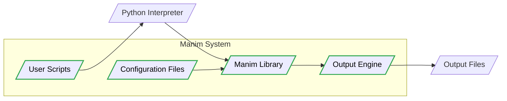
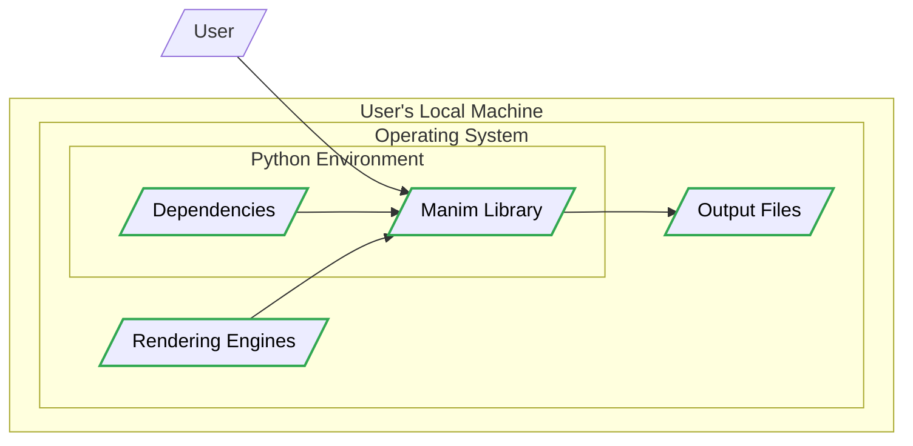
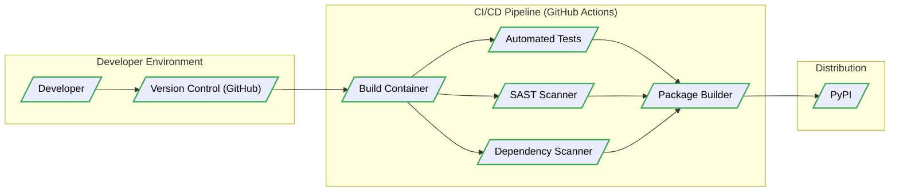

# BUSINESS POSTURE

This project, Manim, is an engine for creating mathematical animations. It is primarily targeted towards educators, students, and content creators who need to visualize mathematical concepts in a dynamic and engaging way.

- Business Priorities:
  - Provide a powerful and flexible tool for creating high-quality mathematical animations.
  - Maintain an open-source and community-driven project to foster collaboration and innovation.
  - Ensure ease of use and accessibility for users with varying levels of technical expertise.
  - Support a wide range of mathematical concepts and visualization techniques.

- Business Goals:
  - Increase adoption of Manim within the educational and content creation communities.
  - Expand the functionality and features of Manim based on user feedback and community contributions.
  - Establish Manim as the leading open-source animation engine for mathematics.
  - Ensure long-term sustainability and maintainability of the project.

- Business Risks:
  - Complexity of use hindering adoption by non-technical users.
  - Lack of community contributions leading to slow development and feature stagnation.
  - Security vulnerabilities in dependencies or the core codebase impacting user trust and project reputation.
  - Performance issues or limitations in handling complex animations.

# SECURITY POSTURE

Manim is an open-source project primarily used locally by individual users to generate animations. As such, the security posture is focused on the integrity of the software itself and the security of the user's local environment.

- Security Controls:
  - security control: Open Source Review - The codebase is publicly available on GitHub, allowing for community review and identification of potential vulnerabilities. Implemented: GitHub Repository.
  - security control: Dependency Management - Python's `pip` and `requirements.txt` are used to manage project dependencies. Implemented: Project Repository.
  - security control: GitHub Security Features - GitHub provides basic security features like vulnerability scanning for dependencies. Implemented: GitHub Platform.

- Accepted Risks:
  - accepted risk: Vulnerabilities in Dependencies - The project relies on numerous Python libraries, and vulnerabilities in these dependencies could affect Manim. Mitigation: Regular dependency updates and vulnerability scanning.
  - accepted risk: Code Injection via User Scripts - Users write Python scripts to define animations, and malicious or poorly written scripts could potentially cause harm to the user's local system. Mitigation: User education and sandboxing (if feasible).
  - accepted risk: Supply Chain Attacks - Compromise of upstream dependencies or build tools could introduce malicious code into Manim. Mitigation: Dependency pinning and verification, secure build processes.

- Recommended Security Controls:
  - security control: Dependency Scanning - Implement automated dependency scanning tools to identify and alert on known vulnerabilities in project dependencies.
  - security control: Software Composition Analysis (SCA) - Utilize SCA tools to gain visibility into the project's software components and their associated risks.
  - security control: Static Application Security Testing (SAST) - Integrate SAST tools into the development process to automatically analyze the codebase for potential security flaws.
  - security control: Security Awareness Training for Contributors - Provide security awareness training to project contributors to promote secure coding practices.

- Security Requirements:
  - Authentication: Not applicable as Manim is primarily a local, offline tool. No user authentication is required.
  - Authorization: Not applicable as Manim operates within the user's local file system permissions. No specific authorization mechanisms are needed within the application itself.
  - Input Validation: User-provided Python scripts are the primary input. Input validation is crucial to prevent execution of malicious code or unexpected behavior. This should focus on validating the structure and syntax of animation scripts, and potentially sandboxing script execution.
  - Cryptography: Cryptography is not a core requirement for Manim's primary functionality of animation generation. However, if features involving data storage or network communication are added in the future, appropriate cryptographic measures should be considered. For now, ensure no sensitive data is stored or transmitted by Manim itself.

# DESIGN

Manim is designed as a Python library that users install and utilize locally to create mathematical animations. The core architecture revolves around processing user-defined Python scripts to generate video or GIF outputs.

## C4 CONTEXT

```mermaid
graph LR
    subgraph "Animation Creation Environment"
        M[/"Manim"/]
    end
    U[/"Educators, Students, Content Creators"/] --> M
    P[/"Python Interpreter"/] --> M
    L[/"Python Libraries (NumPy, SciPy, etc.)"/] --> M
    R[/"Rendering Engines (LaTeX, OpenGL)"/] --> M
    O[/"Output Files (Videos, GIFs)"/] <-- M

    classDef box stroke:#32a852,stroke-width:2px,color:#000
    class M box
```

- C4 Context Elements:
  - Element:
    - Name: Educators, Students, Content Creators
    - Type: Person
    - Description: Users who utilize Manim to create mathematical animations for educational or content creation purposes.
    - Responsibilities: Writing Python scripts to define animations, running Manim to generate output, utilizing generated animations.
    - Security Controls: User education on secure scripting practices.
  - Element:
    - Name: Manim
    - Type: Software System
    - Description: The mathematical animation engine, a Python library that processes user scripts and generates animations.
    - Responsibilities: Parsing user scripts, performing mathematical computations, controlling rendering engines, generating output files.
    - Security Controls: Input validation of user scripts, dependency management, secure build process.
  - Element:
    - Name: Python Interpreter
    - Type: Software System
    - Description: The Python runtime environment required to execute Manim and user scripts.
    - Responsibilities: Executing Python code, providing access to system resources.
    - Security Controls: System-level security controls of the user's operating system.
  - Element:
    - Name: Python Libraries (NumPy, SciPy, etc.)
    - Type: Software System
    - Description: External Python libraries that Manim depends on for mathematical computations and other functionalities.
    - Responsibilities: Providing mathematical functions, data structures, and other utilities.
    - Security Controls: Dependency scanning, regular updates to secure versions.
  - Element:
    - Name: Rendering Engines (LaTeX, OpenGL)
    - Type: Software System
    - Description: External rendering engines used by Manim to generate visual elements in animations.
    - Responsibilities: Rendering text, shapes, and scenes based on instructions from Manim.
    - Security Controls: Security of rendering engine installations on the user's system.
  - Element:
    - Name: Output Files (Videos, GIFs)
    - Type: Data Store
    - Description: The generated animation files in video or GIF formats, stored on the user's local file system.
    - Responsibilities: Storing the final animation output.
    - Security Controls: File system permissions on the user's local machine.

## C4 CONTAINER



- C4 Container Elements:
  - Element:
    - Name: Manim Library
    - Type: Container - Library
    - Description: The core Python library containing the logic for animation creation, scene management, and interaction with rendering engines.
    - Responsibilities: Processing user scripts, managing animation scenes, coordinating with output engine, handling configuration.
    - Security Controls: Input validation within the library, secure coding practices, dependency management.
  - Element:
    - Name: Configuration Files
    - Type: Container - Files
    - Description: Configuration files that store settings for Manim, such as rendering quality, output directories, and default styles.
    - Responsibilities: Providing configurable parameters for Manim execution.
    - Security Controls: File system permissions to restrict modification by unauthorized users.
  - Element:
    - Name: User Scripts
    - Type: Container - Files
    - Description: Python scripts written by users to define the animations they want to create.
    - Responsibilities: Defining animation logic, specifying mathematical content, controlling scene flow.
    - Security Controls: User education on secure scripting, input validation when scripts are processed.
  - Element:
    - Name: Output Engine
    - Type: Container - Component
    - Description: Component responsible for interacting with rendering engines (like LaTeX and OpenGL) and generating the final animation output files.
    - Responsibilities: Rendering scenes, encoding video/GIF output, managing output file storage.
    - Security Controls: Secure interaction with rendering engines, proper handling of output file paths.
  - Element:
    - Name: Output Files
    - Type: Data Store
    - Description: Files generated by Manim containing the animation output (videos, GIFs).
    - Responsibilities: Storing the final animation output.
    - Security Controls: File system permissions on the user's local machine.

## DEPLOYMENT

Manim is primarily deployed as a local application on a user's machine. The typical deployment architecture involves installing Manim and its dependencies within a Python environment on the user's operating system.



- Deployment Elements:
  - Element:
    - Name: User's Local Machine
    - Type: Infrastructure - Physical Machine
    - Description: The user's personal computer or workstation where Manim is installed and executed.
    - Responsibilities: Providing the hardware and operating system environment for running Manim.
    - Security Controls: Operating system security controls, user account management, physical security of the machine.
  - Element:
    - Name: Operating System
    - Type: Infrastructure - Software
    - Description: The operating system (e.g., Windows, macOS, Linux) installed on the user's machine.
    - Responsibilities: Managing system resources, providing a platform for running applications.
    - Security Controls: Operating system security features (firewall, access control, patching).
  - Element:
    - Name: Python Environment
    - Type: Infrastructure - Software Environment
    - Description: A Python environment (e.g., virtual environment, conda environment) where Manim and its dependencies are installed.
    - Responsibilities: Isolating project dependencies, providing the Python runtime.
    - Security Controls: Environment isolation to prevent conflicts, package management within the environment.
  - Element:
    - Name: Manim Library
    - Type: Software - Library
    - Description: The installed Manim Python library.
    - Responsibilities: Animation engine logic.
    - Security Controls: Software integrity, secure installation process.
  - Element:
    - Name: Dependencies
    - Type: Software - Libraries
    - Description: Python libraries required by Manim (NumPy, SciPy, etc.).
    - Responsibilities: Providing supporting functionalities.
    - Security Controls: Dependency scanning, secure dependency sources.
  - Element:
    - Name: Rendering Engines
    - Type: Software - Applications
    - Description: Rendering engines like LaTeX and OpenGL installed on the user's system.
    - Responsibilities: Rendering visual elements.
    - Security Controls: Security of rendering engine installations, updates.
  - Element:
    - Name: Output Files
    - Type: Data Store - Files
    - Description: Animation output files stored on the local file system.
    - Responsibilities: Storing animation output.
    - Security Controls: File system permissions.

## BUILD

The build process for Manim involves packaging the Python library and making it available for users to install. The build process should ensure the integrity and security of the distributed software.



- Build Elements:
  - Element:
    - Name: Developer
    - Type: Person
    - Description: Software developers contributing to the Manim project.
    - Responsibilities: Writing code, committing changes to version control.
    - Security Controls: Secure development practices, code review.
  - Element:
    - Name: Version Control (GitHub)
    - Type: Tool - Version Control System
    - Description: GitHub repository used for source code management and collaboration.
    - Responsibilities: Storing source code, managing code changes, facilitating collaboration.
    - Security Controls: Access control, branch protection, audit logs.
  - Element:
    - Name: Build Container
    - Type: Infrastructure - Container
    - Description: Containerized environment used for building and testing Manim.
    - Responsibilities: Providing a consistent build environment, executing build scripts.
    - Security Controls: Secure container image, minimal software installed in the container.
  - Element:
    - Name: Automated Tests
    - Type: Tool - Testing Framework
    - Description: Automated tests (unit, integration) to verify the functionality of Manim.
    - Responsibilities: Ensuring code quality, detecting regressions.
    - Security Controls: Test coverage for security-relevant functionalities.
  - Element:
    - Name: SAST Scanner
    - Type: Tool - Security Scanner
    - Description: Static Application Security Testing tool to analyze the codebase for potential security vulnerabilities.
    - Responsibilities: Identifying potential security flaws in the code.
    - Security Controls: Regularly updated vulnerability rules, integration into CI/CD pipeline.
  - Element:
    - Name: Dependency Scanner
    - Type: Tool - Security Scanner
    - Description: Tool to scan project dependencies for known vulnerabilities.
    - Responsibilities: Identifying vulnerable dependencies.
    - Security Controls: Regularly updated vulnerability database, automated alerts.
  - Element:
    - Name: Package Builder
    - Type: Tool - Build Tool
    - Description: Tool that packages the Manim library into distributable packages (e.g., Python wheels).
    - Responsibilities: Creating distribution packages.
    - Security Controls: Secure packaging process, signing of packages (if applicable).
  - Element:
    - Name: PyPI
    - Type: Service - Package Repository
    - Description: Python Package Index, the primary repository for Python packages.
    - Responsibilities: Hosting and distributing Manim packages.
    - Security Controls: PyPI security measures, package verification.

# RISK ASSESSMENT

- Critical Business Processes:
  - Providing a functional and reliable animation engine for users.
  - Maintaining the open-source community and project reputation.
  - Ensuring the long-term availability and maintainability of Manim.

- Data to Protect:
  - User-created animation scripts: Sensitivity - Medium (potentially contains intellectual property, but generally not highly sensitive personal data). Integrity and availability are important.
  - Manim source code: Sensitivity - Medium (intellectual property of the project). Integrity and availability are crucial for project continuity.
  - Project infrastructure (build systems, distribution channels): Sensitivity - Medium (compromise could lead to supply chain attacks). Integrity and availability are critical.

- Data Sensitivity:
  - Low to Medium. Manim primarily processes and generates visual content. User scripts might contain some intellectual property, but the application itself does not handle highly sensitive personal or financial data. The main concern is the integrity of the software and the user's local system.

# QUESTIONS & ASSUMPTIONS

- Questions:
  - Are there any plans to introduce features that involve network communication or data storage beyond local file system operations?
  - Is there a formal process for security vulnerability reporting and handling within the Manim project?
  - What is the current level of security awareness and training among project contributors?
  - Are there any specific compliance requirements or industry standards that Manim needs to adhere to?

- Assumptions:
  - Manim is primarily used as a local, offline tool.
  - User scripts are the main form of input and are assumed to be created by users on their own systems.
  - The project is community-driven and relies on open-source principles for security.
  - There is no central server or service component for Manim in its current architecture.
  - Distribution is primarily through PyPI and GitHub.