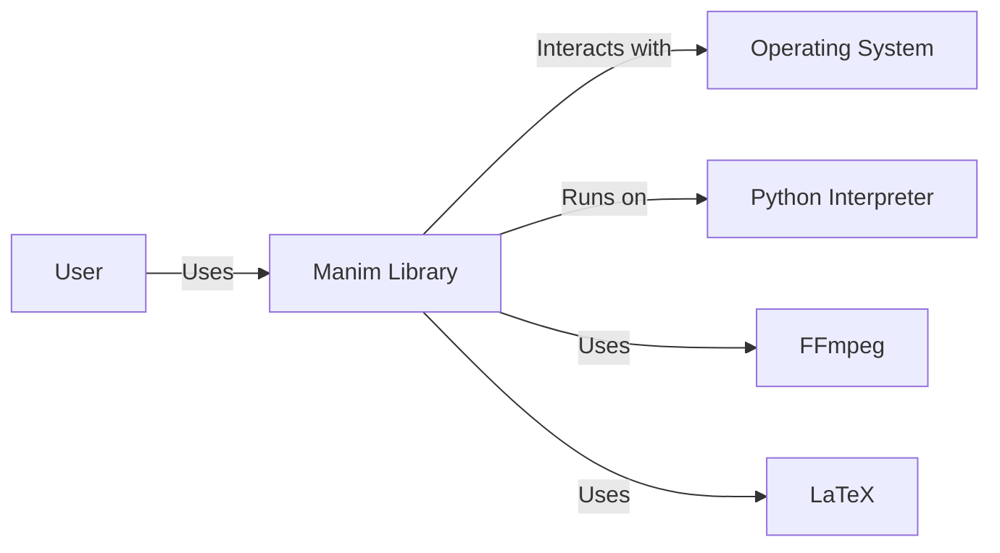
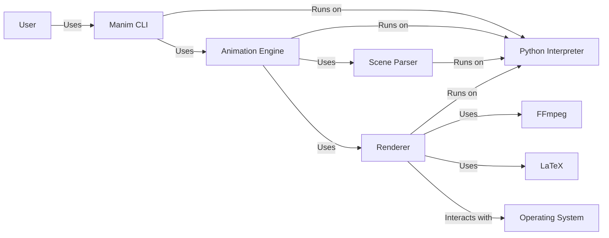
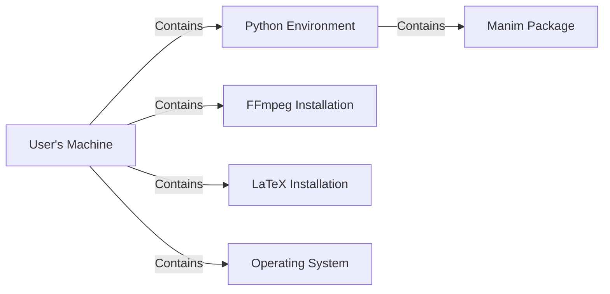
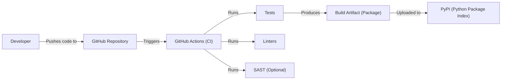

# BUSINESS POSTURE

Business Priorities and Goals:

*   Provide a high-quality, open-source animation engine for creating mathematical visualizations.
*   Foster a community of users and contributors around the project.
*   Enable educators and content creators to easily produce engaging mathematical content.
*   Maintain a codebase that is accessible and easy to understand for contributors.
*   Ensure the software is reliable and performs as expected.

Business Risks:

*   Malicious code injection: Given the project's reliance on user-provided code for animation generation, there's a risk of malicious code being injected, potentially harming users or compromising systems.
*   Denial of Service: The animation generation process could be computationally intensive, making it a potential target for denial-of-service attacks, especially if exposed as a service.
*   Data integrity: If user-generated content or configurations are stored, ensuring their integrity and preventing unauthorized modification is crucial.
*   Reputation damage: Vulnerabilities or security incidents could damage the project's reputation and erode trust within the community.
*   Supply chain attacks: Compromised dependencies could introduce vulnerabilities into the project.

# SECURITY POSTURE

Existing Security Controls:

*   security control: Code Review: The GitHub repository indicates a collaborative development model with pull requests, suggesting that code reviews are likely part of the development process. (Described in contribution guidelines and implied by the use of GitHub).
*   security control: Community Engagement: An active community can help identify and report potential security issues. (Evidenced by the GitHub issues and discussions).
*   security control: Open Source: The open-source nature of the project allows for public scrutiny of the codebase, potentially leading to the identification of vulnerabilities.

Accepted Risks:

*   accepted risk: Limited formal security testing: The project appears to be community-driven, and there's no explicit mention of dedicated security testing resources or processes.
*   accepted risk: Reliance on user input: The core functionality involves executing user-provided code, which inherently carries security risks.
*   accepted risk: Dependency vulnerabilities: The project relies on external libraries, which may contain vulnerabilities.

Recommended Security Controls:

*   security control: Implement a Content Security Policy (CSP) if the output is rendered in a web browser. This can mitigate the risk of cross-site scripting (XSS) attacks.
*   security control: Introduce Static Application Security Testing (SAST) tools into the development workflow to automatically scan for potential vulnerabilities.
*   security control: Perform regular dependency analysis to identify and update outdated or vulnerable libraries.
*   security control: Consider sandboxing or containerization techniques to isolate the animation rendering process and limit the potential impact of malicious code.
*   security control: Develop a security vulnerability disclosure policy to encourage responsible reporting of security issues.

Security Requirements:

*   Authentication: Not directly applicable, as Manim is a library, not a service requiring authentication. However, if integrated into a system with authentication, appropriate controls should be applied at that system level.
*   Authorization: Not directly applicable in the same way as authentication. However, if Manim is used in a system that manages user permissions, the system should ensure users can only execute or access authorized resources.
*   Input Validation: Crucial. User-provided code should be treated as untrusted. Implement strict input validation and sanitization to prevent the execution of malicious code. Consider using a whitelist approach, allowing only known-safe constructs.
*   Cryptography: Not directly applicable for core functionality. If Manim is used to handle sensitive data (which is unlikely), appropriate cryptographic measures should be employed at the system level.

# DESIGN

## C4 CONTEXT

Element Descriptions:

*   Element:
    *   Name: User
    *   Type: Person
    *   Description: A person who uses Manim to create mathematical animations.
    *   Responsibilities: Provides input code, configures animation settings, views the output.
    *   Security controls: Relies on the security controls implemented within Manim and the operating system.

*   Element:
    *   Name: Manim Library
    *   Type: Software System
    *   Description: The core Manim library, providing the functionality for creating animations.
    *   Responsibilities: Parses user input, generates animation frames, interacts with external tools (FFmpeg, LaTeX).
    *   Security controls: Input validation, code review, community scrutiny.

*   Element:
    *   Name: Operating System
    *   Type: Software System
    *   Description: The underlying operating system on which Manim runs.
    *   Responsibilities: Provides file system access, process management, and other system resources.
    *   Security controls: OS-level security features (e.g., file permissions, process isolation).

*   Element:
    *   Name: Python Interpreter
    *   Type: Software System
    *   Description: The Python interpreter used to execute Manim code.
    *   Responsibilities: Executes Python code.
    *   Security controls: Security features of the specific Python interpreter implementation.

*   Element:
    *   Name: FFmpeg
    *   Type: Software System
    *   Description: An external tool used by Manim for video encoding.
    *   Responsibilities: Encodes animation frames into a video file.
    *   Security controls: Relies on the security of the FFmpeg installation.

*   Element:
    *   Name: LaTeX
    *   Type: Software System
    *   Description: External tool for rendering mathematical formulas and text.
    *   Responsibilities: Typesets mathematical expressions.
    *   Security controls: Relies on security of LaTeX installation.

## C4 CONTAINER

Element Descriptions:

*   Element:
    *   Name: User
    *   Type: Person
    *   Description: A person who uses Manim to create mathematical animations.
    *   Responsibilities: Provides input code, configures animation settings, views the output.
    *   Security controls: Relies on the security controls implemented within Manim and the operating system.

*   Element:
    *   Name: Manim CLI
    *   Type: Application
    *   Description: Command Line Interface for interacting with Manim.
    *   Responsibilities: Accepts user commands, passes input to the Animation Engine.
    *   Security controls: Input validation.

*   Element:
    *   Name: Animation Engine
    *   Type: Application
    *   Description: Core logic for processing animation instructions.
    *   Responsibilities: Coordinates the animation generation process.
    *   Security controls: Input validation, code review.

*   Element:
    *   Name: Scene Parser
    *   Type: Application
    *   Description: Parses user-provided scene descriptions.
    *   Responsibilities: Interprets the input code and translates it into animation instructions.
    *   Security controls: Strict input validation, potentially sandboxing.

*   Element:
    *   Name: Renderer
    *   Type: Application
    *   Description: Generates the visual output of the animation.
    *   Responsibilities: Creates animation frames, interacts with FFmpeg and LaTeX.
    *   Security controls: Secure handling of external tools.

*   Element:
    *   Name: FFmpeg
    *   Type: Software System
    *   Description: An external tool used by Manim for video encoding.
    *   Responsibilities: Encodes animation frames into a video file.
    *   Security controls: Relies on the security of the FFmpeg installation.

*   Element:
    *   Name: LaTeX
    *   Type: Software System
    *   Description: External tool for rendering mathematical formulas and text.
    *   Responsibilities: Typesets mathematical expressions.
    *   Security controls: Relies on security of LaTeX installation.

*   Element:
    *   Name: Operating System
    *   Type: Software System
    *   Description: The underlying operating system.
    *   Responsibilities: Provides file system, process management.
    *   Security controls: OS-level security features.

*   Element:
    *   Name: Python Interpreter
    *   Type: Software System
    *   Description: The Python interpreter.
    *   Responsibilities: Executes Python code.
    *   Security controls: Security features of the interpreter.

## DEPLOYMENT

Possible Deployment Solutions:

1.  Local Installation: Users install Manim and its dependencies directly on their machines.
2.  Containerized Deployment: Manim could be packaged within a Docker container for easier deployment and consistent environments.
3.  Cloud-Based IDE: Manim could be integrated into a cloud-based IDE (e.g., Google Colab, Jupyter Notebook online) allowing users to run it without local installation.

Chosen Solution (Detailed): Local Installation

Element Descriptions:

*   Element:
    *   Name: User's Machine
    *   Type: Desktop Computer
    *   Description: The user's personal computer.
    *   Responsibilities: Runs the entire Manim environment.
    *   Security controls: Relies on the user's machine security configuration.

*   Element:
    *   Name: Python Environment
    *   Type: Software Environment
    *   Description: The Python environment (e.g., virtualenv, conda) where Manim is installed.
    *   Responsibilities: Provides the necessary Python interpreter and libraries.
    *   Security controls: Environment isolation, dependency management.

*   Element:
    *   Name: Manim Package
    *   Type: Software Package
    *   Description: The installed Manim library.
    *   Responsibilities: Provides the animation functionality.
    *   Security controls: Code review, community scrutiny.

*   Element:
    *   Name: FFmpeg Installation
    *   Type: Software Installation
    *   Description: The FFmpeg installation on the user's machine.
    *   Responsibilities: Encodes video output.
    *   Security controls: Relies on the security of the FFmpeg installation.

*   Element:
    *   Name: LaTeX Installation
    *   Type: Software Installation
    *   Description: The LaTeX installation on user's machine.
    *   Responsibilities: Typesets mathematical expressions.
    *   Security controls: Relies on the security of the LaTeX installation.

*   Element:
    *   Name: Operating System
    *   Type: Software System
    *   Description: The operating system of the user's machine.
    *   Responsibilities: Manages system resources.
    *   Security controls: OS-level security features.

## BUILD

Build Process Description:

1.  Developers write code and push it to the GitHub repository.
2.  GitHub Actions, the CI/CD system, is triggered by push events or pull requests.
3.  The CI workflow runs linters (e.g., flake8, pylint) to enforce code style and identify potential errors.
4.  The CI workflow runs automated tests (e.g., unit tests, integration tests) to verify the functionality of the code.
5.  Optionally, a SAST tool (e.g., Bandit, SonarQube) can be integrated into the CI workflow to scan for security vulnerabilities.
6.  If all checks pass, a build artifact (e.g., a Python package) is created.
7.  The build artifact can be uploaded to PyPI, the Python Package Index, for distribution.

Security Controls:

*   security control: Code Review: Pull requests on GitHub facilitate code review before merging changes.
*   security control: Automated Testing: CI pipelines include automated tests to catch bugs and regressions.
*   security control: Linting: Linters enforce code style and identify potential errors.
*   security control: SAST (Optional): Static analysis can identify potential security vulnerabilities.
*   security control: Dependency Management: Tools like `requirements.txt` or `Pipfile` manage dependencies, but regular updates are crucial.

# RISK ASSESSMENT

Critical Business Processes:

*   Code execution: The core process of Manim is executing user-provided Python code to generate animations. Protecting this process from malicious code injection is paramount.
*   Community engagement: Maintaining a healthy and active community is crucial for the project's long-term success. Security incidents could damage trust and discourage participation.
*   Software distribution: Ensuring that users download and install authentic, untampered versions of Manim is essential.

Data Sensitivity:

*   User-provided code: This is the most sensitive data, as it can contain malicious instructions. Sensitivity is HIGH.
*   Animation configuration: User settings and preferences for animations. Sensitivity is LOW.
*   Output videos: The generated animation videos. Sensitivity is generally LOW, unless the content itself is sensitive.
*   No user accounts or personal data are stored directly by Manim itself.

# QUESTIONS & ASSUMPTIONS

Questions:

*   Are there any specific performance requirements or limitations for Manim?
*   Are there plans to offer Manim as a hosted service in the future?
*   What is the expected level of technical expertise of the average Manim user?
*   What is the process for handling security vulnerabilities reported by the community?
*   Is there any existing documentation on security best practices for Manim users or contributors?

Assumptions:

*   BUSINESS POSTURE: The primary goal is to provide a free, open-source tool for creating mathematical animations. Monetization is not a primary concern.
*   SECURITY POSTURE: The project relies primarily on community contributions and code review for security. There is no dedicated security team or budget.
*   DESIGN: Users are expected to have a basic understanding of Python and the command line. Manim is primarily used for generating videos locally, not as a web service. The user is responsible for securing their own environment.