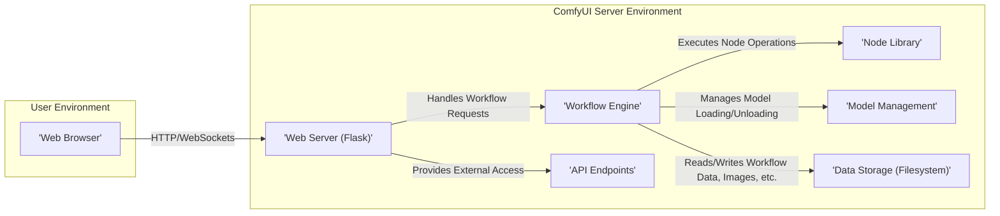
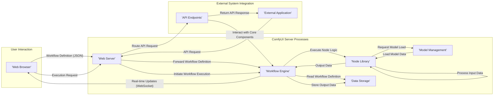

# Project Design Document: ComfyUI

**Version:** 1.1
**Date:** October 26, 2023
**Author:** AI Architecture Expert

## 1. Introduction

This document provides an enhanced design overview of the ComfyUI project, an open-source, node-based user interface for crafting and executing Stable Diffusion and other generative AI workflows. This detailed description of the system's architecture, components, and data flow serves as a robust foundation for subsequent threat modeling activities. This revision aims to provide greater clarity and detail compared to the initial version.

## 2. Goals and Objectives

The primary goals of ComfyUI are to empower users with:

* **Granular Workflow Control:** A flexible and powerful visual interface for designing intricate Stable Diffusion workflows with precise control over each processing step.
* **Extensibility and Customization:** A modular architecture facilitating easy expansion and personalization through the development and integration of custom nodes.
* **Efficient Execution:** An optimized execution environment for demanding generative AI tasks, leveraging available hardware resources effectively.
* **Accessibility for All Skill Levels:** A platform that caters to both beginners and advanced users, enabling experimentation and utilization of generative models regardless of technical expertise.

This design document aims to achieve the following objectives:

* **Clearly Define System Components:**  Provide precise descriptions of the major building blocks of the ComfyUI system.
* **Illustrate Component Interactions:**  Detail the communication pathways and data exchange between these components.
* **Identify Core Technologies and Dependencies:**  Specify the key technologies and libraries underpinning the system.
* **Establish a Security Baseline:**  Offer a solid understanding of the system's attack surface and potential vulnerabilities as a precursor to threat modeling.

## 3. System Architecture

ComfyUI employs a client-server architecture, where a web-based user interface interacts with a backend server responsible for processing.

### 3.1. High-Level Architecture Diagram

### 3.2. Component Breakdown

* **Web Browser:** The graphical interface through which users design, monitor, and interact with ComfyUI workflows. It renders the visual node graph and communicates user actions to the server.
* **Web Server (Flask):** A lightweight Python web framework serving as the communication hub. It handles incoming HTTP requests for the UI and manages persistent WebSocket connections for real-time updates during workflow execution.
* **Workflow Engine:** The central processing unit responsible for interpreting and executing the user-defined node graph. It manages the execution sequence, data flow between nodes, and resource allocation for each step.
* **Node Library:** A collection of modular, self-contained units of computation. Each node performs a specific task within the workflow, such as loading images, applying prompts, running diffusion models, or saving results. This library is extensible, allowing users to create and integrate custom nodes.
* **Model Management:**  This component oversees the loading, unloading, and caching of various AI models (e.g., Stable Diffusion checkpoints, VAE decoders/encoders, LoRA models) required by the nodes in a workflow. It optimizes model loading and memory usage.
* **Data Storage (Filesystem):** ComfyUI primarily utilizes the local filesystem for persistent storage of various data types:
    * Workflow definitions (saved as JSON files).
    * Input and output data (images, latent tensors, etc.).
    * Cached model data (to speed up subsequent loads).
    * Configuration settings and user preferences.
* **API Endpoints:** A set of programmatic interfaces (likely RESTful or similar) enabling external applications, scripts, or services to interact with ComfyUI programmatically. This includes functionalities like triggering workflows, retrieving status updates, and accessing results.

## 4. Data Flow

The following outlines the typical data flow within ComfyUI during different phases of operation:

1. **Workflow Definition and Storage:**
    * The user visually constructs a workflow by adding and connecting nodes within the web browser.
    * The browser transmits the workflow definition (encoded in JSON) to the Web Server.
    * The Web Server forwards the workflow definition to the Workflow Engine.
    * The Workflow Engine persists the workflow definition by saving it to Data Storage.

2. **Workflow Execution Cycle:**
    * The user initiates workflow execution through the web browser interface.
    * The browser sends an execution request to the Web Server.
    * The Web Server instructs the Workflow Engine to begin processing the designated workflow.
    * The Workflow Engine proceeds as follows:
        * It retrieves the workflow definition from Data Storage.
        * It analyzes the node graph to determine the correct execution order based on dependencies.
        * For each node in the sequence:
            * It gathers the necessary input data from the outputs of preceding nodes or from Data Storage.
            * It invokes the corresponding node's logic from the Node Library.
            * The Node Library may interact with Model Management to load required AI models into memory.
            * The node performs its designated operation, generating output data.
            * The Workflow Engine stores the output data, making it available as input for subsequent nodes.
    * Throughout the execution, the Workflow Engine sends real-time status updates and intermediate results back to the Web Browser via persistent WebSocket connections.

3. **Output Generation and Persistence:**
    * The final output(s) of the workflow (e.g., generated images, processed data) are stored in Data Storage.
    * The Web Server can then serve these outputs to the user's browser for viewing or download.

4. **External API Interactions:**
    * External applications can leverage the API Endpoints to:
        * Submit workflow definitions for execution.
        * Trigger the execution of pre-existing workflows.
        * Query the status of running or completed workflows.
        * Download generated output data.

### 4.1. Data Flow Diagram

## 5. Key Components in Detail

### 5.1. Web Server (Flask)

* **Functionality:** Serves as the primary interface for user interaction and external communication.
* **Responsibilities:**
    * Handling and routing incoming HTTP requests from the web browser.
    * Managing persistent WebSocket connections for bidirectional, real-time communication.
    * Serving static assets (HTML, CSS, JavaScript) for the user interface.
    * Implementing authentication and authorization mechanisms (if configured).
    * Providing and managing the API endpoints for external access.
* **Key Technologies:** Python, Flask framework, potentially libraries like `flask-socketio` for WebSocket management, and libraries for handling authentication (e.g., `Flask-Login`).

### 5.2. Workflow Engine

* **Functionality:** The core orchestrator responsible for the execution of user-defined workflows.
* **Responsibilities:**
    * Parsing and interpreting workflow definitions (typically JSON).
    * Managing the execution order of nodes based on data dependencies.
    * Handling the flow of data between connected nodes.
    * Managing the execution state of individual workflows.
    * Interacting with the Node Library to execute node operations.
    * Communicating with Model Management to ensure necessary models are loaded.
* **Key Technologies:** Python, potentially custom logic for graph traversal and execution management, and potentially libraries for task scheduling or asynchronous processing.

### 5.3. Node Library

* **Functionality:**  Provides a modular and extensible set of computational units for building workflows.
* **Responsibilities:**
    * Implementing the specific logic for various operations, such as image manipulation, prompt processing, diffusion model inference, and data saving.
    * Accepting input data of specific types and producing output data according to its function.
    * Potentially interacting with external libraries or services to perform its tasks.
    * Providing a framework for users to develop and integrate custom nodes.
* **Key Technologies:** Python, various AI/ML libraries (e.g., PyTorch, Transformers, Diffusers, OpenCV, Pillow), and potentially custom-built modules for specific functionalities.

### 5.4. Model Management

* **Functionality:**  Efficiently manages the loading, caching, and utilization of AI models.
* **Responsibilities:**
    * Loading model weights from local storage or potentially remote sources.
    * Caching loaded models in memory to minimize redundant loading and improve performance.
    * Managing different versions or configurations of models.
    * Potentially handling model downloading or updates from model repositories.
    * Optimizing memory usage by unloading models when they are no longer needed.
* **Key Technologies:** Python, libraries specific to the AI frameworks used (e.g., `torch.hub` for PyTorch models, `transformers` library), and potentially custom logic for model caching and management.

### 5.5. Data Storage (Filesystem)

* **Functionality:** Provides persistent storage for various types of data generated and used by ComfyUI.
* **Responsibilities:**
    * Storing and retrieving workflow definitions (JSON files).
    * Storing input and output data, including images, latent tensors, and other intermediate results.
    * Potentially storing cached model data to speed up initial loading.
    * Managing configuration files and user preferences.
* **Key Technologies:** Filesystem operations provided by the operating system and Python's standard library (e.g., `os`, `json`).

## 6. Security Considerations (Preliminary)

This section highlights potential security considerations based on the current design. A dedicated threat modeling exercise will provide a more in-depth analysis.

* **Input Validation Vulnerabilities:** Insufficient validation of user-supplied data, particularly within workflow definitions (JSON) and node inputs, could lead to vulnerabilities like arbitrary code execution or denial-of-service. Maliciously crafted workflows could exploit weaknesses in node implementations.
* **Authentication and Authorization Weaknesses:** If ComfyUI is exposed beyond a local environment, inadequate authentication and authorization mechanisms could allow unauthorized access to the application's functionalities, including workflow execution and data access via the API.
* **Code Injection Risks (Custom Nodes):** The ability to introduce custom nodes presents a significant risk of code injection. If custom node code is not properly sandboxed or vetted, malicious actors could execute arbitrary code on the server, potentially compromising the entire system.
* **Dependency Management Issues:** ComfyUI relies on numerous third-party libraries. Known vulnerabilities in these dependencies could be exploited if not regularly updated and managed. A lack of proper dependency management practices increases the attack surface.
* **Data Security and Privacy Concerns:** Sensitive data, such as API keys for external services or user-specific configurations, if not stored securely, could be compromised. Unauthorized access to the filesystem could expose workflow definitions and generated outputs.
* **Network Security Deficiencies:** When deployed in a network environment, a lack of proper network security measures (e.g., using HTTPS, firewalls) could expose ComfyUI to eavesdropping, man-in-the-middle attacks, and unauthorized access.
* **Denial of Service (DoS) Attacks:** The computationally intensive nature of generative AI tasks makes ComfyUI susceptible to DoS attacks. Malicious actors could overload the server with resource-intensive workflow requests, rendering the system unavailable. Rate limiting and resource management are crucial.
* **API Security Vulnerabilities:**  Insecurely designed or implemented API endpoints could expose sensitive functionalities or data to unauthorized external access. Lack of proper authentication, authorization, and input validation on API endpoints are common vulnerabilities.

## 7. Deployment Considerations

ComfyUI offers flexibility in deployment options:

* **Local Machine Deployment:** The most common scenario, where both the server and client interface run on the user's personal computer. This simplifies setup but may limit accessibility.
* **Cloud-Based Deployment:** Deploying ComfyUI on cloud platforms (e.g., AWS, Google Cloud, Azure) provides scalability, increased accessibility, and potentially better resource utilization. This requires careful configuration of security groups and access controls.
* **Containerized Deployment (Docker):** Packaging ComfyUI within a Docker container streamlines deployment, ensures consistent environments across different systems, and simplifies management. Container security best practices should be followed.

The chosen deployment strategy significantly impacts the relevant security considerations, particularly regarding network exposure and access control.

## 8. Future Considerations

* **Enhanced User and Role Management:** Implementing a more robust system for managing user accounts, roles, and permissions, especially in multi-user deployments.
* **Centralized Workflow Management and Sharing:** Developing features for users to share, discover, and manage workflows in a centralized repository.
* **Improved Resource Monitoring and Management:** Implementing more sophisticated mechanisms for monitoring resource usage and managing resource allocation for workflow execution.
* **Expanded Integration Capabilities:**  Broadening integration with other AI platforms, services, and data sources.
* **Strengthened Security Features:**  Incorporating more advanced security features such as workflow signing, enhanced input validation, and more granular access controls.

This enhanced design document provides a more detailed and comprehensive understanding of the ComfyUI project. It serves as a valuable resource for conducting thorough threat modeling and developing effective security mitigation strategies.