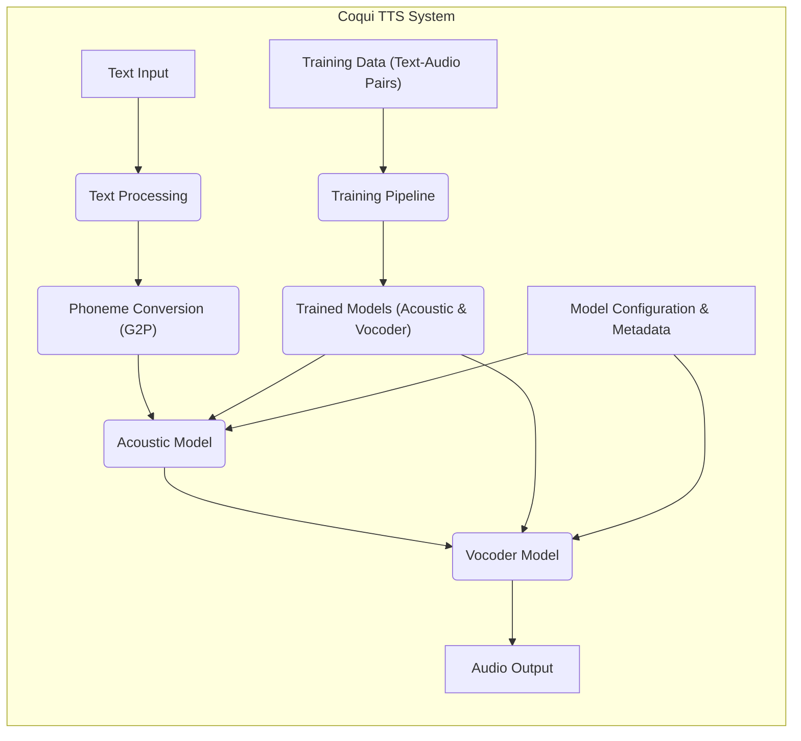
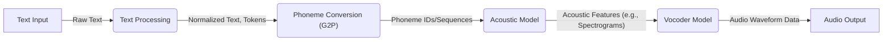
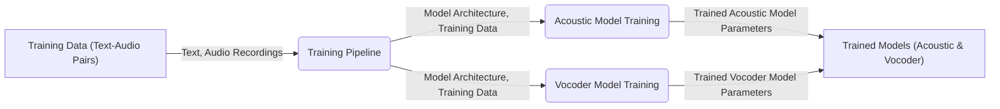

# Project Design Document: Coqui TTS (Improved)

**Version:** 1.1
**Date:** October 26, 2023
**Prepared By:** AI Architecture Expert

## 1. Introduction

This document provides an enhanced and more detailed design overview of the Coqui TTS project, an open-source text-to-speech library. This document is intended for a technical audience, including developers and security engineers, and aims to clearly articulate the system's architecture, components, and data flows to facilitate effective threat modeling. It outlines the key elements of the system that will be crucial for identifying potential security vulnerabilities.

## 2. Goals and Objectives

*   Provide a comprehensive and refined architectural overview of the Coqui TTS project.
*   Clearly identify key components and their specific interactions within the TTS process.
*   Describe the data flow within the system, including data types and transformations.
*   Serve as a robust and detailed foundation for subsequent threat modeling activities.
*   Document the design in a clear, concise, and understandable manner for technical stakeholders.

## 3. High-Level Architecture

The Coqui TTS project is a software library enabling the generation of synthetic speech from text. It involves processing textual input through various stages, leveraging machine learning models and algorithms to produce an audio waveform. The system also includes components for training and managing these TTS models.

## 4. Detailed Design

This section provides a more granular view of the components and their functionalities within the Coqui TTS system.

### 4.1. Core Components

*   **Text Input:** Represents the textual data to be synthesized into speech. This can originate from various sources like user interfaces, files, or network streams. The input is typically raw text.
*   **Text Processing:** This component prepares the input text for further processing. It performs operations such as:
    *   Normalization: Converts text to a consistent format (e.g., expanding abbreviations, handling numbers, and special characters).
    *   Tokenization: Splits the normalized text into individual words or sub-word units, creating tokens.
*   **Phoneme Conversion (Grapheme-to-Phoneme - G2P):** Converts the processed text (graphemes) into a sequence of phonemes, the basic units of sound in a language. This can be achieved through rule-based systems or statistical models. The output is a sequence of phoneme representations.
*   **Acoustic Model:** A machine learning model that predicts acoustic features (e.g., mel-spectrograms, linear spectrograms) corresponding to the input phoneme sequence. Different acoustic model architectures exist, influencing the quality and characteristics of the synthesized speech. It takes phoneme sequences as input and outputs acoustic feature representations.
*   **Vocoder Model:** Takes the acoustic features generated by the acoustic model and synthesizes the final audio waveform. The vocoder's quality is crucial for the naturalness and clarity of the generated speech. It inputs acoustic features and outputs raw audio waveform data.
*   **Audio Output:** The final synthesized speech in the form of an audio waveform. This can be saved to a file (e.g., WAV, MP3), played through an audio device, or streamed to another application.
*   **Training Data (Text-Audio Pairs):** The dataset used to train the acoustic and vocoder models. It consists of pairs of text and their corresponding high-quality audio recordings.
*   **Training Pipeline:** Orchestrates the process of training new TTS models. Key steps include:
    *   Data loading and preprocessing of the training data.
    *   Model definition and initialization based on specified architectures.
    *   Optimization using algorithms like Adam or SGD.
    *   Evaluation of model performance using relevant metrics.
    *   Saving the trained model parameters.
*   **Trained Models (Acoustic & Vocoder):** The saved output of the training pipeline, representing the learned parameters of the acoustic and vocoder models. These models are loaded during the text-to-speech inference process.
*   **Model Configuration & Metadata:**  Includes settings and parameters used to configure the acoustic and vocoder models (e.g., model architecture, hyperparameters) and metadata about the models (e.g., version, training data used).

### 4.2. Data Flows

The primary data flow for text-to-speech generation:

The data flow for training new models:

### 4.3. External Interfaces and Dependencies

*   **Programming Language:** Primarily Python.
*   **Machine Learning Frameworks:**  Relies heavily on frameworks like PyTorch or TensorFlow for model development and training.
*   **Audio Processing Libraries:** Utilizes libraries such as Librosa, SoundFile, or similar for audio input/output, manipulation, and feature extraction.
*   **Operating System:** Designed to be cross-platform, supporting Linux, Windows, and macOS.
*   **Hardware:** Performance is significantly impacted by CPU, GPU (especially for training), and memory resources.
*   **External Data Sources (Optional):** May interact with external data sources for accessing training data or pre-trained models (e.g., cloud storage, datasets).

## 5. Security Considerations (For Threat Modeling)

This section details potential security concerns relevant for threat modeling.

*   **Input Validation Vulnerabilities:** Insufficient validation of the input text could lead to:
    *   **Injection Attacks:** Maliciously crafted text could potentially be interpreted as commands or code if not properly sanitized.
    *   **Denial of Service (DoS):** Extremely long or complex input strings could consume excessive resources, leading to service disruption.
    *   **Unexpected Behavior:** Input containing unusual characters or formatting might cause errors or crashes.
*   **Model Security Risks:** Compromised or malicious models can introduce significant risks:
    *   **Model Poisoning:** If an attacker can influence the training data or process, they could create models that generate biased or harmful speech.
    *   **Model Theft/Reverse Engineering:** Unauthorized access to trained models could allow competitors to replicate the technology or expose proprietary information.
    *   **Backdoor in Models:**  Malicious actors could inject backdoors into models during training, potentially allowing for manipulation of the TTS output.
*   **Dependency Management Weaknesses:** Using outdated or vulnerable dependencies can expose the system to known exploits:
    *   **Vulnerable Libraries:**  Unpatched vulnerabilities in libraries like TensorFlow, PyTorch, or audio processing libraries could be exploited.
    *   **Supply Chain Attacks:** Compromised dependencies could introduce malicious code into the system.
*   **Training Data Security:** Protecting the integrity and confidentiality of training data is crucial:
    *   **Data Breaches:** Unauthorized access to training data could expose sensitive information.
    *   **Data Tampering:** Malicious modification of training data can lead to compromised models.
*   **API Security (if exposed as an API):** When deployed as an API, standard web security practices are essential:
    *   **Authentication and Authorization Flaws:** Lack of proper authentication or authorization could allow unauthorized access to the TTS functionality.
    *   **Rate Limiting Issues:** Absence of rate limiting can lead to abuse and DoS attacks.
    *   **Insecure Communication:**  Failure to use HTTPS can expose communication to eavesdropping and man-in-the-middle attacks.
*   **Resource Exhaustion:** Malicious input or requests could be designed to consume excessive computational resources:
    *   **CPU/Memory Overload:**  Crafted input could lead to high CPU or memory usage, impacting performance or causing crashes.
*   **Code Injection Vulnerabilities:** Flaws in text processing or other components could potentially allow for the execution of arbitrary code.
*   **Supply Chain Security for Pre-trained Models:** If using pre-trained models, verifying their source and integrity is important to prevent the introduction of malicious models.

## 6. Deployment Considerations

The Coqui TTS library offers flexibility in deployment:

*   **Integrated Library:** Directly embedded within other Python applications, inheriting the security context of the parent application.
*   **Command-Line Interface (CLI):** Executed directly from the command line, requiring careful management of access and permissions.
*   **Service (API):** Deployed as a web service using frameworks like Flask or FastAPI, necessitating robust API security measures.
*   **On-Premise Deployment:**  Deployed on local infrastructure, requiring organizations to manage their own security controls.
*   **Cloud Deployment:** Deployed on cloud platforms, leveraging the cloud provider's security services but still requiring careful configuration.

The chosen deployment method significantly impacts the specific security threats and required mitigations.

## 7. Future Considerations

*   **Enhanced Model Security Measures:** Implementing techniques like model signing or watermarking to verify model integrity.
*   **Improved Input Sanitization Techniques:**  Developing more robust methods for cleaning and validating input text.
*   **Federated Learning for Model Training:** Exploring privacy-preserving training methods.
*   **Regular Security Audits and Penetration Testing:** Proactively identifying and addressing potential vulnerabilities.

This improved design document provides a more detailed and nuanced understanding of the Coqui TTS project's architecture, specifically tailored for effective threat modeling. By considering the components, data flows, and potential security considerations outlined here, security professionals can better identify and mitigate risks associated with the system.
